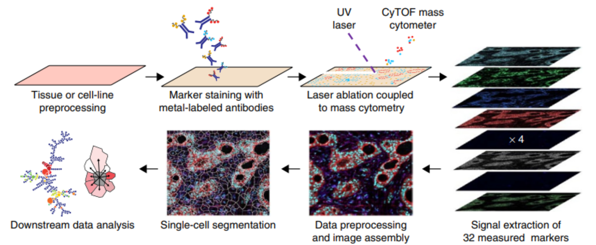

# Introduction {#intro}

Highly multiplexed imaging (HMI) enables the simultaneous detection of dozens of
biological molecules (e.g., proteins, transcripts; also referred to as
“markers”) in tissues. Recently established multiplexed tissue imaging
technologies rely on cyclic staining with fluorescently-tagged antibodies
[@Lin2018; @Gut2018], or the use of oligonucleotide-tagged [@Goltsev2018;
@Saka2019] or metal-tagged [@Giesen2014; @Angelo2014] antibodies, among others.
The key strength of these technologies is that they allow in-depth analysis of
single cells within their spatial tissue context. As a result, these methods
have enabled analysis of the spatial architecture of the tumor microenvironment
[@Lin2018; @Jackson2020; @Ali2020; @Schurch2020], determination of nucleic acid
and protein abundances for assessment of spatial co-localization of cell types
and chemokines [@Hoch2022] and spatial niches of virus infected cells [@Jiang2022],
and characterization of pathological features during COVID-19 infection
[@Rendeiro2021; @Mitamura2021], Type 1 diabetes progression [@Damond2019] and
autoimmune disease [@Ferrian2021].

Imaging mass cytometry (IMC) utilizes metal-tagged antibodies to detect over 40
proteins and other metal-tagged molecules in biological samples. IMC can be used
to perform highly multiplexed imaging and is particularly suited to profiling
selected areas of tissues across many samples.


*Overview of imaging mass cytometry data acquisition. Taken from [@Giesen2014]*

IMC has first been published in 2014 [@Giesen2014] and has been commercialized by
Standard BioTools<sup><font size="1">TM</font></sup> to be distributed as the Hyperion Imaging
System<sup><font size="1">TM</font></sup> (documentation is available
[here](https://www.fluidigm.com/products-services/instruments/hyperion)).
Similar to other HMI technologies such as MIBI [@Angelo2014], CyCIF [@Lin2018],
4i [@Gut2018], CODEX [@Goltsev2018] and SABER [@Saka2019], IMC captures the spatial
expression of multiple proteins in parallel. With a nominal 1 &mu;m resolution,
IMC is able to detect cytoplasmic and nuclear localization of proteins. The
current ablation frequency of IMC is 200Hz, meaning that a 1 mm$^2$ area
can be imaged within about 2 hours.

## Technical details of IMC

Technical aspects of how data acquisition works can be found in the original
publication [@Giesen2014]. Briefly, antibodies to detect targets in biological
material are labeled with heavy metals (e.g., lanthanides) that do not occur in
biological systems and thus can be used upon binding to their target as a
readout similar to fluorophores in fluorescence microscopy. Thin sections of the
biological sample on a glass slide are stained with an antibody cocktail.
Stained microscopy slides are mounted on a precise motor-driven stage inside the
ablation chamber of the IMC instrument. A high-energy UV laser is focused on the
tissue, and each individual laser shot ablates tissue from an area of roughly 1
&mu;m$^2$. The energy of the laser is absorbed by the tissue resulting
in vaporization followed by condensation of the ablated material. The ablated
material from each laser shot is transported in the gas phase into the plasma of
the mass cytometer, where first atomization of the particles and then ionization
of the atoms occurs. The ion cloud is then transferred into a vacuum, and all
ions below a mass of 80 m/z are filtered using a quadrupole mass filter. The
remaining ions (mostly those used to tag antibodies) are analyzed in a
time-of-flight mass spectrometer to ultimately obtain an accumulated mass
spectrum from all ions that correspond to a single laser shot. One can regard
this spectrum as the information underlying a 1 &mu;m$^2$ pixel. With
repetitive laser shots (e.g., at 200 Hz) and a simultaneous lateral sample
movement, a tissue can be ablated pixel by pixel. Ultimately an image is
reconstructed from each pixel mass spectrum.

In principle, IMC can be applied to the same type of samples as conventional
fluorescence microscopy. The largest distinction from fluorescence microscopy is
that for IMC, primary-labeled antibodies are commonly used, whereas in
fluorescence microscopy secondary antibodies carrying fluorophores are widely
applied. Additionally, for IMC, samples are dried before acquisition and can be
stored for years. Formalin-fixed and paraffin-embedded (FFPE) samples are widely
used for IMC. The FFPE blocks are cut to 2-5 &mu;m thick sections and are
stained, dried, and analyzed with IMC.

### Metal-conjugated antobodies and staining

Metal-labeled antibodies are used to stain molecules in tissues enabling to
delineate tissue structures, cells, and subcellular structures. Metal-conjugated
antibodies can either be purchased directly from Standard BioTools<sup><font size="1">TM</font></sup> ([MaxPar IMC Antibodies](https://store.fluidigm.com/Cytometry/ConsumablesandReagentsCytometry/MaxparAntibodies?cclcl=en_US)),
or antibodies can be purchased and labeled individually ([MaxPar Antibody
Labeling](https://store.fluidigm.com/Cytometry/ConsumablesandReagentsCytometry/MaxparAntibodyLabelingKits?cclcl=en_US)).
Antibody labeling using the MaxPar kits is performed via TCEP antibody reduction
followed by crosslinking with sulfhydryl-reactive maleimide-bearing metal
polymers. For each antibody it is essential to validate its functionality,
specificity and optimize its usage to provide optimal signal to noise. To
facilitate antibody handling, a database is highly useful.
[Airlab](https://github.com/BodenmillerGroup/airlab-web) is such a platform; it
allows antibody lot tracking, validation data uploads, and panel generation for
subsequent upload to the IMC acquisition software from Standard BioTools<sup><font size="1">TM</font></sup>

Depending on the sample type, different staining protocols can be used.
Generally, once antibodies of choice have been conjugated to a metal tag,
titration experiments are performed to identify the optimal staining
concentration. For FFPE samples, different staining protocols have been
described, and different antibodies show variable staining with different
protocols. Protocols such as the one provided by Standard BioTools<sup><font size="1">TM</font></sup> or the one describe by
[@Ijsselsteijn2019] are recommended. Briefly, for FFPE tissues, a dewaxing
step is performed to remove the paraffin used to embed the material, followed by
a graded re-hydration of the samples. Thereafter, heat-induced epitope retrieval
(HIER), a step aiming at the reversal of formalin-based fixation, is used to
unmask epitopes within tissues and make them accessible to antibodies. Epitope
unmasking is generally performed in either basic, EDTA-based buffers (pH 9.2) or
acidic, citrate-based buffers (pH 6). Next, a buffer containing bovine serum
albumin (BSA) is used to block non-specific binding. This buffer is also used to
dilute antibody stocks for the actual antibody staining. Staining time and
temperature may vary and optimization must be performed to ensure that each
single antibody performs well. However, overnight staining at 4&deg;C or 3-5
hours at room temperature seem to be suitable in many cases.

Following antibody incubation, unbound antibodies are washed away and a
counterstain comparable to DAPI is applied to enable the identification of
nuclei. The [Iridium intercalator](https://store.fluidigm.com/Cytometry/ConsumablesandReagentsCytometry/MassCytometryReagents/Cell-ID%E2%84%A2%20Intercalator-Ir%E2%80%94125%20%C2%B5M)
from Standard BioTools<sup><font size="1">TM</font></sup> is a reagent of choice and applied in a brief 5 minute staining.
Finally, the samples are washed again and then dried under an airflow. Once
dried, the samples are ready for analysis using IMC and are
usually stable for a long period of time (at least one year).

### Data acquisition

Data is acquired using the CyTOF software from Standard BioTools<sup><font size="1">TM</font></sup> (see manuals
[here](https://go.fluidigm.com/hyperion-support-documents)).

The regions of interest are selected by providing coordinates for ablation. To
determine the region to be imaged, so called "panoramas" can be generated. These
are stitched images of single fields of views of about 200 &mu;m in diameter.
Panoramas provide an optical overview of the tissue with a resolution similar to
10x in microscopy and are intended to help with the selection of regions of
interest for ablation. The tissue should be centered on the glass side, since
the imaging mass cytometer cannot access roughly 5 mm from each of the slide
edges. Currently, the instruments can process one slide at a time and usually one MCD
file per sample slide is generated.

Many regions of interest can be defined on a single slide and acquisition
parameters such as channels to acquire, acquisition speed (100 Hz or 200 Hz),
ablation energy, and other parameters are user-defined. It is recommended that
all isotope channels are recorded. This will result in larger raw data files but valuable information such as
potential contamination of the argon gas (e.g., Xenon) or of the samples (e.g.,
lead, barium) is stored.

To process a large number of slides or to select regions on whole-slide samples,
panoramas may not  provide sufficient information. If this is the case,
multi-color immunofluorescence of the same slide prior to staining with
metal-labeled antibodies may be performed. To allow for region selection based
on immunofluorescence images and to align those images with a panorama of the
same or consecutive sections of the sample, we developed
[napping](https://github.com/BodenmillerGroup/napping).

Acquisition time is directly proportional to the total size of ablation, and run
times for samples of large area or for large sample numbers can roughly be calculated by
dividing the ablation area in square micrometer by the ablation speed (e.g.,
200Hz). In addition to the proprietary MCD file format, TXT files can also
be generated for each region of interest. This is recommended as a back-up
option in case of errors that may corrupt MCD files but not TXT files.

## IMC data format {#data-format}

Upon completion of the acquisition an MCD file of variable size is generated. A
single MCD file can hold raw acquisition data for multiple regions of interest,
optical images providing a slide level overview of the sample ("panoramas"), and
detailed metadata about the experiment. Additionally, for each acquisition a
TXT file is generated which holds the same pixel information as the matched
acquisition in the MCD file. 

The Hyperion Imaging System<sup><font size="1">TM</font></sup> produces files in the following folder structure:

```
.
+-- {XYZ}_ROI_001_1.txt
+-- {XYZ}_ROI_002_2.txt
+-- {XYZ}_ROI_003_3.txt
+-- {XYZ}.mcd
```

Here, `{XYZ}` defines the filename, `ROI_001`, `ROI_002`, `ROI_003` are
user-defined names (descriptions) for the selected regions of interest (ROI),
and `1`, `2`, `3` indicate the unique acquisition identifiers. The ROI
description entry can be specified in the Standard BioTools software when
selecting ROIs. The MCD file contains the raw imaging data and the full metadata
of all acquired ROIs, while each TXT file contains data of a single ROI without
metadata. To follow a consistent naming scheme and to bundle all metadata, we
recommend to zip the folder. Each ZIP file should only contain data from a
single MCD file, and the name of the ZIP file should match the name of the MCD
file.

We refer to this data as raw data and the further
processing of this data is described in Section \@ref(processing).


