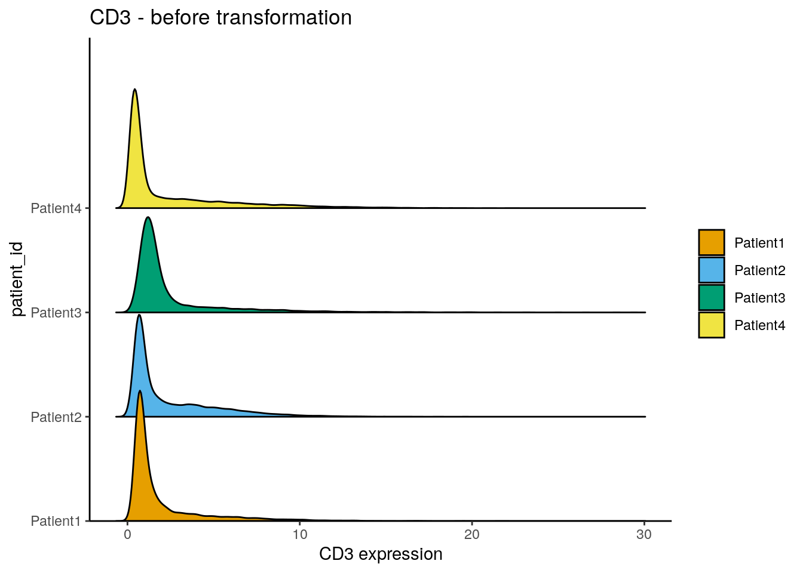
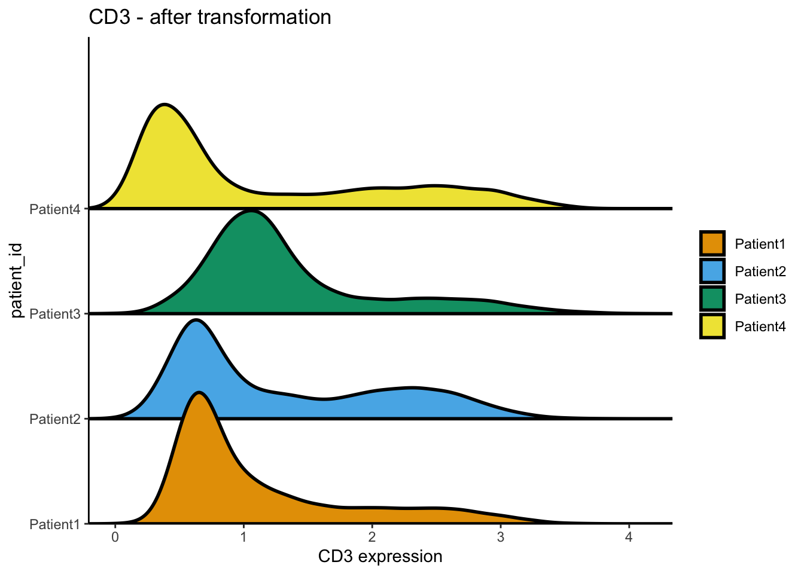

# Read in the data {#read-data}

This section describes how to read in single-cell data and images into `R`
**after** image processing and segmentation (see Section \@ref(processing)).

To highlight examples for IMC data analysis, we provide already processed data at
[10.5281/zenodo.6043599](https://zenodo.org/record/6043599).
This data has already been downloaded in Section \@ref(download-data) and can 
be accessed in the folder `data`.

We use the [imcRtools](https://github.com/BodenmillerGroup/imcRtools) package to
read in single-cell data extracted using the `steinbock` framework or the IMC
Segmentation Pipeline. Both image processing approaches also generate
multi-channel images and segmentation masks that can be read into `R` using the
[cytomapper](https://github.com/BodenmillerGroup/cytomapper) package.


```r
library(imcRtools)
library(cytomapper)
```

## Read in single-cell information

For single-cell data analysis in `R` the
[SingleCellExperiment](https://bioconductor.org/packages/release/bioc/html/SingleCellExperiment.html)
[@Amezquita2019] data container is commonly used within the Bioconductor
framework. It allows standardized access to (i) expression data, (ii) cellular
metadata (e.g., cell type), (iii) feature metadata (e.g., marker name) and (iv)
experiment-wide metadata. For an in-depth introduction to the `SingleCellExperiment`
container, please refer to the [SingleCellExperiment class](https://bioconductor.org/books/release/OSCA.intro/the-singlecellexperiment-class.html).

The [SpatialExperiment](https://bioconductor.org/packages/release/bioc/html/SingleCellExperiment.html)
class [@Righelli2022] is an extension of the `SingleCellExperiment` class. It
was developed to store spatial data in addition to single-cell data and an
extended introduction is accessible
[here](https://bioconductor.org/packages/release/bioc/vignettes/SpatialExperiment/inst/doc/SpatialExperiment.html).

To read in single-cell data generated by the `steinbock` framework or the IMC
Segmentation Pipeline, the `imcRtools` package provides the `read_steinbock` and
`read_cpout` functions, respectively. By default, the data is read into a
`SpatialExperiment` object; however, data can be read in as a
`SingleCellExperiment` object by setting `return_as = "sce"`. All functions
presented in this book are applicable to both data containers.

### steinbock generated data

The downloaded example data (Section \@ref(download-data)) processed with the [steinbock](https://github.com/BodenmillerGroup/steinbock) framework can be read in with the `read_steinbock` function provided by `imcRtools`. For more information, please refer to
`?read_steinbock`.


```r
spe <- read_steinbock("data/steinbock/")
spe
```

```
## class: SpatialExperiment 
## dim: 40 47859 
## metadata(0):
## assays(1): counts
## rownames(40): MPO HistoneH3 ... DNA1 DNA2
## rowData names(12): channel name ... Final.Concentration...Dilution
##   uL.to.add
## colnames: NULL
## colData names(8): sample_id ObjectNumber ... width_px height_px
## reducedDimNames(0):
## mainExpName: NULL
## altExpNames(0):
## spatialCoords names(2) : Pos_X Pos_Y
## imgData names(1): sample_id
```

By default, single-cell data is read in as `SpatialExperiment` object. 
The summarized pixel intensities per channel and cell (here mean intensity) are
stored in the `counts` slot. Columns represent cells and rows represent channels.


```r
counts(spe)[1:5,1:5]
```

```
##                [,1]       [,2]      [,3]      [,4]      [,5]
## MPO       0.5751064  0.4166667 0.4975494  0.890154 0.1818182
## HistoneH3 3.1273082 11.3597883 2.3841440  7.712961 1.4512715
## SMA       0.2600939  1.6720383 0.1535190  1.193948 0.2986703
## CD16      2.0347747  2.5880536 2.2943074 15.629083 0.6084220
## CD38      0.2530137  0.6826669 1.1902979  2.126060 0.2917793
```

Metadata associated to individual cells are stored in the `colData` slot. After
initial image processing, these metadata include the numeric identifier (`ObjectNumber`),
the area, and morphological features of each cell. In addition, `sample_id` stores
the image name from which each cell was extracted and the width and height of the
corresponding images are stored.


```r
head(colData(spe))
```

```
## DataFrame with 6 rows and 8 columns
##      sample_id ObjectNumber      area axis_major_length axis_minor_length
##    <character>    <numeric> <numeric>         <numeric>         <numeric>
## 1 Patient1_001            1        12           7.40623           1.89529
## 2 Patient1_001            2        24          16.48004           1.96284
## 3 Patient1_001            3        17           9.85085           1.98582
## 4 Patient1_001            4        24           8.08290           3.91578
## 5 Patient1_001            5        22           8.79367           3.11653
## 6 Patient1_001            6        25           9.17436           3.46929
##   eccentricity  width_px height_px
##      <numeric> <numeric> <numeric>
## 1     0.966702       600       600
## 2     0.992882       600       600
## 3     0.979470       600       600
## 4     0.874818       600       600
## 5     0.935091       600       600
## 6     0.925744       600       600
```

The main difference between the `SpatialExperiment` and the
`SingleCellExperiment` data container is the way spatial
locations of all cells are stored. For the `SingleCellExperiment` container, the
locations are stored in the `colData` slot while the `SpatialExperiment`
container stores them in the `spatialCoords` slot:


```r
head(spatialCoords(spe))
```

```
##         Pos_X     Pos_Y
## [1,] 468.5833 0.4166667
## [2,] 515.8333 0.4166667
## [3,] 587.2353 0.4705882
## [4,] 192.2500 1.2500000
## [5,] 231.7727 0.9090909
## [6,] 270.1600 1.0400000
```

The _spatial object graphs_ generated by steinbock (see Section
\@ref(feature-extraction) are read into a `colPair` slot with the name
`neighborhood` of the `SpatialExperiment` (or `SingleCellExperiment`) object.
Cell-cell interactions (cells in close spatial proximity) are represented as
"edge list" (stored as `SelfHits` object). Here, the left side represents the
column indices of the `SpatialExperiment` object of the "from" cells and the
right side represents the column indices of the "to" cells. For visualization of
the _spatial object graphs_, please refer to Section \@ref(spatial-viz).


```r
colPair(spe, "neighborhood")
```

```
## SelfHits object with 257116 hits and 0 metadata columns:
##                 from        to
##            <integer> <integer>
##        [1]         1        27
##        [2]         1        55
##        [3]         2        10
##        [4]         2        44
##        [5]         2        81
##        ...       ...       ...
##   [257112]     47858     47836
##   [257113]     47859     47792
##   [257114]     47859     47819
##   [257115]     47859     47828
##   [257116]     47859     47854
##   -------
##   nnode: 47859
```

Finally, metadata regarding the channels are stored in the `rowData` slot. This
information is extracted from the `panel.csv` file.

Channels have the same order as the rows in the `panel.csv` file for which the
keep column is set to 1, and match the order of channels in the multi-channel
images (see Section \@ref(read-images)). For the example data, channels are
ordered by isotope mass.


```r
head(rowData(spe))
```

```
## DataFrame with 6 rows and 12 columns
##               channel        name      keep   ilastik  deepcell  cellpose
##           <character> <character> <numeric> <numeric> <numeric> <logical>
## MPO               Y89         MPO         1        NA        NA        NA
## HistoneH3       In113   HistoneH3         1         1         1        NA
## SMA             In115         SMA         1        NA        NA        NA
## CD16            Pr141        CD16         1        NA        NA        NA
## CD38            Nd142        CD38         1        NA        NA        NA
## HLADR           Nd143       HLADR         1        NA        NA        NA
##           Tube.Number              Target Antibody.Clone Stock.Concentration
##             <numeric>         <character>    <character>           <numeric>
## MPO              2101 Myeloperoxidase MPO Polyclonal MPO                 500
## HistoneH3        2113          Histone H3           D1H2                 500
## SMA              1914                 SMA            1A4                 500
## CD16             2079                CD16       EPR16784                 500
## CD38             2095                CD38        EPR4106                 500
## HLADR            2087              HLA-DR        TAL 1B5                 500
##           Final.Concentration...Dilution   uL.to.add
##                              <character> <character>
## MPO                              4 ug/mL         0.8
## HistoneH3                        1 ug/mL         0.2
## SMA                           0.25 ug/mL        0.05
## CD16                             5 ug/mL           1
## CD38                           2.5 ug/mL         0.5
## HLADR                            1 ug/mL         0.2
```

### IMC Segmentation Pipeline generated data

The [IMC Segmentation Pipeline](https://github.com/BodenmillerGroup/ImcSegmentationPipeline) offers an
alternative approach to multiplexed image processing and segmentation. The
default pipeline is also available via `steinbock`. The IMC Segmentation
Pipeline is based on [Ilastik](https://www.ilastik.org/) pixel classification
and image segmentation using [CellProfiler](https://cellprofiler.org/). We recommend
to become familiar with the pipeline as it allows flexible extension to more
complicated image analysis and segmentation tasks. For standard image analysis
and segmentation, `steinbock` is the preferred choice. Please refer to 
the [documentation](https://bodenmillergroup.github.io/ImcSegmentationPipeline/)
to get an overview on the pipeline.

All relevant [output](https://bodenmillergroup.github.io/ImcSegmentationPipeline/output.html)
storing single-cell data is contained in the `cpout` folder. 
For reading in the single-cell measurement, the `imcRtools` package offers the
`read_cpout` function:


```r
spe2 <- read_cpout("data/ImcSegmentationPipeline/analysis/cpout/")
rownames(spe2) <- rowData(spe2)$Clean_Target
spe2
```

```
## class: SpatialExperiment 
## dim: 40 43796 
## metadata(0):
## assays(1): counts
## rownames(40): MPO HistoneH3 ... DNA1 DNA2
## rowData names(11): Tube.Number Metal.Tag ... ilastik deepcell
## colnames: NULL
## colData names(12): sample_id ObjectNumber ... Metadata_acid
##   Metadata_description
## reducedDimNames(0):
## mainExpName: NULL
## altExpNames(0):
## spatialCoords names(2) : Pos_X Pos_Y
## imgData names(1): sample_id
```

Similar to the `steinbock` output, cell morphological features and image level
metadata are stored in the `colData(spe2)` slot, the interaction information
is contained in `colPair(spe2, type = "neighborhood")` and the mean intensity 
per channel and cell is stored in `counts(spe2)`.

### Reading custom files

When not using `steinbock` or the `ImcSegmentationPipeline`, the single-cell
information has to be read in from custom files. We now demonstrate how
to generate a `SpatialExperiment` object from single-cell data contained
in individual files. As an example, we use files generated by `CellProfiler`
as part of the `ImcSegmentationPipeline`.

First we will read in the single-cell features stored in a CSV file:


```r
library(readr)

cur_features <- read_csv("data/ImcSegmentationPipeline/analysis/cpout/cell.csv")

dim(cur_features)
```

```
## [1] 43796   941
```

```r
head(colnames(cur_features))
```

```
## [1] "ImageNumber"                    "ObjectNumber"                  
## [3] "AreaShape_Area"                 "AreaShape_BoundingBoxArea"     
## [5] "AreaShape_BoundingBoxMaximum_X" "AreaShape_BoundingBoxMaximum_Y"
```

This file contains a large number of single-cell features including the cell
identifier (`ObjectNumber`), the image identifier (`ImageNumber`), morphological 
features (`AreaShape_*`), the cells' locations (`Location_Center_*`) and the 
mean pixel intensity per cell and per channel (`Intensity_MeanIntensity_FullStack_*`).

Now, we split the features into intensity features, cell-specific metadata and
the physical location of the cells:


```r
counts <- cur_features[,grepl("Intensity_MeanIntensity_FullStack", 
                                  colnames(cur_features))]

meta <- cur_features[,c("ImageNumber", "ObjectNumber", "AreaShape_Area",
                            "AreaShape_Eccentricity", "AreaShape_MeanRadius")]

coords <- cur_features[,c("Location_Center_X", "Location_Center_Y")]
```

`CellProfiler` writes out the mean pixel intensities after scaling them 
bit a scaling factor which is bit encoding-specific. The images to which
the IMC Segmentation Pipeline was applied were saved with 16-bit encoding.
This means for the example data, the mean pixel intensities need to 
be scaled by a factor of `2 ^ 16 - 1 = 65535`.


```r
counts <- counts * 65535
```

In addition, `CellProfiler` does not order the channel numerically but rather
as a character; `1, 10, 2, 3, ...` rather than `1, 2, 3, ...`. Therefore we
will need to reorder the channels.


```r
library(stringr)
cur_ch <- str_split(colnames(counts), "_", simplify = TRUE)[,4]
cur_ch <- sub("c", "", cur_ch)

counts <- counts[,order(as.numeric(cur_ch))]
```

From these features we can now construct the `SpatialExperiment` object.


```r
spe3 <- SpatialExperiment(assays = list(counts = t(counts)),
                          colData = meta, 
                          sample_id = as.character(meta$ImageNumber),
                          spatialCoords = as.matrix(coords))
```

Next, we can store the spatial cell graph generated by `CellProfiler` in the
`colPairs` slot of the object. Spatial cell graphs are usually stored as edge
list in form of a CSV file. The `colPairs` slot requires a `SelfHits` entry
storing an edge list where numeric entries represent the index of the `from` and
`to` cell in the `SpatialExperiment` object. To generate such an edge list, we
need to match the cell IDs contained in the CSV against the cell IDs in the
`SpatialExperiment` object.


```r
cur_pairs <- read_csv("data/ImcSegmentationPipeline/analysis/cpout/Object relationships.csv")

cur_from <- paste(cur_pairs$`First Image Number`, cur_pairs$`First Object Number`)
cur_to <- paste(cur_pairs$`Second Image Number`, cur_pairs$`Second Object Number`)

edgelist <- SelfHits(from = match(cur_from, 
                                  paste(spe3$ImageNumber, spe3$ObjectNumber)),
                     to = match(cur_to, 
                                  paste(spe3$ImageNumber, spe3$ObjectNumber)),
                     nnode = ncol(spe3))

colPair(spe3, "neighborhood") <- edgelist
```

For further downstream analysis, we will use the `steinbock` results.

## Single-cell processing {#cell-processing}

After reading in the single-cell data, few further processing steps need to be
taken.

**Add additional metadata**

We can set the `colnames` of the object to generate unique identifiers per cell:


```r
colnames(spe) <- paste0(spe$sample_id, "_", spe$ObjectNumber)
```

It is also often the case that sample-specific metadata are available externally.
For the current data, we need to link the cancer type (also referred to as "Indication")
to each sample. This metadata is available as external CSV file:


```r
library(tidyverse)

# Read patient metadata
meta <- read_csv("data/sample_metadata.csv")

# Extract patient id and ROI id from sample name
spe$patient_id <- str_extract(spe$sample_id, "Patient[1-4]")
spe$ROI <- str_extract(spe$sample_id, "00[1-8]")

# Store cancer type in SPE object
spe$indication <- meta$Indication[match(spe$patient_id, meta$`Sample ID`)]

unique(spe$patient_id)
```

```
## [1] "Patient1" "Patient2" "Patient3" "Patient4"
```

```r
unique(spe$ROI)
```

```
## [1] "001" "002" "003" "004" "005" "006" "007" "008"
```

```r
unique(spe$indication)
```

```
## [1] "SCCHN" "BCC"   "NSCLC" "CRC"
```

The selected patients were diagnosed with different cancer types:

* SCCHN - head and neck cancer  
* BCC - breast cancer  
* NSCLC - lung cancer  
* CRC - colorectal cancer

**Transform counts**

The distribution of expression counts across cells is often observed to be
skewed towards the right side meaning lots of cells display low counts and few
cells have high counts. To avoid analysis biases from these high-expressing
cells, the expression counts are commonly transformed or clipped.

Here, we perform counts transformation using an inverse hyperbolic sine
function. This transformation is commonly applied to [flow cytometry
data](https://support.cytobank.org/hc/en-us/articles/206148057-About-the-Arcsinh-transform).
The `cofactor` here defines the expression range on which no scaling is
performed. While the `cofactor` for CyTOF data is often set to `5`, IMC data
usually display much lower counts. We therefore apply a `cofactor` of `1`.

However, other transformations such as `log(counts(spe) + 0.01)` should be
tested when analysing IMC data.


```r
library(dittoSeq)
dittoRidgePlot(spe, var = "CD3", group.by = "patient_id", assay = "counts") +
    ggtitle("CD3 - before transformation")
```

```
## Warning in (function (mapping = NULL, data = NULL, stat = "density_ridges", :
## Ignoring unknown parameters: `size`
```



```r
assay(spe, "exprs") <- asinh(counts(spe)/1)
dittoRidgePlot(spe, var = "CD3", group.by = "patient_id", assay = "exprs") +
    ggtitle("CD3 - after transformation")
```

```
## Warning in (function (mapping = NULL, data = NULL, stat = "density_ridges", :
## Ignoring unknown parameters: `size`
```



**Define interesting channels**

For downstream analysis such as visualization, dimensionality reduction and
clustering, only a subset of markers should be used. As convenience, we can
store an additional entry in the `rowData` slot that specifies the markers of
interest. Here, we deselect the nuclear markers, which were primarily used for
cell segmentation, and keep all other biological targets. However, more informed
marker selection should be performed to exclude lowly expressed marker or
markers with low signal-to-noise ratio. 


```r
rowData(spe)$use_channel <- !grepl("DNA|Histone", rownames(spe))
```

**Define color schemes**

We will define color schemes for different metadata entries of the data and
conveniently store them in the `metadata` slot of the `SpatialExperiment` which
will be helpful for downstream data visualizations. We will use colors from the
`RColorBrewer` and `dittoSeq` packages but any other coloring package will
suffice.


```r
library(RColorBrewer)
color_vectors <- list()

ROI <- setNames(brewer.pal(length(unique(spe$ROI)), name = "BrBG"), 
                unique(spe$ROI))
patient_id <- setNames(brewer.pal(length(unique(spe$patient_id)), name = "Set1"), 
                unique(spe$patient_id))
sample_id <- setNames(c(brewer.pal(6, "YlOrRd")[3:5],
                        brewer.pal(6, "PuBu")[3:6],
                        brewer.pal(6, "YlGn")[3:5],
                        brewer.pal(6, "BuPu")[3:6]),
                unique(spe$sample_id))
indication <- setNames(brewer.pal(length(unique(spe$indication)), name = "Set2"), 
                unique(spe$indication))

color_vectors$ROI <- ROI
color_vectors$patient_id <- patient_id
color_vectors$sample_id <- sample_id
color_vectors$indication <- indication

metadata(spe)$color_vectors <- color_vectors
```

## Read in images {#read-images}

The `cytomapper` package allows multi-channel image handling and visualization
within the Bioconductor framework. The most common data format for multi-channel
images or segmentation masks is the TIFF file format, which is used by `steinbock`
and the `IMC segementation pipeline` to save images. 

Here, we will read in multi-channel images and segmentation masks into a
[CytoImageList](https://www.bioconductor.org/packages/release/bioc/vignettes/cytomapper/inst/doc/cytomapper.html#5_The_CytoImageList_object)
data container. It allows storing multiple multi-channel images and requires
matched channels across all images within the object.

The `loadImages` function is used to read in processed multi-channel images and
their corresponding segmentation masks. **Of note**: the multi-channel images
generated by `steinbock` are saved as 32-bit images while the segmentation masks
are saved as 16-bit images. To correctly scale pixel values of the segmentation
masks when reading them in, we will need to set `as.is = TRUE`.


```r
images <- loadImages("data/steinbock/img/")
```

```
## All files in the provided location will be read in.
```

```r
masks <- loadImages("data/steinbock/masks_deepcell/", as.is = TRUE)
```

```
## All files in the provided location will be read in.
```

In the case of multi-channel images, it is beneficial to set the `channelNames`
for easy visualization. Using the `steinbock` framework, the channel order of
the single-cell data matches the channel order of the multi-channel images.
However, it is recommended to make sure that the channel order is identical
between the single-cell data and the images.


```r
channelNames(images) <- rownames(spe)
images
```

```
## CytoImageList containing 14 image(s)
## names(14): Patient1_001 Patient1_002 Patient1_003 Patient2_001 Patient2_002 Patient2_003 Patient2_004 Patient3_001 Patient3_002 Patient3_003 Patient4_005 Patient4_006 Patient4_007 Patient4_008 
## Each image contains 40 channel(s)
## channelNames(40): MPO HistoneH3 SMA CD16 CD38 HLADR CD27 CD15 CD45RA CD163 B2M CD20 CD68 Ido1 CD3 LAG3 / LAG33 CD11c PD1 PDGFRb CD7 GrzB PDL1 TCF7 CD45RO FOXP3 ICOS CD8a CarbonicAnhydrase CD33 Ki67 VISTA CD40 CD4 CD14 Ecad CD303 CD206 cleavedPARP DNA1 DNA2
```

For visualization shown in Section \@ref(image-visualization) we will need to
add additional metadata to the `elementMetadata` slot of the `CytoImageList`
objects. This slot is easily accessible using the `mcols` function.

Here, we will store the matched `sample_id`, `patient_id` and `indication`
information within the `elementMetadata` slot of the multi-channel images and
segmentation masks objects. It is crucial that the order of the images in 
both `CytoImageList` objects is the same.


```r
all.equal(names(images), names(masks))
```

```
## [1] TRUE
```

```r
# Extract patient id from image name
patient_id <- str_extract(names(images), "Patient[1-4]")

# Retrieve cancer type per patient from metadata file
indication <- meta$Indication[match(patient_id, meta$`Sample ID`)] 

# Store patient and image level information in elementMetadata
mcols(images) <- mcols(masks) <- DataFrame(sample_id = names(images),
                                           patient_id = patient_id,
                                           indication = indication)
```

## Generate single-cell data from images

An alternative way of generating a `SingleCellExperiment` object directly 
from the multi-channel images and segmentation masks is supported by the 
[measureObjects](https://bodenmillergroup.github.io/cytomapper/reference/measureObjects.html)
function of the `cytomapper` package. For each cell present in the `masks`
object, the function computes the mean pixel intensity per channel as well as
morphological features (area, radius, major axis length, eccentricity) and the 
location of cells:


```r
cytomapper_sce <- measureObjects(masks, image = images, img_id = "sample_id")

cytomapper_sce
```

```
## class: SingleCellExperiment 
## dim: 40 47859 
## metadata(0):
## assays(1): counts
## rownames(40): MPO HistoneH3 ... DNA1 DNA2
## rowData names(0):
## colnames: NULL
## colData names(10): sample_id object_id ... patient_id indication
## reducedDimNames(0):
## mainExpName: NULL
## altExpNames(0):
```

## Accessing publicly available IMC datasets

The [imcdatasets](https://github.com/BodenmillerGroup/imcdatasets)
R/Bioconductor package provides a number of publicly available IMC datasets. For
a complete introduction to the package, please refer to the
[documentation](https://bioconductor.org/packages/release/data/experiment/vignettes/imcdatasets/inst/doc/imcdatasets.html).
Here, we can read in example data of [@Damond2019] taken from patients diagnosed
with Type I Diabetes. The example here consists of a `CytoImageList` object of
100 images, a `CytoImageList` object of 100 segmentation masks and a
`SingleCellExperiment` object containing 252059 cells. **Of note:** downloading the
images takes quite some time and uses 8GB of memory.


```r
library(imcdatasets)

pancreasImages <- Damond_2019_Pancreas(data_type = "images")
pancreasMasks <- Damond_2019_Pancreas(data_type = "masks")
pancreasSCE <- Damond_2019_Pancreas(data_type = "sce")
```

## Save objects

Finally, the generated data objects can be saved for further downstream 
processing and analysis.


```r
saveRDS(spe, "data/spe.rds")
saveRDS(images, "data/images.rds")
saveRDS(masks, "data/masks.rds")
```


## Session Info

<details>
   <summary>SessionInfo</summary>
   

```
## R version 4.3.2 (2023-10-31)
## Platform: x86_64-pc-linux-gnu (64-bit)
## Running under: Ubuntu 22.04.3 LTS
## 
## Matrix products: default
## BLAS:   /usr/lib/x86_64-linux-gnu/openblas-pthread/libblas.so.3 
## LAPACK: /usr/lib/x86_64-linux-gnu/openblas-pthread/libopenblasp-r0.3.20.so;  LAPACK version 3.10.0
## 
## locale:
##  [1] LC_CTYPE=en_US.UTF-8       LC_NUMERIC=C              
##  [3] LC_TIME=en_US.UTF-8        LC_COLLATE=en_US.UTF-8    
##  [5] LC_MONETARY=en_US.UTF-8    LC_MESSAGES=en_US.UTF-8   
##  [7] LC_PAPER=en_US.UTF-8       LC_NAME=C                 
##  [9] LC_ADDRESS=C               LC_TELEPHONE=C            
## [11] LC_MEASUREMENT=en_US.UTF-8 LC_IDENTIFICATION=C       
## 
## time zone: Etc/UTC
## tzcode source: system (glibc)
## 
## attached base packages:
## [1] stats4    stats     graphics  grDevices utils     datasets  methods  
## [8] base     
## 
## other attached packages:
##  [1] testthat_3.2.1              RColorBrewer_1.1-3         
##  [3] dittoSeq_1.14.0             lubridate_1.9.3            
##  [5] forcats_1.0.0               dplyr_1.1.4                
##  [7] purrr_1.0.2                 tidyr_1.3.0                
##  [9] tibble_3.2.1                ggplot2_3.4.4              
## [11] tidyverse_2.0.0             stringr_1.5.1              
## [13] readr_2.1.4                 cytomapper_1.14.0          
## [15] EBImage_4.44.0              imcRtools_1.8.0            
## [17] SpatialExperiment_1.12.0    SingleCellExperiment_1.24.0
## [19] SummarizedExperiment_1.32.0 Biobase_2.62.0             
## [21] GenomicRanges_1.54.1        GenomeInfoDb_1.38.5        
## [23] IRanges_2.36.0              S4Vectors_0.40.2           
## [25] BiocGenerics_0.48.1         MatrixGenerics_1.14.0      
## [27] matrixStats_1.2.0          
## 
## loaded via a namespace (and not attached):
##   [1] later_1.3.2               bitops_1.0-7             
##   [3] svgPanZoom_0.3.4          polyclip_1.10-6          
##   [5] lifecycle_1.0.4           sf_1.0-15                
##   [7] rprojroot_2.0.4           lattice_0.21-9           
##   [9] vroom_1.6.5               MASS_7.3-60              
##  [11] magrittr_2.0.3            sass_0.4.8               
##  [13] rmarkdown_2.25            jquerylib_0.1.4          
##  [15] yaml_2.3.8                httpuv_1.6.13            
##  [17] sp_2.1-2                  cowplot_1.1.2            
##  [19] DBI_1.2.0                 pkgload_1.3.3            
##  [21] abind_1.4-5               zlibbioc_1.48.0          
##  [23] ggraph_2.1.0              RCurl_1.98-1.13          
##  [25] tweenr_2.0.2              GenomeInfoDbData_1.2.11  
##  [27] ggrepel_0.9.4             RTriangle_1.6-0.12       
##  [29] terra_1.7-65              pheatmap_1.0.12          
##  [31] units_0.8-5               svglite_2.1.3            
##  [33] DelayedMatrixStats_1.24.0 codetools_0.2-19         
##  [35] DelayedArray_0.28.0       DT_0.31                  
##  [37] scuttle_1.12.0            ggforce_0.4.1            
##  [39] tidyselect_1.2.0          raster_3.6-26            
##  [41] farver_2.1.1              viridis_0.6.4            
##  [43] jsonlite_1.8.8            BiocNeighbors_1.20.1     
##  [45] e1071_1.7-14              ellipsis_0.3.2           
##  [47] tidygraph_1.3.0           ggridges_0.5.5           
##  [49] systemfonts_1.0.5         tools_4.3.2              
##  [51] Rcpp_1.0.11               glue_1.6.2               
##  [53] gridExtra_2.3             SparseArray_1.2.3        
##  [55] xfun_0.41                 HDF5Array_1.30.0         
##  [57] shinydashboard_0.7.2      withr_2.5.2              
##  [59] fastmap_1.1.1             rhdf5filters_1.14.1      
##  [61] fansi_1.0.6               digest_0.6.33            
##  [63] timechange_0.2.0          R6_2.5.1                 
##  [65] mime_0.12                 colorspace_2.1-0         
##  [67] jpeg_0.1-10               utf8_1.2.4               
##  [69] generics_0.1.3            data.table_1.14.10       
##  [71] class_7.3-22              graphlayouts_1.0.2       
##  [73] htmlwidgets_1.6.4         S4Arrays_1.2.0           
##  [75] pkgconfig_2.0.3           gtable_0.3.4             
##  [77] XVector_0.42.0            brio_1.1.4               
##  [79] htmltools_0.5.7           bookdown_0.37            
##  [81] fftwtools_0.9-11          scales_1.3.0             
##  [83] png_0.1-8                 knitr_1.45               
##  [85] tzdb_0.4.0                rjson_0.2.21             
##  [87] proxy_0.4-27              cachem_1.0.8             
##  [89] rhdf5_2.46.1              KernSmooth_2.23-22       
##  [91] parallel_4.3.2            vipor_0.4.7              
##  [93] concaveman_1.1.0          desc_1.4.3               
##  [95] pillar_1.9.0              grid_4.3.2               
##  [97] vctrs_0.6.5               promises_1.2.1           
##  [99] distances_0.1.10          beachmat_2.18.0          
## [101] xtable_1.8-4              archive_1.1.7            
## [103] beeswarm_0.4.0            evaluate_0.23            
## [105] magick_2.8.2              cli_3.6.2                
## [107] locfit_1.5-9.8            compiler_4.3.2           
## [109] rlang_1.1.2               crayon_1.5.2             
## [111] labeling_0.4.3            classInt_0.4-10          
## [113] ggbeeswarm_0.7.2          stringi_1.8.3            
## [115] viridisLite_0.4.2         BiocParallel_1.36.0      
## [117] nnls_1.5                  munsell_0.5.0            
## [119] tiff_0.1-12               Matrix_1.6-4             
## [121] hms_1.1.3                 sparseMatrixStats_1.14.0 
## [123] bit64_4.0.5               Rhdf5lib_1.24.1          
## [125] shiny_1.8.0               highr_0.10               
## [127] igraph_1.6.0              bslib_0.6.1              
## [129] bit_4.0.5
```
</details>

