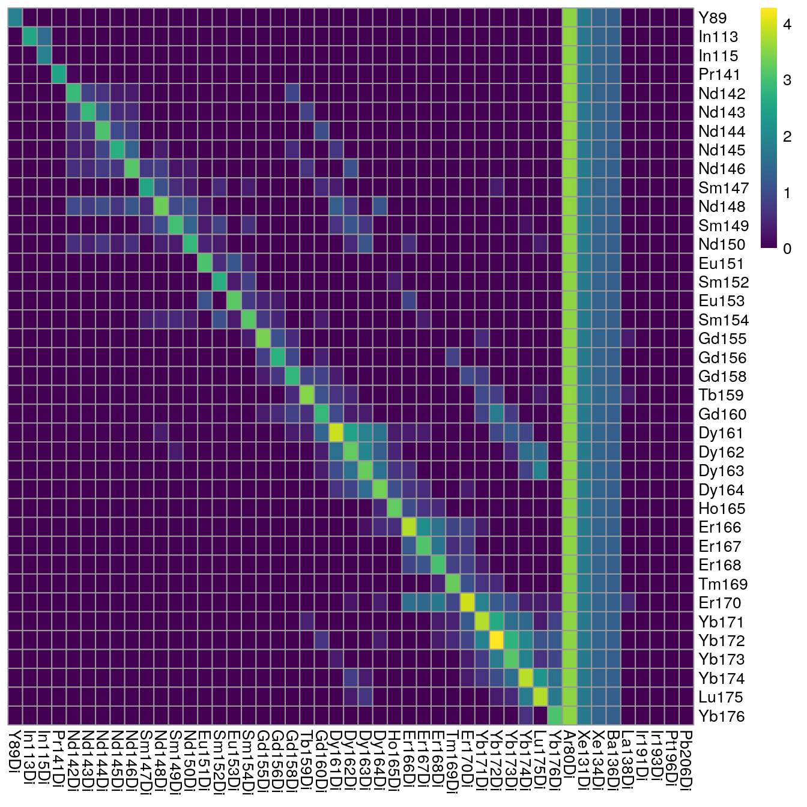
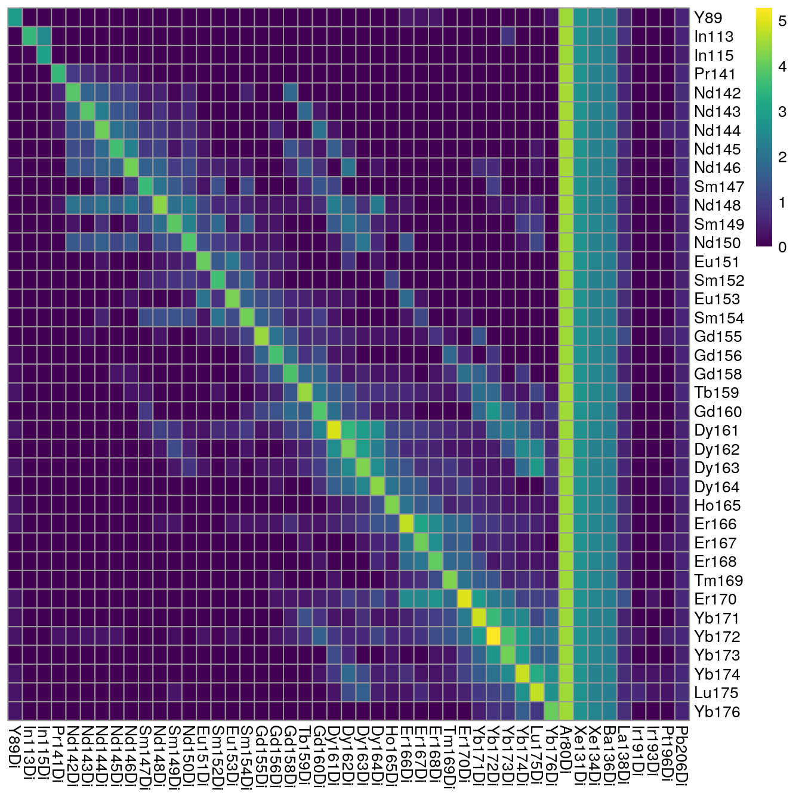
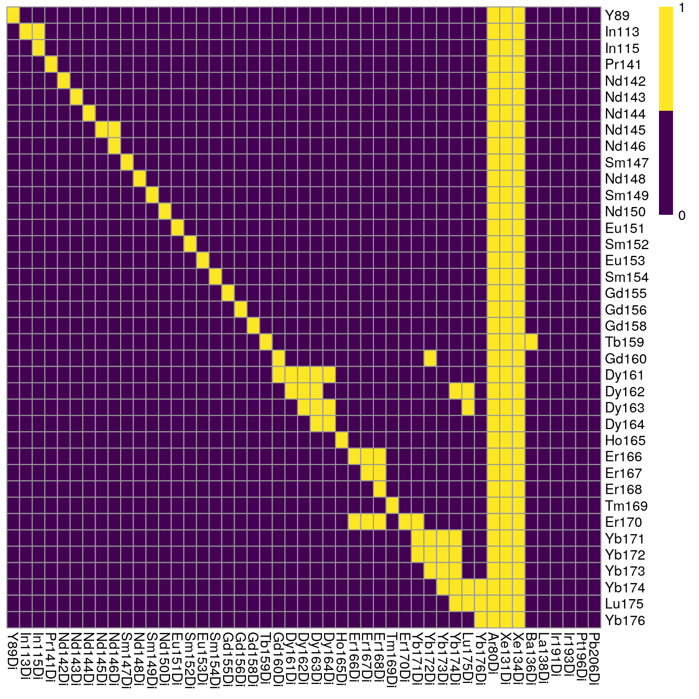
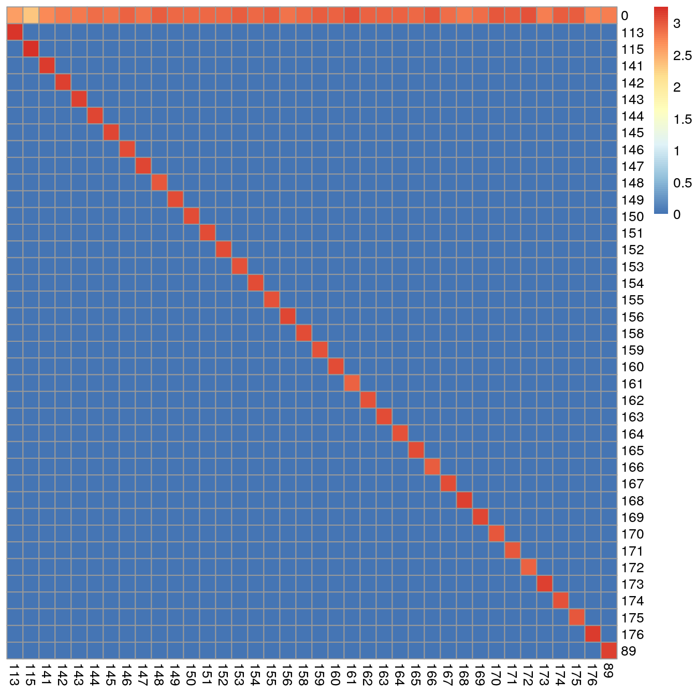
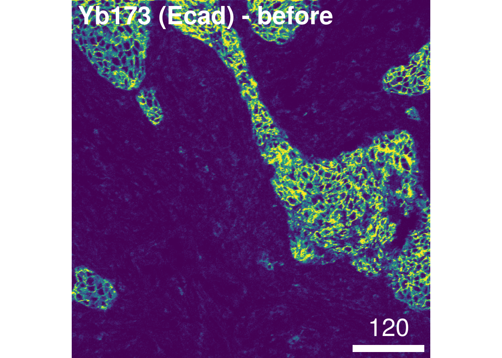
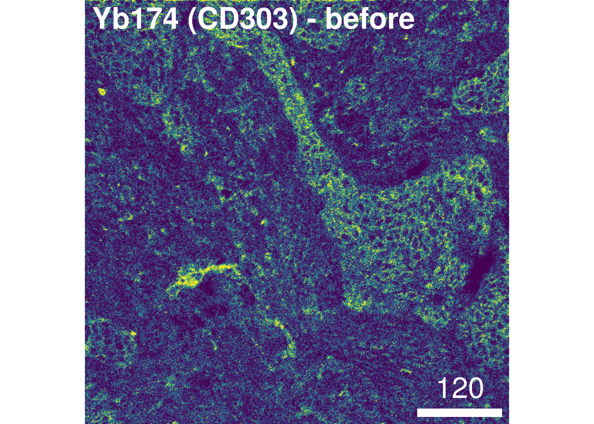
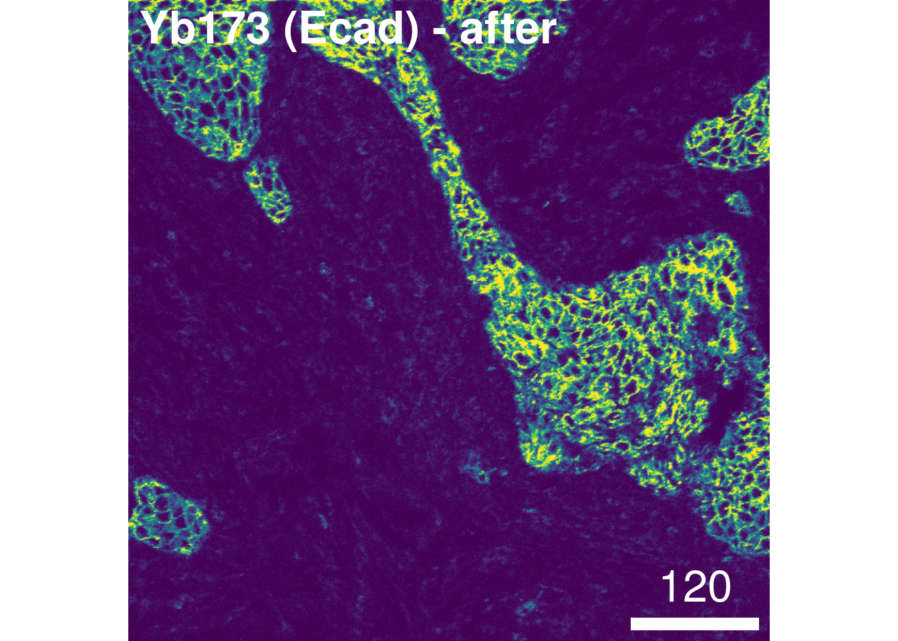

# Spillover correction

**Original scripts:** *Vito Zanotelli*, **adapted/maintained by:** *Nils Eling*

This section highlights how to generate a spillover matrix from individually
acquired single metal spots on an agarose slide. Each spot needs to be imaged as
its own acquisition/ROI and individual TXT files containing the pixel
intensities per spot need to be available. For complete details on the spillover
correction approach, please refer to [the original
publication](https://www.cell.com/cell-systems/fulltext/S2405-4712(18)30063-2) [@Chevrier2017].

**Spillover slide preparation:**  

* Prepare 2% agarose in double distilled H$_2$O in a beaker and melt it in a microwave until well dissolved. 
* Dip a blank superfrost plus glass microscope slide into the agarose and submerge it until the label. 
* Remove the slide and prop it up against a support to allow the excess agarose to run off onto paper towels.  
* Allow the slide to dry completely (at least 30 minutes).  
* Retrieve all the antibody conjugates used in the panel for which the spillover matrix is to be generated and place them on ice. 
* Arrange them in a known order (e.g., mass of the conjugated metal).  
* Pipette 0.3 µl spots of 0.4% trypan blue dye into an array on the slide. Prepare one spot per antibody, and make sure the spots are well separated. 
* Pipette 0.3 µl of each antibody conjugate (usually at 0.5 mg/ml) onto a unique blue spot, taking care to avoid different antibodies bleeding into each other. Note the exact location of each conjugate on the slide. 
* Let the spots dry completely, at least 1 hour. 

**Spillover slide acquisition:**  

* Create a JPEG or PNG image of the slide using a mobile phone camera or flat-bed scanner.  
* In the CyTOF software, create a new file and import the slide image into it. 
* Create a panorama across all the spots to visualize their locations.  
* Within each spot, create a region of interest (ROI) with a width of 200 pixels and a height of 10 pixels.  
* Name each ROI with the mass and name of the metal conjugate contained in the spot, e.g "Ir193" or "Ho165". This will be how each TXT file is named. 
* Set the profiling type of each ROI to "Local".  
* Apply the antibody panel to all the ROIs. This panel should contain all (or more) of the isotopes in the panel, with the correct metal specified. For example: if the metal used is Barium 138, make sure this, rather than Lanthanum 138, is selected. 
* Save the file, make sure "Generate Text File" is selected, and start the acquisition. 

This procedure will generate an MCD file similar to the one available on zenodo:
[10.5281/zenodo.5949115](https://doi.org/10.5281/zenodo.5949115)

The original code of the spillover correction manuscript is available on Github
[here](https://github.com/BodenmillerGroup/cyTOFcompensation); however, due to
changes in the
[CATALYST](https://bioconductor.org/packages/release/bioc/html/CATALYST.html)
package, users were not able to reproduce the analysis using the newest software
versions. The following workflow uses the newest package versions to generate a
spillover matrix and perform spillover correction.

In brief, the highlighted workflow comprises 9 steps:

1. Reading in the data
2. Quality control 
3. (Optional) pixel binning
4. "Debarcoding" for pixel assignment
5. Pixel selection for spillover matrix estimation
6. Spillover matrix generation
7. Saving the results
8. Single-cell compensation
9. Image compensation

## Generate the spillover matrix

In the first step, we will generate a spillover matrix based on the single-metal
spots and save it for later use.

### Read in the data

Here, we will read in the individual TXT files into a `SingleCellExperiment`
object. This object can be used directly by the `CATALYST` package to estimate
the spillover.

For this to work, the TXT file names need to contain the spotted metal isotope
name. By default, the first occurrence of the isotope in the format `(mt)(mass)`
(e.g. `Sm152` for Samarium isotope with the atomic mass 152) will be used as
spot identifier. Alternatively, a named list of already read-in pixel intensities
can be provided. For more information, please refer to the man page `?readSCEfromTXT`.

For further downstream analysis, we will asinh-transform the data using a
cofactor of 5; a common transformation for CyTOF data [@Bendall2011].
As the pixel intensities are larger than the cell intensities, the cofactor
here is larger than the cofactor when transforming the mean cell intensities.


```r
library(imcRtools)

# Create SingleCellExperiment from TXT files
sce <- readSCEfromTXT("data/compensation/") 
```

```
## Spotted channels:  Y89, In113, In115, Pr141, Nd142, Nd143, Nd144, Nd145, Nd146, Sm147, Nd148, Sm149, Nd150, Eu151, Sm152, Eu153, Sm154, Gd155, Gd156, Gd158, Tb159, Gd160, Dy161, Dy162, Dy163, Dy164, Ho165, Er166, Er167, Er168, Tm169, Er170, Yb171, Yb172, Yb173, Yb174, Lu175, Yb176
## Acquired channels:  Ar80, Y89, In113, In115, Xe131, Xe134, Ba136, La138, Pr141, Nd142, Nd143, Nd144, Nd145, Nd146, Sm147, Nd148, Sm149, Nd150, Eu151, Sm152, Eu153, Sm154, Gd155, Gd156, Gd158, Tb159, Gd160, Dy161, Dy162, Dy163, Dy164, Ho165, Er166, Er167, Er168, Tm169, Er170, Yb171, Yb172, Yb173, Yb174, Lu175, Yb176, Ir191, Ir193, Pt196, Pb206
## Channels spotted but not acquired:  
## Channels acquired but not spotted:  Ar80, Xe131, Xe134, Ba136, La138, Ir191, Ir193, Pt196, Pb206
```

```r
assay(sce, "exprs") <- asinh(counts(sce)/5)
```

### Quality control

In the next step, we will observe the median pixel intensities per spot and
threshold on medians < 200 counts.
These types of visualization serve two purposes:

1. Small median pixel intensities (< 200 counts) might hinder the robust
estimation of the channel spillover. In that case, consecutive pixels can be
summed (see [Optional pixel binning](#pixel_binning)).

2. Each spotted metal (row) should show the highest median pixel intensity in its
corresponding channel (column). If this is not the case, either the naming of the
TXT files was incorrect or the incorrect metal was spotted.


```r
# Log10 median pixel counts per spot and channel
plotSpotHeatmap(sce)
```



```r
# Thresholded on 200 pixel counts
plotSpotHeatmap(sce, log = FALSE, threshold = 200)
```


As we can see, nearly all median pixel intensities are > 200 counts for each spot.
We also observe acquired channels for which no spot was placed (e.g., Xe134, Ir191, Ir193). 

### Optional pixel binning {#pixel_binning}

In cases where median pixel intensities are low (< 200 counts), consecutive
pixels can be summed to increase the robustness of the spillover estimation.
The `imcRtools` package provides the `binAcrossPixels` function,
which performs aggregation for each channel across `bin_size` consecutive pixels 
per spotted metal.


```r
# Define grouping
bin_size = 10

sce2 <- binAcrossPixels(sce, bin_size = bin_size)

# Log10 median pixel counts per spot and channel
plotSpotHeatmap(sce2)
```



```r
# Thresholded on 200 pixel counts
plotSpotHeatmap(sce2, log = FALSE, threshold = 200)
```



Here, we can see an increase in the median pixel intensities and accumulation of
off-diagonal signal. Due to already high original pixel intensities, we will
refrain from aggregating across consecutive pixels for this demonstration.

### Filtering incorrectly assigned pixels

The following step uses functions provided by the `CATALYST` package to
"debarcode" the pixels. Based on the intensity distribution of all channels,
pixels are assigned to their corresponding barcode; here this is the already
known metal spot. This procedure serves the purpose to identify pixels that
cannot be robustly assigned to the spotted metal. Pixels of such kind can be
regarded as "noisy", "background" or "artefacts" that should be removed prior to
spillover estimation.

We will also need to specify which channels were spotted (argument `bc_key`).
This information is directly contained in the `colData(sce)` slot.
To facilitate visualization, we will order the `bc_key` by mass.

The general workflow for pixel debarcoding is as follows:

1. assign a preliminary metal mass to each pixel
2. for each pixel, estimate a cutoff parameter for the distance between 
positive and negative pixel sets
3. apply the estimated cutoffs to identify truly positive pixels


```r
library(CATALYST)

bc_key <- as.numeric(unique(sce$sample_mass))
bc_key <- bc_key[order(bc_key)]

sce <- assignPrelim(sce, bc_key = bc_key)
sce <- estCutoffs(sce)
sce <- applyCutoffs(sce)
```

The obtained `SingleCellExperiment` now contains the additional `bc_id` entry.
For each pixel, this vector indicates the assigned mass (e.g. `161`) or
`0`, meaning unassigned. 

This information can be visualized in form of a heatmap:


```r
library(pheatmap)
cur_table <- table(sce$bc_id, sce$sample_mass)

# Visualize the correctly and incorrectly assigned pixels
pheatmap(log10(cur_table + 1),
         cluster_rows = FALSE,
         cluster_cols = FALSE)
```



```r
# Compute the fraction of unassigned pixels per spot
cur_table["0",] / colSums(cur_table)
```

```
##    113    115    141    142    143    144    145    146    147    148    149 
## 0.1985 0.1060 0.2575 0.3195 0.3190 0.3825 0.3545 0.4280 0.3570 0.4770 0.4200 
##    150    151    152    153    154    155    156    158    159    160    161 
## 0.4120 0.4025 0.4050 0.4630 0.4190 0.4610 0.3525 0.4020 0.4655 0.4250 0.5595 
##    162    163    164    165    166    167    168    169    170    171    172 
## 0.4340 0.4230 0.4390 0.4055 0.5210 0.3900 0.3285 0.3680 0.5015 0.4900 0.5650 
##    173    174    175    176     89 
## 0.3125 0.4605 0.4710 0.2845 0.3015
```

We can see here, that all pixels were assigned to the right mass and that all
pixel sets are made up of > 800 pixels.

However, in cases where incorrect assignment occurred or where few pixels were
measured for some spots, the `imcRtools` package exports a simple helper
function to exclude pixels based on these criteria:


```r
sce <- filterPixels(sce, minevents = 40, correct_pixels = TRUE)
```

In the `filterPixels` function, the `minevents` parameter specifies the threshold
under which correctly assigned pixel sets are excluded from spillover
estimation. The `correct_pixels` parameter indicates whether pixels that were
assigned to masses other than the spotted mass should be excluded from spillover
estimation. The default values often result in sufficient pixel filtering;
however, if very few pixels (~100) are measured per spot, the `minevents`
parameter value needs to be lowered.

### Compute spillover matrix

Based on the single-positive pixels, we use the `CATALYST::computeSpillmat()`
function to compute the spillover matrix and `CATALYST::plotSpillmat()` to
visualize it. The `plotSpillmat` function checks the spotted and acquired
metal isotopes against a pre-defined `CATALYST::isotope_list()`. In this data,
the `Ar80` channel was additionally acquired to check for deviations in signal
intensity. `Ar80` needs to be added to a custom `isotope_list` object for
visualization.


```r
sce <- computeSpillmat(sce)

isotope_list <- CATALYST::isotope_list
isotope_list$Ar <- 80

plotSpillmat(sce, isotope_list = isotope_list)
```

```
## Warning: The `guide` argument in `scale_*()` cannot be `FALSE`. This was deprecated in
## ggplot2 3.3.4.
## ℹ Please use "none" instead.
## ℹ The deprecated feature was likely used in the CATALYST package.
##   Please report the issue at <https://github.com/HelenaLC/CATALYST/issues>.
## This warning is displayed once every 8 hours.
## Call `lifecycle::last_lifecycle_warnings()` to see where this warning was
## generated.
```


```r
# Save spillover matrix in variable
sm <- metadata(sce)$spillover_matrix
```

**Of note: the visualization of the spillover matrix using CATALYST does currently
not visualize spillover between the larger channels.** In this case, the 
spillover matrix is clipped at Yb171.

As we can see, the largest spillover appears in `In113 --> In115` and we also
observe the `+16` oxide impurities for e.g. `Nd148 --> Dy164`.

We can save the spillover matrix for external use.


```r
write.csv(sm, "data/sm.csv")
```

## Single-cell data compensation

The `CATALYST` package can be used to perform spillover compensation on the
**single-cell mean intensities**. Here, the `SpatialExperiment` object generated
in Section \@ref(read-data) is read in. The `CATALYST` package requires an entry
to `rowData(spe)$channel_name` for the `compCytof` function to run. This entry
should contain the metal isotopes in the form (mt)(mass)Di (e.g., `Sm152Di` for
Samarium isotope with the atomic mass 152). 

The `compCytof` function performs channel spillover compensation on the mean
pixel intensities per channel and cell. Here, we will not overwrite the assays
in the `SpatialExperiment` object to later highlight the effect of compensation.
As shown in Section \@ref(read-data), also the compensated counts are
asinh-transformed using a cofactor of 1.


```r
spe <- readRDS("data/spe.rds")
rowData(spe)$channel_name <- paste0(rowData(spe)$channel, "Di")

spe <- compCytof(spe, sm, 
                 transform = TRUE, cofactor = 1,
                 isotope_list = isotope_list, 
                 overwrite = FALSE)
```

To check the effect of channel spillover compensation, the expression of markers
that are affected by spillover (e.g., E-cadherin in channel Yb173 and CD303 in
channel Yb174) can be visualized in form of scatter plots before and after
compensation.


```r
library(dittoSeq)
library(patchwork)
before <- dittoScatterPlot(spe, x.var = "Ecad", y.var = "CD303",
                           assay.x = "exprs", assay.y = "exprs") +
    ggtitle("Before compensation")

after <- dittoScatterPlot(spe, x.var = "Ecad", y.var = "CD303",
                          assay.x = "compexprs", assay.y = "compexprs") +
    ggtitle("After compensation")
before + after
```


We observe that the spillover Yb173 --> Yb174 was successfully corrected.
To facilitate further downstream analysis, the non-compensated assays can now be
replaced by their compensated counterparts:


```r
assay(spe, "counts") <- assay(spe, "compcounts") 
assay(spe, "exprs") <- assay(spe, "compexprs") 
assay(spe, "compcounts") <- assay(spe, "compexprs") <- NULL
```

## Image compensation

The [cytomapper](https://github.com/BodenmillerGroup/cytomapper) package allows channel
spillover compensation directly on **multi-channel images**. 
The `compImage` function takes a `CytoImageList` object and the estimated
spillover matrix as input. More info on how to work with `CytoImageList`
objects can be seen in Section \@ref(image-visualization).

At this point, we can read in the `CytoImageList` object containing multi-channel
images as generated in Section \@ref(read-data).
The `channelNames` need to be set according to their metal isotope in the form
(mt)(mass)Di and therefore match `colnames(sm)`.


```r
library(cytomapper)

images <- readRDS("data/images.rds")
channelNames(images) <- rowData(spe)$channel_name
```

The CATALYST package provides the `adaptSpillmat` function that corrects the
spillover matrix in a way that rows and columns match a predefined set of
metals. Please refer to `?compCytof` for more information how metals in the
spillover matrix are matched to acquired channels in the `SingleCellExperiment`
object.

The spillover matrix can now be adapted to exclude channels that were not kept
for downstream analysis.


```r
adapted_sm <- adaptSpillmat(sm, channelNames(images), 
                            isotope_list = isotope_list)
```

```
## Compensation is likely to be inaccurate.
## Spill values for the following interactions
## have not been estimated:
```

```
## Ir191Di -> Ir193Di
```

```
## Ir193Di -> Ir191Di
```

The adapted spillover matrix now matches the `channelNames` of the
`CytoImageList` object and can be used to perform pixel-level spillover
compensation. Here, we parallelise the image compensation on all available minus 2 cores. When
working on Windows, you will need to use the `SnowParam` function instead of
`MultiCoreParam`.


```r
library(BiocParallel)

images_comp <- compImage(images, adapted_sm, 
                         BPPARAM = MulticoreParam())
```

As a sanity check, we will visualize the image before and after compensation:


```r
# Before compensation
plotPixels(images[5], colour_by = "Yb173Di", 
           image_title = list(text = "Yb173 (Ecad) - before", position = "topleft"), 
           legend = NULL, bcg = list(Yb173Di = c(0, 4, 1)))
```



```r
plotPixels(images[5], colour_by = "Yb174Di", 
           image_title = list(text = "Yb174 (CD303) - before", position = "topleft"), 
           legend = NULL, bcg = list(Yb174Di = c(0, 4, 1)))
```



```r
# After compensation
plotPixels(images_comp[5], colour_by = "Yb173Di",
           image_title = list(text = "Yb173 (Ecad) - after", position = "topleft"), 
           legend = NULL, bcg = list(Yb173Di = c(0, 4, 1)))
```



```r
plotPixels(images_comp[5], colour_by = "Yb174Di", 
           image_title = list(text = "Yb174 (CD303) - after", position = "topleft"),
           legend = NULL, bcg = list(Yb174Di = c(0, 4, 1)))
```


For convenience, we will re-set the `channelNames` to their biological targtes:


```r
channelNames(images_comp) <- rownames(spe)
```


## Write out compensated images

In the final step, the compensated images are written out as 16-bit TIFF
files:


```r
library(tiff)
dir.create("data/comp_img")
lapply(names(images_comp), function(x){
  writeImage(as.array(images_comp[[x]])/(2^16 - 1), 
             paste0("data/comp_img/", x, ".tiff"),
             bits.per.sample = 16)
})
```

## Save objects

For further downstream analysis, the compensated `SpatialExperiment` and
`CytoImageList` objects are saved replacing the former objects:


```r
saveRDS(spe, "data/spe.rds")
saveRDS(images_comp, "data/images.rds")
```


## Session Info

<details>
   <summary>SessionInfo</summary>
   

```
## R version 4.3.2 (2023-10-31)
## Platform: x86_64-pc-linux-gnu (64-bit)
## Running under: Ubuntu 22.04.3 LTS
## 
## Matrix products: default
## BLAS:   /usr/lib/x86_64-linux-gnu/openblas-pthread/libblas.so.3 
## LAPACK: /usr/lib/x86_64-linux-gnu/openblas-pthread/libopenblasp-r0.3.20.so;  LAPACK version 3.10.0
## 
## locale:
##  [1] LC_CTYPE=en_US.UTF-8       LC_NUMERIC=C              
##  [3] LC_TIME=en_US.UTF-8        LC_COLLATE=en_US.UTF-8    
##  [5] LC_MONETARY=en_US.UTF-8    LC_MESSAGES=en_US.UTF-8   
##  [7] LC_PAPER=en_US.UTF-8       LC_NAME=C                 
##  [9] LC_ADDRESS=C               LC_TELEPHONE=C            
## [11] LC_MEASUREMENT=en_US.UTF-8 LC_IDENTIFICATION=C       
## 
## time zone: Etc/UTC
## tzcode source: system (glibc)
## 
## attached base packages:
## [1] stats4    stats     graphics  grDevices utils     datasets  methods  
## [8] base     
## 
## other attached packages:
##  [1] testthat_3.2.1              tiff_0.1-12                
##  [3] BiocParallel_1.36.0         cytomapper_1.14.0          
##  [5] EBImage_4.44.0              patchwork_1.1.3            
##  [7] dittoSeq_1.14.0             ggplot2_3.4.4              
##  [9] pheatmap_1.0.12             CATALYST_1.26.0            
## [11] imcRtools_1.8.0             SpatialExperiment_1.12.0   
## [13] SingleCellExperiment_1.24.0 SummarizedExperiment_1.32.0
## [15] Biobase_2.62.0              GenomicRanges_1.54.1       
## [17] GenomeInfoDb_1.38.5         IRanges_2.36.0             
## [19] S4Vectors_0.40.2            BiocGenerics_0.48.1        
## [21] MatrixGenerics_1.14.0       matrixStats_1.2.0          
## 
## loaded via a namespace (and not attached):
##   [1] bitops_1.0-7                sf_1.0-15                  
##   [3] RColorBrewer_1.1-3          doParallel_1.0.17          
##   [5] tools_4.3.2                 backports_1.4.1            
##   [7] utf8_1.2.4                  R6_2.5.1                   
##   [9] DT_0.31                     HDF5Array_1.30.0           
##  [11] rhdf5filters_1.14.1         GetoptLong_1.0.5           
##  [13] withr_2.5.2                 sp_2.1-2                   
##  [15] gridExtra_2.3               cli_3.6.2                  
##  [17] archive_1.1.7               sandwich_3.1-0             
##  [19] labeling_0.4.3              sass_0.4.8                 
##  [21] nnls_1.5                    mvtnorm_1.2-4              
##  [23] readr_2.1.4                 proxy_0.4-27               
##  [25] ggridges_0.5.5              systemfonts_1.0.5          
##  [27] colorRamps_2.3.1            svglite_2.1.3              
##  [29] scater_1.30.1               plotrix_3.8-4              
##  [31] flowCore_2.14.0             generics_0.1.3             
##  [33] shape_1.4.6                 gtools_3.9.5               
##  [35] vroom_1.6.5                 car_3.1-2                  
##  [37] dplyr_1.1.4                 Matrix_1.6-4               
##  [39] RProtoBufLib_2.14.0         ggbeeswarm_0.7.2           
##  [41] fansi_1.0.6                 abind_1.4-5                
##  [43] terra_1.7-65                lifecycle_1.0.4            
##  [45] multcomp_1.4-25             yaml_2.3.8                 
##  [47] carData_3.0-5               rhdf5_2.46.1               
##  [49] SparseArray_1.2.3           Rtsne_0.17                 
##  [51] grid_4.3.2                  promises_1.2.1             
##  [53] crayon_1.5.2                shinydashboard_0.7.2       
##  [55] lattice_0.21-9              beachmat_2.18.0            
##  [57] cowplot_1.1.2               magick_2.8.2               
##  [59] pillar_1.9.0                knitr_1.45                 
##  [61] ComplexHeatmap_2.18.0       RTriangle_1.6-0.12         
##  [63] rjson_0.2.21                codetools_0.2-19           
##  [65] glue_1.6.2                  data.table_1.14.10         
##  [67] vctrs_0.6.5                 png_0.1-8                  
##  [69] gtable_0.3.4                cachem_1.0.8               
##  [71] xfun_0.41                   S4Arrays_1.2.0             
##  [73] mime_0.12                   tidygraph_1.3.0            
##  [75] ConsensusClusterPlus_1.66.0 survival_3.5-7             
##  [77] iterators_1.0.14            cytolib_2.14.0             
##  [79] units_0.8-5                 ellipsis_0.3.2             
##  [81] TH.data_1.1-2               bit64_4.0.5                
##  [83] rprojroot_2.0.4             bslib_0.6.1                
##  [85] irlba_2.3.5.1               svgPanZoom_0.3.4           
##  [87] vipor_0.4.7                 KernSmooth_2.23-22         
##  [89] colorspace_2.1-0            DBI_1.2.0                  
##  [91] raster_3.6-26               tidyselect_1.2.0           
##  [93] bit_4.0.5                   compiler_4.3.2             
##  [95] BiocNeighbors_1.20.1        desc_1.4.3                 
##  [97] DelayedArray_0.28.0         bookdown_0.37              
##  [99] scales_1.3.0                classInt_0.4-10            
## [101] distances_0.1.10            stringr_1.5.1              
## [103] digest_0.6.33               fftwtools_0.9-11           
## [105] rmarkdown_2.25              XVector_0.42.0             
## [107] htmltools_0.5.7             pkgconfig_2.0.3            
## [109] jpeg_0.1-10                 sparseMatrixStats_1.14.0   
## [111] highr_0.10                  fastmap_1.1.1              
## [113] rlang_1.1.2                 GlobalOptions_0.1.2        
## [115] htmlwidgets_1.6.4           shiny_1.8.0                
## [117] DelayedMatrixStats_1.24.0   farver_2.1.1               
## [119] jquerylib_0.1.4             zoo_1.8-12                 
## [121] jsonlite_1.8.8              BiocSingular_1.18.0        
## [123] RCurl_1.98-1.13             magrittr_2.0.3             
## [125] scuttle_1.12.0              GenomeInfoDbData_1.2.11    
## [127] Rhdf5lib_1.24.1             munsell_0.5.0              
## [129] Rcpp_1.0.11                 ggnewscale_0.4.9           
## [131] viridis_0.6.4               stringi_1.8.3              
## [133] ggraph_2.1.0                brio_1.1.4                 
## [135] zlibbioc_1.48.0             MASS_7.3-60                
## [137] plyr_1.8.9                  parallel_4.3.2             
## [139] ggrepel_0.9.4               graphlayouts_1.0.2         
## [141] splines_4.3.2               hms_1.1.3                  
## [143] circlize_0.4.15             locfit_1.5-9.8             
## [145] igraph_1.6.0                ggpubr_0.6.0               
## [147] ggsignif_0.6.4              pkgload_1.3.3              
## [149] reshape2_1.4.4              ScaledMatrix_1.10.0        
## [151] XML_3.99-0.16               drc_3.0-1                  
## [153] evaluate_0.23               tzdb_0.4.0                 
## [155] foreach_1.5.2               tweenr_2.0.2               
## [157] httpuv_1.6.13               tidyr_1.3.0                
## [159] purrr_1.0.2                 polyclip_1.10-6            
## [161] clue_0.3-65                 ggforce_0.4.1              
## [163] rsvd_1.0.5                  broom_1.0.5                
## [165] xtable_1.8-4                e1071_1.7-14               
## [167] rstatix_0.7.2               later_1.3.2                
## [169] viridisLite_0.4.2           class_7.3-22               
## [171] tibble_3.2.1                FlowSOM_2.10.0             
## [173] beeswarm_0.4.0              cluster_2.1.4              
## [175] concaveman_1.1.0
```
</details>

