# Image and cell-level quality control

The following section discusses possible quality indicators for data obtained
by IMC and other highly multiplexed imaging technologies. Here, we will focus
on describing quality metrics on the single-cell as well as image level.

## Read in the data

We will first read in the data processed in previous sections:


``` r
images <- readRDS("data/images.rds")
masks <- readRDS("data/masks.rds")
spe <- readRDS("data/spe.rds")
```

## Segmentation quality control {#seg-quality}

The first step after image segmentation is to observe its accuracy.
Without having ground-truth data readily available, a common approach to 
segmentation quality control is to overlay segmentation masks on composite images
displaying channels that were used for segmentation. 
The [cytomapper](https://www.bioconductor.org/packages/release/bioc/html/cytomapper.html) 
package supports exactly this tasks by using the `plotPixels` function.

Here, we select 3 random images and perform image- and channel-wise
normalization (channels are first min-max normalized and scaled to a range of
0-1 before clipping the maximum intensity to 0.2).


``` r
library(cytomapper)
set.seed(20220118)
img_ids <- sample(seq_along(images), 3)

# Normalize and clip images
cur_images <- images[img_ids]
cur_images <- cytomapper::normalize(cur_images, separateImages = TRUE)
cur_images <- cytomapper::normalize(cur_images, inputRange = c(0, 0.2))

plotPixels(cur_images,
           mask = masks[img_ids],
           img_id = "sample_id",
           missing_colour = "white",
           colour_by = c("CD163", "CD20", "CD3", "Ecad", "DNA1"),
           colour = list(CD163 = c("black", "yellow"),
                         CD20 = c("black", "red"),
                         CD3 = c("black", "green"),
                         Ecad = c("black", "cyan"),
                         DNA1 = c("black", "blue")),
           image_title = NULL,
           legend = list(colour_by.title.cex = 0.7,
                         colour_by.labels.cex = 0.7))
```

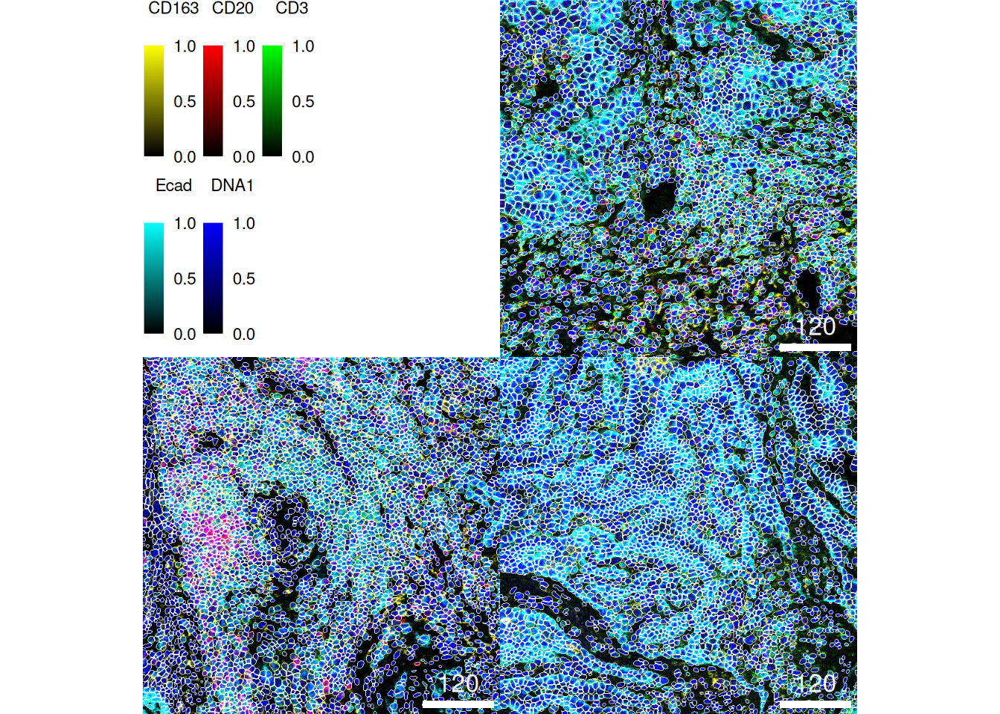

We can see that nuclei are centered within the segmentation masks and all cell
types are correctly segmented (note: to zoom into the image you can right click
and select `Open Image in New Tab`). A common challenge here is to segment large (e.g.,
epithelial cells - in cyan) _versus_ small (e.g., B cells - in red). However, the
segmentation approach here appears to correctly segment cells across different
sizes.

An easier and interactive way of observing segmentation quality is to use the
interactive image viewer provided by the
[cytoviewer](https://github.com/BodenmillerGroup/cytoviewer) R/Bioconductor
package [@Meyer2024]. Under "Image-level" > "Basic controls", up to six markers
can be selected for visualization. The contrast of each marker can be adjusted.
Under "Image-level" > "Advanced controls", click the "Show cell outlines" box
to outline segmented cells on the images.


``` r
library(cytoviewer)

app <- cytoviewer(image = images, 
                  mask = masks, 
                  object = spe,
                  cell_id = "ObjectNumber", 
                  img_id = "sample_id")

if (interactive()) {
    shiny::runApp(app)
}
```

An additional approach to observe cell segmentation quality and potentially also
antibody specificity issues is to visualize single-cell expression in form of a
heatmap. Here, we sub-sample the dataset to 2000 cells for visualization
purposes and overlay the cancer type from which the cells were extracted.


``` r
library(dittoSeq)
library(viridis)
cur_cells <- sample(seq_len(ncol(spe)), 2000)

dittoHeatmap(spe[,cur_cells], 
             genes = rownames(spe)[rowData(spe)$use_channel],
             assay = "exprs", 
             cluster_cols = TRUE, 
             scale = "none",
             heatmap.colors = viridis(100), 
             annot.by = "indication",
             annotation_colors = list(indication = metadata(spe)$color_vectors$indication))
```

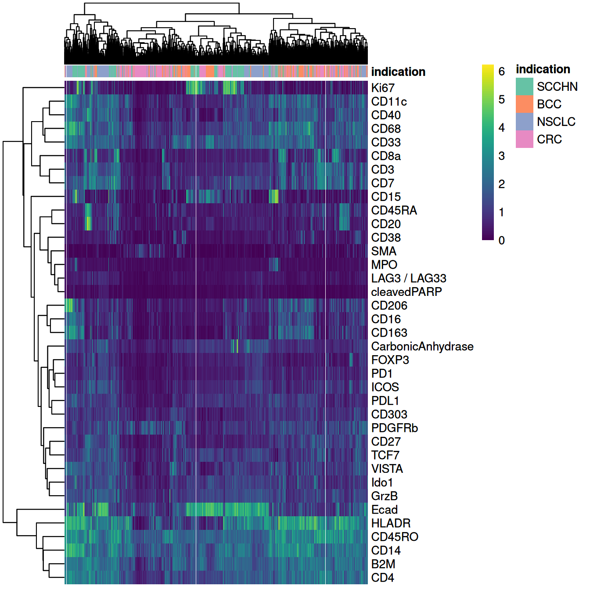

We can differentiate between epithelial cells (Ecad+) and immune cells
(CD45RO+). Some of the markers are detected in specific cells (e.g., Ki67, CD20,
Ecad) while others are more broadly expressed across cells (e.g., HLADR, B2M,
CD4).

## Image-level quality control {#image-quality}

Image-level quality control is often performed using tools that offer a
graphical user interface such as [QuPath](https://qupath.github.io/),
[FIJI](https://imagej.net/software/fiji/) and the previously mentioned
[cytoviewer](https://github.com/BodenmillerGroup/cytoviewer) package. Viewers
that were specifically developed for IMC data can be seen
[here](https://bodenmillergroup.github.io/IMCWorkflow/viewers.html). In this
section, we will specifically focus on quantitative metrics to assess image
quality.

It is often of interest to calculate the signal-to-noise ratio (SNR) for
individual channels and markers. Here, we define the SNR as:

$$SNR = I_s/I_n$$

where $I_s$ is the intensity of the signal (mean intensity of pixels with true
signal) and $I_n$ is the intensity of the noise (mean intensity of pixels
containing noise). This definition of the SNR is just one of many and other
measures can be applied.  Finding a threshold that separates pixels containing
signal and pixels containing noise is not trivial and different approaches can
be chosen. Here, we use the `otsu` thresholding approach to find pixels of the
"foreground" (i.e., signal) and "background" (i.e., noise). The SNR is then
defined as the mean intensity of foreground pixels divided by the mean intensity
of background pixels. We compute this measure as well as the mean signal
intensity per image. The plot below shows the average SNR _versus_ the average
signal intensity across all images.


``` r
library(tidyverse)
library(ggrepel)
library(EBImage)

cur_snr <- lapply(names(images), function(x){
    img <- images[[x]]
    mat <- apply(img, 3, function(ch){
        # Otsu threshold
        thres <- otsu(ch, range = c(min(ch), max(ch)), levels = 65536)
        # Signal-to-noise ratio
        snr <- mean(ch[ch > thres]) / mean(ch[ch <= thres])
        # Signal intensity
        ps <- mean(ch[ch > thres])
        
        return(c(snr = snr, ps = ps))
    })
    t(mat) %>% as.data.frame() %>% 
        mutate(image = x,
               marker = colnames(mat)) %>% 
        pivot_longer(cols = c(snr, ps))
})

cur_snr <- do.call(rbind, cur_snr)

cur_snr %>% 
    group_by(marker, name) %>%
    summarize(log_mean = log2(mean(value))) %>%
    pivot_wider(names_from = name, values_from = log_mean) %>%
    ggplot() +
    geom_point(aes(ps, snr)) +
    geom_label_repel(aes(ps, snr, label = marker)) +
    theme_minimal(base_size = 15) + ylab("Signal-to-noise ratio [log2]") +
    xlab("Signal intensity [log2]")
```

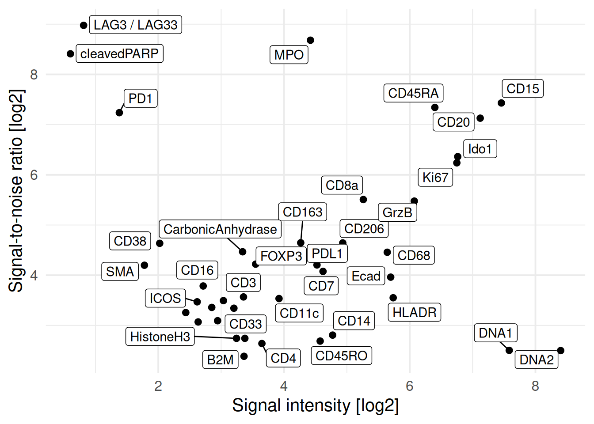

We observe PD1, LAG3 and cleaved PARP to have high SNR but low signal intensity
meaning that in general these markers are not abundantly expressed. The Iridium
intercalator (here marked as DNA1 and DNA2) has the highest signal intensity 
but low SNR. This might be due to staining differences between individual nuclei
where some nuclei are considered as background. We do however observe high
SNR and sufficient signal intensity for the majority of markers.

Otsu thesholding and SNR calculation does not perform well if the markers are
lowly abundant. In the next code chunk, we will remove markers that have 
a positive signal of below 2 per image.  


``` r
cur_snr <- cur_snr %>% 
    pivot_wider(names_from = name, values_from = value) %>%
    filter(ps > 2) %>%
    pivot_longer(cols = c(snr, ps))

cur_snr %>% 
    group_by(marker, name) %>%
    summarize(log_mean = log2(mean(value))) %>%
    pivot_wider(names_from = name, values_from = log_mean) %>%
    ggplot() +
    geom_point(aes(ps, snr)) +
    geom_label_repel(aes(ps, snr, label = marker)) +
    theme_minimal(base_size = 15) + ylab("Signal-to-noise ratio [log2]") +
    xlab("Signal intensity [log2]")
```

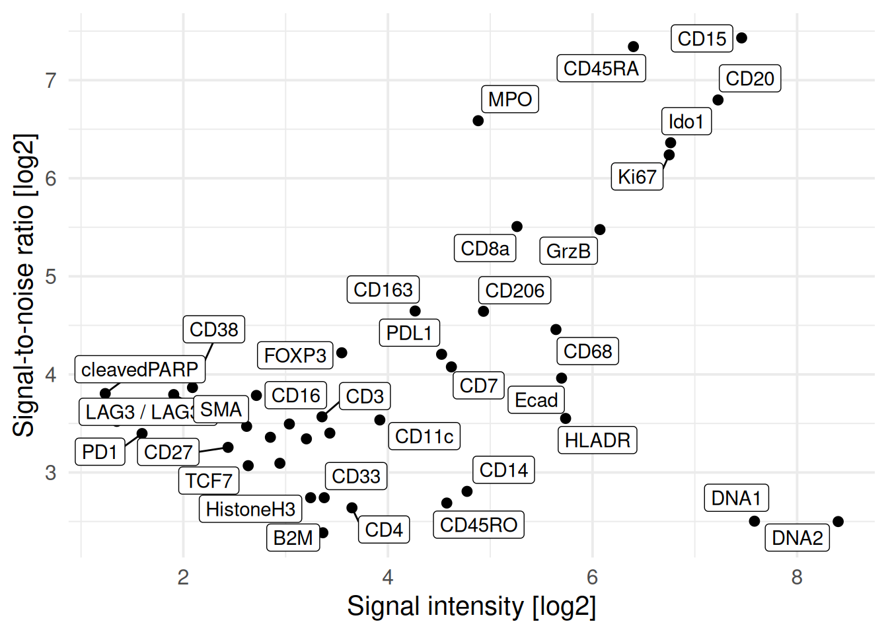

This visualization shows a reduces SNR for PD1, LAG3 and cleaved PARP which was
previously inflated due to low signal.

Another quality indicator is the image area covered by cells (or biological
tissue). This metric identifies ROIs where little cells are present, possibly
hinting at incorrect selection of the ROI. We can compute the percentage of
covered image area using the metadata contained in the `SpatialExperiment`
object:


``` r
cell_density <- colData(spe) %>%
    as.data.frame() %>%
    group_by(sample_id) %>%
    # Compute the number of pixels covered by cells and 
    # the total number of pixels
    summarize(cell_area = sum(area),
              no_pixels = mean(width_px) * mean(height_px)) %>%
    # Divide the total number of pixels 
    # by the number of pixels covered by cells
    mutate(covered_area = cell_area / no_pixels)

# Visualize the image area covered by cells per image
ggplot(cell_density) +
        geom_point(aes(reorder(sample_id,covered_area), covered_area)) + 
        theme_minimal(base_size = 15) +
        theme(axis.text.x = element_text(angle = 90, hjust = 1, size = 15)) +
        ylim(c(0, 1)) +
        ylab("% covered area") + xlab("")
```

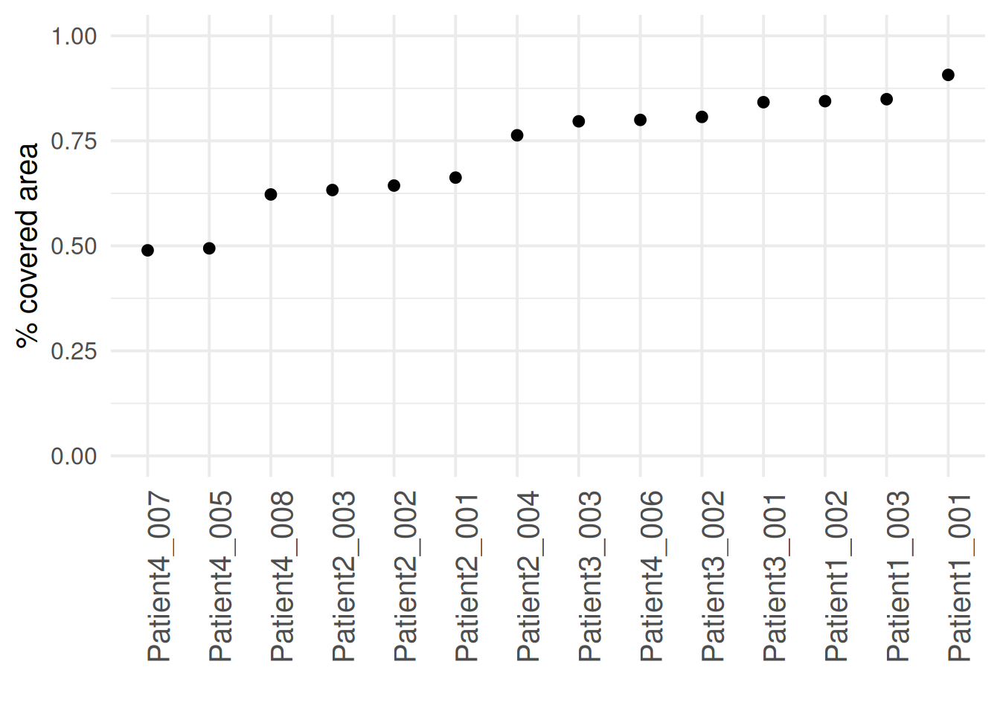

We observe that two of the 14 images show unusually low cell coverage. These
two images can now be visualized using `cytomapper`.


``` r
# Normalize and clip images
cur_images <- images[c("Patient4_005", "Patient4_007")]
cur_images <- cytomapper::normalize(cur_images, separateImages = TRUE)
cur_images <- cytomapper::normalize(cur_images, inputRange = c(0, 0.2))

plotPixels(cur_images,
           mask = masks[c("Patient4_005", "Patient4_007")],
           img_id = "sample_id",
           missing_colour = "white",
           colour_by = c("CD163", "CD20", "CD3", "Ecad", "DNA1"),
           colour = list(CD163 = c("black", "yellow"),
                         CD20 = c("black", "red"),
                         CD3 = c("black", "green"),
                         Ecad = c("black", "cyan"),
                         DNA1 = c("black", "blue")),
           legend = list(colour_by.title.cex = 0.7,
                         colour_by.labels.cex = 0.7))
```

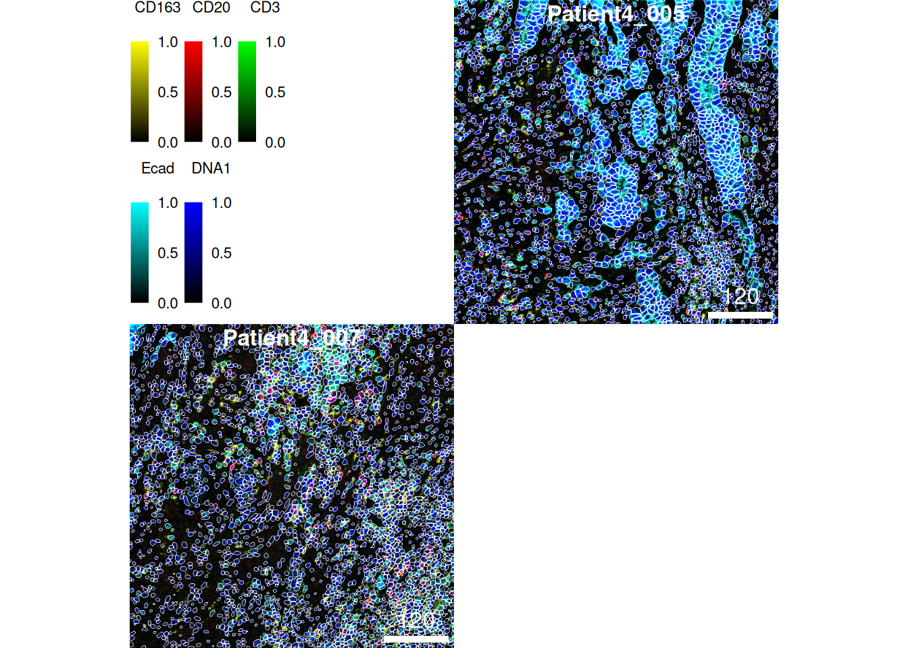

These two images display less dense tissue structure but overall the images are
intact and appear to be segmented correctly.

Finally, it can be beneficial to visualize the mean marker expression per image
to identify images with outlying marker expression. This check does not
indicate image quality _per se_ but can highlight biological differences. Here,
we will use the `aggregateAcrossCells` function of the 
*[scuttle](https://bioconductor.org/packages/3.22/scuttle)* package to compute the mean expression per 
image. For visualization purposes, we again `asinh` transform the mean expression
values.


``` r
library(scuttle)

image_mean <- aggregateAcrossCells(spe, 
                                   ids = spe$sample_id, 
                                   statistics="mean",
                                   use.assay.type = "counts")
assay(image_mean, "exprs") <- asinh(counts(image_mean))

dittoHeatmap(image_mean, genes = rownames(spe)[rowData(spe)$use_channel],
             assay = "exprs", cluster_cols = TRUE, scale = "none",
             heatmap.colors = viridis(100), 
             annot.by = c("indication", "patient_id", "ROI"),
             annotation_colors = list(indication = metadata(spe)$color_vectors$indication,
                                      patient_id = metadata(spe)$color_vectors$patient_id,
                                      ROI = metadata(spe)$color_vectors$ROI),
             show_colnames = TRUE)
```

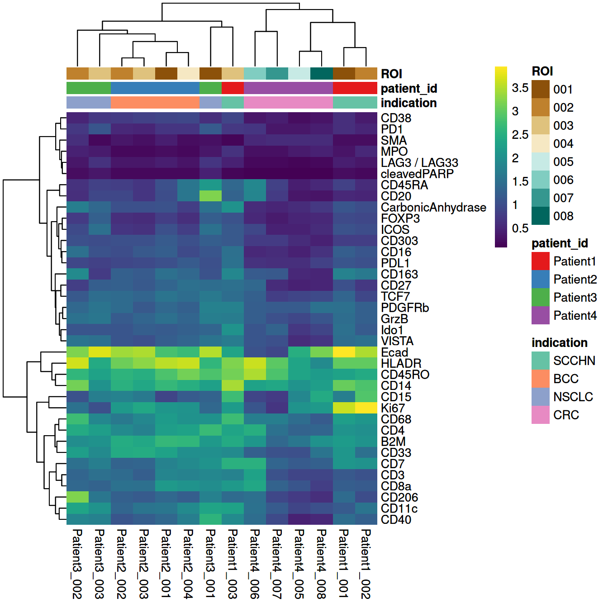

We observe extensive biological variation across the 14 images specifically for
some of the cell phenotype markers including the macrophage marker CD206, the B
cell marker CD20, the neutrophil marker CD15, and the proliferation marker Ki67.
These differences will be further studied in the following chapters.

## Cell-level quality control {#cell-quality}

In the following paragraphs we will look at different metrics and visualization
approaches to assess data quality (as well as biological differences) on the 
single-cell level. 

Related to the signal-to-noise ratio (SNR) calculated above on the pixel-level, 
a similar measure can be derived on the single-cell level. Here, we will use 
a two component Gaussian mixture model for each marker to find cells
with positive and negative expression. The SNR is defined as:

$$SNR = I_s/I_n$$

where $I_s$ is the intensity of the signal (mean intensity of cells with
positive signal) and $I_n$ is the intensity of the noise (mean intensity of
cells lacking expression). To define cells with positive and negative marker
expression, we fit the mixture model across the transformed counts of all cells
contained in the `SpatialExperiment` object. Next, for each marker we calculate
the mean of the non-transformed counts for the positive and the negative cells.
The SNR is then the ratio between the mean of the positive signal and the mean
of the negative signal.


``` r
library(mclust)

set.seed(220224)
mat <- sapply(seq_len(nrow(spe)), function(x){
    cur_exprs <- assay(spe, "exprs")[x,]
    cur_counts <- assay(spe, "counts")[x,]
    
    cur_model <- Mclust(cur_exprs, G = 2)
    mean1 <- mean(cur_counts[cur_model$classification == 1])
    mean2 <- mean(cur_counts[cur_model$classification == 2])
    
    signal <- ifelse(mean1 > mean2, mean1, mean2)
    noise <- ifelse(mean1 > mean2, mean2, mean1)
    
    return(c(snr = signal/noise, ps = signal))
})
    
cur_snr <- t(mat) %>% as.data.frame() %>% 
        mutate(marker = rownames(spe))

cur_snr %>% ggplot() +
    geom_point(aes(log2(ps), log2(snr))) +
    geom_label_repel(aes(log2(ps), log2(snr), label = marker)) +
    theme_minimal(base_size = 15) + ylab("Signal-to-noise ratio [log2]") +
    xlab("Signal intensity [log2]")
```

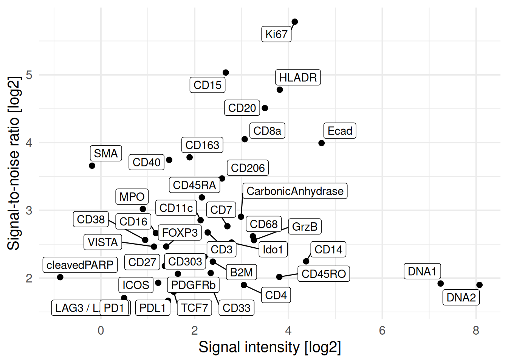

Next, we observe the distributions of cell size across the individual images.
Differences in cell size distributions can indicate segmentation biases due to
differences in cell density or can indicate biological differences due to cell
type compositions (tumor cells tend to be larger than immune cells). 


``` r
dittoPlot(spe, var = "area", 
          group.by = "sample_id", 
          plots = "boxplot") +
        ylab("Cell area") + xlab("")
```

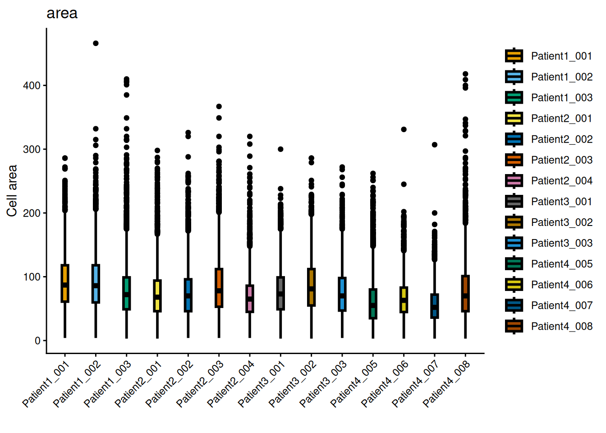

``` r
summary(spe$area)
```

```
##    Min. 1st Qu.  Median    Mean 3rd Qu.    Max. 
##    3.00   47.00   70.00   76.38   98.00  466.00
```

The median cell size is 70 pixels with a median major axis
length of 11.3. The largest cell
has an area of 466 pixels which relates to a diameter of 
21.6 pixels assuming a circular shape.
Overall, the distribution of cell sizes is similar across images with images from
`Patient4_005` and `Patient4_007` showing a reduced average cell size. These
images contain fewer tumor cells which can explain the smaller average cell size.

We detect very small cells in the dataset and will remove them.
The chosen threshold is arbitrary and needs to be adjusted per dataset.


``` r
sum(spe$area < 5)
```

```
## [1] 65
```

``` r
spe <- spe[,spe$area >= 5]
```

Another quality indicator can be an absolute measure of cell density often 
reported in cells per mm$^2$.


``` r
cell_density <- colData(spe) %>%
    as.data.frame() %>%
    group_by(sample_id) %>%
    summarize(cell_count = n(),
           no_pixels = mean(width_px) * mean(height_px)) %>%
    mutate(cells_per_mm2 = cell_count/(no_pixels/1000000))

ggplot(cell_density) +
    geom_point(aes(reorder(sample_id,cells_per_mm2), cells_per_mm2)) + 
    theme_minimal(base_size = 15) + 
    theme(axis.text.x = element_text(angle = 90, hjust = 1, size = 8)) +
    ylab("Cells per mm2") + xlab("")
```

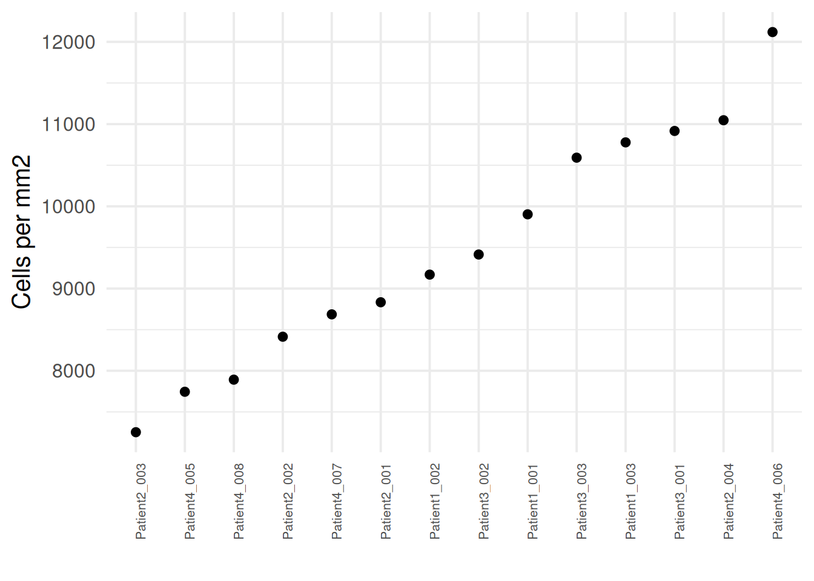

The number of cells per mm$^2$ varies across images which also depends on the
number of tumor/non-tumor cells. As we can see in the following sections, some
immune cells appear in cell dense regions while other stromal regions are less
dense.

The data presented here originate from samples from different locations with
potential differences in pre-processing and each sample was stained individually.
These (and other) technical aspects can induce staining differences between
samples or batches of samples. Observing potential staining differences can be
crucial to assess data quality. We will use ridgeline visualizations to check
differences in staining patterns:


``` r
multi_dittoPlot(spe, vars = rownames(spe)[rowData(spe)$use_channel],
               group.by = "patient_id", plots = "ridgeplot", 
               assay = "exprs", 
               color.panel = metadata(spe)$color_vectors$patient_id)
```

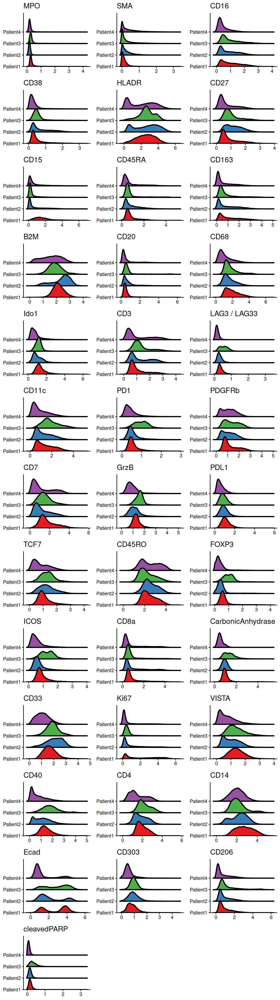

We observe variations in the distributions of marker expression across patients.
These variations may arise partly from different abundances of cells in
different images (e.g., Patient3 may have higher numbers of CD11c+ and PD1+
cells) as well as staining differences between samples. While most of the
selected markers are specifically expressed in immune cell subtypes, we can see
that E-Cadherin (a marker for epithelial (tumor) cells) shows a similar
expression range across all patients.

Finally, we will use non-linear dimensionality reduction methods to project
cells from a high-dimensional (40) down to a low-dimensional (2) space. For this
the *[scater](https://bioconductor.org/packages/3.22/scater)* package provides the `runUMAP` and
`runTSNE` function. To ensure reproducibility, we will need to set a seed;
however different seeds and different parameter settings (e.g., the `perplexity`
parameter in the `runTSNE` function) need to be tested to avoid
over-interpretation of visualization artefacts. For dimensionality reduction, we
will use all channels that show biological variation across the dataset.
However, marker selection can be performed with different biological questions
in mind. Here, both the `runUMAP` and `runTSNE` function are not deterministic, 
meaning they produce different results across different runs. We therefore
set a `seed` in this chunk for reproducibility purposes.


``` r
library(scater)

set.seed(220225)
spe <- runUMAP(spe, subset_row = rowData(spe)$use_channel, exprs_values = "exprs") 
spe <- runTSNE(spe, subset_row = rowData(spe)$use_channel, exprs_values = "exprs") 
```

After dimensionality reduction, the low-dimensional embeddings are stored in the 
`reducedDim` slot.


``` r
reducedDims(spe)
```

```
## List of length 2
## names(2): UMAP TSNE
```

``` r
head(reducedDim(spe, "UMAP"))
```

```
##                    UMAP1     UMAP2
## Patient1_001_1 -4.680679 -3.690127
## Patient1_001_2 -4.234805 -3.320928
## Patient1_001_3 -4.238052 -3.319839
## Patient1_001_4 -3.993810 -3.043950
## Patient1_001_5 -6.225138 -2.404558
## Patient1_001_6 -5.565394 -3.399283
```

Visualization of the low-dimensional embedding facilitates assessment of 
potential "batch effects". The `dittoDimPlot`
function allows flexible visualization. It returns `ggplot` objects which
can be further modified.


``` r
library(patchwork)

# visualize patient id 
p1 <- dittoDimPlot(spe, var = "patient_id", reduction.use = "UMAP", size = 0.2) + 
    scale_color_manual(values = metadata(spe)$color_vectors$patient_id) +
    ggtitle("Patient ID on UMAP")
p2 <- dittoDimPlot(spe, var = "patient_id", reduction.use = "TSNE", size = 0.2) + 
    scale_color_manual(values = metadata(spe)$color_vectors$patient_id) +
    ggtitle("Patient ID on TSNE")

# visualize region of interest id
p3 <- dittoDimPlot(spe, var = "ROI", reduction.use = "UMAP", size = 0.2) + 
    scale_color_manual(values = metadata(spe)$color_vectors$ROI) +
    ggtitle("ROI ID on UMAP")
p4 <- dittoDimPlot(spe, var = "ROI", reduction.use = "TSNE", size = 0.2) + 
    scale_color_manual(values = metadata(spe)$color_vectors$ROI) +
    ggtitle("ROI ID on TSNE")

# visualize indication
p5 <- dittoDimPlot(spe, var = "indication", reduction.use = "UMAP", size = 0.2) + 
    scale_color_manual(values = metadata(spe)$color_vectors$indication) +
    ggtitle("Indication on UMAP")
p6 <- dittoDimPlot(spe, var = "indication", reduction.use = "TSNE", size = 0.2) + 
    scale_color_manual(values = metadata(spe)$color_vectors$indication) +
    ggtitle("Indication on TSNE")

(p1 + p2) / (p3 + p4) / (p5 + p6)
```

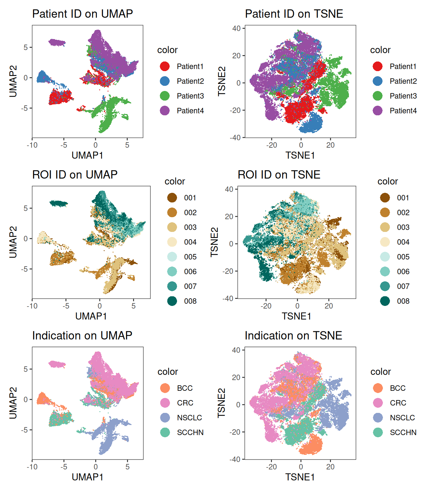


``` r
# visualize marker expression
p1 <- dittoDimPlot(spe, var = "Ecad", reduction.use = "UMAP", 
                   assay = "exprs", size = 0.2) +
    scale_color_viridis(name = "Ecad") +
    ggtitle("E-Cadherin expression on UMAP")
p2 <- dittoDimPlot(spe, var = "CD45RO", reduction.use = "UMAP", 
                   assay = "exprs", size = 0.2) +
    scale_color_viridis(name = "CD45RO") +
    ggtitle("CD45RO expression on UMAP")
p3 <- dittoDimPlot(spe, var = "Ecad", reduction.use = "TSNE", 
                   assay = "exprs", size = 0.2) +
    scale_color_viridis(name = "Ecad") +
    ggtitle("Ecad expression on TSNE")
p4 <- dittoDimPlot(spe, var = "CD45RO", reduction.use = "TSNE", 
                   assay = "exprs", size = 0.2) +
    scale_color_viridis(name = "CD45RO") +
    ggtitle("CD45RO expression on TSNE")

(p1 + p2) / (p3 + p4)
```

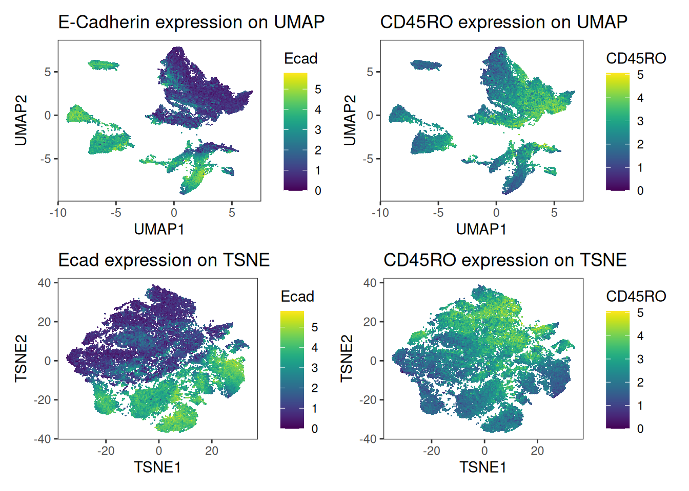

We observe a strong separation of tumor cells (Ecad+ cells) between the
patients. Here, each patient was diagnosed with a different tumor type. The
separation of tumor cells could be of biological origin since tumor cells tend
to display differences in expression between patients and cancer types and/or of
technical origin: the panel only contains a single tumor marker (E-Cadherin) and
therefore slight technical differences in staining causes visible separation
between cells of different patients. Nevertheless, the immune compartment
(CD45RO+ cells) mix between patients and we can rule out systematic staining
differences between patients.

## Save objects

The modified `SpatialExperiment` object is saved for further downstream analysis.


``` r
saveRDS(spe, "data/spe.rds")
```


## Session Info

<details>
   <summary>SessionInfo</summary>
   

```
## R version 4.5.2 (2025-10-31)
## Platform: x86_64-pc-linux-gnu
## Running under: Ubuntu 24.04.3 LTS
## 
## Matrix products: default
## BLAS:   /usr/lib/x86_64-linux-gnu/openblas-pthread/libblas.so.3 
## LAPACK: /usr/lib/x86_64-linux-gnu/openblas-pthread/libopenblasp-r0.3.26.so;  LAPACK version 3.12.0
## 
## locale:
##  [1] LC_CTYPE=en_US.UTF-8       LC_NUMERIC=C              
##  [3] LC_TIME=en_US.UTF-8        LC_COLLATE=en_US.UTF-8    
##  [5] LC_MONETARY=en_US.UTF-8    LC_MESSAGES=en_US.UTF-8   
##  [7] LC_PAPER=en_US.UTF-8       LC_NAME=C                 
##  [9] LC_ADDRESS=C               LC_TELEPHONE=C            
## [11] LC_MEASUREMENT=en_US.UTF-8 LC_IDENTIFICATION=C       
## 
## time zone: Etc/UTC
## tzcode source: system (glibc)
## 
## attached base packages:
## [1] stats4    stats     graphics  grDevices utils     datasets  methods  
## [8] base     
## 
## other attached packages:
##  [1] testthat_3.3.2              patchwork_1.3.2            
##  [3] scater_1.38.0               mclust_6.1.2               
##  [5] scuttle_1.20.0              ggrepel_0.9.7              
##  [7] lubridate_1.9.5             forcats_1.0.1              
##  [9] stringr_1.6.0               dplyr_1.2.0                
## [11] purrr_1.2.1                 readr_2.2.0                
## [13] tidyr_1.3.2                 tibble_3.3.1               
## [15] tidyverse_2.0.0             viridis_0.6.5              
## [17] viridisLite_0.4.3           dittoSeq_1.22.0            
## [19] ggplot2_4.0.2               cytoviewer_1.10.0          
## [21] cytomapper_1.22.0           SingleCellExperiment_1.32.0
## [23] SummarizedExperiment_1.40.0 Biobase_2.70.0             
## [25] GenomicRanges_1.62.1        Seqinfo_1.0.0              
## [27] IRanges_2.44.0              S4Vectors_0.48.0           
## [29] BiocGenerics_0.56.0         generics_0.1.4             
## [31] MatrixGenerics_1.22.0       matrixStats_1.5.0          
## [33] EBImage_4.52.0             
## 
## loaded via a namespace (and not attached):
##   [1] RColorBrewer_1.1-3       jsonlite_2.0.0           magrittr_2.0.4          
##   [4] ggbeeswarm_0.7.3         magick_2.9.1             farver_2.1.2            
##   [7] rmarkdown_2.30           vctrs_0.7.1              memoise_2.0.1           
##  [10] RCurl_1.98-1.17          terra_1.8-93             svgPanZoom_0.3.4        
##  [13] htmltools_0.5.9          S4Arrays_1.10.1          BiocNeighbors_2.4.0     
##  [16] raster_3.6-32            Rhdf5lib_1.32.0          SparseArray_1.10.8      
##  [19] rhdf5_2.54.1             sass_0.4.10              bslib_0.10.0            
##  [22] desc_1.4.3               htmlwidgets_1.6.4        fontawesome_0.5.3       
##  [25] cachem_1.1.0             mime_0.13                lifecycle_1.0.5         
##  [28] pkgconfig_2.0.3          rsvd_1.0.5               colourpicker_1.3.0      
##  [31] Matrix_1.7-4             R6_2.6.1                 fastmap_1.2.0           
##  [34] shiny_1.13.0             digest_0.6.39            colorspace_2.1-2        
##  [37] shinycssloaders_1.1.0    rprojroot_2.1.1          RSpectra_0.16-2         
##  [40] irlba_2.3.7              pkgload_1.5.0            textshaping_1.0.4       
##  [43] beachmat_2.26.0          labeling_0.4.3           nnls_1.6                
##  [46] timechange_0.4.0         abind_1.4-8              compiler_4.5.2          
##  [49] withr_3.0.2              S7_0.2.1                 tiff_0.1-12             
##  [52] BiocParallel_1.44.0      HDF5Array_1.38.0         DelayedArray_0.36.0     
##  [55] rjson_0.2.23             tools_4.5.2              vipor_0.4.7             
##  [58] otel_0.2.0               beeswarm_0.4.0           httpuv_1.6.16           
##  [61] glue_1.8.0               h5mread_1.2.1            rhdf5filters_1.22.0     
##  [64] promises_1.5.0           grid_4.5.2               Rtsne_0.17              
##  [67] gtable_0.3.6             tzdb_0.5.0               hms_1.1.4               
##  [70] BiocSingular_1.26.1      ScaledMatrix_1.18.0      sp_2.2-1                
##  [73] XVector_0.50.0           RcppAnnoy_0.0.23         pillar_1.11.1           
##  [76] later_1.4.7              lattice_0.22-7           tidyselect_1.2.1        
##  [79] locfit_1.5-9.12          miniUI_0.1.2             knitr_1.51              
##  [82] gridExtra_2.3            bookdown_0.46            svglite_2.2.2           
##  [85] xfun_0.56                shinydashboard_0.7.3     brio_1.1.5              
##  [88] pheatmap_1.0.13          stringi_1.8.7            fftwtools_0.9-11        
##  [91] yaml_2.3.12              evaluate_1.0.5           codetools_0.2-20        
##  [94] archive_1.1.12.1         BiocManager_1.30.27      cli_3.6.5               
##  [97] uwot_0.2.4               xtable_1.8-8             systemfonts_1.3.1       
## [100] jquerylib_0.1.4          Rcpp_1.1.1               png_0.1-8               
## [103] parallel_4.5.2           jpeg_0.1-11              bitops_1.0-9            
## [106] SpatialExperiment_1.20.0 scales_1.4.0             ggridges_0.5.7          
## [109] BiocStyle_2.38.0         rlang_1.1.7              cowplot_1.2.0
```
</details>
