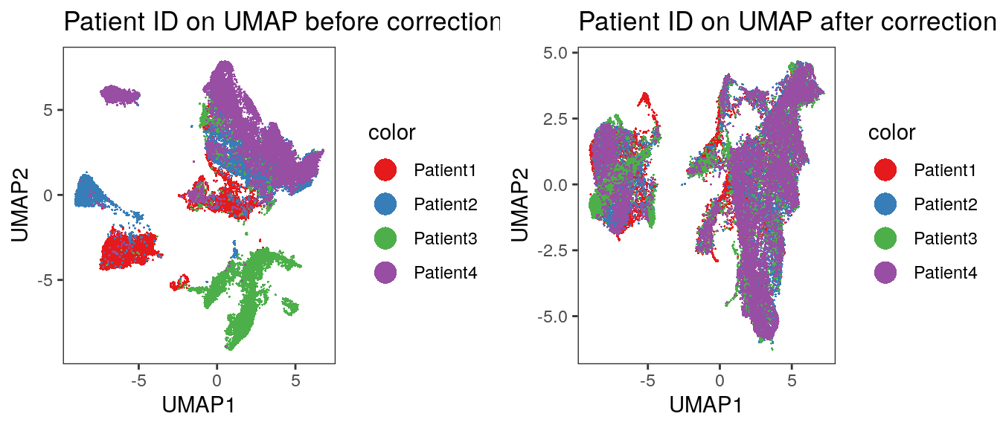
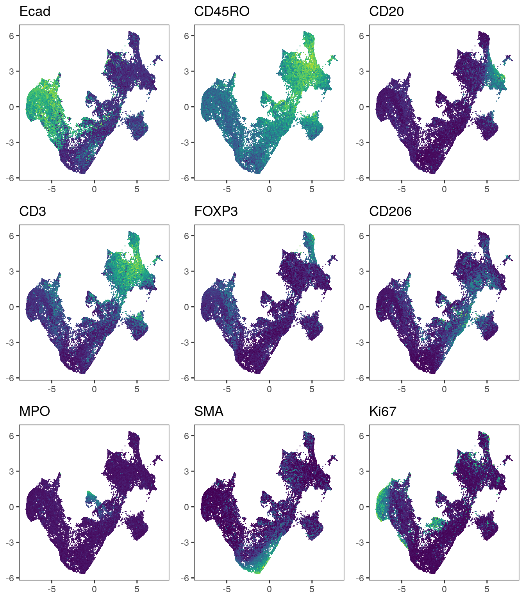

# Batch effect correction {#batch-effects}

In Section \@ref(cell-quality) we observed staining/expression differences
between the individual samples. This can arise due to technical (e.g.,
differences in sample processing) as well as biological (e.g., differential
expression between patients/indications) effects. However, the combination of these effects
hinders cell phenotyping via clustering as highlighted in Section \@ref(clustering).

To integrate cells across samples, we can use computational
strategies developed for correcting batch effects in single-cell RNA sequencing
data. In the following sections, we will use functions of the
[batchelor](https://www.bioconductor.org/packages/release/bioc/html/batchelor.html),
[harmony](https://github.com/immunogenomics/harmony) and
[Seurat](https://satijalab.org/seurat/articles/integration_introduction.html)
packages to correct for such batch effects.

Of note: the correction approaches presented here aim at removing any
differences between samples. This will also remove biological differences
between the patients/indications. Nevertheless, integrating cells across samples
can facilitate the detection of cell phenotypes via clustering.

First, we will read in the `SpatialExperiment` object containing the single-cell
data.


```r
spe <- readRDS("data/spe.rds")
```

## fastMNN correction

The `batchelor` package provides the `mnnCorrect` and `fastMNN` functions to
correct for differences between samples/batches. Both functions build up on
finding mutual nearest neighbors (MNN) among the cells of different samples and
correct expression differences between the batches [@Haghverdi2018]. The `mnnCorrect` function 
returns corrected expression counts while the `fastMNN` functions performs the 
correction in reduced dimension space. As such, `fastMNN` returns integrated
cells in form of a low dimensional embedding.

Paper: [Batch effects in single-cell RNA-sequencing data are corrected by matching mutual nearest neighbors](https://www.nature.com/articles/nbt.4091)  
Documentation: [batchelor](https://www.bioconductor.org/packages/release/bioc/vignettes/batchelor/inst/doc/correction.html)

### Perform sample correction

Here, we apply the `fastMNN` function to integrate cells between 
patients. By setting `auto.merge = TRUE` the function estimates the best 
batch merging order by maximizing the number of MNN pairs at each merging step. 
This is more time consuming than merging sequentially based on how batches appear in the 
dataset (default). We again select the markers defined in Section \@ref(cell-processing)
for sample correction.

The function returns a `SingleCellExperiment` object which contains corrected
low-dimensional coordinates for each cell in the `reducedDim(out, "corrected")`
slot. This low-dimensional embedding can be further used for clustering and
non-linear dimensionality reduction. We check that the order of cells is the
same between the input and output object and then transfer the corrected
coordinates to the main `SpatialExperiment` object.


```r
library(batchelor)
set.seed(220228)
out <- fastMNN(spe, batch = spe$patient_id,
               auto.merge = TRUE,
               subset.row = rowData(spe)$use_channel,
               assay.type = "exprs")

# Check that order of cells is the same
stopifnot(all.equal(colnames(spe), colnames(out)))

# Transfer the correction results to the main spe object
reducedDim(spe, "fastMNN") <- reducedDim(out, "corrected")
```


The computational time of the `fastMNN` function call is 
1.49 minutes.

Of note, the warnings that the `fastMNN` function produces can be avoided as follows:

1. The following warning can be avoided by setting `BSPARAM = BiocSingular::ExactParam()`

```
Warning in (function (A, nv = 5, nu = nv, maxit = 1000, work = nv + 7, reorth = TRUE,  :
  You're computing too large a percentage of total singular values, use a standard svd instead.
```

2. The following warning can be avoided by requesting fewer singular values by setting `d = 30`

```
In check_numbers(k = k, nu = nu, nv = nv, limit = min(dim(x)) -  :
  more singular values/vectors requested than available
```

### Quality control of correction results

The `fastMNN` function further returns outputs that can be used to assess the
quality of the batch correction. The `metadata(out)$merge.info` entry collects
diagnostics for each individual merging step. Here, the `batch.size` and
`lost.var` entries are important. The `batch.size` entry reports the relative
magnitude of the batch effect and the `lost.var` entry represents the percentage
of lost variance per merging step. A large `batch.size` and low `lost.var`
indicate sufficient batch correction.


```r
merge_info <- metadata(out)$merge.info 

merge_info[,c("left", "right", "batch.size")]
```

```
## DataFrame with 3 rows and 3 columns
##                         left    right batch.size
##                       <List>   <List>  <numeric>
## 1                   Patient4 Patient2   0.381635
## 2          Patient4,Patient2 Patient1   0.581013
## 3 Patient4,Patient2,Patient1 Patient3   0.767376
```

```r
merge_info$lost.var
```

```
##         Patient1    Patient2   Patient3    Patient4
## [1,] 0.000000000 0.031154864 0.00000000 0.046198914
## [2,] 0.043363546 0.009772150 0.00000000 0.011931892
## [3,] 0.005394755 0.003023119 0.07219394 0.005366304
```

We observe that Patient4 and Patient2 are most similar with a low batch effect. 
Merging cells of Patient3 into the combined batch of Patient1,
Patient2 and Patient4 resulted in the highest percentage of lost variance and
the detection of the largest batch effect. In the next paragraph we can
visualize the correction results.

### Visualization

The simplest option to check if the sample effects were corrected is by using
non-linear dimensionality reduction techniques and observe mixing of cells across
samples. We will recompute the UMAP embedding using the corrected
low-dimensional coordinates for each cell.


```r
library(scater)

set.seed(220228)
spe <- runUMAP(spe, dimred= "fastMNN", name = "UMAP_mnnCorrected") 
```

Next, we visualize the corrected UMAP while overlaying patient IDs.


```r
library(cowplot)
library(dittoSeq)
library(viridis)

# visualize patient id 
p1 <- dittoDimPlot(spe, var = "patient_id", 
                   reduction.use = "UMAP", size = 0.2) + 
    scale_color_manual(values = metadata(spe)$color_vectors$patient_id) +
    ggtitle("Patient ID on UMAP before correction")
p2 <- dittoDimPlot(spe, var = "patient_id", 
                   reduction.use = "UMAP_mnnCorrected", size = 0.2) + 
    scale_color_manual(values = metadata(spe)$color_vectors$patient_id) +
    ggtitle("Patient ID on UMAP after correction")

plot_grid(p1, p2)
```


We observe an imperfect merging of Patient3 into all other samples. This
was already seen when displaying the merging information above.
We now also visualize the expression of selected markers across all cells 
before and after batch correction.


```r
markers <- c("Ecad", "CD45RO", "CD20", "CD3", "FOXP3", "CD206", "MPO", "SMA", "Ki67")

# Before correction
plot_list <- multi_dittoDimPlot(spe, var = markers, reduction.use = "UMAP", 
                   assay = "exprs", size = 0.2, list.out = TRUE) 
plot_list <- lapply(plot_list, function(x) x + scale_color_viridis())
plot_grid(plotlist = plot_list) 
```


```r
# After correction
plot_list <- multi_dittoDimPlot(spe, var = markers, reduction.use = "UMAP_mnnCorrected", 
                   assay = "exprs", size = 0.2, list.out = TRUE) 
plot_list <- lapply(plot_list, function(x) x + scale_color_viridis())
plot_grid(plotlist = plot_list) 
```


We observe that immune cells across patients are merged after batch correction 
using `fastMNN`. However, the tumor cells of different patients still cluster
separately.

## harmony correction

The `harmony` algorithm performs batch correction by iteratively clustering and
correcting the positions of cells in PCA space [@Korsunsky2019]. We will first
perform PCA on the asinh-transformed counts and then call the `RunHarmony`
function to perform data integration.

Paper: [Fast, sensitive and accurate integration of single-cell data with Harmony](https://www.nature.com/articles/s41592-019-0619-0)  
Documentation: [harmony](https://portals.broadinstitute.org/harmony/index.html)

Similar to the `fastMNN` function, `harmony` returns the corrected
low-dimensional coordinates for each cell. These can be transfered to the
`reducedDim` slot of the original `SpatialExperiment` object.


```r
library(harmony)
library(BiocSingular)

spe <- runPCA(spe, 
              subset_row = rowData(spe)$use_channel, 
              exprs_values = "exprs", 
              ncomponents = 30,
              BSPARAM = ExactParam())

set.seed(230616)
out <- RunHarmony(spe, group.by.vars = "patient_id")

# Check that order of cells is the same
stopifnot(all.equal(colnames(spe), colnames(out)))

reducedDim(spe, "harmony") <- reducedDim(out, "HARMONY")
```


The computational time of the `HarmonyMatrix` function call is 
0.48 minutes.

### Visualization

We will now again visualize the cells in low dimensions after UMAP embedding.


```r
set.seed(220228)
spe <- runUMAP(spe, dimred = "harmony", name = "UMAP_harmony") 
```


```r
# visualize patient id 
p1 <- dittoDimPlot(spe, var = "patient_id", 
                   reduction.use = "UMAP", size = 0.2) + 
    scale_color_manual(values = metadata(spe)$color_vectors$patient_id) +
    ggtitle("Patient ID on UMAP before correction")
p2 <- dittoDimPlot(spe, var = "patient_id", 
                   reduction.use = "UMAP_harmony", size = 0.2) + 
    scale_color_manual(values = metadata(spe)$color_vectors$patient_id) +
    ggtitle("Patient ID on UMAP after correction")

plot_grid(p1, p2)
```



And we visualize selected marker expression as defined above.


```r
# Before correction
plot_list <- multi_dittoDimPlot(spe, var = markers, reduction.use = "UMAP", 
                   assay = "exprs", size = 0.2, list.out = TRUE) 
plot_list <- lapply(plot_list, function(x) x + scale_color_viridis())
plot_grid(plotlist = plot_list) 
```


```r
# After correction
plot_list <- multi_dittoDimPlot(spe, var = markers, reduction.use = "UMAP_harmony", 
                   assay = "exprs", size = 0.2, list.out = TRUE) 
plot_list <- lapply(plot_list, function(x) x + scale_color_viridis())
plot_grid(plotlist = plot_list) 
```


We observe a more aggressive merging of cells from different patients compared
to the results after `fastMNN` correction. Importantly, immune cell and epithelial
markers are expressed in distinct regions of the UMAP. 

## Seurat correction

The `Seurat` package provides a number of functionalities to analyze single-cell
data. As such it also allows the integration of cells across different samples.
Conceptually, `Seurat` performs batch correction similarly to `fastMNN` by
finding mutual nearest neighbors (MNN) in low dimensional space before
correcting the expression values of cells [@Stuart2019].

Paper: [Comprehensive Integration of Single-Cell Data](https://www.cell.com/cell/fulltext/S0092-8674(19)30559-8)  
Documentation: [Seurat](https://satijalab.org/seurat/index.html)

To use `Seurat`, we will first create a `Seurat` object from the `SpatialExperiment`
object and add relevant metadata. The object also needs to be split by patient
prior to integration. 


```r
library(Seurat)
library(SeuratObject)
seurat_obj <- as.Seurat(spe, counts = "counts", data = "exprs")
seurat_obj <- AddMetaData(seurat_obj, as.data.frame(colData(spe)))

seurat.list <- SplitObject(seurat_obj, split.by = "patient_id")
```

To avoid long run times, we will use an approach that relies on reciprocal PCA
instead of canonical correlation analysis for dimensionality reduction and
initial alignment. For an extended tutorial on how to use `Seurat` for data
integration, please refer to their
[vignette](https://satijalab.org/seurat/articles/integration_rpca.html).

We will first define the features used for integration and perform PCA on cells
of each patient individually. The `FindIntegrationAnchors` function detects MNNs between
cells of different patients and the `IntegrateData` function corrects the
expression values of cells. We slightly increase the number of neighbors to be
considered for MNN detection (the `k.anchor` parameter). This increases the integration
strength.


```r
features <- rownames(spe)[rowData(spe)$use_channel]
seurat.list <- lapply(X = seurat.list, FUN = function(x) {
    x <- ScaleData(x, features = features, verbose = FALSE)
    x <- RunPCA(x, features = features, verbose = FALSE, approx = FALSE)
    return(x)
})

anchors <- FindIntegrationAnchors(object.list = seurat.list, 
                                  anchor.features = features,
                                  reduction = "rpca", 
                                  k.anchor = 20)

combined <- IntegrateData(anchorset = anchors)
```


We now select the `integrated` assay and perform PCA dimensionality reduction.
The cell coordinates in PCA reduced space can then be transferred to the
original `SpatialExperiment` object. **Of note:** by splitting the object into
individual batch-specific objects, the ordering of cells in the integrated
object might not match the ordering of cells in the input object. In this case,
columns will need to be reordered. Here, we test if the ordering of cells in the
integrated `Seurat` object matches the ordering of cells in the main
`SpatialExperiment` object.


```r
DefaultAssay(combined) <- "integrated"

combined <- ScaleData(combined, verbose = FALSE)
combined <- RunPCA(combined, npcs = 30, verbose = FALSE, approx = FALSE)

# Check that order of cells is the same
stopifnot(all.equal(colnames(spe), colnames(combined)))

reducedDim(spe, "seurat") <- Embeddings(combined, reduction = "pca")
```

The computational time of the `Seurat` function calls is 
2.87 minutes.

### Visualization

As above, we recompute the UMAP embeddings based on `Seurat` integrated results
and visualize the embedding.


```r
set.seed(220228)
spe <- runUMAP(spe, dimred = "seurat", name = "UMAP_seurat") 
```

Visualize patient IDs.


```r
# visualize patient id 
p1 <- dittoDimPlot(spe, var = "patient_id", 
                   reduction.use = "UMAP", size = 0.2) + 
    scale_color_manual(values = metadata(spe)$color_vectors$patient_id) +
    ggtitle("Patient ID on UMAP before correction")
p2 <- dittoDimPlot(spe, var = "patient_id", 
                   reduction.use = "UMAP_seurat", size = 0.2) + 
    scale_color_manual(values = metadata(spe)$color_vectors$patient_id) +
    ggtitle("Patient ID on UMAP after correction")

plot_grid(p1, p2)
```


Visualization of marker expression.


```r
# Before correction
plot_list <- multi_dittoDimPlot(spe, var = markers, reduction.use = "UMAP", 
                   assay = "exprs", size = 0.2, list.out = TRUE) 
plot_list <- lapply(plot_list, function(x) x + scale_color_viridis())
plot_grid(plotlist = plot_list) 
```


```r
# After correction
plot_list <- multi_dittoDimPlot(spe, var = markers, reduction.use = "UMAP_seurat", 
                   assay = "exprs", size = 0.2, list.out = TRUE) 
plot_list <- lapply(plot_list, function(x) x + scale_color_viridis())
plot_grid(plotlist = plot_list) 
```



Similar to the methods presented above, `Seurat` integrates immune cells correctly.
When visualizing the patient IDs, slight patient-to-patient differences within tumor
cells can be detected. 

Choosing the correct integration approach is challenging without having ground truth
cell labels available. It is recommended to compare different techniques and different
parameter settings. Please refer to the documentation of the individual tools
to become familiar with the possible parameter choices. Furthermore, in the following
section, we will discuss clustering and classification approaches in light of
expression differences between samples.

In general, it appears that MNN-based approaches are less conservative in terms
of merging compared to `harmony`. On the other hand, `harmony` could well merge
cells in a way that regresses out biological signals. 

## Save objects

The modified `SpatialExperiment` object is saved for further downstream analysis.


```r
saveRDS(spe, "data/spe.rds")
```


## Session Info

<details>
   <summary>SessionInfo</summary>
   

```
## R version 4.3.2 (2023-10-31)
## Platform: x86_64-pc-linux-gnu (64-bit)
## Running under: Ubuntu 22.04.3 LTS
## 
## Matrix products: default
## BLAS:   /usr/lib/x86_64-linux-gnu/openblas-pthread/libblas.so.3 
## LAPACK: /usr/lib/x86_64-linux-gnu/openblas-pthread/libopenblasp-r0.3.20.so;  LAPACK version 3.10.0
## 
## locale:
##  [1] LC_CTYPE=en_US.UTF-8       LC_NUMERIC=C              
##  [3] LC_TIME=en_US.UTF-8        LC_COLLATE=en_US.UTF-8    
##  [5] LC_MONETARY=en_US.UTF-8    LC_MESSAGES=en_US.UTF-8   
##  [7] LC_PAPER=en_US.UTF-8       LC_NAME=C                 
##  [9] LC_ADDRESS=C               LC_TELEPHONE=C            
## [11] LC_MEASUREMENT=en_US.UTF-8 LC_IDENTIFICATION=C       
## 
## time zone: Etc/UTC
## tzcode source: system (glibc)
## 
## attached base packages:
## [1] stats4    stats     graphics  grDevices utils     datasets  methods  
## [8] base     
## 
## other attached packages:
##  [1] testthat_3.2.1              Seurat_5.0.1               
##  [3] SeuratObject_5.0.1          sp_2.1-2                   
##  [5] BiocSingular_1.18.0         harmony_1.2.0              
##  [7] Rcpp_1.0.11                 viridis_0.6.4              
##  [9] viridisLite_0.4.2           dittoSeq_1.14.0            
## [11] cowplot_1.1.2               scater_1.30.1              
## [13] ggplot2_3.4.4               scuttle_1.12.0             
## [15] SpatialExperiment_1.12.0    batchelor_1.18.1           
## [17] SingleCellExperiment_1.24.0 SummarizedExperiment_1.32.0
## [19] Biobase_2.62.0              GenomicRanges_1.54.1       
## [21] GenomeInfoDb_1.38.5         IRanges_2.36.0             
## [23] S4Vectors_0.40.2            BiocGenerics_0.48.1        
## [25] MatrixGenerics_1.14.0       matrixStats_1.2.0          
## 
## loaded via a namespace (and not attached):
##   [1] RcppAnnoy_0.0.21          splines_4.3.2            
##   [3] later_1.3.2               bitops_1.0-7             
##   [5] tibble_3.2.1              polyclip_1.10-6          
##   [7] fastDummies_1.7.3         lifecycle_1.0.4          
##   [9] rprojroot_2.0.4           globals_0.16.2           
##  [11] lattice_0.21-9            MASS_7.3-60              
##  [13] magrittr_2.0.3            plotly_4.10.3            
##  [15] sass_0.4.8                rmarkdown_2.25           
##  [17] jquerylib_0.1.4           yaml_2.3.8               
##  [19] httpuv_1.6.13             sctransform_0.4.1        
##  [21] spam_2.10-0               spatstat.sparse_3.0-3    
##  [23] reticulate_1.34.0         pbapply_1.7-2            
##  [25] RColorBrewer_1.1-3        ResidualMatrix_1.12.0    
##  [27] pkgload_1.3.3             abind_1.4-5              
##  [29] zlibbioc_1.48.0           Rtsne_0.17               
##  [31] purrr_1.0.2               RCurl_1.98-1.13          
##  [33] GenomeInfoDbData_1.2.11   ggrepel_0.9.4            
##  [35] irlba_2.3.5.1             spatstat.utils_3.0-4     
##  [37] listenv_0.9.0             pheatmap_1.0.12          
##  [39] goftest_1.2-3             RSpectra_0.16-1          
##  [41] spatstat.random_3.2-2     fitdistrplus_1.1-11      
##  [43] parallelly_1.36.0         DelayedMatrixStats_1.24.0
##  [45] leiden_0.4.3.1            codetools_0.2-19         
##  [47] DelayedArray_0.28.0       tidyselect_1.2.0         
##  [49] farver_2.1.1              ScaledMatrix_1.10.0      
##  [51] spatstat.explore_3.2-5    jsonlite_1.8.8           
##  [53] BiocNeighbors_1.20.1      ellipsis_0.3.2           
##  [55] progressr_0.14.0          ggridges_0.5.5           
##  [57] survival_3.5-7            tools_4.3.2              
##  [59] ica_1.0-3                 glue_1.6.2               
##  [61] gridExtra_2.3             SparseArray_1.2.3        
##  [63] xfun_0.41                 dplyr_1.1.4              
##  [65] withr_2.5.2               fastmap_1.1.1            
##  [67] fansi_1.0.6               digest_0.6.33            
##  [69] rsvd_1.0.5                R6_2.5.1                 
##  [71] mime_0.12                 colorspace_2.1-0         
##  [73] scattermore_1.2           tensor_1.5               
##  [75] spatstat.data_3.0-3       RhpcBLASctl_0.23-42      
##  [77] utf8_1.2.4                tidyr_1.3.0              
##  [79] generics_0.1.3            data.table_1.14.10       
##  [81] httr_1.4.7                htmlwidgets_1.6.4        
##  [83] S4Arrays_1.2.0            uwot_0.1.16              
##  [85] pkgconfig_2.0.3           gtable_0.3.4             
##  [87] lmtest_0.9-40             XVector_0.42.0           
##  [89] brio_1.1.4                htmltools_0.5.7          
##  [91] dotCall64_1.1-1           bookdown_0.37            
##  [93] scales_1.3.0              png_0.1-8                
##  [95] knitr_1.45                reshape2_1.4.4           
##  [97] rjson_0.2.21              nlme_3.1-163             
##  [99] cachem_1.0.8              zoo_1.8-12               
## [101] stringr_1.5.1             KernSmooth_2.23-22       
## [103] parallel_4.3.2            miniUI_0.1.1.1           
## [105] vipor_0.4.7               desc_1.4.3               
## [107] pillar_1.9.0              grid_4.3.2               
## [109] vctrs_0.6.5               RANN_2.6.1               
## [111] promises_1.2.1            beachmat_2.18.0          
## [113] xtable_1.8-4              cluster_2.1.4            
## [115] waldo_0.5.2               beeswarm_0.4.0           
## [117] evaluate_0.23             magick_2.8.2             
## [119] cli_3.6.2                 compiler_4.3.2           
## [121] rlang_1.1.2               crayon_1.5.2             
## [123] future.apply_1.11.1       labeling_0.4.3           
## [125] plyr_1.8.9                ggbeeswarm_0.7.2         
## [127] stringi_1.8.3             deldir_2.0-2             
## [129] BiocParallel_1.36.0       munsell_0.5.0            
## [131] lazyeval_0.2.2            spatstat.geom_3.2-7      
## [133] Matrix_1.6-4              RcppHNSW_0.5.0           
## [135] patchwork_1.1.3           sparseMatrixStats_1.14.0 
## [137] future_1.33.1             shiny_1.8.0              
## [139] highr_0.10                ROCR_1.0-11              
## [141] igraph_1.6.0              bslib_0.6.1
```
</details>
