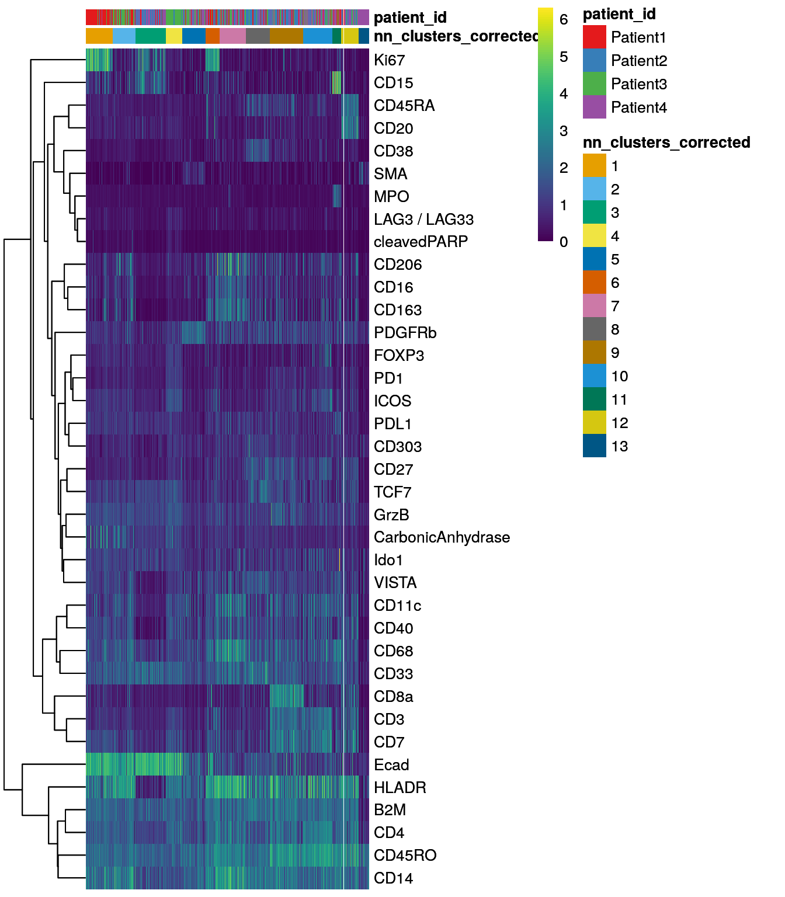
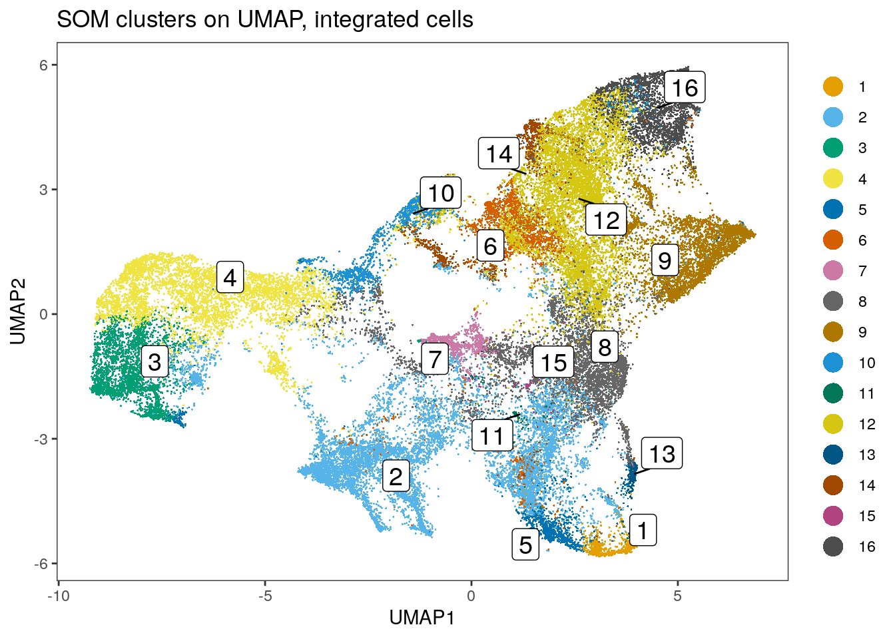
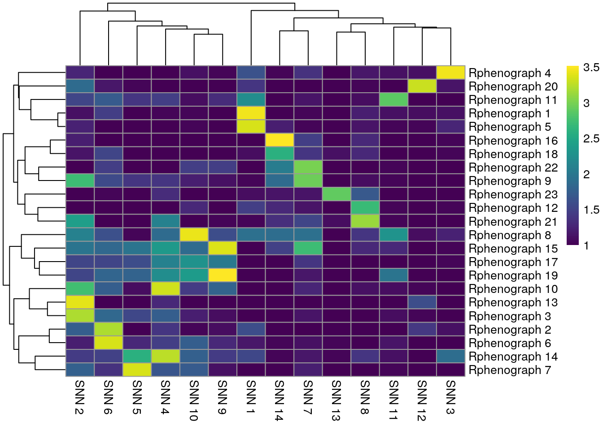
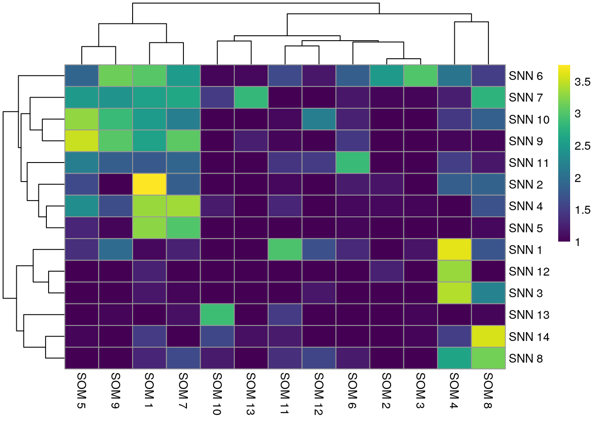
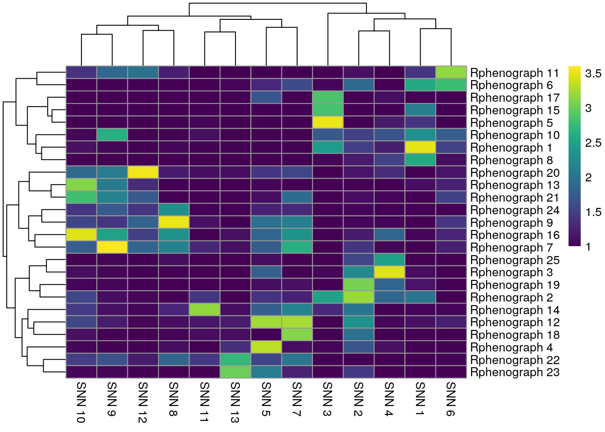
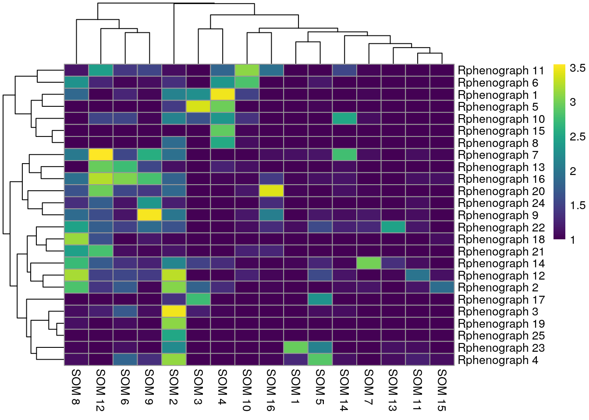
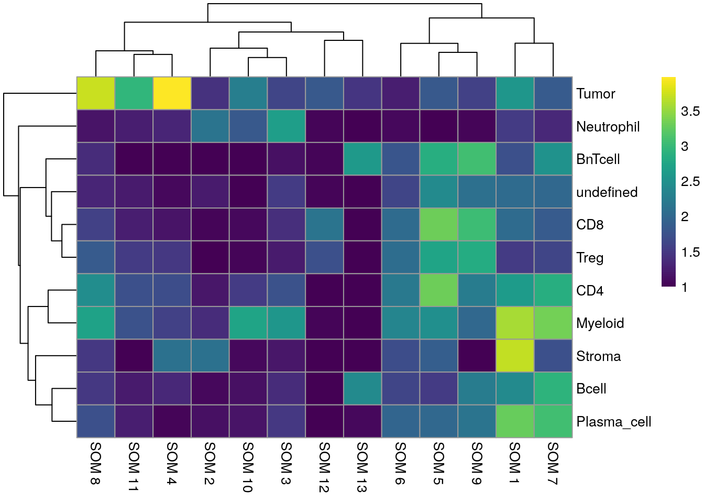
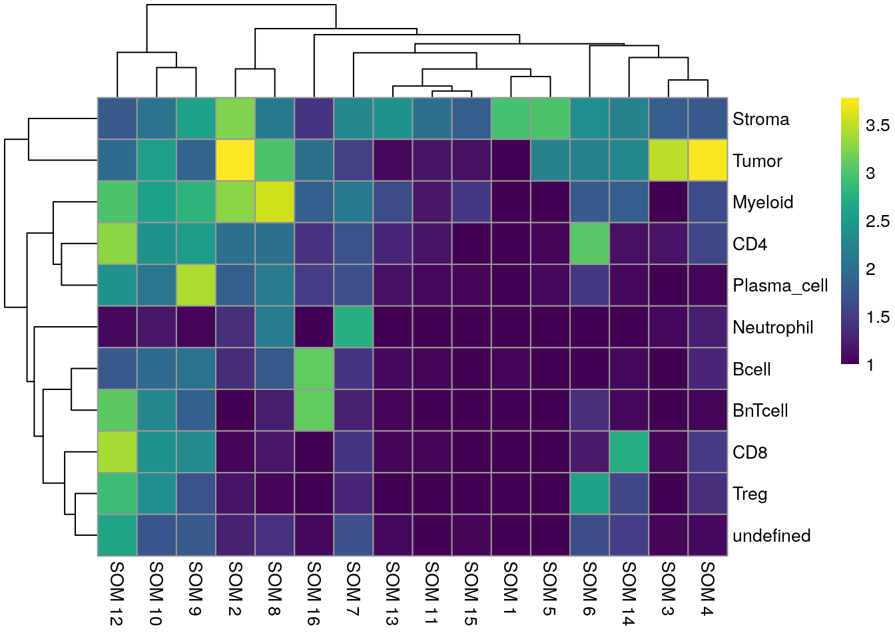

# Cell phenotyping 

A common step during single-cell data analysis is the annotation of cells based
on their phenotype. Defining cell phenotypes is often subjective and relies
on previous biological knowledge. The [Orchestrating Single Cell Analysis with Bioconductor](https://bioconductor.org/books/release/OSCA.basic/cell-type-annotation.html) book
presents a number of approaches to phenotype cells detected by single-cell RNA
sequencing based on reference datasets or gene set analysis.

In highly-multiplexed imaging, target proteins or molecules are manually
selected based on the biological question at hand. It narrows down the feature
space and facilitates the manual annotation of clusters to derive cell
phenotypes. We will therefore discuss and compare a number of clustering
approaches to group cells based on their similarity in marker expression in
Section \@ref(clustering).

Unlike single-cell RNA sequencing or CyTOF data, single-cell data derived from
highly-multiplexed imaging data often suffers from "lateral spillover" between
neighboring cells. This spillover caused by imperfect segmentation often hinders
accurate clustering to define specific cell phenotypes in multiplexed imaging
data. Tools have been developed to correct lateral spillover between cells
[@Bai2021] but the approach requires careful selection of the markers to
correct. In Section \@ref(classification) we will train and apply a random
forest classifier to classify cell phenotypes in the dataset as alternative
approach to clustering-based cell phenotyping. This approach has been previously used to
identify major cell phenotypes in metastatic melanoma and avoids clustering of
cells [@Hoch2022].

## Load data

We will first read in the previously generated `SpatialExperiment` object and
sample 2000 cells to visualize cluster membership.


```r
library(SpatialExperiment)
spe <- readRDS("data/spe.rds")

# Sample cells
set.seed(220619)
cur_cells <- sample(seq_len(ncol(spe)), 2000)
```

## Clustering approaches {#clustering}

In the first section, we will present clustering approaches to identify cellular
phenotypes in the dataset. These methods group cells based on their similarity
in marker expression or by their proximity in low dimensional space. A number of
approaches have been developed to cluster data derived from single-cell RNA
sequencing technologies [@Yu2022] or CyTOF [@Weber2016]. For demonstration
purposes, we will highlight common clustering approaches that are available in R
and have been used for clustering cells obtained from IMC. Two approaches rely
on graph-based clustering and one approach uses self organizing maps (SOM).

### Rphenograph

The PhenoGraph clustering approach was first described to group cells of a CyTOF
dataset [@Levine2015]. The algorithm first constructs a graph by detecting the
`k` nearest neighbours based on euclidean distance in expression space. In the
next step, edges between nodes (cells) are weighted by their overlap in nearest
neighbor sets. To quantify the overlap in shared nearest neighbor sets, the
jaccard index is used. The Louvain modularity optimization approach is used to
detect connected communities and partition the graph into clusters of cells.
This clustering strategy was used by Jackson, Fischer _et al._  and Schulz _et
al._ to cluster IMC data [@Jackson2020; @Schulz2018].

There are several different PhenoGraph implementations available in R. Here, we
use the one available at
[https://github.com/i-cyto/Rphenograph](https://github.com/i-cyto/Rphenograph).
For large datasets,
[https://github.com/stuchly/Rphenoannoy](https://github.com/stuchly/Rphenoannoy)
offers a more performant implementation of the algorithm.

In the following code chunk, we select the asinh-transformed mean pixel
intensities per cell and channel and subset the channels to the ones containing
biological variation. This matrix is transposed to store cells in rows. Within
the `Rphenograph` function, we select the 45 nearest neighbors for graph
building and louvain community detection (default). The function returns a list
of length 2, the first entry being the graph and the second entry containing the
community object. Calling `membership` on the community object will return
cluster IDs for each cell. These cluster IDs are then stored within the
`colData` of the `SpatialExperiment` object. Cluster IDs are mapped on top of
the UMAP embedding and single-cell marker expression within each cluster are
visualized in form of a heatmap.

It is recommended to test different inputs to `k` as shown in the next section.
Selecting larger values for `k` results in larger clusters.


```r
library(Rphenograph)
library(igraph)
library(dittoSeq)
library(viridis)

mat <- t(assay(spe, "exprs")[rowData(spe)$use_channel,])

set.seed(230619)
out <- Rphenograph(mat, k = 45)

clusters <- factor(membership(out[[2]]))

spe$pg_clusters <- clusters

dittoDimPlot(spe, var = "pg_clusters", 
             reduction.use = "UMAP", size = 0.2,
             do.label = TRUE) +
    ggtitle("Phenograph clusters on UMAP")
```


```r
dittoHeatmap(spe[,cur_cells], 
             genes = rownames(spe)[rowData(spe)$use_channel],
             assay = "exprs", scale = "none",
             heatmap.colors = viridis(100), 
             annot.by = c("pg_clusters", "patient_id"),
             annot.colors = c(dittoColors(1)[1:length(unique(spe$pg_clusters))],
                              metadata(spe)$color_vectors$patient_id))
```


The `Rphenograph` function call took 
1.41 minutes.

We can observe that some of the clusters only contain cells of a single patient.
This  can often be observed in the tumor compartment. In the next step, we
use the integrated cells (see Section \@ref(batch-effects)) in low dimensional
embedding for clustering. Here, the low dimensional embedding can
be directly accessed from the `reducedDim` slot.


```r
mat <- reducedDim(spe, "fastMNN")

set.seed(230619)
out <- Rphenograph(mat, k = 45)

clusters <- factor(membership(out[[2]]))

spe$pg_clusters_corrected <- clusters

dittoDimPlot(spe, var = "pg_clusters_corrected", 
             reduction.use = "UMAP_mnnCorrected", size = 0.2,
             do.label = TRUE) +
    ggtitle("Phenograph clusters on UMAP, integrated cells")
```


```r
dittoHeatmap(spe[,cur_cells], 
             genes = rownames(spe)[rowData(spe)$use_channel],
             assay = "exprs", scale = "none",
             heatmap.colors = viridis(100), 
             annot.by = c("pg_clusters_corrected","patient_id"),
             annot.colors = c(dittoColors(1)[1:length(unique(spe$pg_clusters_corrected))],
                              metadata(spe)$color_vectors$patient_id))
```


Clustering using the integrated embedding leads to clusters that contain cells
of different patients. Cluster annotation can now be performed by manually
labeling cells based on their marker expression (see Notes in Section
\@ref(clustering-notes)).

### Shared nearest neighbour graph {#snn-graph}

The [bluster](https://www.bioconductor.org/packages/release/bioc/html/bluster.html) 
package provides a simple interface to cluster cells using a number of different
[clustering approaches](https://www.bioconductor.org/packages/release/bioc/vignettes/bluster/inst/doc/clusterRows.html) and different metrics to [access cluster stability](https://www.bioconductor.org/packages/release/bioc/vignettes/bluster/inst/doc/diagnostics.html).  

For simplicity, we will focus on graph based clustering as this is the most
popular and a fast method for single-cell clustering. The `bluster` package
provides functionalities to build k-nearest neighbor (KNN) graphs and its weighted
version, shared nearest neighbor (SNN) graphs where nodes represent cells.
The user can chose the number of neighbors to consider (parameter `k`), 
the edge weighting method (parameter `type`) and the community detection
function to use (parameter `cluster.fun`). As all parameters affect the clustering
results, the `bluster` package provides the `clusterSweep` function to test
a number of parameter settings in parallel. In the following code chunk,
we select the asinh-transformed mean pixel intensities and subset the markers
of interest. The resulting matrix is transposed to fit to the requirements of 
the bluster package (cells in rows).

We test two different settings for `k`, two for `type` and fix the `cluster.fun`
to `louvain` as this is one of the most common approaches for community detection.
This function call is parallelized by setting the `BPPARAM` parameter. 


```r
library(bluster)
library(BiocParallel)
library(ggplot2)

mat <- t(assay(spe, "exprs")[rowData(spe)$use_channel,])

combinations <- clusterSweep(mat, 
                             BLUSPARAM=SNNGraphParam(),
                             k=c(10L, 20L), 
                             type = c("rank", "jaccard"), 
                             cluster.fun = "louvain",
                             BPPARAM = MulticoreParam(RNGseed = 220427))
```

We next calculate two metrics to estimate cluster stability: the average
silhouette width and the neighborhood purity.

We use the `approxSilhouette` function to compute the silhouette width for each
cell and compute the average across all cells per parameter setting. Please see
`?silhouette` for more information on how the silhouette width is computed for
each cell. A large average silhouette width indicates a cluster parameter
setting for which cells that are well clustered.

The `neighborPurity` function computes the fraction of cells around each cell
with the same cluster ID. Per parameter setting, we compute the average
neighborhood purity across all cells. A large average neighborhood purity
indicates a cluster parameter setting for which cells that are well clustered.


```r
sil <- vapply(as.list(combinations$clusters), 
              function(x) mean(approxSilhouette(mat, x)$width), 
              0)

ggplot(data.frame(method = names(sil),
                  sil = sil)) +
    geom_point(aes(method, sil)) +
    theme_classic(base_size = 15) +
    theme(axis.text.x = element_text(angle = 90, hjust = 1)) +
    xlab("Cluster parameter combination") +
    ylab("Average silhouette width")
```


```r
pur <- vapply(as.list(combinations$clusters), 
              function(x) mean(neighborPurity(mat, x)$purity), 
              0)

ggplot(data.frame(method = names(pur),
                  pur = pur)) +
    geom_point(aes(method, pur)) +
    theme_classic(base_size = 15) +
    theme(axis.text.x = element_text(angle = 90, hjust = 1)) +
    xlab("Cluster parameter combination") +
    ylab("Average neighborhood purity")
```


The cluster parameter sweep took 
4.13 minutes.

Performing a cluster sweep takes some time as multiple function calls are run in parallel.
We do however recommend testing a number of different parameter settings to
assess clustering performance.

Once parameter settings are known, we can either use the `clusterRows` function
of the `bluster` package to cluster cells or its convenient wrapper function
exported by the
[scran](https://bioconductor.org/packages/release/bioc/html/scran.html) package.
The `scran::clusterCells` function accepts a `SpatialExperiment` (or
`SingleCellExperiment`) object which stores cells in columns. By default, the
function detects the 10 nearest neighbours for each cell, performs rank-based
weighting of edges (see `?makeSNNGraph` for more information) and uses the
`cluster_walktrap` function to detect communities in the graph.

As we can see above, the clustering approach in this dataset with `k` being 20
and rank-based edge weighting leads to the highest silhouette width and highest
neighborhood purity.


```r
library(scran)

set.seed(220620)
clusters <- clusterCells(spe[rowData(spe)$use_channel,], 
                         assay.type = "exprs", 
                         BLUSPARAM = SNNGraphParam(k=20, 
                                                  cluster.fun = "louvain",
                                                  type = "rank"))

spe$nn_clusters <- clusters

dittoDimPlot(spe, var = "nn_clusters", 
             reduction.use = "UMAP", size = 0.2,
             do.label = TRUE) +
    ggtitle("SNN clusters on UMAP")
```


```r
dittoHeatmap(spe[,cur_cells], 
             genes = rownames(spe)[rowData(spe)$use_channel],
             assay = "exprs", scale = "none",
             heatmap.colors = viridis(100), 
             annot.by = c("nn_clusters", "patient_id"),
             annot.colors = c(dittoColors(1)[1:length(unique(spe$nn_clusters))],
                              metadata(spe)$color_vectors$patient_id))
```


The shared nearest neighbor graph clustering approach took 
0.99 minutes.

This function was used by [@Tietscher2022] to cluster cells obtained by IMC. Setting
`type = "jaccard"` performs clustering similar to `Rphenograph` above and [Seurat](https://satijalab.org/seurat/articles/pbmc3k_tutorial.html#cluster-the-cells-1).

Similar to the results obtained by `Rphenograph`, some of the clusters are 
patient-specific. We can now perform clustering of the integrated cells
by directly specifying which low-dimensional embedding to use:


```r
set.seed(220621)
clusters <- clusterCells(spe, 
                         use.dimred = "fastMNN", 
                         BLUSPARAM = SNNGraphParam(k = 20, 
                                        cluster.fun = "louvain",
                                        type = "rank"))

spe$nn_clusters_corrected <- clusters

dittoDimPlot(spe, var = "nn_clusters_corrected", 
             reduction.use = "UMAP_mnnCorrected", size = 0.2,
             do.label = TRUE) +
    ggtitle("SNN clusters on UMAP, integrated cells")
```


```r
dittoHeatmap(spe[,cur_cells], 
             genes = rownames(spe)[rowData(spe)$use_channel],
             assay = "exprs", scale = "none",
             heatmap.colors = viridis(100), 
             annot.by = c("nn_clusters_corrected","patient_id"),
             annot.colors = c(dittoColors(1)[1:length(unique(spe$nn_clusters_corrected))],
                              metadata(spe)$color_vectors$patient_id))
```



### Self organizing maps

An alternative to graph-based clustering is offered by the
[CATALYST](https://bioconductor.org/packages/release/bioc/html/CATALYST.html)
package. The `cluster` function internally uses the
[FlowSOM](https://bioconductor.org/packages/release/bioc/html/FlowSOM.html)
package to group cells into 100 (default) clusters based on self organizing maps
(SOM). In the next step, the
[ConsensusClusterPlus](https://bioconductor.org/packages/release/bioc/html/ConsensusClusterPlus.html)
package is used to perform hierarchical consensus clustering of the previously
detected 100 SOM nodes into 2 to `maxK` clusters. Cluster stability for each `k`
can be assessed by plotting the `delta_area(spe)`. The optimal number
of clusters can be found by selecting the `k` at which a plateau is reached.
In the example below, an optimal `k` lies somewhere around 13.


```r
library(CATALYST)

# Run FlowSOM and ConsensusClusterPlus clustering
set.seed(220410)
spe <- cluster(spe, 
               features = rownames(spe)[rowData(spe)$use_channel],
               maxK = 30)

# Assess cluster stability
delta_area(spe)
```


```r
spe$som_clusters <- cluster_ids(spe, "meta13")

dittoDimPlot(spe, var = "som_clusters", 
             reduction.use = "UMAP", size = 0.2,
             do.label = TRUE) +
    ggtitle("SOM clusters on UMAP")
```


```r
dittoHeatmap(spe[,cur_cells], 
             genes = rownames(spe)[rowData(spe)$use_channel],
             assay = "exprs", scale = "none",
             heatmap.colors = viridis(100), 
             annot.by = c("som_clusters", "patient_id"),
             annot.colors = c(dittoColors(1)[1:length(unique(spe$som_clusters))],
                              metadata(spe)$color_vectors$patient_id))
```


Running FlowSOM clustering took 0.16 minutes.

The `CATALYST` package does not provide functionality to perform `FlowSOM` and
`ConsensusClusterPlus` clustering directly on the batch-corrected, integrated cells. As an
alternative to the `CATALYST` package, the `bluster` package provides SOM
clustering when specifying the `SomParam()` parameter. Similar to the `CATALYST`
approach, we will first cluster the dataset into 100 clusters (also called
"codes"). These codes are then further clustered into a maximum of 30 clusters
using `ConsensusClusterPlus` (using hierarchical clustering and euclidean
distance). The delta area plot can be accessed using the (not exported)
`.plot_delta_area` function from `CATALYST`. Here, it seems that the plateau is
reached at a `k` of 16 and we will store the final cluster IDs within the
`SpatialExperiment` object.


```r
library(kohonen)
library(ConsensusClusterPlus)

# Select integrated cells
mat <- reducedDim(spe, "fastMNN")

# Perform SOM clustering
set.seed(220410)
som.out <- clusterRows(mat, SomParam(100), full = TRUE)

# Cluster the 100 SOM codes into larger clusters
ccp <- ConsensusClusterPlus(t(som.out$objects$som$codes[[1]]),
                            maxK = 30,
                            reps = 100, 
                            distance = "euclidean", 
                            seed = 220410, 
                            plot = NULL)
```


```r
# Visualize delta area plot
CATALYST:::.plot_delta_area(ccp)
```


```r
# Link ConsensusClusterPlus clusters with SOM codes and save in object
som.cluster <- ccp[[16]][["consensusClass"]][som.out$clusters]
spe$som_clusters_corrected <- as.factor(som.cluster)

dittoDimPlot(spe, var = "som_clusters_corrected", 
             reduction.use = "UMAP_mnnCorrected", size = 0.2,
             do.label = TRUE) +
    ggtitle("SOM clusters on UMAP, integrated cells")
```




```r
dittoHeatmap(spe[,cur_cells], 
             genes = rownames(spe)[rowData(spe)$use_channel],
             assay = "exprs", scale = "none",
             heatmap.colors = viridis(100), 
             annot.by = c("som_clusters_corrected","patient_id"),
             annot.colors = c(dittoColors(1)[1:length(unique(spe$som_clusters_corrected))],
                              metadata(spe)$color_vectors$patient_id))
```


The `FlowSOM` clustering approach has been used by [@Hoch2022] to sub-cluster tumor
cells as measured by IMC.

### Compare between clustering approaches

Finally, we can compare the results of different clustering approaches. For
this, we visualize the number of cells that are shared between different
clustering results in a pairwise fashion. In the following heatmaps a high match
between clustering results can be seen for those clusters that are uniquely
detected in both approaches.

First, we will visualize the match between the three different approaches 
applied to the asinh-transformed counts.


```r
library(patchwork)
library(pheatmap)
library(gridExtra)

tab1 <- table(paste("Rphenograph", spe$pg_clusters), 
              paste("SNN", spe$nn_clusters))
tab2 <- table(paste("Rphenograph", spe$pg_clusters), 
              paste("SOM", spe$som_clusters))
tab3 <- table(paste("SNN", spe$nn_clusters), 
              paste("SOM", spe$som_clusters))

pheatmap(log10(tab1 + 10), color = viridis(100))
```



```r
pheatmap(log10(tab2 + 10), color = viridis(100))
```


```r
pheatmap(log10(tab3 + 10), color = viridis(100))
```



We observe that `Rphenograph` and the shared nearest neighbor (SNN) approach by
`scran` show similar results (first heatmap above). For example, Rphenograph
cluster 20 (a tumor cluster) is perfectly captured by SNN cluster 12. On the
other hand, the Neutrophil cluster (SNN cluster 6) is split into Rphenograph
cluster 2 and Rphenograph cluster 6. A common approach
is to now merge clusters that contain similar cell types and annotate them by
hand (see below).

Below, a comparison between the clustering results of the integrated cells 
is shown.


```r
tab1 <- table(paste("Rphenograph", spe$pg_clusters_corrected), 
              paste("SNN", spe$nn_clusters_corrected))
tab2 <- table(paste("Rphenograph", spe$pg_clusters_corrected), 
              paste("SOM", spe$som_clusters_corrected))
tab3 <- table(paste("SNN", spe$nn_clusters_corrected), 
              paste("SOM", spe$som_clusters_corrected))

pheatmap(log10(tab1 + 10), color = viridis(100))
```



```r
pheatmap(log10(tab2 + 10), color = viridis(100))
```



```r
pheatmap(log10(tab3 + 10), color = viridis(100))
```


In comparison to clustering on the non-integrated cells, the clustering results
of the integrated cells show higher overlap. The SNN approach resulted in fewer
clusters and therefore matches better with the SOM clustering approach.

### Further clustering notes {#clustering-notes}

The `bluster` package provides a number of metrics to assess cluster stability
[here](https://www.bioconductor.org/packages/release/bioc/vignettes/bluster/inst/doc/diagnostics.html).
For brevity we only highlighted the use of the silhouette width and the
neighborhood purity but different metrics should be tested to assess cluster
stability.

To assign cell types to clusters, we manually annotate clusters based on their
marker expression. For example, SNN cluster 12 (clustering of the integrated
cells) shows high, homogeneous expression of CD20 and we might therefore label
this cluster as B cells. The next chapter \@ref(single-cell-visualization) will 
highlight single-cell visualization methods that can be helpful for manual 
cluster annotations. 

An example how to label clusters can be seen below:


```r
library(dplyr)
cluster_celltype <- recode(spe$nn_clusters_corrected,
                            "1" = "Tumor_proliferating",
                            "2" = "Myeloid",
                            "3" = "Tumor",
                            "4" = "Tumor",
                            "5" = "Stroma",
                            "6" = "Proliferating",
                            "7" = "Myeloid",
                            "8" = "Plasma_cell",
                            "9" = "CD8",
                            "10" = "CD4",
                            "11" = "Neutrophil",
                            "12" = "Bcell",
                            "13" = "Stroma")

spe$cluster_celltype <- cluster_celltype
```

## Classification approach {#classification}

In this section, we will highlight a cell type classification approach based
on ground truth labeling and random forest classification. The rational for
this supervised cell phenotyping approach is to use the information contained
in the pre-defined markers to detect cells of interest. This approach was
used by Hoch _et al._ to classify cell types in a metastatic melanoma IMC
dataset [@Hoch2022].

The antibody panel used in the example data set mainly focuses on immune cell
types and little on tumor cell phenotypes. Therefore we will label the following
cell types:

* Tumor (E-cadherin positive)
* Stroma (SMA, PDGFRb positive)
* Plasma cells (CD38 positive)
* Neutrophil (MPO, CD15 positive)
* Myeloid cells (HLADR positive)
* B cells (CD20 positive)
* B next to T cells (CD20, CD3 positive)
* Regulatory T cells (FOXP3 positive)
* CD8+ T cells (CD3, CD8 positive)
* CD4+ T cells (CD3, CD4 positive)

The "B next to T cell" phenotype (`BnTcell`) is commonly observed in immune
infiltrated regions measured by IMC. We include this phenotype to account for B
cell/T cell interactions where precise classification into B cells or T cells is
not possible. The exact gating scheme can be seen at
[img/Gating_scheme.pdf](img/Gating_scheme.pdf).

As related approaches, [Astir](https://github.com/camlab-bioml/astir) and
[Garnett](https://cole-trapnell-lab.github.io/garnett/) use pre-defined panel
information to classify cell phenotypes based on their marker expression.

### Manual labeling of cells

The [cytomapper](https://www.bioconductor.org/packages/release/bioc/html/cytomapper.html)
package provides the `cytomapperShiny` function that allows gating of cells
based on their marker expression and visualization of selected cells directly
on the images. 


```r
library(cytomapper)
if (interactive()) {
    
    images <- readRDS("data/images.rds")
    masks <- readRDS("data/masks.rds")
    
    cytomapperShiny(object = spe, mask = masks, image = images, 
                    cell_id = "ObjectNumber", img_id = "sample_id")
}
```

The labeled cells for this data set can be accessed at
[10.5281/zenodo.6554544](https://zenodo.org/record/6554544) and were downloaded
in Section \@ref(prerequisites). Gating is performed per image and the
`cytomapperShiny` function allows the export of gated cells in form of a
`SingleCellExperiment` or `SpatialExperiment` object. The cell label is stored
in `colData(object)$cytomapper_CellLabel` and the gates are stored in
`metadata(object)`. In the next section, we will read in and consolidate the
labeled data.

### Define color vectors

For consistent visualization of cell types, we will now pre-define their colors:


```r
celltype <- setNames(c("#3F1B03", "#F4AD31", "#894F36", "#1C750C", "#EF8ECC", 
                       "#6471E2", "#4DB23B", "grey", "#F4800C", "#BF0A3D", "#066970"),
                     c("Tumor", "Stroma", "Myeloid", "CD8", "Plasma_cell", 
                       "Treg", "CD4", "undefined", "BnTcell", "Bcell", "Neutrophil"))

metadata(spe)$color_vectors$celltype <- celltype
```

### Read in and consolidate labeled data

Here, we will read in the individual `SpatialExperiment` objects containing the
labeled cells and concatenate them. In the process of concatenating the 
`SpatialExperiment` objects along their columns, the `sample_id` entry is 
appended by `.1, .2, .3, ...` due to replicated entries. 


```r
library(SingleCellExperiment)
label_files <- list.files("data/gated_cells", 
                          full.names = TRUE, pattern = ".rds$")

# Read in SPE objects
spes <- lapply(label_files, readRDS)

# Merge SPE objects
concat_spe <- do.call("cbind", spes)
```

In the following code chunk we will identify cells that were labeled multiple
times. This occurs when different cell phenotypes are gated per image and can
affect immune cells that are located inside the tumor compartment.

We will first identify those cells that were uniquely labeled. In the next step, 
we will identify those cells that were labeled twice AND were labeled as Tumor
cells. These cells will be assigned their immune cell label. Finally, we will
save the unique labels within the original `SpatialExperiment` object.

**Of note:** this concatenation strategy is specific for cell phenotypes contained in this
example dataset. The gated cell labels might need to be processed in a slightly
different way when working with other samples.

For these tasks, we will define a filter function:


```r
filter_labels <- function(object, 
                          label = "cytomapper_CellLabel") {
    cur_tab <- unclass(table(colnames(object), object[[label]]))
    
    cur_labels <- colnames(cur_tab)[apply(cur_tab, 1, which.max)]
    names(cur_labels) <- rownames(cur_tab)
    
    cur_labels <- cur_labels[rowSums(cur_tab) == 1]
    
    return(cur_labels)
}
```

This function is now applied to all cells and then only non-tumor cells.


```r
labels <- filter_labels(concat_spe)

cur_spe <- concat_spe[,concat_spe$cytomapper_CellLabel != "Tumor"]

non_tumor_labels <- filter_labels(cur_spe)

additional_cells <- setdiff(names(non_tumor_labels), names(labels))

final_labels <- c(labels, non_tumor_labels[additional_cells])

# Transfer labels to SPE object
spe_labels <- rep("unlabeled", ncol(spe))
names(spe_labels) <- colnames(spe)
spe_labels[names(final_labels)] <- final_labels
spe$cell_labels <- spe_labels

# Number of cells labeled per patient
table(spe$cell_labels, spe$patient_id)
```

```
##              
##               Patient1 Patient2 Patient3 Patient4
##   Bcell            152      131      234      263
##   BnTcell          396       37      240     1029
##   CD4               45      342      167      134
##   CD8               60      497      137      128
##   Myeloid          183      378      672      517
##   Neutrophil        97        4       17       16
##   Plasma_cell       34      536       87       59
##   Stroma            84       37       85      236
##   Treg             139      149       49       24
##   Tumor           2342      906     1618     1133
##   unlabeled       7214     9780     7826     9580
```

Based on these labels, we can now train a random forest classifier to classify
all remaining, unlabeled cells.

### Train classifier

In this section, we will use the
[caret](https://topepo.github.io/caret/index.html) framework for machine
learning in R. This package provides an interface to train a number of
regression and classification models in a coherent fashion. We use a random
forest classifier due to low number of parameters, high speed and an observed
high performance for cell type classification [@Hoch2022].

In the following section, we will first split the `SpatialExperiment` object
into labeled and unlabeled cells. Based on the labeled cells, we split
the data into a train (75% of the data) and test (25% of the data) dataset. 
We currently do not provide an independently labeled validation dataset.

The `caret` package provides the `trainControl` function, which specifies model
training parameters and the `train` function, which performs the actual model
training. While training the model, we also want to estimate the best model
parameters. In the case of the chosen random forest model (`method = "rf"`), we
only need to estimate a single parameters (`mtry`) which corresponds to the
number of variables randomly sampled as candidates at each split. To estimate
the best parameter, we will perform a 5-fold cross validation (set within
`trainControl`) over a tune length of 5 entries to `mtry`. In the following
code chunk, the `createDataPartition` and the `train` function are not deterministic,
meaning they return different results across different runs. We therefore set
a `seed` here for both functions.


```r
library(caret)

# Split between labeled and unlabeled cells
lab_spe <- spe[,spe$cell_labels != "unlabeled"]
unlab_spe <- spe[,spe$cell_labels == "unlabeled"]

# Randomly split into train and test data
set.seed(221029)
trainIndex <- createDataPartition(factor(lab_spe$cell_labels), p = 0.75)

train_spe <- lab_spe[,trainIndex$Resample1]
test_spe <- lab_spe[,-trainIndex$Resample1]

# Define fit parameters for 5-fold cross validation
fitControl <- trainControl(method = "cv",
                           number = 5)

# Select the arsinh-transformed counts for training
cur_mat <- t(assay(train_spe, "exprs")[rowData(train_spe)$use_channel,])

# Train a random forest classifier
rffit <- train(x = cur_mat, 
               y = factor(train_spe$cell_labels),
               method = "rf", ntree = 1000,
               tuneLength = 5,
               trControl = fitControl)

rffit
```

```
## Random Forest 
## 
## 10049 samples
##    37 predictor
##    10 classes: 'Bcell', 'BnTcell', 'CD4', 'CD8', 'Myeloid', 'Neutrophil', 'Plasma_cell', 'Stroma', 'Treg', 'Tumor' 
## 
## No pre-processing
## Resampling: Cross-Validated (5 fold) 
## Summary of sample sizes: 8040, 8039, 8038, 8038, 8041 
## Resampling results across tuning parameters:
## 
##   mtry  Accuracy   Kappa    
##    2    0.9643726  0.9524051
##   10    0.9780071  0.9707483
##   19    0.9801973  0.9736577
##   28    0.9787052  0.9716635
##   37    0.9779095  0.9705890
## 
## Accuracy was used to select the optimal model using the largest value.
## The final value used for the model was mtry = 19.
```


Training the classifier took 
8.46 minutes.

### Classifier performance

We next observe the accuracy of the classifer when predicting cell phenotypes
across the cross-validation and when applying the classifier to the test
dataset.

First, we can visualize the classification accuracy during parameter
tuning:


```r
ggplot(rffit) + 
  geom_errorbar(data = rffit$results,
                aes(ymin = Accuracy - AccuracySD,
                    ymax = Accuracy + AccuracySD),
                width = 0.4) +
    theme_classic(base_size = 15)
```


The best value for `mtry` is 19 and is used when predicting new data.

It is often recommended to visualize the variable importance of the
classifier. The following plot specifies which variables (markers) are 
most important for classifying the data.


```r
plot(varImp(rffit))
```


As expected, the markers that were used for gating (Ecad, CD3, CD20, HLADR,
CD8a, CD38, FOXP3) were important for classification.

To assess the accuracy, sensitivity, specificity, among other quality measures of
the classifier, we will now predict cell phenotypes in the test data.


```r
# Select the arsinh-transformed counts of the test data
cur_mat <- t(assay(test_spe, "exprs")[rowData(test_spe)$use_channel,])

# Predict the cell phenotype labels of the test data
set.seed(231019)
cur_pred <- predict(rffit, newdata = cur_mat)
```

While the overall classification accuracy can appear high, we also want
to check if each cell phenotype class is correctly predicted.
For this, we will calculate the confusion matrix between predicted and actual 
cell labels. This measure may highlight individual cell phenotype classes that 
were not correctly predicted by the classifier. When setting `mode = "everything"`,
the `confusionMatrix` function returns all available prediction measures including
sensitivity, specificity, precision, recall and the F1 score per cell 
phenotype class.


```r
cm <- confusionMatrix(data = cur_pred, 
                      reference = factor(test_spe$cell_labels), 
                      mode = "everything")

cm
```

```
## Confusion Matrix and Statistics
## 
##              Reference
## Prediction    Bcell BnTcell  CD4  CD8 Myeloid Neutrophil Plasma_cell Stroma
##   Bcell         186       2    0    0       0          0           6      0
##   BnTcell         4     423    1    0       0          0           0      0
##   CD4             0       0  163    0       0          2           3      2
##   CD8             0       0    0  199       0          0           8      0
##   Myeloid         0       0    2    1     437          0           0      0
##   Neutrophil      0       0    0    0       0         30           0      0
##   Plasma_cell     1       0    3    2       0          0         158      0
##   Stroma          0       0    2    0       0          0           0    108
##   Treg            0       0    0    0       0          0           3      0
##   Tumor           4       0    1    3       0          1           1      0
##              Reference
## Prediction    Treg Tumor
##   Bcell          0     1
##   BnTcell        0     1
##   CD4            0     5
##   CD8            0     3
##   Myeloid        0     0
##   Neutrophil     0     0
##   Plasma_cell    1     0
##   Stroma         0     0
##   Treg          89     2
##   Tumor          0  1487
## 
## Overall Statistics
##                                          
##                Accuracy : 0.9806         
##                  95% CI : (0.9753, 0.985)
##     No Information Rate : 0.4481         
##     P-Value [Acc > NIR] : < 2.2e-16      
##                                          
##                   Kappa : 0.9741         
##                                          
##  Mcnemar's Test P-Value : NA             
## 
## Statistics by Class:
## 
##                      Class: Bcell Class: BnTcell Class: CD4 Class: CD8
## Sensitivity               0.95385         0.9953    0.94767    0.97073
## Specificity               0.99714         0.9979    0.99622    0.99650
## Pos Pred Value            0.95385         0.9860    0.93143    0.94762
## Neg Pred Value            0.99714         0.9993    0.99716    0.99809
## Precision                 0.95385         0.9860    0.93143    0.94762
## Recall                    0.95385         0.9953    0.94767    0.97073
## F1                        0.95385         0.9906    0.93948    0.95904
## Prevalence                0.05830         0.1271    0.05142    0.06129
## Detection Rate            0.05561         0.1265    0.04873    0.05949
## Detection Prevalence      0.05830         0.1283    0.05232    0.06278
## Balanced Accuracy         0.97549         0.9966    0.97195    0.98361
##                      Class: Myeloid Class: Neutrophil Class: Plasma_cell
## Sensitivity                  1.0000          0.909091            0.88268
## Specificity                  0.9990          1.000000            0.99779
## Pos Pred Value               0.9932          1.000000            0.95758
## Neg Pred Value               1.0000          0.999095            0.99340
## Precision                    0.9932          1.000000            0.95758
## Recall                       1.0000          0.909091            0.88268
## F1                           0.9966          0.952381            0.91860
## Prevalence                   0.1306          0.009865            0.05351
## Detection Rate               0.1306          0.008969            0.04723
## Detection Prevalence         0.1315          0.008969            0.04933
## Balanced Accuracy            0.9995          0.954545            0.94024
##                      Class: Stroma Class: Treg Class: Tumor
## Sensitivity                0.98182     0.98889       0.9920
## Specificity                0.99938     0.99846       0.9946
## Pos Pred Value             0.98182     0.94681       0.9933
## Neg Pred Value             0.99938     0.99969       0.9935
## Precision                  0.98182     0.94681       0.9933
## Recall                     0.98182     0.98889       0.9920
## F1                         0.98182     0.96739       0.9927
## Prevalence                 0.03288     0.02691       0.4481
## Detection Rate             0.03229     0.02661       0.4445
## Detection Prevalence       0.03288     0.02810       0.4475
## Balanced Accuracy          0.99060     0.99368       0.9933
```

To easily visualize these results, we can now plot the true positive rate
(sensitivity) versus the false positive rate (1 - specificity). The size of the
point is determined by the number of true positives divided by the total number
of cells.


```r
library(tidyverse)

data.frame(cm$byClass) %>%
  mutate(class = sub("Class: ", "", rownames(cm$byClass))) %>%
  ggplot() + 
  geom_point(aes(1 - Specificity, Sensitivity, 
                 size = Detection.Rate,
                 fill = class),
             shape = 21) + 
  scale_fill_manual(values = metadata(spe)$color_vectors$celltype) +
  theme_classic(base_size = 15) + 
  ylab("Sensitivity (TPR)") +
  xlab("1 - Specificity (FPR)")
```


We observe high sensitivity and specificity for most cell types. Plasma cells
show the lowest true positive rate with 88% being sufficiently high. 

Finally, to observe which cell phenotypes were wrongly classified, we can visualize
the distribution of classification probabilities per cell phenotype class:


```r
set.seed(231019)
cur_pred <- predict(rffit, 
                    newdata = cur_mat, 
                    type = "prob")
cur_pred$truth <- factor(test_spe$cell_labels)

cur_pred %>%
  pivot_longer(cols = Bcell:Tumor) %>%
  ggplot() +
  geom_boxplot(aes(x = name, y = value, fill = name), outlier.size = 0.5) +
  facet_wrap(. ~ truth, ncol = 1) + 
  scale_fill_manual(values = metadata(spe)$color_vectors$celltype)  +
  theme(panel.background = element_blank(), 
        axis.text.x = element_text(angle = 45, hjust = 1))
```


The boxplots indicate the classification probabilities per class. The classifier
is well trained if classification probabilities are only high for the one 
specific class.

### Classification of new data

In the final section, we will now use the tuned and tested random forest 
classifier to predict the cell phenotypes of the unlabeled data.

First, we predict the cell phenotypes and extract their classification
probabilities.


```r
# Select the arsinh-transformed counts of the unlabeled data for prediction
cur_mat <- t(assay(unlab_spe, "exprs")[rowData(unlab_spe)$use_channel,])

# Predict the cell phenotype labels of the unlabeled data
set.seed(231014)
cell_class <- as.character(predict(rffit, 
                                   newdata = cur_mat, 
                                   type = "raw"))
names(cell_class) <- rownames(cur_mat)

table(cell_class)
```

```
## cell_class
##       Bcell     BnTcell         CD4         CD8     Myeloid  Neutrophil 
##         817         979        3620        2716        6302         559 
## Plasma_cell      Stroma        Treg       Tumor 
##        2692        4904        1170       10641
```

```r
# Extract prediction probabilities for each cell
set.seed(231014)
cell_prob <- predict(rffit, 
                     newdata = cur_mat, 
                     type = "prob")
```

Each cell is assigned to the class with highest probability. There are however
cases, where the highest probability is low meaning the cell can not be uniquely
assigned to a class. We next want to identify these cells and label them as 
"undefined". Here, we select a maximum classification probability threshold 
of 40% but this threshold needs to be adjusted for other datasets. The adjusted
cell labels are then stored in the `SpatialExperiment` object.


```r
library(ggridges)

# Distribution of maximum probabilities
tibble(max_prob = rowMax(as.matrix(cell_prob)),
       type = cell_class) %>%
    ggplot() +
        geom_density_ridges(aes(x = max_prob, y = cell_class, fill = cell_class)) +
        scale_fill_manual(values = metadata(spe)$color_vectors$celltype) +
        theme_classic(base_size = 15) +
        xlab("Maximum probability") +
        ylab("Cell type") + 
        xlim(c(0,1.2))
```

```
## Picking joint bandwidth of 0.0238
```


```r
# Label undefined cells
cell_class[rowMax(as.matrix(cell_prob)) < 0.4] <- "undefined"

# Store labels in SpatialExperiment onject
cell_labels <- spe$cell_labels
cell_labels[colnames(unlab_spe)] <- cell_class
spe$celltype <- cell_labels 

table(spe$celltype, spe$patient_id)
```

```
##              
##               Patient1 Patient2 Patient3 Patient4
##   Bcell            179      527      431      458
##   BnTcell          416      586      594     1078
##   CD4              391     1370      699     1385
##   CD8              518     1365      479     1142
##   Myeloid         1369     2197     1723     2731
##   Neutrophil       348        9      148      176
##   Plasma_cell      650     2122      351      274
##   Stroma           633      676      736     3261
##   Treg             553      409      243      310
##   Tumor           5560     3334     5648     2083
##   undefined        129      202       80      221
```

We can now compare the cell labels derived by classification to the different
clustering strategies. The first comparison is against the clustering results
using the asinh-transformed counts.


```r
tab1 <- table(spe$celltype, 
              paste("Rphenograph", spe$pg_clusters))
tab2 <- table(spe$celltype, 
              paste("SNN", spe$nn_clusters))
tab3 <- table(spe$celltype, 
              paste("SOM", spe$som_clusters))

pheatmap(log10(tab1 + 10), color = viridis(100))
```


```r
pheatmap(log10(tab2 + 10), color = viridis(100))
```


```r
pheatmap(log10(tab3 + 10), color = viridis(100))
```



We can see that Tumor and Myeloid cells span multiple clusters while
Neutrophiles are detected as an individual cluster by all clustering approaches.

We next compare the cell classification against clustering results using the 
integrated cells.


```r
tab1 <- table(spe$celltype, 
              paste("Rphenograph", spe$pg_clusters_corrected))
tab2 <- table(spe$celltype, 
              paste("SNN", spe$nn_clusters_corrected))
tab3 <- table(spe$celltype, 
              paste("SOM", spe$som_clusters_corrected))

pheatmap(log10(tab1 + 10), color = viridis(100))
```


```r
pheatmap(log10(tab2 + 10), color = viridis(100))
```


```r
pheatmap(log10(tab3 + 10), color = viridis(100))
```



We observe a high agreement between the shared nearest neighbor clustering
approach using the integrated cells and the cell phenotypes derived by
classification.

In the next sections, we will highlight visualization strategies to verify the
correctness of the phenotyping approach. Specifically, Section
\@ref(outline-cells) shows how to outline identified cell phenotypes on
composite images.


Finally, we save the updated `SpatialExperiment` object.


```r
saveRDS(spe, "data/spe.rds")
```


## Session Info

<details>
   <summary>SessionInfo</summary>
   

```
## R version 4.3.2 (2023-10-31)
## Platform: x86_64-pc-linux-gnu (64-bit)
## Running under: Ubuntu 22.04.3 LTS
## 
## Matrix products: default
## BLAS:   /usr/lib/x86_64-linux-gnu/openblas-pthread/libblas.so.3 
## LAPACK: /usr/lib/x86_64-linux-gnu/openblas-pthread/libopenblasp-r0.3.20.so;  LAPACK version 3.10.0
## 
## locale:
##  [1] LC_CTYPE=en_US.UTF-8       LC_NUMERIC=C              
##  [3] LC_TIME=en_US.UTF-8        LC_COLLATE=en_US.UTF-8    
##  [5] LC_MONETARY=en_US.UTF-8    LC_MESSAGES=en_US.UTF-8   
##  [7] LC_PAPER=en_US.UTF-8       LC_NAME=C                 
##  [9] LC_ADDRESS=C               LC_TELEPHONE=C            
## [11] LC_MEASUREMENT=en_US.UTF-8 LC_IDENTIFICATION=C       
## 
## time zone: Etc/UTC
## tzcode source: system (glibc)
## 
## attached base packages:
## [1] stats4    stats     graphics  grDevices utils     datasets  methods  
## [8] base     
## 
## other attached packages:
##  [1] testthat_3.2.1              ggridges_0.5.5             
##  [3] lubridate_1.9.3             forcats_1.0.0              
##  [5] stringr_1.5.1               purrr_1.0.2                
##  [7] readr_2.1.4                 tidyr_1.3.0                
##  [9] tibble_3.2.1                tidyverse_2.0.0            
## [11] caret_6.0-94                lattice_0.21-9             
## [13] cytomapper_1.14.0           EBImage_4.44.0             
## [15] dplyr_1.1.4                 gridExtra_2.3              
## [17] pheatmap_1.0.12             patchwork_1.1.3            
## [19] ConsensusClusterPlus_1.66.0 kohonen_3.0.12             
## [21] CATALYST_1.26.0             scran_1.30.0               
## [23] scuttle_1.12.0              BiocParallel_1.36.0        
## [25] bluster_1.12.0              viridis_0.6.4              
## [27] viridisLite_0.4.2           dittoSeq_1.14.0            
## [29] ggplot2_3.4.4               igraph_1.6.0               
## [31] Rphenograph_0.99.1.9003     SpatialExperiment_1.12.0   
## [33] SingleCellExperiment_1.24.0 SummarizedExperiment_1.32.0
## [35] Biobase_2.62.0              GenomicRanges_1.54.1       
## [37] GenomeInfoDb_1.38.5         IRanges_2.36.0             
## [39] S4Vectors_0.40.2            BiocGenerics_0.48.1        
## [41] MatrixGenerics_1.14.0       matrixStats_1.2.0          
## 
## loaded via a namespace (and not attached):
##   [1] bitops_1.0-7              RColorBrewer_1.1-3       
##   [3] doParallel_1.0.17         tools_4.3.2              
##   [5] backports_1.4.1           utf8_1.2.4               
##   [7] R6_2.5.1                  HDF5Array_1.30.0         
##   [9] rhdf5filters_1.14.1       GetoptLong_1.0.5         
##  [11] withr_2.5.2               sp_2.1-2                 
##  [13] cli_3.6.2                 sandwich_3.1-0           
##  [15] labeling_0.4.3            sass_0.4.8               
##  [17] nnls_1.5                  mvtnorm_1.2-4            
##  [19] randomForest_4.7-1.1      proxy_0.4-27             
##  [21] systemfonts_1.0.5         colorRamps_2.3.1         
##  [23] svglite_2.1.3             scater_1.30.1            
##  [25] parallelly_1.36.0         plotrix_3.8-4            
##  [27] limma_3.58.1              flowCore_2.14.0          
##  [29] generics_0.1.3            shape_1.4.6              
##  [31] gtools_3.9.5              car_3.1-2                
##  [33] Matrix_1.6-4              RProtoBufLib_2.14.0      
##  [35] waldo_0.5.2               ggbeeswarm_0.7.2         
##  [37] fansi_1.0.6               abind_1.4-5              
##  [39] terra_1.7-65              lifecycle_1.0.4          
##  [41] multcomp_1.4-25           yaml_2.3.8               
##  [43] edgeR_4.0.3               carData_3.0-5            
##  [45] rhdf5_2.46.1              recipes_1.0.9            
##  [47] SparseArray_1.2.3         Rtsne_0.17               
##  [49] grid_4.3.2                promises_1.2.1           
##  [51] dqrng_0.3.2               crayon_1.5.2             
##  [53] shinydashboard_0.7.2      beachmat_2.18.0          
##  [55] cowplot_1.1.2             magick_2.8.2             
##  [57] pillar_1.9.0              knitr_1.45               
##  [59] ComplexHeatmap_2.18.0     metapod_1.10.1           
##  [61] rjson_0.2.21              future.apply_1.11.1      
##  [63] codetools_0.2-19          glue_1.6.2               
##  [65] data.table_1.14.10        vctrs_0.6.5              
##  [67] png_0.1-8                 gtable_0.3.4             
##  [69] cachem_1.0.8              gower_1.0.1              
##  [71] xfun_0.41                 S4Arrays_1.2.0           
##  [73] mime_0.12                 prodlim_2023.08.28       
##  [75] survival_3.5-7            timeDate_4032.109        
##  [77] iterators_1.0.14          cytolib_2.14.0           
##  [79] hardhat_1.3.0             lava_1.7.3               
##  [81] statmod_1.5.0             ellipsis_0.3.2           
##  [83] TH.data_1.1-2             ipred_0.9-14             
##  [85] nlme_3.1-163              rprojroot_2.0.4          
##  [87] bslib_0.6.1               irlba_2.3.5.1            
##  [89] svgPanZoom_0.3.4          vipor_0.4.7              
##  [91] rpart_4.1.21              colorspace_2.1-0         
##  [93] raster_3.6-26             nnet_7.3-19              
##  [95] tidyselect_1.2.0          compiler_4.3.2           
##  [97] BiocNeighbors_1.20.1      desc_1.4.3               
##  [99] DelayedArray_0.28.0       bookdown_0.37            
## [101] scales_1.3.0              tiff_0.1-12              
## [103] digest_0.6.33             fftwtools_0.9-11         
## [105] rmarkdown_2.25            XVector_0.42.0           
## [107] htmltools_0.5.7           pkgconfig_2.0.3          
## [109] jpeg_0.1-10               sparseMatrixStats_1.14.0 
## [111] highr_0.10                fastmap_1.1.1            
## [113] rlang_1.1.2               GlobalOptions_0.1.2      
## [115] htmlwidgets_1.6.4         shiny_1.8.0              
## [117] DelayedMatrixStats_1.24.0 farver_2.1.1             
## [119] jquerylib_0.1.4           zoo_1.8-12               
## [121] jsonlite_1.8.8            ModelMetrics_1.2.2.2     
## [123] BiocSingular_1.18.0       RCurl_1.98-1.13          
## [125] magrittr_2.0.3            GenomeInfoDbData_1.2.11  
## [127] Rhdf5lib_1.24.1           munsell_0.5.0            
## [129] Rcpp_1.0.11               ggnewscale_0.4.9         
## [131] pROC_1.18.5               stringi_1.8.3            
## [133] brio_1.1.4                zlibbioc_1.48.0          
## [135] MASS_7.3-60               plyr_1.8.9               
## [137] listenv_0.9.0             parallel_4.3.2           
## [139] ggrepel_0.9.4             splines_4.3.2            
## [141] hms_1.1.3                 circlize_0.4.15          
## [143] locfit_1.5-9.8            ggpubr_0.6.0             
## [145] ggsignif_0.6.4            pkgload_1.3.3            
## [147] reshape2_1.4.4            ScaledMatrix_1.10.0      
## [149] XML_3.99-0.16             drc_3.0-1                
## [151] evaluate_0.23             tzdb_0.4.0               
## [153] foreach_1.5.2             tweenr_2.0.2             
## [155] httpuv_1.6.13             RANN_2.6.1               
## [157] polyclip_1.10-6           future_1.33.1            
## [159] clue_0.3-65               ggforce_0.4.1            
## [161] rsvd_1.0.5                broom_1.0.5              
## [163] xtable_1.8-4              e1071_1.7-14             
## [165] rstatix_0.7.2             later_1.3.2              
## [167] class_7.3-22              FlowSOM_2.10.0           
## [169] beeswarm_0.4.0            cluster_2.1.4            
## [171] timechange_0.2.0          globals_0.16.2
```
</details>
