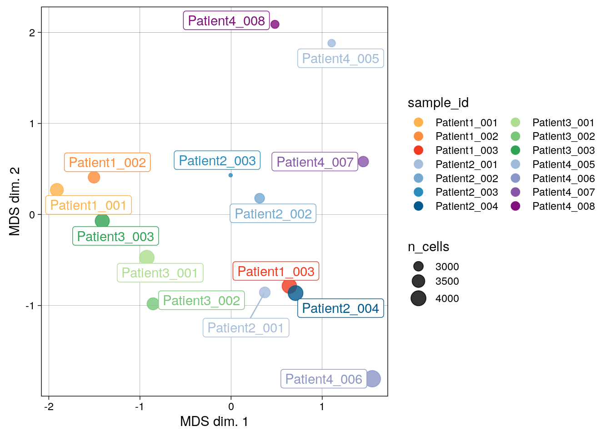
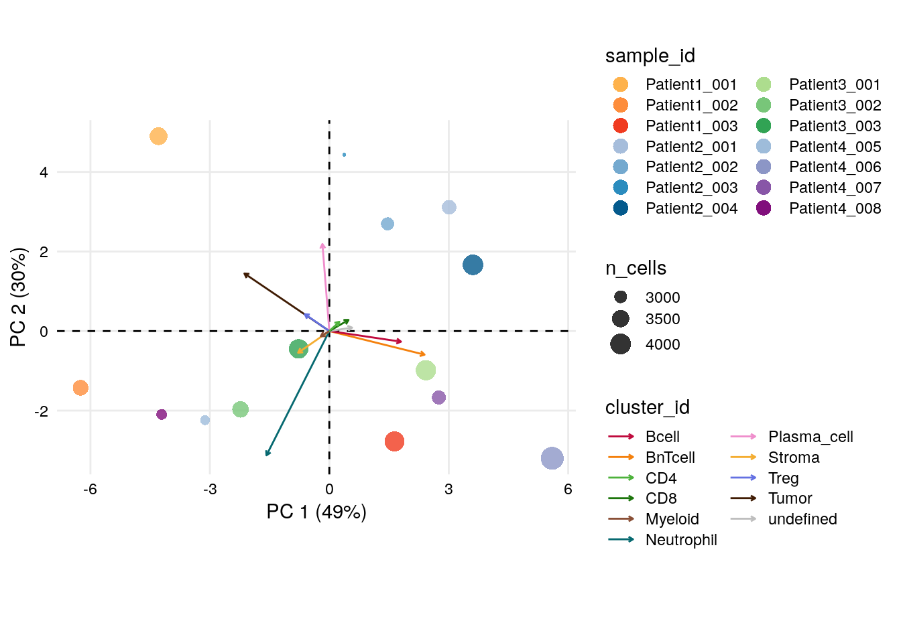
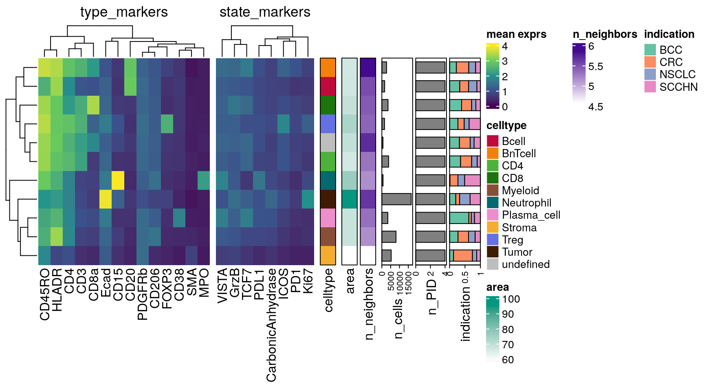

# Single cell visualization {#single-cell-visualization}

The following section describes typical approaches for visualizing
single-cell data.

This chapter is divided into three parts. Section \@ref(cell-type-level)
will highlight visualization approaches downstream of cell type
classification from Section \@ref(classification). We will then focus on
visualization methods that relate single-cell data to the sample level
in Section \@ref(sample-level). Lastly, Section \@ref(rich-example) will
provide a more customized example on how to integrate various
single-cell and sample metadata into one heatmap using the
[ComplexHeatmap](https://bioconductor.org/packages/release/bioc/html/ComplexHeatmap.html)
package [@Gu2016].

Visualization functions from popular R packages in single-cell research
such as
[scater](https://bioconductor.org/packages/release/bioc/html/scater.html),
[DittoSeq](https://bioconductor.org/packages/release/bioc/html/dittoSeq.html)
and
[CATALYST](https://bioconductor.org/packages/release/bioc/html/CATALYST.html)
will be utilized. We will recycle methods and functions that we have
used in previous sections, while also introducing new ones.

Please note that this chapter aims to provide an overview on **common**
visualization options and should be seen as a stepping-stone. However,
many more options exist and the user should customize the visualization
according to the biological question at hand.

## Load data

First, we will read in the previously generated `SpatialExperiment`
object.


```r
spe <- readRDS("data/spe.rds")
```

For visualization purposes, we will define markers that were used for
cell type classification and markers that can indicate a specific cell
state (e.g., Ki67 for proliferating cells).


```r
# Define cell phenotype markers 
type_markers <- c("Ecad", "CD45RO", "CD20", "CD3", "FOXP3", "CD206", "MPO", 
                  "SMA", "CD8a", "CD4", "HLADR", "CD15", "CD38", "PDGFRb")

# Define cell state markers 
state_markers <- c("CarbonicAnhydrase", "Ki67", "PD1", "GrzB", "PDL1", 
                   "ICOS", "TCF7", "VISTA")

# Add to spe
rowData(spe)$marker_class <- ifelse(rownames(spe) %in% type_markers, "type",
                                    ifelse(rownames(spe) %in% state_markers, "state", 
                                    "other"))
```

## Cell-type level {#cell-type-level}

In the first section of this chapter, the grouping-level for the
visualization approaches will be the cell type classification from
Section \@ref(classification). Other grouping levels (e.g., cluster
assignments from Section \@ref(clustering)) are possible and the user
should adjust depending on the chosen analysis workflow.

### Dimensionality reduction visualization

As seen before, we can visualize single-cells in low-dimensional space.
Often, non-linear methods for dimensionality reduction such as tSNE and
UMAP are used. They aim to preserve the distances between each cell and its
neighbors in the high-dimensional space.

Interpreting these plots is not trivial, but local neighborhoods in the
plot can suggest similarity in expression for given cells. See
[Orchestrating Single-Cell Analysis with
Bioconductor](https://bioconductor.org/books/release/OSCA/) for more
details.

Here, we will use `dittoDimPlot` from the
[DittoSeq](https://bioconductor.org/packages/release/bioc/html/dittoSeq.html)
package and `plotReducedDim` from the 
[scater](https://bioconductor.org/packages/release/bioc/html/scater.html) package
to visualize the fastMNN-corrected UMAP colored by cell type and
expression (using the asinh-transformed intensities), respectively.

Both functions are highly flexible and return `ggplot` objects which can
be further modified.


```r
library(dittoSeq)
library(scater)
library(patchwork)
library(cowplot)
library(viridis)

## UMAP colored by cell type and expression - dittoDimPlot
p1 <- dittoDimPlot(spe, 
                   var = "celltype", 
                   reduction.use = "UMAP_mnnCorrected", 
                   size = 0.2,
                   do.label = TRUE) +
  scale_color_manual(values = metadata(spe)$color_vectors$celltype) +
  theme(legend.title = element_blank()) +
  ggtitle("Cell types on UMAP, integrated cells")

p2 <- dittoDimPlot(spe, 
                   var = "Ecad", 
                   assay = "exprs",
                   reduction.use = "UMAP_mnnCorrected", 
                   size = 0.2, 
                   colors = viridis(100), 
                   do.label = TRUE) +
    scale_color_viridis()
  
p1 + p2
```


The `plotReducedDim` function of the `scater` package provides an alternative
way for visualizing cells in low dimensions. Here, we loop over all type
markers, generate one plot per marker and plot the indivudual plots side-by-side.


```r
# UMAP colored by expression for all markers - plotReducedDim
plot_list  <- lapply(rownames(spe)[rowData(spe)$marker_class == "type"], function(x){
                      p <- plotReducedDim(spe, 
                                          dimred = "UMAP_mnnCorrected",
                                          colour_by = x,
                                          by_exprs_values = "exprs",
                                          point_size = 0.2)
                      return(p)
                    })

plot_grid(plotlist = plot_list)
```


### Heatmap visualization

Next, it is often useful to visualize single-cell expression per cell
type in form of a heatmap. For this, we will use the `dittoHeatmap`
function from the 
[DittoSeq](https://bioconductor.org/packages/release/bioc/html/dittoSeq.html)
package.

We sub-sample the dataset to 4000 cells for ease of visualization and
overlay the cancer type and patient ID from which the cells were
extracted.


```r
set.seed(220818)
cur_cells <- sample(seq_len(ncol(spe)), 4000)

# Heatmap visualization - DittoHeatmap
dittoHeatmap(spe[,cur_cells], 
             genes = rownames(spe)[rowData(spe)$marker_class == "type"],
             assay = "exprs", 
             cluster_cols = FALSE, 
             scale = "none",
             heatmap.colors = viridis(100), 
             annot.by = c("celltype", "indication", "patient_id"),
             annotation_colors = list(indication = metadata(spe)$color_vectors$indication,
                                      patient_id = metadata(spe)$color_vectors$patient_id,
                                      celltype = metadata(spe)$color_vectors$celltype))
```


Similarly, we can visualize the mean marker expression per cell type for all
cells bu first calculating the mean marker expression per cell type using the
`aggregateAcrossCells` function from the
[scuttle](https://bioconductor.org/packages/release/bioc/html/scuttle.html)
package and then use `dittoHeatmap`. We will annotate the heatmap with the
number of cells per cell type and we will used different ways for feature
scaling.


```r
library(scuttle)

## aggregate by cell type
celltype_mean <- aggregateAcrossCells(as(spe, "SingleCellExperiment"),  
                     ids = spe$celltype, 
                     statistics = "mean",
                     use.assay.type = "exprs", 
                     subset.row = rownames(spe)[rowData(spe)$marker_class == "type"])

# No scaling
dittoHeatmap(celltype_mean,
             assay = "exprs", 
             cluster_cols = TRUE, 
             scale = "none",
             heatmap.colors = viridis(100),
             annot.by = c("celltype", "ncells"),
             annotation_colors = list(celltype = metadata(spe)$color_vectors$celltype,
                                      ncells = plasma(100)))
```


```r
# Scaled to max
dittoHeatmap(celltype_mean,
             assay = "exprs", 
             cluster_cols = TRUE, 
             scaled.to.max = TRUE,
             heatmap.colors.max.scaled = inferno(100),
             annot.by = c("celltype", "ncells"),
             annotation_colors = list(celltype = metadata(spe)$color_vectors$celltype,
                                      ncells = plasma(100)))
```


```r
# Z score scaled
dittoHeatmap(celltype_mean,
             assay = "exprs", 
             cluster_cols = TRUE, 
             annot.by = c("celltype", "ncells"),
             annotation_colors = list(celltype = metadata(spe)$color_vectors$celltype,
                                      ncells = plasma(100)))
```


As illustrated above for not-, max-, and Z score-scaled expression values,
different ways of scaling can have strong effects on visualization
output and we encourage the user to test multiple options.

Overall, we can observe cell-type specific marker expression (e.g., Tumor
= Ecad high and B cells = CD20 high) in agreement with the gating scheme
of Section \@ref(classification).

### Violin plot visualization

The `plotExpression` function from the
[scater](https://bioconductor.org/packages/release/bioc/html/scater.html) package
allows to plot the distribution of expression values across cell types
for a chosen set of proteins. The output is a `ggplot` object which can be 
modified further.


```r
# Violin Plot - plotExpression
plotExpression(spe[,cur_cells], 
               features = rownames(spe)[rowData(spe)$marker_class == "type"],
               x = "celltype", 
               exprs_values = "exprs", 
               colour_by = "celltype") +
    theme(axis.text.x =  element_text(angle = 90))+
    scale_color_manual(values = metadata(spe)$color_vectors$celltype)
```


### Scatter plot visualization

Moreover, a protein expression based scatter plot can be generated with
`dittoScatterPlot` (returns a `ggplot` object). We overlay the plot with
the cell type information.


```r
# Scatter plot
dittoScatterPlot(spe, 
                 x.var = "CD3", 
                 y.var="CD20", 
                 assay.x = "exprs", 
                 assay.y = "exprs", 
                 color.var = "celltype") +
    scale_color_manual(values = metadata(spe)$color_vectors$celltype) +
    ggtitle("Scatterplot for CD3/CD20 labelled by celltype")
```


We can nicely observe how the "B next to T cell" phenotype (`BnTcell`)
has high expression values for both CD20 and CD3.

**Of note**, in a setting where the user aims to assign labels to
clusters based on marker genes/proteins, all of the above plots can be
particularly helpful.

### Barplot visualization

In order to display frequencies of cell types per sample/patient, the
`dittoBarPlot` function will be used. Data can be represented as
percentages or counts and again `ggplot` objects are outputted.


```r
# by sample_id - percentage
dittoBarPlot(spe, 
             var = "celltype", 
             group.by = "sample_id") +
    scale_fill_manual(values = metadata(spe)$color_vectors$celltype)
```


```r
# by patient_id - percentage
dittoBarPlot(spe, 
             var = "celltype", 
             group.by = "patient_id") +
    scale_fill_manual(values = metadata(spe)$color_vectors$celltype)
```


```r
# by patient_id - count
dittoBarPlot(spe, 
             scale = "count",
             var = "celltype", 
             group.by = "patient_id") +
    scale_fill_manual(values = metadata(spe)$color_vectors$celltype)
```


We can see that cell type frequencies change between samples/patients
and that the highest proportion/counts of plasma cells and stromal
cells can be observed for Patient 2 and Patient 4, respectively.

### CATALYST-based visualization

In the following, we highlight some useful visualization
functions from the
[CATALYST](https://bioconductor.org/packages/release/bioc/html/CATALYST.html)
package.

To this end, we will first convert the `SpatialExperiment` object into a
CATALYST-compatible format.


```r
library(CATALYST)

# Save SPE in CATALYST-compatible object with renamed colData entries and 
# new metadata information
spe_cat <- spe 

spe_cat$sample_id <- factor(spe$sample_id)
spe_cat$condition <- factor(spe$indication)
spe_cat$cluster_id <- factor(spe$celltype)

# Add celltype information to metadata
metadata(spe_cat)$cluster_codes <- data.frame(celltype = factor(spe_cat$celltype))
```

All of the `CATALYST` functions presented below return `ggplot` objects,
which allow flexible downstream adjustment.

#### Pseudobulk-level MDS plot

Pseudobulk-level multi-dimensional scaling (MDS) plots can be rendered
with the exported `pbMDS` function.

Here, we will use `pbMDS` to highlight expression similarities between
cell types and subsequently for each celltype-sample-combination.


```r
# MDS pseudobulk by cell type
pbMDS(spe_cat, 
      by = "cluster_id", 
      features = rownames(spe_cat)[rowData(spe_cat)$marker_class == "type"], 
      label_by = "cluster_id", 
      k = "celltype") +
  scale_color_manual(values = metadata(spe_cat)$color_vectors$celltype)
```


```r
# MDS pseudobulk by cell type and sample_id
pbMDS(spe_cat, 
      by = "both", 
      features = rownames(spe_cat)[rowData(spe_cat)$marker_class == "type"], 
      k = "celltype", 
      shape_by = "condition", 
      size_by = TRUE) +
  scale_color_manual(values = metadata(spe_cat)$color_vectors$celltype)
```


We can see that the pseudobulk-expression profile of neutrophils seems
markedly distinct from the other cell types, while comparable cell types
such as the T cell subtypes group together. Furthermore, pseudobulk
cell-type profiles from SCCHN appear different from the other
indications.

#### Reduced dimension plot on CLR of proportions

The `clrDR` function produces dimensionality reduction plots on centered
log-ratios (CLR) of sample/cell type proportions across cell
type/samples.

As with `pbMDS`, the output plots aim to illustrate the degree of
similarity between cell types based on sample proportions.


```r
# CLR on cluster proportions across samples
clrDR(spe_cat, 
      dr = "PCA", 
      by = "cluster_id", 
      k = "celltype", 
      label_by = "cluster_id", 
      arrow_col = "sample_id", 
      point_pal = metadata(spe_cat)$color_vectors$celltype) 
```


We can again observe that neutrophils have a divergent profile also in
terms of their sample proportions.

#### Pseudobulk expression boxplot

The `plotPbExprs` generates combined box- and jitter-plots of aggregated marker
expression per cell type and sample (image). Here, we further split the data by
cancer type.


```r
plotPbExprs(spe_cat, 
            k = "celltype", 
            facet_by = "cluster_id", 
            ncol = 2, 
            features = rownames(spe_cat)[rowData(spe_cat)$marker_class == "type"]) +
    scale_color_manual(values = metadata(spe_cat)$color_vectors$indication)
```


Notably, CD15 levels are elevated in SCCHN in comparison to all other
indications for most cell types.

## Sample-level {#sample-level}

In the next section, we will shift the grouping-level focus from the
cell type to the sample-level. Sample-levels will be further divided
into the sample-(image) and patient-level.

Although we will mostly repeat the functions from the previous section
\@ref(cell-type-level), sample- and patient-level centered visualization
can provide additional quality control and biological interpretation.

### Dimensionality reduction visualization

Visualization of low-dimensional embeddings, here comparing non-corrected and
fastMNN-corrected UMAPs, and coloring it by sample-levels is often used
for "batch effect" assessment as mentioned in Section
\@ref(cell-quality).

We will again use `dittoDimPlot`.


```r
## UMAP colored by cell type and expression - dittoDimPlot
p1 <- dittoDimPlot(spe, 
                   var = "sample_id",
                   reduction.use = "UMAP", 
                   size = 0.2, 
                   colors = viridis(100), 
                   do.label = FALSE) +
    scale_color_manual(values = metadata(spe)$color_vectors$sample_id) +
  theme(legend.title = element_blank()) +
  ggtitle("Sample ID")

p2 <- dittoDimPlot(spe, 
                   var = "sample_id",
                   reduction.use = "UMAP_mnnCorrected", 
                   size = 0.2, 
                   colors = viridis(100), 
                   do.label = FALSE) +
    scale_color_manual(values = metadata(spe)$color_vectors$sample_id) +
  theme(legend.title = element_blank()) +
  ggtitle("Sample ID")

p3 <- dittoDimPlot(spe, 
                   var = "patient_id",
                   reduction.use = "UMAP", 
                   size = 0.2,
                   do.label = FALSE) +
  scale_color_manual(values = metadata(spe)$color_vectors$patient_id) +
  theme(legend.title = element_blank()) +
  ggtitle("Patient ID")

p4 <- dittoDimPlot(spe, 
                   var = "patient_id", 
                   reduction.use = "UMAP_mnnCorrected", 
                   size = 0.2,
                   do.label = FALSE) +
  scale_color_manual(values = metadata(spe)$color_vectors$patient_id) +
  theme(legend.title = element_blank()) +
  ggtitle("Patient ID")

(p1 + p2) / (p3 + p4)
```


As illustrated in Section \@ref(batch-effects), we see that the fastMNN
approach (right side of the plot) leads to mixing of cells across
samples/patients and thus batch effect correction.

### Heatmap visualization

It can be beneficial to use a heatmap to visualize single-cell
expression per sample and patient. Such a plot, which we will create
using `dittoHeatmap`, can highlight biological differences across
samples/patients.


```r
# Heatmap visualization - DittoHeatmap
dittoHeatmap(spe[,cur_cells], 
             genes = rownames(spe)[rowData(spe)$marker_class == "type"],
             assay = "exprs", 
             order.by = c("patient_id","sample_id"),
             cluster_cols = FALSE, 
             scale = "none",
             heatmap.colors = viridis(100), 
             annot.by = c("celltype", "indication", "patient_id", "sample_id"),
             annotation_colors = list(celltype = metadata(spe)$color_vectors$celltype,
                                      indication = metadata(spe)$color_vectors$indication,
                                      patient_id = metadata(spe)$color_vectors$patient_id,
                                      sample_id = metadata(spe)$color_vectors$sample_id))
```


As in Section \@ref(image-quality), aggregated mean marker expression
per sample/patient allow identification of samples/patients with
outlying expression patterns.

Here, we will focus on the patient level and use `aggregateAcrossCells`
and `dittoHeatmap`. The heatmap will be annotated with the number of
cells per patient and cancer type and displayed using two scaling
options.


```r
# mean expression by patient_id
patient_mean <- aggregateAcrossCells(as(spe, "SingleCellExperiment"),  
                     ids = spe$patient_id, 
                     statistics = "mean",
                     use.assay.type = "exprs", 
                     subset.row = rownames(spe)[rowData(spe)$marker_class == "type"])

# No scaling
dittoHeatmap(patient_mean,
             assay = "exprs", 
             cluster_cols = TRUE, 
             scale = "none",
             heatmap.colors = viridis(100),
             annot.by = c("patient_id","indication","ncells"),
             annotation_colors = list(patient_id = metadata(spe)$color_vectors$patient_id,
                                      indication = metadata(spe)$color_vectors$indication,
                                      ncells = plasma(100)))
```


```r
# Max expression scaling
dittoHeatmap(patient_mean,
             assay = "exprs", 
             cluster_cols = TRUE, 
             scaled.to.max =  TRUE,
             heatmap.colors.max.scaled = inferno(100),
             annot.by = c("patient_id","indication","ncells"),
             annotation_colors = list(patient_id = metadata(spe)$color_vectors$patient_id,
                                      indication = metadata(spe)$color_vectors$indication,
                                      ncells = plasma(100)))
```


As seen before, CD15 levels are elevated in Patient 4 (SCCHN), while SMA
levels are highest for Patient 4 (CRC).

### Barplot visualization

Complementary to displaying cell type frequencies per sample/patient, we
can use `dittoBarPlot` to display sample/patient frequencies per cell
type.


```r
dittoBarPlot(spe, 
             var = "patient_id", 
             group.by = "celltype") +
    scale_fill_manual(values = metadata(spe)$color_vectors$patient_id)
```


```r
dittoBarPlot(spe, 
             var = "sample_id", 
             group.by = "celltype") +
    scale_fill_manual(values = metadata(spe)$color_vectors$sample_id)
```


`Patient2` has the highest and lowest proportion of plasma cells and
neutrophils, respectively.

### CATALYST-based visualization

#### Pseudobulk-level MDS plot

Expression-based pseudobulks for each sample can be compared with the
`pbMDS` function.


```r
# MDS pseudobulk by sample_id 
pbMDS(spe_cat, 
      by = "sample_id", 
      color_by = "sample_id", 
      features = rownames(spe_cat)[rowData(spe_cat)$marker_class == "type"]) +
  scale_color_manual(values = metadata(spe_cat)$color_vectors$sample_id)
```



There are marked differences in pseudobulk-expression patterns between
samples and across patients, which can be driven by biological
differences and also technical aspects such as divergent region
selection.

#### Reduced dimension plot on CLR of proportions

The `clrDR` function can also be used to analyze similarity of samples
based on cell type proportions.


```r
# CLR on sample proportions across clusters
clrDR(spe_cat, 
      dr = "PCA", 
      by = "sample_id", 
      point_col = "sample_id",
      k = "celltype", 
      point_pal = metadata(spe_cat)$color_vectors$sample_id) +
  scale_color_manual(values = metadata(spe_cat)$color_vectors$celltype)
```

```
## Scale for colour is already present.
## Adding another scale for colour, which will replace the existing scale.
```



There are notable differences between samples based on their cell type
proportions.

Interestingly, `Patient3_001`, `Patient1_003`, `Patient4_007` and
`Patient4_006` group together and the PC loadings indicate a strong
contribution of BnT and B cells, which could propose formation of
tertiary lymphoid structures (TLS). In section \@ref(spatial-viz), we
will be able to confirm this hypothesis visually on the images.

## Further examples {#rich-example}

In the last section of this chapter, we will use the popular
[ComplexHeatmap](https://bioconductor.org/packages/release/bioc/html/ComplexHeatmap.html)
package to create a visualization example that combines various
cell-type- and sample-level information.

[ComplexHeatmap](https://bioconductor.org/packages/release/bioc/html/ComplexHeatmap.html)
is highly versatile and is originally inspired from the
[pheatmap](https://cran.r-project.org/web/packages/pheatmap/index.html)
package. Therefore, many arguments have the same/similar names.

For more details, we would recommend to read the [reference
book](https://jokergoo.github.io/ComplexHeatmap-reference/book/).

### Publication-ready ComplexHeatmap

For this example, we will concatenate heatmaps and annotations
horizontally into one rich heatmap list. The grouping-level for the
visualization will again be the cell type information from Section
\@ref(classification)

Initially, we will create two separate `Heatmap` objects for cell type
and state markers.

Then, metadata information, including the cancer type proportion and
number of cells/patients per cell type, will be extracted into
`HeatmapAnnotation` objects.

Notably, we will add spatial features per cell type, here the number of
neighbors extracted from `colPair(spe)` and cell area, in another
`HeatmapAnnotation` object.

Ultimately, all objects are combined in a `HeatmapList` and visualized.


```r
library(ComplexHeatmap)
library(circlize)
library(tidyverse)
set.seed(22)

### 1. Heatmap bodies ###

# Heatmap body color 
col_exprs <- colorRamp2(c(0,1,2,3,4), 
                        c("#440154FF","#3B518BFF","#20938CFF",
                          "#6ACD5AFF","#FDE725FF"))

# Create Heatmap objects
# By cell type markers
celltype_mean <- aggregateAcrossCells(as(spe, "SingleCellExperiment"),  
                     ids = spe$celltype, 
                     statistics = "mean",
                     use.assay.type = "exprs", 
                     subset.row = rownames(spe)[rowData(spe)$marker_class == "type"])

h_type <- Heatmap(t(assay(celltype_mean, "exprs")),
        column_title = "type_markers",
        col = col_exprs,
        name= "mean exprs",
        show_row_names = TRUE, 
        show_column_names = TRUE)
    
# By cell state markers
cellstate_mean <- aggregateAcrossCells(as(spe, "SingleCellExperiment"),  
                     ids = spe$celltype, 
                     statistics = "mean",
                     use.assay.type = "exprs", 
                     subset.row = rownames(spe)[rowData(spe)$marker_class == "state"])

h_state <- Heatmap(t(assay(cellstate_mean, "exprs")),
        column_title = "state_markers",
        col = col_exprs,
        name= "mean exprs",
        show_row_names = TRUE,
        show_column_names = TRUE)


### 2. Heatmap annotation ###

### 2.1  Metadata features

anno <- colData(celltype_mean) %>% as.data.frame %>% select(celltype, ncells)

# Proportion of indication per celltype
indication <- unclass(prop.table(table(spe$celltype, spe$indication), margin = 1))

# Number of contributing patients per celltype
cluster_PID <- colData(spe) %>% 
    as.data.frame() %>% 
    select(celltype, patient_id) %>% 
    group_by(celltype) %>% table() %>% 
    as.data.frame()

n_PID <- cluster_PID %>% 
    filter(Freq>0) %>% 
    group_by(celltype) %>% 
    count(name = "n_PID") %>% 
    column_to_rownames("celltype")

# Create HeatmapAnnotation objects
ha_anno <- HeatmapAnnotation(celltype = anno$celltype,
                            border = TRUE, 
                            gap = unit(1,"mm"),
                            col = list(celltype = metadata(spe)$color_vectors$celltype),
                            which = "row")
    
ha_meta <- HeatmapAnnotation(n_cells = anno_barplot(anno$ncells, width = unit(10, "mm")),
                            n_PID = anno_barplot(n_PID, width = unit(10, "mm")),
                            indication = anno_barplot(indication,width = unit(10, "mm"),
                                                      gp = gpar(fill = metadata(spe)$color_vectors$indication)),
                            border = TRUE, 
                            annotation_name_rot = 90,
                            gap = unit(1,"mm"),
                            which = "row")

### 2.2 Spatial features

# Add number of neighbors to spe object (saved in colPair)
spe$n_neighbors <- countLnodeHits(colPair(spe, "neighborhood"))

# Select spatial features and average over celltypes
spatial <- colData(spe) %>% 
    as.data.frame() %>% 
    select(area, celltype, n_neighbors)

spatial <- spatial %>% 
    select(-celltype) %>% 
    aggregate(by = list(celltype = spatial$celltype), FUN = mean) %>% 
    column_to_rownames("celltype")

# Create HeatmapAnnotation object
ha_spatial <- HeatmapAnnotation(
    area = spatial$area,
    n_neighbors = spatial$n_neighbors,
    border = TRUE,
    gap = unit(1,"mm"),
    which = "row")

### 3. Plot rich heatmap ###

# Create HeatmapList object
h_list <- h_type +
    h_state +
    ha_anno +
    ha_spatial +
    ha_meta

# Add customized legend for anno_barplot()
lgd <- Legend(title = "indication", 
              at = colnames(indication), 
              legend_gp = gpar(fill = metadata(spe)$color_vectors$indication))
             
# Plot
draw(h_list,annotation_legend_list = list(lgd))
```



This plot summarizes most of the information we have seen in this
chapter previously. In addition, we can observe that tumor cells have
the largest mean cell area, high number of neighbors and elevated Ki67
expression. BnT cells have the highest number of neighbors on average,
which is biological sound given their predominant location in highly
immune infiltrated regions (such as TLS).

### Interactive visualization

For interactive visualization of the single-cell data the 
[iSEE](https://www.bioconductor.org/packages/release/bioc/html/iSEE.html) shiny 
application can be used. For a comprehensive tutorial, please refer to the
[iSEE vignette](https://www.bioconductor.org/packages/release/bioc/vignettes/iSEE/inst/doc/basic.html).


```r
if (interactive()) {
    library(iSEE)

    iSEE(spe)   
}
```

## Session Info

<details>
   <summary>SessionInfo</summary>
   

```
## R version 4.3.2 (2023-10-31)
## Platform: x86_64-pc-linux-gnu (64-bit)
## Running under: Ubuntu 22.04.3 LTS
## 
## Matrix products: default
## BLAS:   /usr/lib/x86_64-linux-gnu/openblas-pthread/libblas.so.3 
## LAPACK: /usr/lib/x86_64-linux-gnu/openblas-pthread/libopenblasp-r0.3.20.so;  LAPACK version 3.10.0
## 
## locale:
##  [1] LC_CTYPE=en_US.UTF-8       LC_NUMERIC=C              
##  [3] LC_TIME=en_US.UTF-8        LC_COLLATE=en_US.UTF-8    
##  [5] LC_MONETARY=en_US.UTF-8    LC_MESSAGES=en_US.UTF-8   
##  [7] LC_PAPER=en_US.UTF-8       LC_NAME=C                 
##  [9] LC_ADDRESS=C               LC_TELEPHONE=C            
## [11] LC_MEASUREMENT=en_US.UTF-8 LC_IDENTIFICATION=C       
## 
## time zone: Etc/UTC
## tzcode source: system (glibc)
## 
## attached base packages:
## [1] grid      stats4    stats     graphics  grDevices utils     datasets 
## [8] methods   base     
## 
## other attached packages:
##  [1] lubridate_1.9.3             forcats_1.0.0              
##  [3] stringr_1.5.1               dplyr_1.1.4                
##  [5] purrr_1.0.2                 readr_2.1.4                
##  [7] tidyr_1.3.0                 tibble_3.2.1               
##  [9] tidyverse_2.0.0             circlize_0.4.15            
## [11] ComplexHeatmap_2.18.0       CATALYST_1.26.0            
## [13] viridis_0.6.4               viridisLite_0.4.2          
## [15] cowplot_1.1.2               patchwork_1.1.3            
## [17] scater_1.30.1               scuttle_1.12.0             
## [19] dittoSeq_1.14.0             ggplot2_3.4.4              
## [21] SpatialExperiment_1.12.0    SingleCellExperiment_1.24.0
## [23] SummarizedExperiment_1.32.0 Biobase_2.62.0             
## [25] GenomicRanges_1.54.1        GenomeInfoDb_1.38.5        
## [27] IRanges_2.36.0              S4Vectors_0.40.2           
## [29] BiocGenerics_0.48.1         MatrixGenerics_1.14.0      
## [31] matrixStats_1.2.0          
## 
## loaded via a namespace (and not attached):
##   [1] RColorBrewer_1.1-3          jsonlite_1.8.8             
##   [3] shape_1.4.6                 magrittr_2.0.3             
##   [5] magick_2.8.2                ggbeeswarm_0.7.2           
##   [7] TH.data_1.1-2               farver_2.1.1               
##   [9] rmarkdown_2.25              GlobalOptions_0.1.2        
##  [11] zlibbioc_1.48.0             vctrs_0.6.5                
##  [13] Cairo_1.6-2                 DelayedMatrixStats_1.24.0  
##  [15] RCurl_1.98-1.13             rstatix_0.7.2              
##  [17] htmltools_0.5.7             S4Arrays_1.2.0             
##  [19] plotrix_3.8-4               BiocNeighbors_1.20.1       
##  [21] broom_1.0.5                 SparseArray_1.2.3          
##  [23] sass_0.4.8                  bslib_0.6.1                
##  [25] plyr_1.8.9                  sandwich_3.1-0             
##  [27] zoo_1.8-12                  cachem_1.0.8               
##  [29] igraph_1.6.0                lifecycle_1.0.4            
##  [31] iterators_1.0.14            pkgconfig_2.0.3            
##  [33] rsvd_1.0.5                  Matrix_1.6-4               
##  [35] R6_2.5.1                    fastmap_1.1.1              
##  [37] GenomeInfoDbData_1.2.11     clue_0.3-65                
##  [39] digest_0.6.33               colorspace_2.1-0           
##  [41] ggnewscale_0.4.9            irlba_2.3.5.1              
##  [43] ggpubr_0.6.0                beachmat_2.18.0            
##  [45] labeling_0.4.3              cytolib_2.14.0             
##  [47] timechange_0.2.0            fansi_1.0.6                
##  [49] colorRamps_2.3.1            nnls_1.5                   
##  [51] polyclip_1.10-6             abind_1.4-5                
##  [53] compiler_4.3.2              withr_2.5.2                
##  [55] doParallel_1.0.17           ConsensusClusterPlus_1.66.0
##  [57] backports_1.4.1             BiocParallel_1.36.0        
##  [59] carData_3.0-5               highr_0.10                 
##  [61] ggforce_0.4.1               ggsignif_0.6.4             
##  [63] MASS_7.3-60                 drc_3.0-1                  
##  [65] DelayedArray_0.28.0         rjson_0.2.21               
##  [67] FlowSOM_2.10.0              gtools_3.9.5               
##  [69] tools_4.3.2                 vipor_0.4.7                
##  [71] beeswarm_0.4.0              glue_1.6.2                 
##  [73] Rtsne_0.17                  cluster_2.1.4              
##  [75] reshape2_1.4.4              generics_0.1.3             
##  [77] gtable_0.3.4                tzdb_0.4.0                 
##  [79] hms_1.1.3                   data.table_1.14.10         
##  [81] BiocSingular_1.18.0         ScaledMatrix_1.10.0        
##  [83] car_3.1-2                   utf8_1.2.4                 
##  [85] XVector_0.42.0              ggrepel_0.9.4              
##  [87] foreach_1.5.2               pillar_1.9.0               
##  [89] splines_4.3.2               flowCore_2.14.0            
##  [91] tweenr_2.0.2                lattice_0.21-9             
##  [93] survival_3.5-7              RProtoBufLib_2.14.0        
##  [95] tidyselect_1.2.0            knitr_1.45                 
##  [97] gridExtra_2.3               bookdown_0.37              
##  [99] xfun_0.41                   pheatmap_1.0.12            
## [101] stringi_1.8.3               yaml_2.3.8                 
## [103] evaluate_0.23               codetools_0.2-19           
## [105] cli_3.6.2                   munsell_0.5.0              
## [107] jquerylib_0.1.4             Rcpp_1.0.11                
## [109] png_0.1-8                   XML_3.99-0.16              
## [111] parallel_4.3.2              sparseMatrixStats_1.14.0   
## [113] bitops_1.0-7                mvtnorm_1.2-4              
## [115] scales_1.3.0                ggridges_0.5.5             
## [117] crayon_1.5.2                GetoptLong_1.0.5           
## [119] rlang_1.1.2                 multcomp_1.4-25
```
</details>
