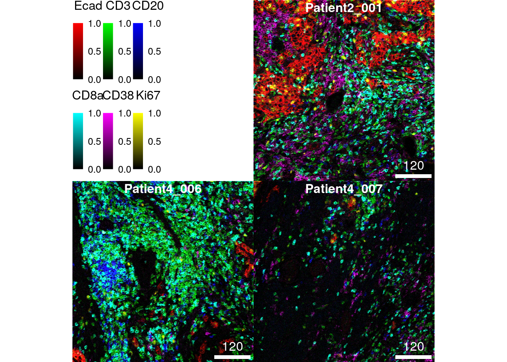
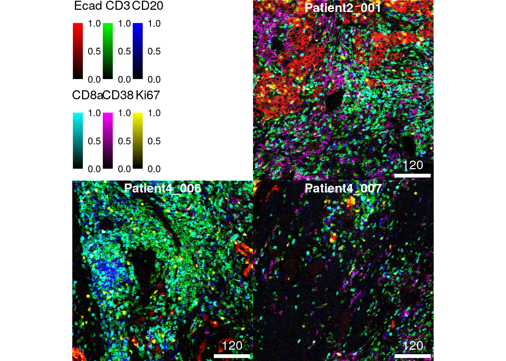
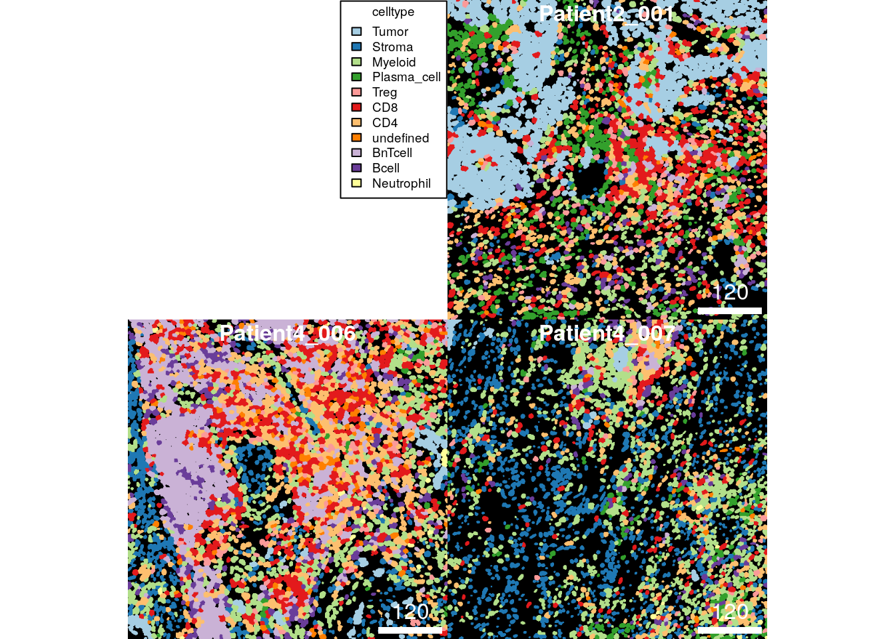
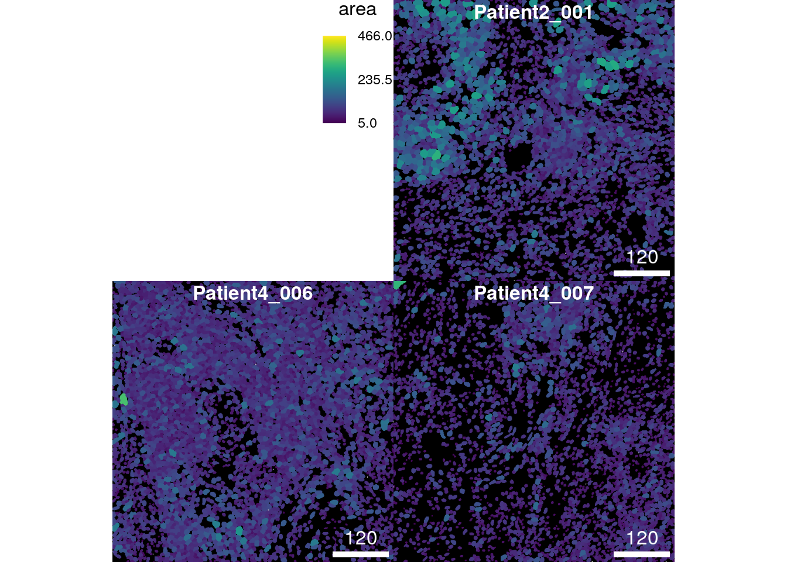
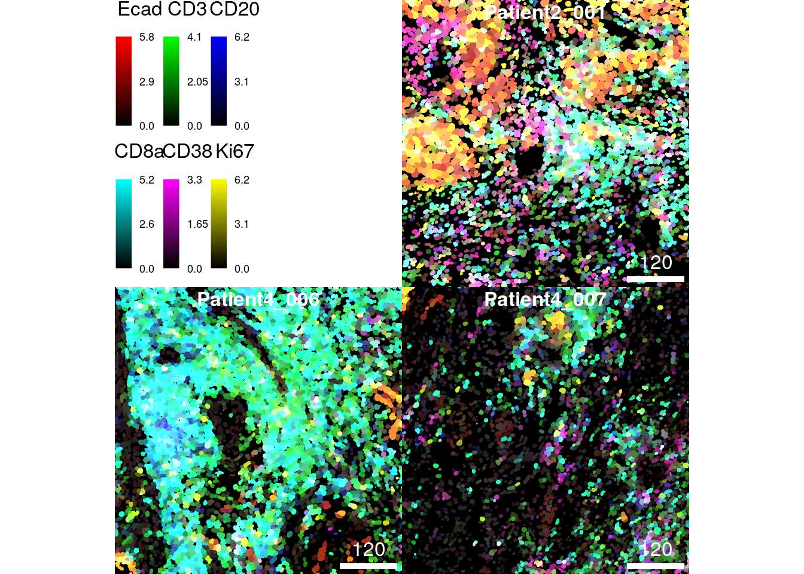
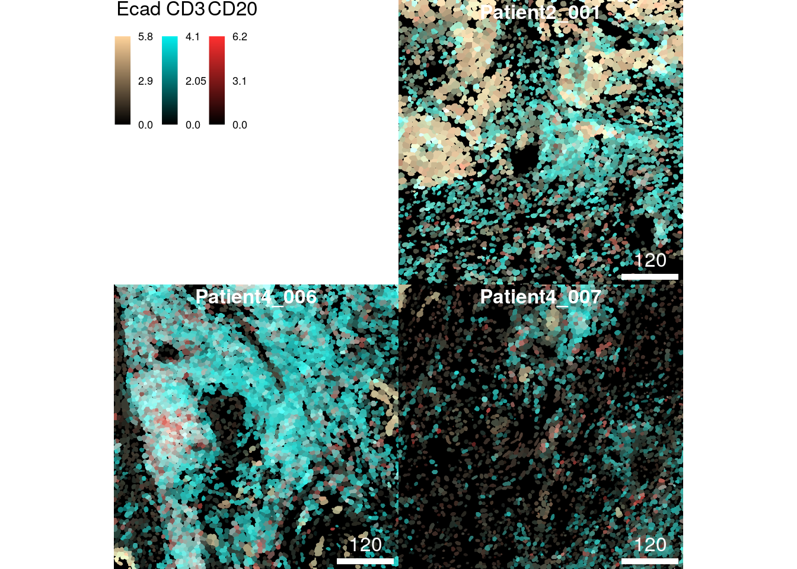
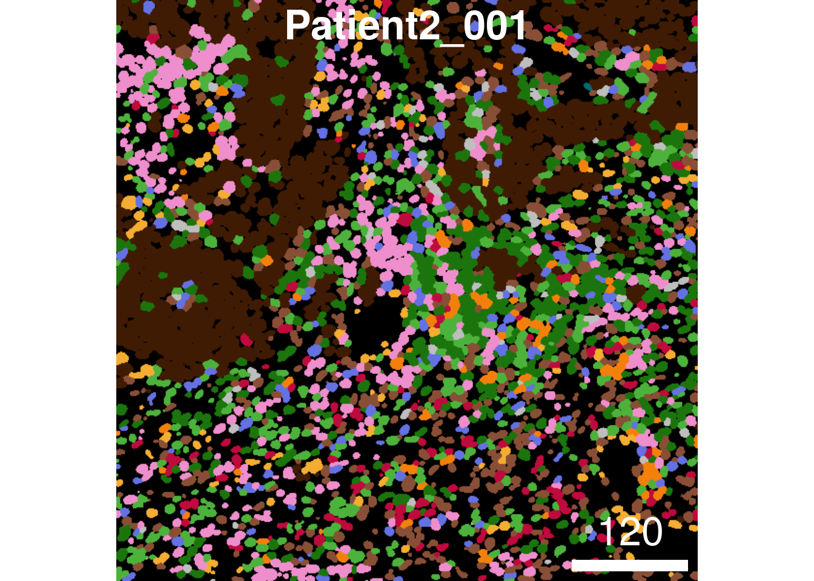

# Image visualization {#image-visualization}

The following section describes how to visualize the abundance of
biomolecules (e.g., protein or RNA) as well as cell-specific metadata on
images. Section \@ref(pixel-visualization) focuses on visualizing
pixel-level information including the generation of pseudo-color
composite images. Section \@ref(mask-visualization) highlights the
visualization of cell metadata (e.g., cell phenotype) as well as
summarized pixel intensities on cell segmentation masks. Section
\@ref(cytoviewer) showcases interactive pixel- and
cell-level visualization with the
[cytoviewer](https://bioconductor.org/packages/release/bioc/html/cytoviewer.html)
R/Bioconductor package [@Meyer2024].

The
[cytomapper](https://www.bioconductor.org/packages/release/bioc/html/cytomapper.html)
R/Bioconductor package was developed to support the handling and
visualization of multiple multi-channel images and segmentation masks
[@Eling2020]. The main data object for image handling is the
[CytoImageList](https://www.bioconductor.org/packages/release/bioc/vignettes/cytomapper/inst/doc/cytomapper.html#5_The_CytoImageList_object)
container which we used in Section \@ref(read-data) to store
multi-channel images and segmentation masks.

We will first read in the previously processed data and randomly select
3 images for visualization purposes.


```r
library(SpatialExperiment)
library(cytomapper)
spe <- readRDS("data/spe.rds")
images <- readRDS("data/images.rds")
masks <- readRDS("data/masks.rds")

# Sample images
set.seed(220517)
cur_id <- sample(unique(spe$sample_id), 3)
cur_images <- images[names(images) %in% cur_id]
cur_masks <- masks[names(masks) %in% cur_id]
```

## Pixel visualization {#pixel-visualization}

The following section gives examples for visualizing individual channels
or multiple channels as pseudo-color composite images. For this the
`cytomapper` package exports the `plotPixels` function which expects a
`CytoImageList` object storing one or multiple multi-channel images. In
the simplest use case, a single channel can be visualized as follows:


```r
plotPixels(cur_images, 
           colour_by = "Ecad",
           bcg = list(Ecad = c(0, 5, 1)))
```


The plot above shows the tissue expression of the epithelial tumor
marker E-cadherin on the 3 selected images. The `bcg` parameter (default
`c(0, 1, 1)`) stands for "background", "contrast", "gamma" and controls
these attributes of the image. This parameter takes a named list where
each entry specifies these attributes per channel. The first value of
the numeric vector will be added to the pixel intensities (background);
pixel intensities will be multiplied by the second entry of the vector
(contrast); pixel intensities will be exponentiated by the third entry
of the vector (gamma). In most cases, it is sufficient to adjust the
second (contrast) entry of the vector.

The following example highlights the visualization of 6 markers (maximum
allowed number of markers) at once per image. The markers indicate the
spatial distribution of tumor cells (E-cadherin), T cells (CD3), B cells
(CD20), CD8+ T cells (CD8a), plasma cells (CD38) and proliferating cells
(Ki67).


```r
plotPixels(cur_images, 
           colour_by = c("Ecad", "CD3", "CD20", "CD8a", "CD38", "Ki67"),
           bcg = list(Ecad = c(0, 5, 1),
                      CD3 = c(0, 5, 1),
                      CD20 = c(0, 5, 1),
                      CD8a = c(0, 5, 1),
                      CD38 = c(0, 8, 1),
                      Ki67 = c(0, 5, 1)))
```


### Adjusting colors

The default colors for visualization are chosen by the additive RGB
(red, green, blue) color model. For six markers the default colors are:
red, green, blue, cyan (green + blue), magenta (red + blue), yellow
(green + red). These colors are the easiest to distinguish by eye.
However, you can select other colors for each channel by setting the
`colour` parameter:


```r
plotPixels(cur_images, 
           colour_by = c("Ecad", "CD3", "CD20"),
           bcg = list(Ecad = c(0, 5, 1),
                      CD3 = c(0, 5, 1),
                      CD20 = c(0, 5, 1)),
           colour = list(Ecad = c("black", "burlywood1"),
                         CD3 = c("black", "cyan2"),
                         CD20 = c("black", "firebrick1")))
```


The `colour` parameter takes a named list in which each entry specifies
the colors from which a color gradient is constructed via
`colorRampPalette`. These are usually vectors of length 2 in which the
first entry is `"black"` and the second entry specifies the color of
choice. Although not recommended, you can also specify more than two
colors to generate a more complex color gradient.

### Image normalization

As an alternative to setting the `bcg` parameter, images can first be
normalized. Normalization here means to scale the pixel intensities per
channel between 0 and 1 (or a range specified by the `ft` parameter in
the `normalize` function). By default, the `normalize` function scales
pixel intensities across **all** images contained in the `CytoImageList`
object (`separateImages = FALSE`). Each individual channel is scaled
independently (`separateChannels = TRUE`).

After 0-1 normalization, maximum pixel intensities can be clipped to
enhance the contrast of the image (setting the `inputRange` parameter).
In the following example, the clipping to 0 and 0.2 is the same as
multiplying the pixel intensities by a factor of 5.


```r
# 0 - 1 channel scaling across all images
norm_images <- cytomapper::normalize(cur_images)

# Clip channel at 0.2
norm_images <- cytomapper::normalize(norm_images, inputRange = c(0, 0.2))

plotPixels(norm_images, 
           colour_by = c("Ecad", "CD3", "CD20", "CD8a", "CD38", "Ki67"))
```



The default setting of scaling pixel intensities across all images
ensures comparable intensity levels across images. Pixel intensities can
also be scaled **per image** therefore correcting for
staining/expression differences between images:


```r
# 0 - 1 channel scaling per image
norm_images <- cytomapper::normalize(cur_images, separateImages = TRUE)

# Clip channel at 0.2
norm_images <- cytomapper::normalize(norm_images, inputRange = c(0, 0.2))

plotPixels(norm_images, 
           colour_by = c("Ecad", "CD3", "CD20", "CD8a", "CD38", "Ki67"))
```



As we can see, the marker Ki67 appears brighter on image 2 and 3 in
comparison to scaling the channel across all images.

Finally, the `normalize` function also accepts a named list input for
the `inputRange` argument. In this list, the clipping range per channel
can be set individually:


```r
# 0 - 1 channel scaling per image
norm_images <- cytomapper::normalize(cur_images, 
                         separateImages = TRUE,
                         inputRange = list(Ecad = c(0, 50), 
                                           CD3 = c(0, 30),
                                           CD20 = c(0, 40),
                                           CD8a = c(0, 50),
                                           CD38 = c(0, 10),
                                           Ki67 = c(0, 70)))

plotPixels(norm_images, 
           colour_by = c("Ecad", "CD3", "CD20", "CD8a", "CD38", "Ki67"))
```


## Cell visualization {#mask-visualization}

In the following section, we will show examples on how to visualize
single cells either as segmentation masks or outlined on composite
images. This type of visualization allows to observe the spatial
distribution of cell phenotypes, the visual assessment of morphological
features and quality control in terms of cell segmentation and
phenotyping.

### Visualzing metadata

The `cytomapper` package provides the `plotCells` function that accepts
a `CytoImageList` object containing segmentation masks. These are
defined as single channel images where sets of pixels with the same
integer ID identify individual cells. This integer ID can be found as an
entry in the `colData(spe)` slot and as pixel information in the
segmentation masks. The entry in `colData(spe)` needs to be specified
via the `cell_id` argument to the `plotCells` function. In that way,
data contained in the `SpatialExperiment` object can be mapped to
segmentation masks. For the current dataset, the cell IDs are stored in
`colData(spe)$ObjectNumber`.

As cell IDs are only unique within a single image, `plotCells` also
requires the `img_id` argument. This argument specifies the
`colData(spe)` as well as the `mcols(masks)` entry that stores the
unique image name from which each cell was extracted. In the current
dataset the unique image names are stored in `colData(spe)$sample_id`
and `mcols(masks)$sample_id`.

Providing these two entries that allow mapping between the
`SpatialExperiment` object and segmentation masks, we can now color
individual cells based on their cell type:


```r
plotCells(cur_masks,
          object = spe, 
          cell_id = "ObjectNumber", 
          img_id = "sample_id",
          colour_by = "celltype")
```



For consistent visualization, the `plotCells` function takes a named
list as `color` argument. The entry name must match the `colour_by`
argument.


```r
plotCells(cur_masks,
          object = spe, 
          cell_id = "ObjectNumber", 
          img_id = "sample_id",
          colour_by = "celltype",
          colour = list(celltype = metadata(spe)$color_vectors$celltype))
```


If only individual cell types should be visualized, the
`SpatialExperiment` object can be subsetted (e.g., to only contain CD8+
T cells). In the following example CD8+ T cells are colored in red and
all other cells that are not contained in the dataset are colored in
white (as set by the `missing_color` argument).


```r
CD8 <- spe[,spe$celltype == "CD8"]

plotCells(cur_masks,
          object = CD8, 
          cell_id = "ObjectNumber", 
          img_id = "sample_id",
          colour_by = "celltype",
          colour = list(celltype = c(CD8 = "red")),
          missing_colour = "white")
```


In terms of visualizing metadata, any entry in the `colData(spe)` slot
can be visualized. The `plotCells` function automatically detects if the
entry is continuous or discrete. In this fashion, we can now visualize
the area of each cell:


```r
plotCells(cur_masks,
          object = spe, 
          cell_id = "ObjectNumber", 
          img_id = "sample_id",
          colour_by = "area")
```



### Visualizating expression

Similar to visualizing single-cell metadata on segmentation masks, we
can use the `plotCells` function to visualize the aggregated pixel
intensities per cell. In the current dataset pixel intensities were
aggregated by computing the mean pixel intensity per cell and per
channel. The `plotCells` function accepts the `exprs_values` argument
(default `counts`) that allows selecting the assay which stores the
expression values that should be visualized.

In the following example, we visualize the asinh-transformed mean pixel
intensities of the epithelial marker E-cadherin on segmentation masks.


```r
plotCells(cur_masks,
          object = spe, 
          cell_id = "ObjectNumber", 
          img_id = "sample_id",
          colour_by = "Ecad",
          exprs_values = "exprs")
```


We will now visualize the maximum number of allowed markers as
composites on the segmentation masks. As above the markers indicate the
spatial distribution of tumor cells (E-cadherin), T cells (CD3), B cells
(CD20), CD8+ T cells (CD8a), plasma cells (CD38) and proliferating cells
(Ki67).


```r
plotCells(cur_masks,
          object = spe, 
          cell_id = "ObjectNumber", 
          img_id = "sample_id",
          colour_by = c("Ecad", "CD3", "CD20", "CD8a", "CD38", "Ki67"),
          exprs_values = "exprs")
```



While visualizing 6 markers on the pixel-level may still allow the
distinction of different tissue structures, observing single-cell
expression levels is difficult when visualizing many markers
simultaneously due to often overlapping expression.

Similarly to adjusting marker colors when visualizing pixel intensities,
we can change the color gradients per marker by setting the `color`
argument:


```r
plotCells(cur_masks,
          object = spe, 
          cell_id = "ObjectNumber", 
          img_id = "sample_id",
          colour_by = c("Ecad", "CD3", "CD20"),
          exprs_values = "exprs",
          colour = list(Ecad = c("black", "burlywood1"),
                        CD3 = c("black", "cyan2"),
                        CD20 = c("black", "firebrick1")))
```



### Outlining cells on images {#outline-cells}

The following section highlights the combined visualization of pixel-
and cell-level information at once. For this, besides the
`SpatialExperiment` object, the `plotPixels` function accepts two
`CytoImageList` objects. One for the multi-channel images and one for
the segmentation masks. By specifying the `outline_by` parameter, the
outlines of cells can now be colored based on their metadata.

The following example first generates a 3-channel composite images
displaying the expression of E-cadherin, CD3 and CD20 before coloring
the cells' outlines by their cell phenotype.


```r
plotPixels(image = cur_images,
           mask = cur_masks,
           object = spe, 
           cell_id = "ObjectNumber", 
           img_id = "sample_id",
           colour_by = c("Ecad", "CD3", "CD20"),
           outline_by = "celltype",
           bcg = list(Ecad = c(0, 5, 1),
                      CD3 = c(0, 5, 1),
                      CD20 = c(0, 5, 1)),
           colour = list(celltype = metadata(spe)$color_vectors$celltype),
           thick = TRUE)
```


Distinguishing individual cell phenotypes is nearly impossible in the
images above.

However, the `SpatialExperiment` object can be subsetted to only contain
cells of a single or few phenotypes. This allows the selective
visualization of cell outlines on composite images.

Here, we select all CD8+ T cells from the dataset and outline them on a
2-channel composite image displaying the expression of CD3 and CD8a.


```r
CD8 <- spe[,spe$celltype == "CD8"]

plotPixels(image = cur_images,
           mask = cur_masks,
           object = CD8, 
           cell_id = "ObjectNumber", img_id = "sample_id",
           colour_by = c("CD3", "CD8a"),
           outline_by = "celltype",
           bcg = list(CD3 = c(0, 5, 1),
                      CD8a = c(0, 5, 1)),
           colour = list(celltype = c("CD8" = "white")),
           thick = TRUE)
```


This type of visualization allows the quality control of two things: 1.
segmentation quality of individual cell types can be checked and 2. cell
phenotyping accuracy can be visually assessed against expected marker
expression.

## Adjusting plot annotations

The `cytomapper` package provides a number of function arguments to
adjust the visual appearance of figures that are shared between the
`plotPixels` and `plotCells` function.

For a full overview of the arguments please refer to `?plotting-param`.

We use the following example to highlight how to adjust the scale bar,
the image title, the legend appearance and the margin between images.


```r
plotPixels(cur_images, 
           colour_by = c("Ecad", "CD3", "CD20", "CD8a", "CD38", "Ki67"),
           bcg = list(Ecad = c(0, 5, 1),
                      CD3 = c(0, 5, 1),
                      CD20 = c(0, 5, 1),
                      CD8a = c(0, 5, 1),
                      CD38 = c(0, 8, 1),
                      Ki67 = c(0, 5, 1)),
           scale_bar = list(length = 100,
                            label = expression("100 " ~ mu * "m"),
                            cex = 0.7, 
                            lwidth = 10,
                            colour = "grey",
                            position = "bottomleft",
                            margin = c(5,5),
                            frame = 3),
           image_title = list(text = mcols(cur_images)$indication,
                              position = "topright",
                              colour = "grey",
                              margin = c(5,5),
                              font = 2,
                              cex = 2),
           legend = list(colour_by.title.cex = 0.7,
                         margin = 10),
           margin = 40)
```


## Displaying individual images

By default, all images are displayed on the same graphics device. This
can be useful when saving all images at once (see next section) to zoom
into the individual images instead of opening each image individually.
However, when displaying images in a markdown document these are more
accessible when visualized individually. For this, the `plotPixels` and
`plotCells` function accepts the `display` parameter that when set to
`"single"` displays each resulting image in its own graphics device:


```r
plotCells(cur_masks,
          object = spe, 
          cell_id = "ObjectNumber", 
          img_id = "sample_id",
          colour_by = "celltype",
          colour = list(celltype = metadata(spe)$color_vectors$celltype),
          display = "single",
          legend = NULL)
```



## Saving and returning images

The final section addresses how to save composite images and how to
return them for integration with other plots.

The `plotPixels` and `plotCells` functions accept the `save_plot`
argument which takes a named list of the following entries: `filename`
indicates the location and file type of the image saved to disk; `scale`
adjusts the resolution of the saved image (this only needs to be
adjusted for small images).


```r
plotCells(cur_masks,
          object = spe, 
          cell_id = "ObjectNumber", 
          img_id = "sample_id",
          colour_by = "celltype",
          colour = list(celltype = metadata(spe)$color_vectors$celltype),
          save_plot = list(filename = "data/celltype_image.png"))
```

The composite images (together with their annotation) can also be
returned. In the following code chunk we save two example plots to
variables (`out1` and `out2`).


```r
out1 <- plotCells(cur_masks,
                  object = spe, 
                  cell_id = "ObjectNumber", 
                  img_id = "sample_id",
                  colour_by = "celltype",
                  colour = list(celltype = metadata(spe)$color_vectors$celltype),
                  return_plot = TRUE)
```

```r
out2 <- plotCells(cur_masks,
                  object = spe, 
                  cell_id = "ObjectNumber", 
                  img_id = "sample_id",
                  colour_by = c("Ecad", "CD3", "CD20"),
                  exprs_values = "exprs",
                  return_plot = TRUE)
```

The composite images are stored in `out1$plot` and `out2$plot` and can
be converted into a graph object recognized by the
[cowplot](https://cran.r-project.org/web/packages/cowplot/vignettes/introduction.html)
package.

The final function call of the following chunk plots both object next to
each other.


```r
library(cowplot)
library(gridGraphics)
p1 <- ggdraw(out1$plot, clip = "on")
p2 <- ggdraw(out2$plot, clip = "on")

plot_grid(p1, p2)
```


## Interactive image visualization {#cytoviewer}

The
[cytoviewer](https://bioconductor.org/packages/release/bioc/html/cytoviewer.html)
R/Bioconductor package [@Meyer2024] extends the static visualization
abilities from `cytomapper` via an interactive and user-friendly `shiny`
application.

It supports flexible generation of image composites, allows side-by-side
visualization of single channels, and facilitates the spatial
visualization of single-cell data in the form of segmentation masks.
Rapid and publication-quality image downloads are also supported. For a
full introduction to the package, please refer to 
[the vignette](https://bioconductor.org/packages/release/bioc/vignettes/cytoviewer/inst/doc/cytoviewer.html).


```r
library(cytoviewer)

app <- cytoviewer(image = images,
                  mask = masks,
                  object = spe,
                  cell_id = "ObjectNumber",
                  img_id = "sample_id")

if (interactive()) {
    shiny::runApp(app)
}
```

## Session Info

<details>

<summary>SessionInfo</summary>


```
## R version 4.3.2 (2023-10-31)
## Platform: x86_64-pc-linux-gnu (64-bit)
## Running under: Ubuntu 22.04.3 LTS
## 
## Matrix products: default
## BLAS:   /usr/lib/x86_64-linux-gnu/openblas-pthread/libblas.so.3 
## LAPACK: /usr/lib/x86_64-linux-gnu/openblas-pthread/libopenblasp-r0.3.20.so;  LAPACK version 3.10.0
## 
## locale:
##  [1] LC_CTYPE=en_US.UTF-8       LC_NUMERIC=C              
##  [3] LC_TIME=en_US.UTF-8        LC_COLLATE=en_US.UTF-8    
##  [5] LC_MONETARY=en_US.UTF-8    LC_MESSAGES=en_US.UTF-8   
##  [7] LC_PAPER=en_US.UTF-8       LC_NAME=C                 
##  [9] LC_ADDRESS=C               LC_TELEPHONE=C            
## [11] LC_MEASUREMENT=en_US.UTF-8 LC_IDENTIFICATION=C       
## 
## time zone: Etc/UTC
## tzcode source: system (glibc)
## 
## attached base packages:
## [1] grid      stats4    stats     graphics  grDevices utils     datasets 
## [8] methods   base     
## 
## other attached packages:
##  [1] cytoviewer_1.2.0            gridGraphics_0.5-1         
##  [3] cowplot_1.1.2               cytomapper_1.14.0          
##  [5] EBImage_4.44.0              SpatialExperiment_1.12.0   
##  [7] SingleCellExperiment_1.24.0 SummarizedExperiment_1.32.0
##  [9] Biobase_2.62.0              GenomicRanges_1.54.1       
## [11] GenomeInfoDb_1.38.5         IRanges_2.36.0             
## [13] S4Vectors_0.40.2            BiocGenerics_0.48.1        
## [15] MatrixGenerics_1.14.0       matrixStats_1.2.0          
## 
## loaded via a namespace (and not attached):
##   [1] splines_4.3.2               later_1.3.2                
##   [3] bitops_1.0-7                tibble_3.2.1               
##   [5] svgPanZoom_0.3.4            polyclip_1.10-6            
##   [7] XML_3.99-0.16               lifecycle_1.0.4            
##   [9] rstatix_0.7.2               doParallel_1.0.17          
##  [11] lattice_0.21-9              MASS_7.3-60                
##  [13] backports_1.4.1             magrittr_2.0.3             
##  [15] sass_0.4.8                  rmarkdown_2.25             
##  [17] jquerylib_0.1.4             yaml_2.3.8                 
##  [19] plotrix_3.8-4               httpuv_1.6.13              
##  [21] sp_2.1-2                    RColorBrewer_1.1-3         
##  [23] ConsensusClusterPlus_1.66.0 multcomp_1.4-25            
##  [25] abind_1.4-5                 zlibbioc_1.48.0            
##  [27] Rtsne_0.17                  purrr_1.0.2                
##  [29] RCurl_1.98-1.13             TH.data_1.1-2              
##  [31] tweenr_2.0.2                sandwich_3.1-0             
##  [33] circlize_0.4.15             GenomeInfoDbData_1.2.11    
##  [35] ggrepel_0.9.4               irlba_2.3.5.1              
##  [37] CATALYST_1.26.0             terra_1.7-65               
##  [39] svglite_2.1.3               DelayedMatrixStats_1.24.0  
##  [41] codetools_0.2-19            DelayedArray_0.28.0        
##  [43] scuttle_1.12.0              ggforce_0.4.1              
##  [45] tidyselect_1.2.0            shape_1.4.6                
##  [47] raster_3.6-26               farver_2.1.1               
##  [49] ScaledMatrix_1.10.0         viridis_0.6.4              
##  [51] jsonlite_1.8.8              BiocNeighbors_1.20.1       
##  [53] GetoptLong_1.0.5            ellipsis_0.3.2             
##  [55] ggridges_0.5.5              survival_3.5-7             
##  [57] scater_1.30.1               iterators_1.0.14           
##  [59] systemfonts_1.0.5           foreach_1.5.2              
##  [61] tools_4.3.2                 ggnewscale_0.4.9           
##  [63] Rcpp_1.0.11                 glue_1.6.2                 
##  [65] gridExtra_2.3               SparseArray_1.2.3          
##  [67] xfun_0.41                   dplyr_1.1.4                
##  [69] HDF5Array_1.30.0            shinydashboard_0.7.2       
##  [71] withr_2.5.2                 fastmap_1.1.1              
##  [73] rhdf5filters_1.14.1         fansi_1.0.6                
##  [75] rsvd_1.0.5                  digest_0.6.33              
##  [77] R6_2.5.1                    mime_0.12                  
##  [79] colorspace_2.1-0            gtools_3.9.5               
##  [81] jpeg_0.1-10                 utf8_1.2.4                 
##  [83] tidyr_1.3.0                 generics_0.1.3             
##  [85] data.table_1.14.10          htmlwidgets_1.6.4          
##  [87] S4Arrays_1.2.0              pkgconfig_2.0.3            
##  [89] gtable_0.3.4                ComplexHeatmap_2.18.0      
##  [91] RProtoBufLib_2.14.0         XVector_0.42.0             
##  [93] htmltools_0.5.7             carData_3.0-5              
##  [95] bookdown_0.37               fftwtools_0.9-11           
##  [97] clue_0.3-65                 scales_1.3.0               
##  [99] png_0.1-8                   colorRamps_2.3.1           
## [101] knitr_1.45                  reshape2_1.4.4             
## [103] rjson_0.2.21                cachem_1.0.8               
## [105] zoo_1.8-12                  rhdf5_2.46.1               
## [107] GlobalOptions_0.1.2         stringr_1.5.1              
## [109] shinycssloaders_1.0.0       miniUI_0.1.1.1             
## [111] parallel_4.3.2              vipor_0.4.7                
## [113] pillar_1.9.0                vctrs_0.6.5                
## [115] promises_1.2.1              ggpubr_0.6.0               
## [117] BiocSingular_1.18.0         car_3.1-2                  
## [119] cytolib_2.14.0              beachmat_2.18.0            
## [121] xtable_1.8-4                cluster_2.1.4              
## [123] archive_1.1.7               beeswarm_0.4.0             
## [125] evaluate_0.23               magick_2.8.2               
## [127] mvtnorm_1.2-4               cli_3.6.2                  
## [129] locfit_1.5-9.8              compiler_4.3.2             
## [131] rlang_1.1.2                 crayon_1.5.2               
## [133] ggsignif_0.6.4              FlowSOM_2.10.0             
## [135] flowCore_2.14.0             plyr_1.8.9                 
## [137] ggbeeswarm_0.7.2            stringi_1.8.3              
## [139] viridisLite_0.4.2           BiocParallel_1.36.0        
## [141] nnls_1.5                    munsell_0.5.0              
## [143] tiff_0.1-12                 colourpicker_1.3.0         
## [145] Matrix_1.6-4                sparseMatrixStats_1.14.0   
## [147] ggplot2_3.4.4               Rhdf5lib_1.24.1            
## [149] shiny_1.8.0                 highr_0.10                 
## [151] fontawesome_0.5.2           drc_3.0-1                  
## [153] memoise_2.0.1               igraph_1.6.0               
## [155] broom_1.0.5                 bslib_0.6.1
```

</details>
