# Performing spatial analysis

Highly multiplexed imaging technologies measure the spatial distributions of
molecule abundances across tissue sections. As such, having the option to
analyze single cells in their spatial tissue context is a key strength of these
technologies.

A number of software packages such as
[squidpy](https://squidpy.readthedocs.io/en/stable/),
[giotto](https://giottosuite.readthedocs.io/en/master/) and
[Seurat](https://satijalab.org/seurat/articles/spatial_vignette_2.html) have
been developed to analyse and visualize cells in their spatial context. The
following chapter will highlight the use of
[imcRtools](https://bioconductor.org/packages/release/bioc/html/imcRtools.html)
and other Bioconductor packages to visualize and analyse single-cell data
obtained from highly multiplexed imaging technologies.

We will first read in the spatially-annotated single-cell data processed in the 
previous sections.


```r
library(SpatialExperiment)
spe <- readRDS("data/spe.rds")
```

## Spatial interaction graphs

Many spatial analysis approaches either compare the observed versus expected
number of cells around a given cell type (point process) or utilize interaction
graphs (spatial object graphs) to estimate clustering or interaction frequencies
between cell types.

The [steinbock](https://bodenmillergroup.github.io/steinbock/latest/cli/measurement/) 
framework allows the construction of these spatial graphs. During image 
processing (see Section \@ref(image-processing)), we have constructed
a spatial graph by expanding the individual cell masks by 4 pixels. 

The `imcRtools` package further allows the *ad hoc* consctruction of spatial
graphs directly using a `SpatialExperiment` or `SingleCellExperiment` object
while considering the spatial location (centroids) of individual cells. The
[buildSpatialGraph](https://bodenmillergroup.github.io/imcRtools/reference/buildSpatialGraph.html)
function allows constructing spatial graphs by detecting the k-nearest neighbors
in 2D (`knn`), by detecting all cells within a given distance to the center cell
(`expansion`) and by Delaunay triangulation (`delaunay`).

When constructing a knn graph, the number of neighbors (`k`) needs to be set and
(optionally) the maximum distance to consider (`max_dist`) can be specified.
When constructing a graph via expansion, the distance to expand (`threshold`)
needs to be provided. For graphs constructed via Delaunay triangulation,
the `max_dist` parameter can be set to avoid unusually large connections at the
edge of the image.


```r
library(imcRtools)
```


```r
spe <- buildSpatialGraph(spe, img_id = "sample_id", type = "knn", k = 20)
```

```
## The returned object is ordered by the 'sample_id' entry.
```

```r
spe <- buildSpatialGraph(spe, img_id = "sample_id", type = "expansion", threshold = 20)
```

```
## The returned object is ordered by the 'sample_id' entry.
```

```r
spe <- buildSpatialGraph(spe, img_id = "sample_id", type = "delaunay", max_dist = 20)
```

```
## The returned object is ordered by the 'sample_id' entry.
```

The spatial graphs are stored in `colPair(spe, name)` slots. These slots store
`SelfHits` objects representing edge lists in which the first column indicates
the index of the "from" cell and the second column the index of the "to" cell.
Each edge list is newly constructed when subsetting the object.


```r
colPairNames(spe)
```

```
## [1] "neighborhood"                "knn_interaction_graph"      
## [3] "expansion_interaction_graph" "delaunay_interaction_graph"
```

Here, `colPair(spe, "neighborhood")` stores the spatial graph constructed by
`steinbock`, `colPair(spe, "knn_interaction_graph")` stores the knn spatial
graph, `colPair(spe, "expansion_interaction_graph")` stores the expansion graph
and `colPair(spe, "delaunay_interaction_graph")` stores the graph constructed by
Delaunay triangulation.

## Spatial visualization {#spatial-viz}

Section \@ref(image-visualization) highlights the use of the
[cytomapper](https://www.bioconductor.org/packages/release/bioc/html/cytomapper.html)
package to visualize multichannel images and segmentation masks. Here, we
introduce the
[plotSpatial](https://bodenmillergroup.github.io/imcRtools/reference/plotSpatial.html)
function of the [imcRtools](https://www.bioconductor.org/packages/release/bioc/html/imcRtools.html) package to visualize the cells' centroids and
cell-cell interactions as spatial graphs.

In the following example, we select one image for visualization purposes. 
Here, each dot (node) represents a cell and edges are drawn between cells
in close physical proximity as detected by `steinbock` or the `buildSpatialGraph`
function. Nodes are variably colored based on the cell type and edges are
colored in grey.


```r
library(ggplot2)
library(viridis)

# steinbock interaction graph 
plotSpatial(spe[,spe$sample_id == "Patient3_001"], 
            node_color_by = "celltype", 
            img_id = "sample_id", 
            draw_edges = TRUE, 
            colPairName = "neighborhood", 
            nodes_first = FALSE, 
            edge_color_fix = "grey") + 
    scale_color_manual(values = metadata(spe)$color_vectors$celltype) +
    ggtitle("steinbock interaction graph")
```

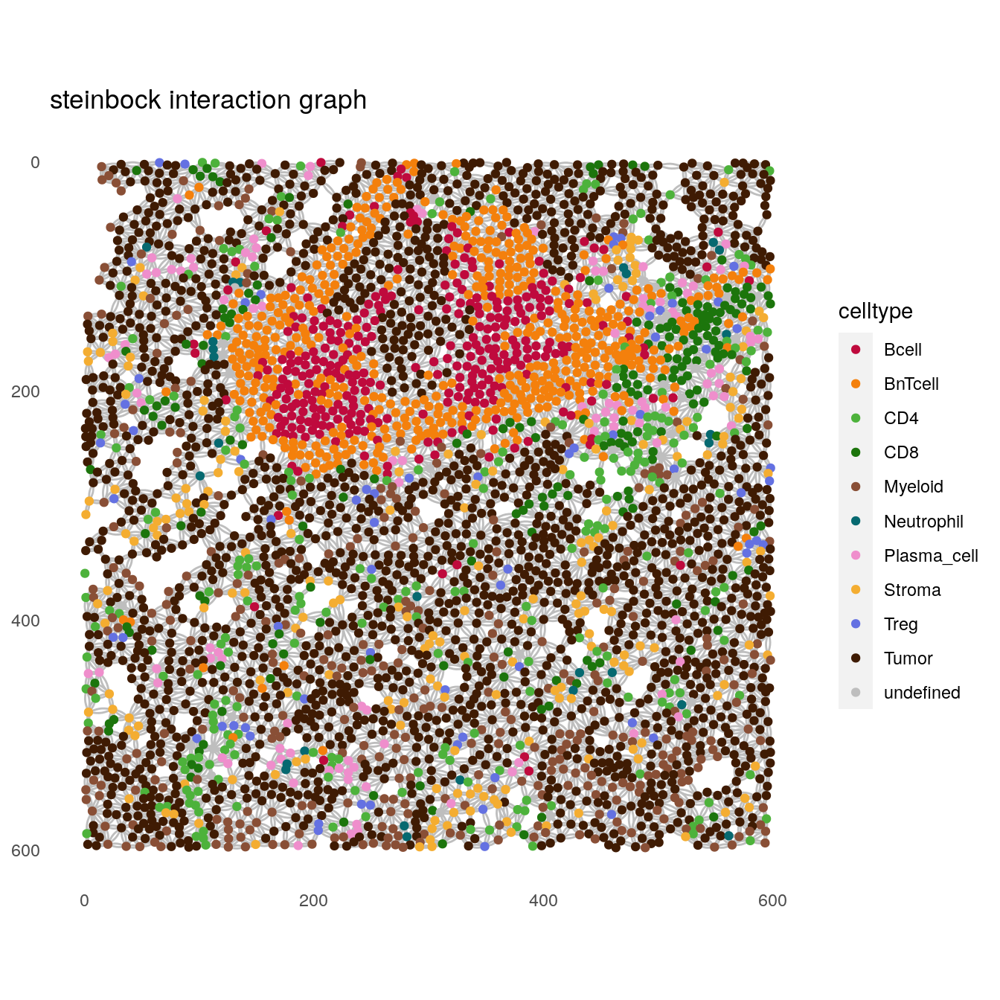

```r
# knn interaction graph 
plotSpatial(spe[,spe$sample_id == "Patient3_001"], 
            node_color_by = "celltype", 
            img_id = "sample_id", 
            draw_edges = TRUE, 
            colPairName = "knn_interaction_graph", 
            nodes_first = FALSE,
            edge_color_fix = "grey") + 
    scale_color_manual(values = metadata(spe)$color_vectors$celltype) +
    ggtitle("knn interaction graph")
```

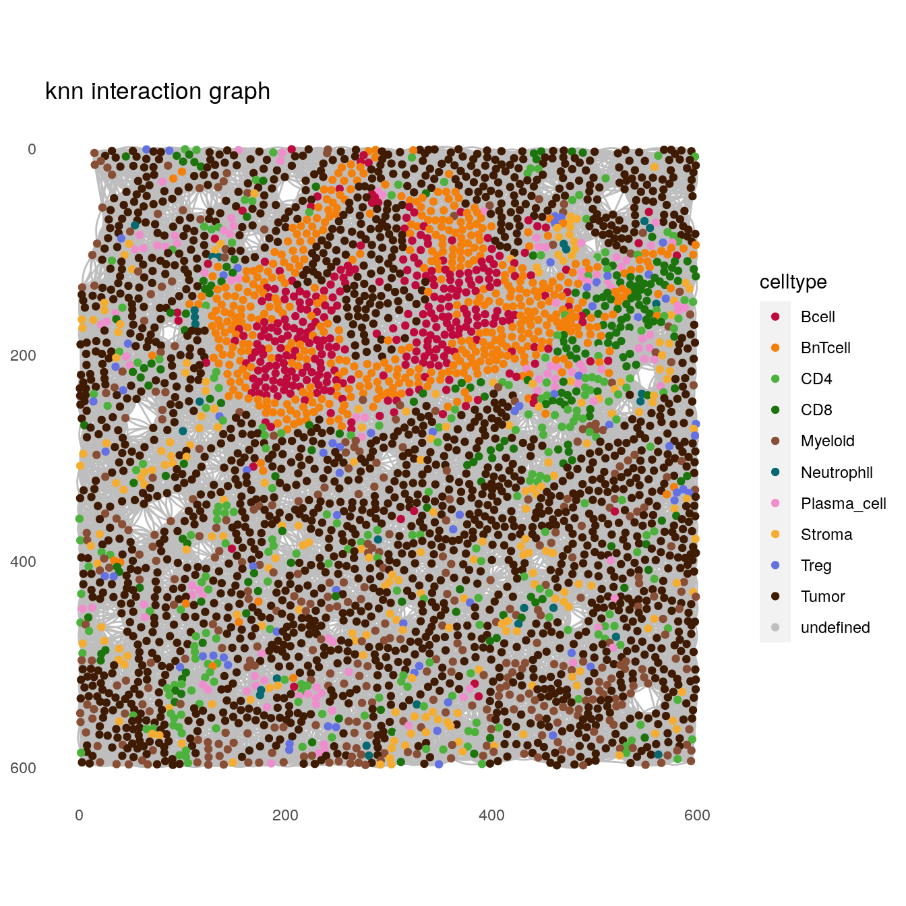

```r
# expansion interaction graph 
plotSpatial(spe[,spe$sample_id == "Patient3_001"], 
            node_color_by = "celltype", 
            img_id = "sample_id", 
            draw_edges = TRUE, 
            colPairName = "expansion_interaction_graph", 
            nodes_first = FALSE,
            edge_color_fix = "grey") + 
    scale_color_manual(values = metadata(spe)$color_vectors$celltype) +
    ggtitle("expansion interaction graph")
```

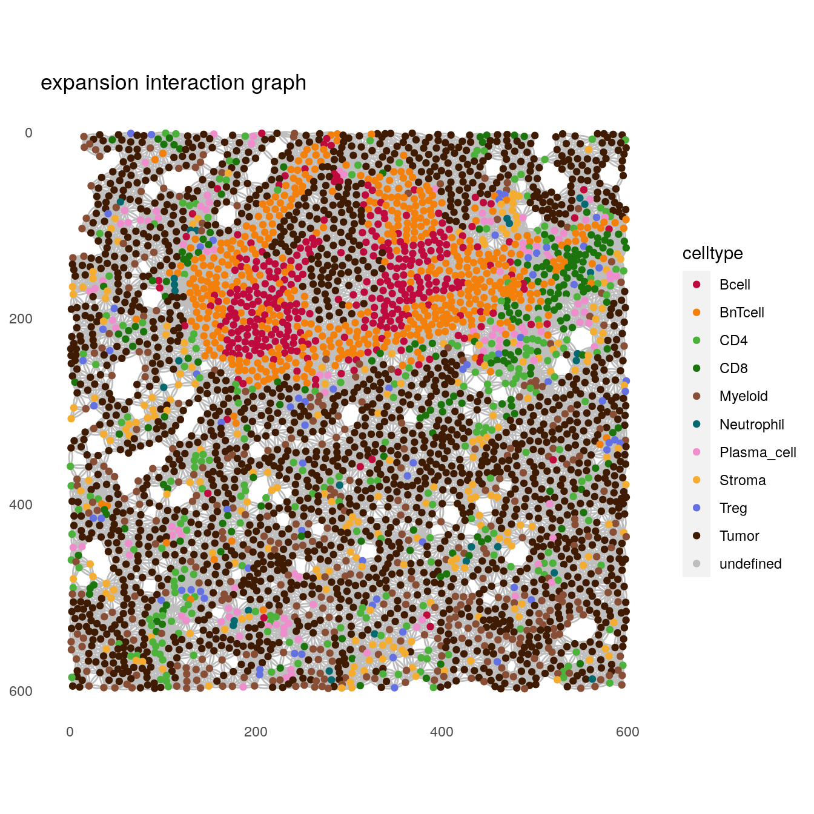

```r
# delaunay interaction graph 
plotSpatial(spe[,spe$sample_id == "Patient3_001"], 
            node_color_by = "celltype", 
            img_id = "sample_id", 
            draw_edges = TRUE, 
            colPairName = "delaunay_interaction_graph", 
            nodes_first = FALSE,
            edge_color_fix = "grey") + 
    scale_color_manual(values = metadata(spe)$color_vectors$celltype) +
    ggtitle("delaunay interaction graph")
```


Nodes can also be colored based on the cells' expression levels (e.g.,
E-cadherin expression) and their size can be adjusted (e.g., based on measured
cell area).


```r
plotSpatial(spe[,spe$sample_id == "Patient3_001"], 
            node_color_by = "Ecad", 
            assay_type = "exprs",
            img_id = "sample_id", 
            draw_edges = TRUE, 
            colPairName = "expansion_interaction_graph", 
            nodes_first = FALSE, 
            node_size_by = "area", 
            directed = FALSE,
            edge_color_fix = "grey") + 
    scale_size_continuous(range = c(0.1, 2)) +
    ggtitle("E-cadherin expression")
```

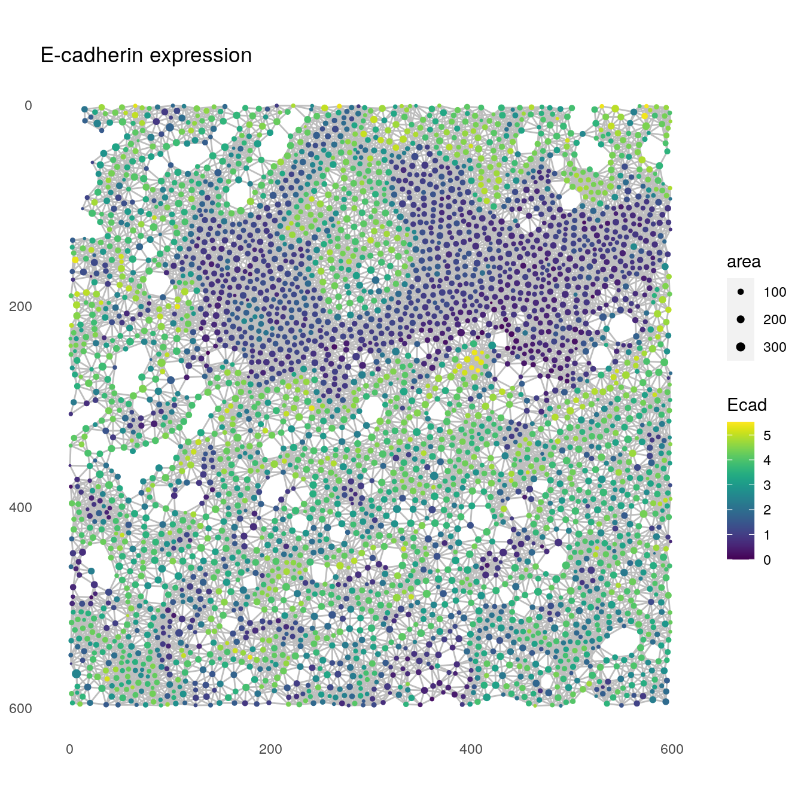

Finally, the `plotSpatial` function allows displaying all images at once. This
visualization can be useful to quickly detect larger structures of interest.


```r
plotSpatial(spe, 
            node_color_by = "celltype", 
            img_id = "sample_id", 
            node_size_fix = 0.5) + 
    scale_color_manual(values = metadata(spe)$color_vectors$celltype)
```


For a full documentation on the `plotSpatial` function, please refer to
`?plotSpatial`.

## Spatial community analysis

The detection of spatial communities was proposed by [@Jackson2020]. Here, cells
are clustered solely based on their interactions as defined by the spatial
object graph. We can perform spatial community detection across all cells as
displayed in the next code chunk. Communities with less than 10 cells are
excluded. **Of note:** we set the seed outside of the function call for
reproducibility porposes as internally the `louvain` modularity optimization
function is used which gives different results over different runs.


```r
set.seed(230621)
spe <- detectCommunity(spe, 
                       colPairName = "neighborhood", 
                       size_threshold = 10)

plotSpatial(spe, 
            node_color_by = "spatial_community", 
            img_id = "sample_id", 
            node_size_fix = 0.5) +
    theme(legend.position = "none") +
    ggtitle("Spatial tumor communities") +
    scale_color_manual(values = rev(colors()))
```

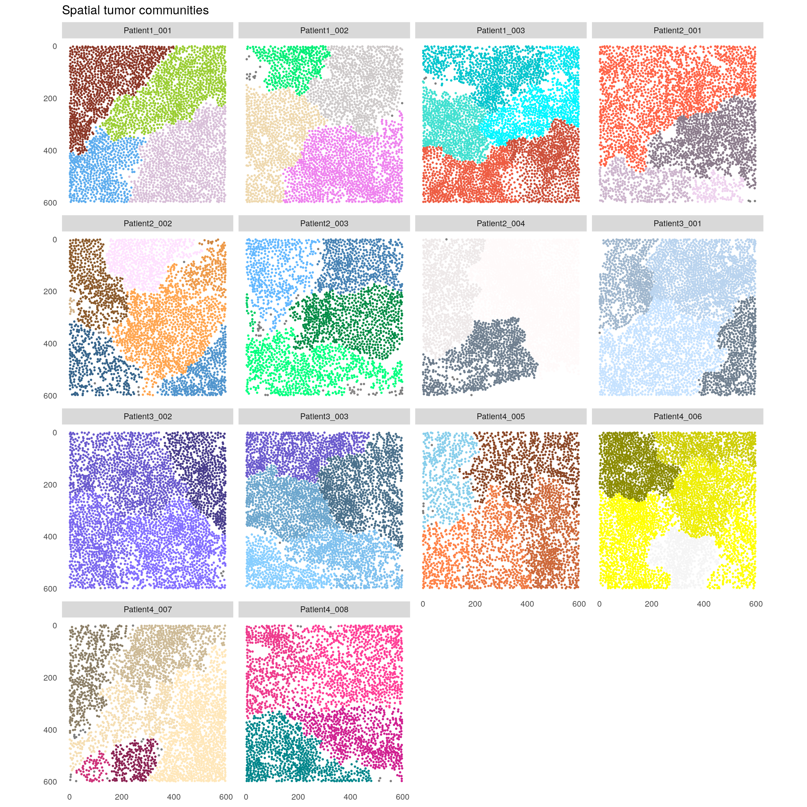

The example shown above might not be of interest if different tissue structures
exist within which spatial communities should be computed. In the following
example, we perform spatial community detection separately for tumor and stromal
cells.

The general procedure is as follows:    

1. create a `colData(spe)` entry that specifies if a cell is part of the tumor
or stroma compartment. 

2. use the `detectCommunity` function of the `imcRtools`
package to cluster cells within the tumor or stroma compartment solely based on
their spatial interaction graph as constructed by the `steinbock` package.  

Both tumor and stromal spatial communities are stored in the `colData` of
the `SpatialExperiment` object under the `spatial_community` identifier.

**Of note:** Here, and in contrast to the function call above, we set the seed 
argument within the `SerialParam` function for reproducibility
purposes. We need this here due to the way the `detectCommunity` function 
is implemented when setting the `group_by` parameter.


```r
spe$tumor_stroma <- ifelse(spe$celltype == "Tumor", "Tumor", "Stroma")

library(BiocParallel)
spe <- detectCommunity(spe, 
                       colPairName = "neighborhood", 
                       size_threshold = 10,
                       group_by = "tumor_stroma",
                       BPPARAM = SerialParam(RNGseed = 220819))
```

We can now separately visualize the tumor and stromal communities.


```r
plotSpatial(spe[,spe$celltype == "Tumor"], 
            node_color_by = "spatial_community", 
            img_id = "sample_id", 
            node_size_fix = 0.5) +
    theme(legend.position = "none") +
    ggtitle("Spatial tumor communities") +
    scale_color_manual(values = rev(colors()))
```


```r
plotSpatial(spe[,spe$celltype != "Tumor"], 
            node_color_by = "spatial_community", 
            img_id = "sample_id", 
            node_size_fix = 0.5) +
    theme(legend.position = "none") +
    ggtitle("Spatial non-tumor communities") +
    scale_color_manual(values = rev(colors()))
```

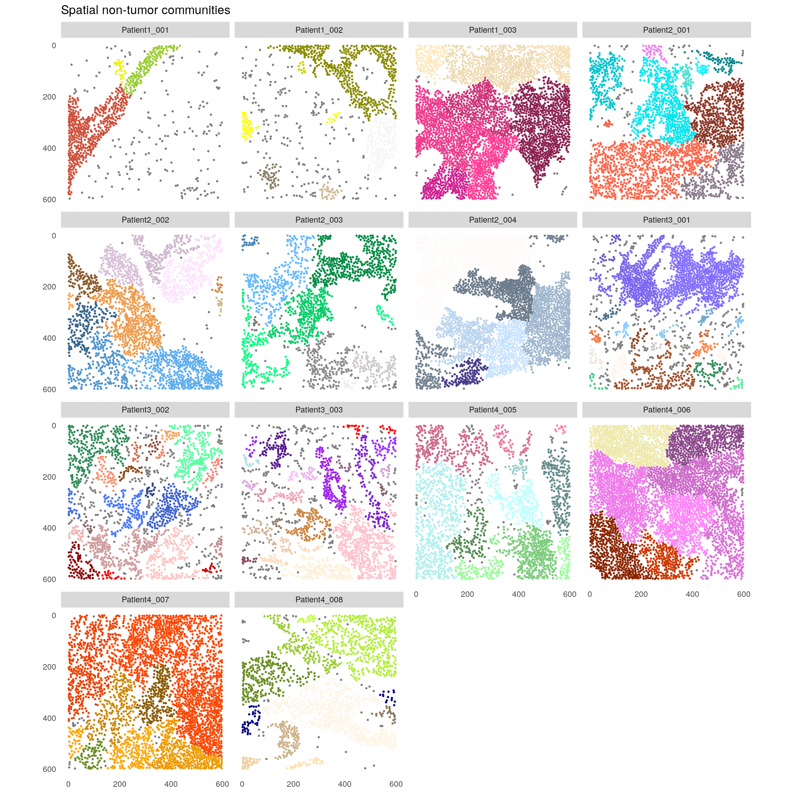

The example data was acquired using a panel that mainly focuses on immune cells.
We are therefore unable to detect many tumor sub-phenotypes and will 
focus on the stromal communities.

In the next step, the fraction of cell types within each
spatial stromal community is displayed.


```r
library(pheatmap)
library(viridis)

cur_spe <- spe[,spe$celltype != "Tumor"]

for_plot <- prop.table(table(cur_spe$spatial_community, 
                             cur_spe$celltype), 
                       margin = 1)

pheatmap(for_plot, 
         color = colorRampPalette(c("dark blue", "white", "dark red"))(100), 
         show_rownames = FALSE, 
         scale = "column")
```

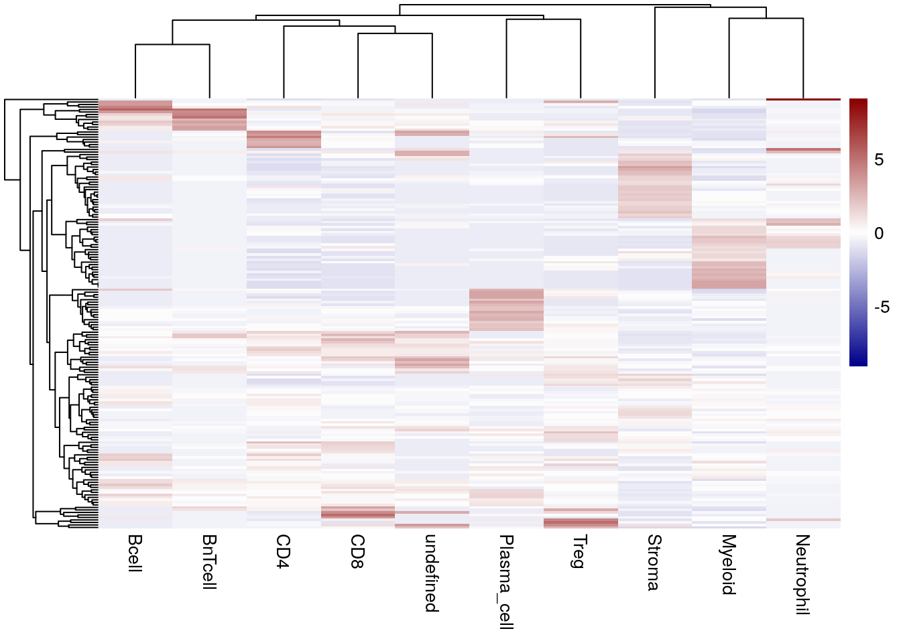

We observe that many spatial stromal communities are made up of myeloid cells or
"stromal" (non-immune) cells. Other communities are mainly made up of B cells
and BnT cells indicating tertiary lymphoid structures (TLS). While plasma cells,
CD4$^+$ or CD8$^+$ T cells tend to aggregate, only in few spatial stromal
communities consists of mainly neutrophils.

## Cellular neighborhood analysis

The following section highlights the use of the `imcRtools` package to
detect cellular neighborhoods. This approach has been proposed by
[@Goltsev2018] and [@Schurch2020] to group cells based on information
contained in their direct neighborhood.

[@Goltsev2018] perfomed Delaunay triangulation-based graph construction,
neighborhood aggregation and then clustered cells. [@Schurch2020] on the
other hand constructed a 10-nearest neighbor graph before aggregating
information across neighboring cells.

In the following code chunk we will use the 20-nearest neighbor graph as
constructed above to define the direct cellular neighborhood. The
[aggregateNeighbors](https://bodenmillergroup.github.io/imcRtools/reference/aggregateNeighbors.html)
function allows neighborhood aggregation in 2 different ways:

1.  For each cell the function computes the fraction of cells of a
    certain type (e.g., cell type) among its neighbors.
2.  For each cell it aggregates (e.g., mean) the expression counts
    across all neighboring cells.

Based on these measures, cells can now be clustered into cellular
neighborhoods. We will first compute the fraction of the different cell
types among the 20-nearest neighbors and use kmeans clustering to group
cells into 6 cellular neighborhoods.

**Of note:** constructing a 20-nearest neighbor graph and clustering
using kmeans with `k=6` is only an example. Similar to the analysis done
in Section \@ref(snn-graph), it is recommended to perform a parameter
sweep across different graph construction algorithms and different
parmaters `k` for kmeans clustering. Finding the best CN detection
settings is also subject to the question at hand. Constructing graphs
with more neighbors usually results in larger CNs.


```r
# By celltypes
spe <- aggregateNeighbors(spe, 
                          colPairName = "knn_interaction_graph", 
                          aggregate_by = "metadata", 
                          count_by = "celltype")

set.seed(220705)

cn_1 <- kmeans(spe$aggregatedNeighbors, centers = 6)
spe$cn_celltypes <- as.factor(cn_1$cluster)

plotSpatial(spe, 
            node_color_by = "cn_celltypes", 
            img_id = "sample_id", 
            node_size_fix = 0.5) +
    scale_color_brewer(palette = "Set3")
```


There are now different visualizations to examine the cell type composition 
of the detected cellular neighborhoods (CN). First we can look at the total 
number of cells per cell type and CN.


```r
for_plot <- table(as.character(spe$cn_celltypes), spe$celltype)

pheatmap(for_plot, 
         color = viridis(100), display_numbers = TRUE, 
         number_color = "white", number_format = "%.0f")
```

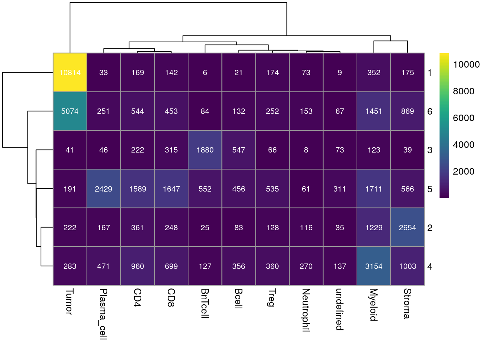

Next, we can observe per cell type the fraction of CN that they are distributed
across.


```r
for_plot <- prop.table(table(as.character(spe$cn_celltypes), spe$celltype), margin = 2)

pheatmap(for_plot, 
         color = viridis(100), display_numbers = TRUE, 
         number_color = "white", number_format = "%.2f")
```

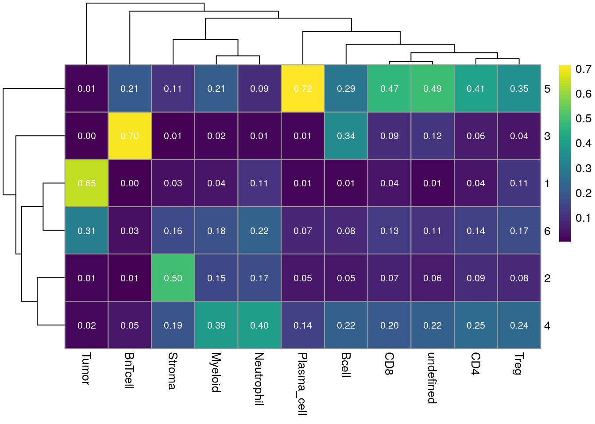

Similarly, we can visualize the fraction of each CN made up of each cell type.


```r
for_plot <- prop.table(table(as.character(spe$cn_celltypes), spe$celltype), margin = 1)

pheatmap(for_plot, 
         color = viridis(100), display_numbers = TRUE, 
         number_color = "white", number_format = "%.2f")
```

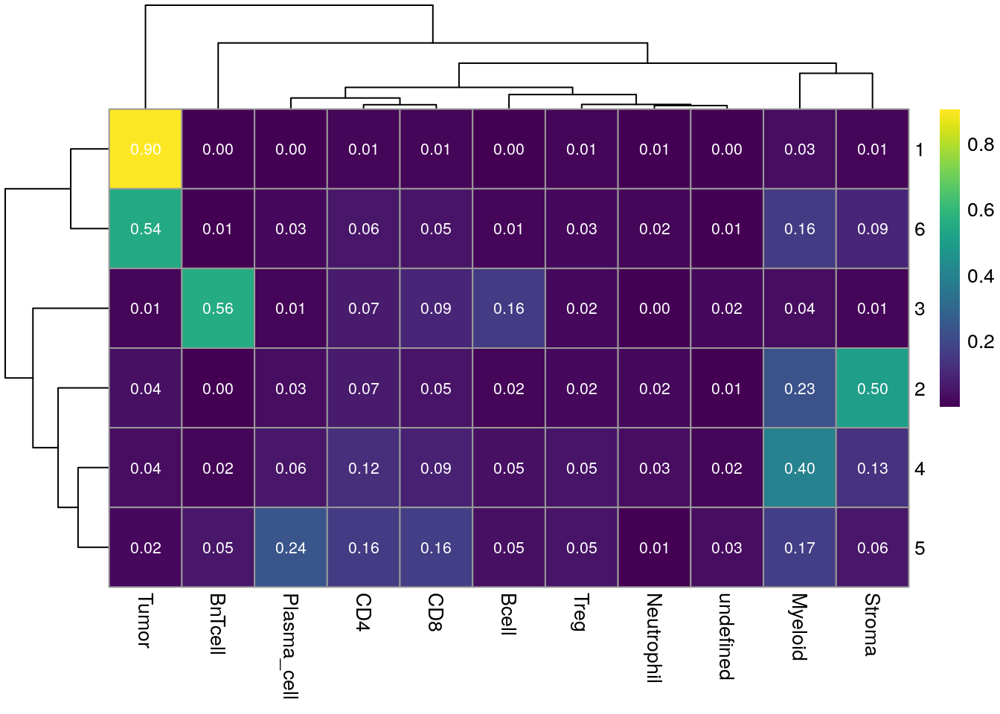

This visualization can also be scaled by column to account for the relative 
cell type abundance.


```r
pheatmap(for_plot, 
         color = colorRampPalette(c("dark blue", "white", "dark red"))(100), 
         scale = "column")
```

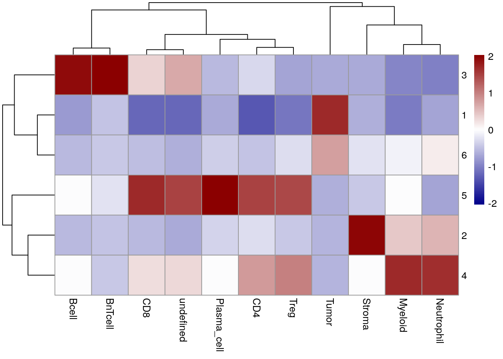

Lastly, we can visualize the enrichment of cell types within cellular neighborhoods
using the `regionMap` function of the `lisaClust` package.


```r
library(lisaClust)
regionMap(spe, 
          cellType = "celltype",
          region = "cn_celltypes")
```


It is also recommended to visualize some images to confirm the interpretation of
cellular neighborhoods. For this we can either use the `lisClust::hatchingPlot` or
the `imcRtools::plotSpatial` functions:


```r
# hatchingPlot
cur_spe <- spe[,spe$sample_id == "Patient1_003"]
cur_sce <- as(cur_spe, "SingleCellExperiment")
cur_sce$x <- spatialCoords(cur_spe)[,1]
cur_sce$y <- spatialCoords(cur_spe)[,2]
cur_sce$region <- as.character(cur_sce$cn_celltypes)

hatchingPlot(cur_sce, region = "region", cellType = "celltype") +
    scale_color_manual(values = metadata(spe)$color_vectors$celltype)
```

```
## There is no cellID. I'll create these
```

```
## There is no image specific imageCellID. I'll create these
```

```
## There is no imageID. I'll assume this is only one image and create an arbitrary imageID
```

```
## Creating variable region
```

```
## Concave windows are temperamental. Try choosing values of window.length > and < 1 if you have problems.
```


```r
# plotSpatial
plotSpatial(spe[,spe$sample_id == "Patient1_003"],
            img_id = "cn_celltypes", node_color_by = "celltype", node_size_fix = 0.7) +
    scale_color_manual(values = metadata(spe)$color_vectors$celltype)
```

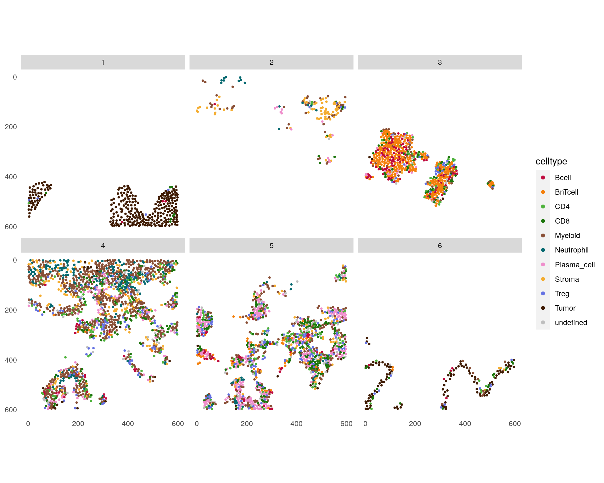

CN 1 and CN 6 are mainly enriched for tumor cells with CN 6 forming the
tumor/stroma border. CN 3 is mainly enriched for B and BnT cells
indicating TLS. CN 5 is composed of aggregated plasma cells and most T
cells.

We will now detect cellular neighborhoods by computing the mean
expression across the 20-nearest neighbor prior to kmeans clustering
(k=6).


```r
# By expression
spe <- aggregateNeighbors(spe, 
                          colPairName = "knn_interaction_graph", 
                          aggregate_by = "expression", 
                          assay_type = "exprs",
                          subset_row = rowData(spe)$use_channel)

set.seed(220705)

cn_2 <- kmeans(spe$mean_aggregatedExpression, centers = 6)
spe$cn_expression <- as.factor(cn_2$cluster)

plotSpatial(spe, 
            node_color_by = "cn_expression", 
            img_id = "sample_id", 
            node_size_fix = 0.5) +
    scale_color_brewer(palette = "Set3")
```

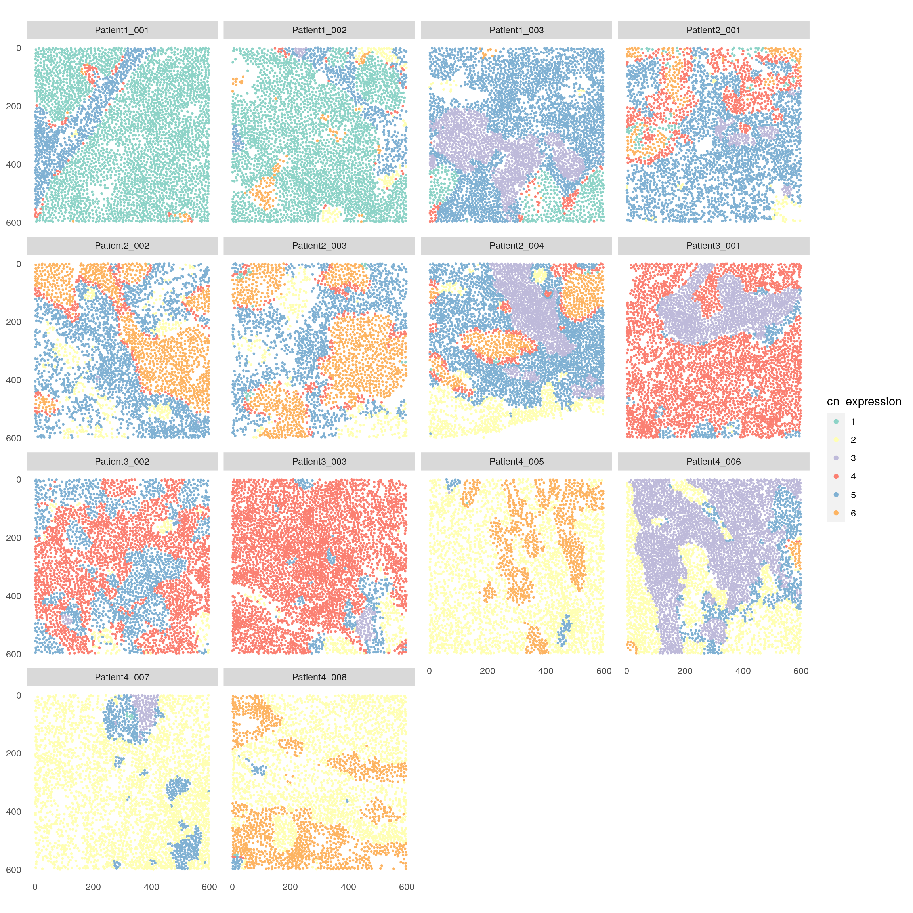

Also here, we can visualize the cell type composition of each cellular
neighborhood.


```r
for_plot <- prop.table(table(spe$cn_expression, spe$celltype), 
                  margin = 1)

pheatmap(for_plot, 
         color = colorRampPalette(c("dark blue", "white", "dark red"))(100), 
         scale = "column")
```


When clustering cells based on the mean expression within the direct
neighborhood, tumor cells are split across CN 6, CN 1 and CN 4 without
forming a clear tumor/stroma interface. This result reflects
patient-to-patient differences in the expression of tumor markers.

CN 3 again contains B cells and BnT cells but also CD8 and undefined
cells, therefore it is less representative of TLS compared to CN 3 in
previous CN approach. CN detection based on mean marker expression is
therefore sensitive to staining/expression differences between samples
as well as lateral spillover due to imperfect segmentation.

An alternative to the `aggregateNeighbors` function is provided by the
[lisaClust](https://bioconductor.org/packages/release/bioc/html/lisaClust.html)
Bioconductor package [@Patrick2023]. In contrast to `imcRtools`, the
`lisaClust` package computes local indicators of spatial associations
(LISA) functions and clusters cells based on those. More precise, the
package summarizes L-functions from a Poisson point process model to
derive numeric vectors for each cell which can then again be clustered
using kmeans. All steps are supported by the `lisaClust` function which
can be applied to a `SingleCellExperiment` and `SpatialExperiment` object.

In the following example, we calculate the LISA curves within a 10µm, 20µm and
50µm neighborhood around each cell. Increasing these radii will lead to broader
and smoother spatial clusters. However, a number of parameter settings should be
tested to estimate the robustness of the results.


```r
set.seed(220705)
spe <- lisaClust(spe, 
                 k = 6,
                 Rs = c(10, 20, 50),
                 spatialCoords = c("Pos_X", "Pos_Y"),
                 cellType = "celltype",
                 imageID = "sample_id")

plotSpatial(spe, 
            node_color_by = "region", 
            img_id = "sample_id", 
            node_size_fix = 0.5) +
    scale_color_brewer(palette = "Set3")
```

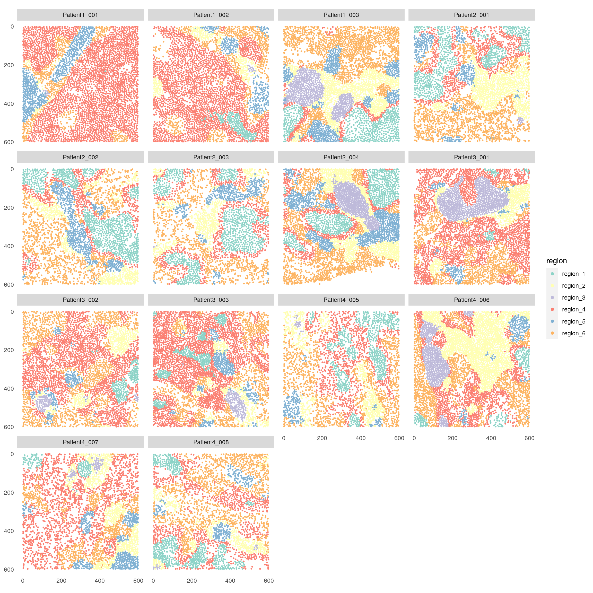

Similar to the example above, we can now observe the cell type
composition per spatial cluster.


```r
for_plot <- prop.table(table(spe$region, spe$celltype), 
                  margin = 1)

pheatmap(for_plot, 
         color = colorRampPalette(c("dark blue", "white", "dark red"))(100), 
         scale = "column")
```


In this case, CN 1 and 4 contain tumor cells but no CN is forming the
tumor/stroma interface. CN 3 represents TLS. CN 2 indicates T cell
subtypes and plasma cells are aggregated to CN 5.

## Spatial context analysis

Downstream of CN assignments, we will analyze the spatial context (SC)
of each cell using three functions from the `imcRtools` package.

While CNs can represent sites of unique local processes, the term SC was
coined by Bhate and colleagues [@Bhate2022] and describes tissue regions
in which distinct CNs may be interacting. Hence, SCs may be interesting
regions of specialized biological events.

Here, we will first detect SCs using the `detectSpatialContext` function. This
function relies on CN fractions for each cell in a spatial interaction
graph (originally a KNN graph), which we will calculate using
`buildSpatialGraph` and `aggregateNeighbors`. We will focus on the CNs
derived from cell type fractions but other CN assignments are possible.

**Of note**, the window size (k for KNN) for `buildSpatialGraph` should
reflect a length scale on which biological signals can be exchanged and
depends, among others, on cell density and tissue area. In view of their
divergent functionality, we recommend to use a larger window size for SC
(interaction between local processes) than for CN (local processes)
detection. Since we used a 20-nearest neighbor graph for CN assignment,
we will use a 40-nearest neighbor graph for SC detection. As before,
different parameters should be tested.

Subsequently, the CN fractions are sorted from high-to-low and the SC of
each cell is assigned as the minimal combination of SCs that additively
surpass a user-defined threshold. The default threshold of 0.9 aims to
represent the dominant CNs, hence the most prevalent signals, in a given
window.

For more details and biological validation, please refer to
[@Bhate2022].


```r
library(circlize)
library(RColorBrewer)

# Construct a 40-nearest neighbor graph
spe <- buildSpatialGraph(spe, 
                         img_id = "sample_id", 
                         type = "knn", 
                         name = "knn_spatialcontext_graph", 
                         k = 40)

# Compute the fraction of cellular neighborhoods around each cell
spe <- aggregateNeighbors(spe, 
                          colPairName = "knn_spatialcontext_graph",
                          aggregate_by = "metadata",
                          count_by = "cn_celltypes",
                          name = "aggregatedNeighborhood")

# Detect spatial contexts
spe <- detectSpatialContext(spe, 
                            entry = "aggregatedNeighborhood",
                            threshold = 0.90,
                            name = "spatial_context")

# Define SC color scheme
n_SCs <- length(unique(spe$spatial_context))
col_SC <- setNames(colorRampPalette(brewer.pal(9, "Paired"))(n_SCs), 
                   sort(unique(spe$spatial_context)))

# Visualize spatial contexts on images
plotSpatial(spe, 
            node_color_by = "spatial_context", 
            img_id = "sample_id", 
            node_size_fix = 0.5) +
    scale_color_manual(values = col_SC)
```


We detect a total of 52 distinct
SCs across this dataset.

For ease of interpretation, we will directly compare the CN and SC
assignments for `Patient3_001`.


```r
library(patchwork)

# Compare CN and SC for one patient 
p1 <- plotSpatial(spe[,spe$sample_id == "Patient3_001"], 
            node_color_by = "cn_celltypes", 
            img_id = "sample_id", 
            node_size_fix = 0.5) +
    scale_color_brewer(palette = "Set3")

p2 <- plotSpatial(spe[,spe$sample_id == "Patient3_001"], 
            node_color_by = "spatial_context", 
            img_id = "sample_id", 
            node_size_fix = 0.5) +
    scale_color_manual(values = col_SC, limits = force)

p1 + p2
```


As expected, we can observe that interfaces between different CNs make
up distinct SCs. For instance, interface between CN 3 (TLS region
consisting of B and BnT cells) and CN 5 (Plasma- and T-cell dominated)
turns to SC 3_5. On the other hand, the core of CN 3 becomes SC 3, since
the most abundant CN of the neighborhood for these cells is just the CN
itself.

Next, we filter the SCs based on user-defined thresholds for number of
group entries (here at least 3 patients) and/or total number of cells
(here minimum of 100 cells) per SC using the `filterSpatialContext` function.


```r
## Filter spatial contexts
# By number of group entries
spe <- filterSpatialContext(spe, 
                            entry = "spatial_context",
                            group_by = "patient_id", 
                            group_threshold = 3,
                            name = "spatial_context_filtered")

plotSpatial(spe, 
            node_color_by = "spatial_context_filtered", 
            img_id = "sample_id", 
            node_size_fix = 0.5) +
    scale_color_manual(values = col_SC, limits = force)
```


```r
# Filter out small and infrequent spatial contexts
spe <- filterSpatialContext(spe, 
                            entry = "spatial_context",
                            group_by = "patient_id", 
                            group_threshold = 3,
                            cells_threshold = 100,
                            name = "spatial_context_filtered")

plotSpatial(spe, 
            node_color_by = "spatial_context_filtered", 
            img_id = "sample_id", 
            node_size_fix = 0.5) +
    scale_color_manual(values = col_SC, limits = force)
```


Lastly, we can use the `plotSpatialContext` function to generate *SC
graphs*, analogous to *CN combination maps* in [@Bhate2022]. Returned
objects are `ggplots`, which can be easily modified further. We will
create a SC graph for the filtered SCs here.


```r
## Plot spatial context graph 

# Colored by name, size by n_cells
plotSpatialContext(spe, 
                   entry = "spatial_context_filtered",
                   group_by = "sample_id",
                   node_color_by = "name",
                   node_size_by = "n_cells",
                   node_label_color_by = "name")
```

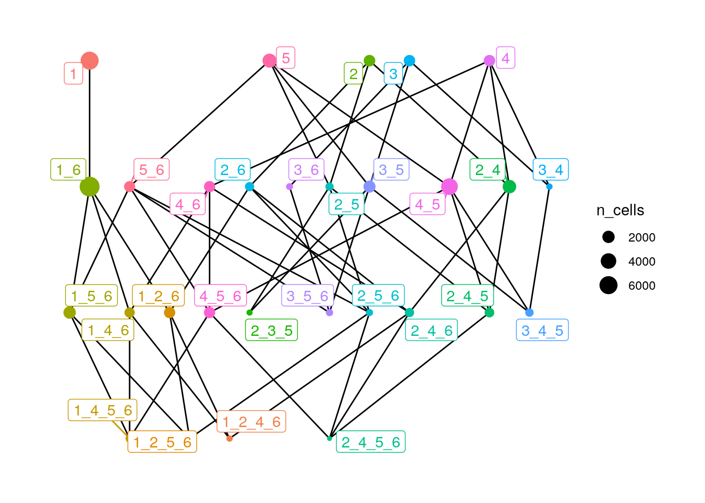

```r
# Colored by n_cells, size by n_group                   
plotSpatialContext(spe, 
                   entry = "spatial_context_filtered",
                   group_by = "sample_id",
                   node_color_by = "n_cells",
                   node_size_by = "n_group",
                   node_label_color_by = "n_cells") +
  scale_color_viridis()
```


SC 1 (Tumor-dominated), SC 1_6 (Tumor and Tumor-Stroma interface) and SC
4_5 (Plasma/T cell and Myeloid/Neutrophil interface) are the most
frequent SCs in this dataset. Moreover, we may compare the degree of the
different nodes in the SC graph. For example, we can observe that SC 1
has only one degree (directed to SC 1_6), while SC 5 (T cells and plasma cells) has
a much higher degree (n = 4) and potentially more CN interactions.

## Patch detection

The previous section focused on detecting cellular neighborhoods in a rather
unsupervised fashion. However, the `imcRtools` package also provides methods for
detecting spatial compartments in a supervised fashion. The
[patchDetection](https://bodenmillergroup.github.io/imcRtools/reference/patchDetection.html)
function allows the detection of connected sets of similar cells as proposed by
[@Hoch2022]. In the following example, we will use the `patchDetection` function
to detect tumor patches in three steps:

1. Find connected sets of tumor cells (using the `steinbock` graph).  
2. Components which contain less than 10 cells are excluded.  
3. Expand the components by 1µm to construct a concave hull around the patch and
include cells within the patch.


```r
spe <- patchDetection(spe, 
                      patch_cells = spe$celltype == "Tumor",
                      img_id = "sample_id",
                      expand_by = 1,
                      min_patch_size = 10,
                      colPairName = "neighborhood",
                      BPPARAM = MulticoreParam())
```

```
## The returned object is ordered by the 'sample_id' entry.
```

```r
plotSpatial(spe, 
            node_color_by = "patch_id", 
            img_id = "sample_id", 
            node_size_fix = 0.5) +
    theme(legend.position = "none") +
    scale_color_manual(values = rev(colors()))
```


We can now calculate the fraction of T cells within each tumor patch to roughly
estimate T cell infiltration.


```r
library(tidyverse)
colData(spe) %>% as_tibble() %>%
    group_by(patch_id, sample_id) %>%
    summarize(Tcell_count = sum(celltype == "CD8" | celltype == "CD4"),
              patch_size = n(),
              Tcell_freq = Tcell_count / patch_size) %>%
    filter(!is.na(patch_id)) %>%
    ggplot() +
        geom_point(aes(log10(patch_size), Tcell_freq, color = sample_id)) +
    theme_classic()
```

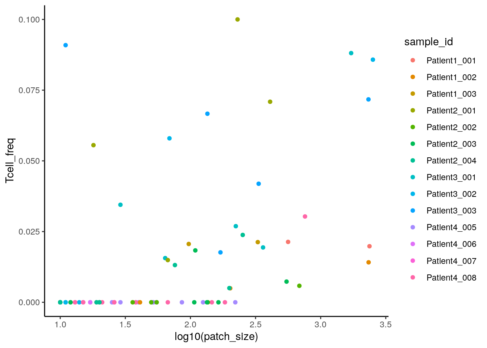

We can now measure the size of each patch using the
[patchSize](https://bodenmillergroup.github.io/imcRtools/reference/patchSize.html)
function and visualize tumor patch distribution per patient.


```r
patch_size <- patchSize(spe, "patch_id")

patch_size <- merge(patch_size, 
                    colData(spe)[match(patch_size$patch_id, spe$patch_id),], 
                    by = "patch_id")

ggplot(as.data.frame(patch_size)) + 
    geom_boxplot(aes(patient_id, log10(size))) +
    geom_point(aes(patient_id, log10(size)))
```

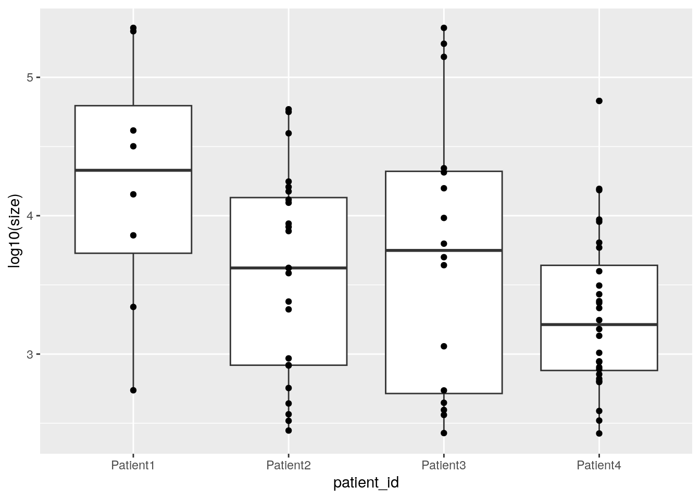

The
[minDistToCells](https://bodenmillergroup.github.io/imcRtools/reference/minDistToCells.html)
function can be used to calculate the minimum distance between each cell and a
cell set of interest. Here, we highlight its use to calculate the minimum
distance of all cells to the detected tumor patches. Negative values indicate
the minimum distance of each tumor patch cell to a non-tumor patch cell.


```r
spe <- minDistToCells(spe, 
                      x_cells = !is.na(spe$patch_id), 
                      img_id = "sample_id")
```

```
## The returned object is ordered by the 'sample_id' entry.
```

```r
plotSpatial(spe, 
            node_color_by = "distToCells", 
            img_id = "sample_id", 
            node_size_fix = 0.5) +
    scale_color_gradient2(low = "dark blue", mid = "white", high = "dark red")
```


Finally, we can  observe the minimum distances to tumor patches in a cell type
specific manner.


```r
library(ggridges)

ggplot(as.data.frame(colData(spe))) + 
    geom_density_ridges(aes(distToCells, celltype, fill = celltype)) +
    geom_vline(xintercept = 0, color = "dark red", linewidth = 2) +
    scale_fill_manual(values = metadata(spe)$color_vectors$celltype)
```


## Interaction analysis

**Bug notice: we discovered and fixed a bug in the `testInteractions` function in version below 1.5.5 which affected `SingleCellExperiment` or `SpatialExperiment` objects in which cells were not grouped by image. Please make sure you have the newest version (>= 1.6.0) installed.**  

The next section focuses on statistically testing the pairwise interaction
between all cell types of the dataset. For this, the `imcRtools` package
provides the 
[testInteractions](https://bodenmillergroup.github.io/imcRtools/reference/testInteractions.html) 
function which implements the interaction testing strategy proposed by
[@Shapiro2017]. 

Per grouping level (e.g., image), the `testInteractions` function computes the 
averaged cell type/cell type interaction count and compares this count against
an empirical null distribution which is generated by permuting all cell labels (while maintaining the tissue structure).

In the following example, we use the `steinbock` generated spatial interaction
graph and estimate the interaction or avoidance between cell types in the
dataset.


```r
library(scales)
out <- testInteractions(spe, 
                        group_by = "sample_id",
                        label = "celltype", 
                        colPairName = "neighborhood",
                        BPPARAM = SerialParam(RNGseed = 221029))

head(out)
```

```
## DataFrame with 6 rows and 10 columns
##       group_by  from_label    to_label        ct      p_gt      p_lt
##    <character> <character> <character> <numeric> <numeric> <numeric>
## 1 Patient1_001       Bcell       Bcell         0  1.000000  1.000000
## 2 Patient1_001       Bcell     BnTcell         0  1.000000  0.998002
## 3 Patient1_001       Bcell         CD4         3  0.001998  1.000000
## 4 Patient1_001       Bcell         CD8         0  1.000000  0.898102
## 5 Patient1_001       Bcell     Myeloid         0  1.000000  0.804196
## 6 Patient1_001       Bcell  Neutrophil        NA        NA        NA
##   interaction         p       sig    sigval
##     <logical> <numeric> <logical> <numeric>
## 1       FALSE  1.000000     FALSE         0
## 2       FALSE  0.998002     FALSE         0
## 3        TRUE  0.001998      TRUE         1
## 4       FALSE  0.898102     FALSE         0
## 5       FALSE  0.804196     FALSE         0
## 6          NA        NA        NA        NA
```

The returned `DataFrame` contains the test results per grouping level (in this case
the image ID, `group_by`), "from" cell type (`from_label`) and "to" cell type
(`to_label`). The `sigval` entry indicates if a pair of cell types is
significantly interacting (`sigval = 1`), if a pair of cell types is
significantly avoiding (`sigval = -1`) or if no significant interaction or
avoidance was detected (`sigval = 0`).

These results can be visualized by computing the sum of the `sigval` entries
across all images:


```r
out %>% as_tibble() %>%
    group_by(from_label, to_label) %>%
    summarize(sum_sigval = sum(sigval, na.rm = TRUE)) %>%
    ggplot() +
        geom_tile(aes(from_label, to_label, fill = sum_sigval)) +
        scale_fill_gradient2(low = muted("blue"), mid = "white", high = muted("red")) +
        theme(axis.text.x = element_text(angle = 45, hjust = 1))
```


In the plot above the red tiles indicate cell type pairs that were detected to 
significantly interact on a large number of images. On the other hand, blue
tiles show cell type pairs which tend to avoid each other on a large number 
of images. 

Here we can observe that tumor cells are mostly compartmentalized and are in
avoidance with other cell types. As expected, B cells interact with BnT cells; 
regulatory T cells interact with CD4+ T cells and CD8+ T cells. Most cell types
show self interactions indicating spatial clustering. 

The `imcRtools` package further implements an interaction testing strategy
proposed by [@Schulz2018] where the hypothesis is tested if at least n cells of
a certain type are located around a target cell type (`from_cell`). This type of
testing can be performed by selecting `method = "patch"` and specifying the
number of patch cells via the `patch_size` parameter.


```r
out <- testInteractions(spe, 
                        group_by = "sample_id",
                        label = "celltype", 
                        colPairName = "neighborhood",
                        method = "patch", 
                        patch_size = 3,
                        BPPARAM = SerialParam(RNGseed = 221029))

out %>% as_tibble() %>%
    group_by(from_label, to_label) %>%
    summarize(sum_sigval = sum(sigval, na.rm = TRUE)) %>%
    ggplot() +
        geom_tile(aes(from_label, to_label, fill = sum_sigval)) +
        scale_fill_gradient2(low = muted("blue"), mid = "white", high = muted("red")) +
        theme(axis.text.x = element_text(angle = 45, hjust = 1))
```


These results are comparable to the interaction testing presented above. The
main difference comes from the lack of symmetry. We can now for example see that
3 or more myeloid cells sit around CD4$^+$ T cells while this interaction is not
as strong when considering CD4$^+$ T cells sitting around myeloid cells.

Finally, we save the updated `SpatialExperiment` object.


```r
saveRDS(spe, "data/spe.rds")
```


## Session Info

<details>
   <summary>SessionInfo</summary>
   

```
## R version 4.3.2 (2023-10-31)
## Platform: x86_64-pc-linux-gnu (64-bit)
## Running under: Ubuntu 22.04.3 LTS
## 
## Matrix products: default
## BLAS:   /usr/lib/x86_64-linux-gnu/openblas-pthread/libblas.so.3 
## LAPACK: /usr/lib/x86_64-linux-gnu/openblas-pthread/libopenblasp-r0.3.20.so;  LAPACK version 3.10.0
## 
## locale:
##  [1] LC_CTYPE=en_US.UTF-8       LC_NUMERIC=C              
##  [3] LC_TIME=en_US.UTF-8        LC_COLLATE=en_US.UTF-8    
##  [5] LC_MONETARY=en_US.UTF-8    LC_MESSAGES=en_US.UTF-8   
##  [7] LC_PAPER=en_US.UTF-8       LC_NAME=C                 
##  [9] LC_ADDRESS=C               LC_TELEPHONE=C            
## [11] LC_MEASUREMENT=en_US.UTF-8 LC_IDENTIFICATION=C       
## 
## time zone: Etc/UTC
## tzcode source: system (glibc)
## 
## attached base packages:
## [1] stats4    stats     graphics  grDevices utils     datasets  methods  
## [8] base     
## 
## other attached packages:
##  [1] testthat_3.2.1              scales_1.3.0               
##  [3] ggridges_0.5.5              lubridate_1.9.3            
##  [5] forcats_1.0.0               stringr_1.5.1              
##  [7] dplyr_1.1.4                 purrr_1.0.2                
##  [9] readr_2.1.4                 tidyr_1.3.0                
## [11] tibble_3.2.1                tidyverse_2.0.0            
## [13] patchwork_1.1.3             RColorBrewer_1.1-3         
## [15] circlize_0.4.15             lisaClust_1.10.1           
## [17] pheatmap_1.0.12             BiocParallel_1.36.0        
## [19] viridis_0.6.4               viridisLite_0.4.2          
## [21] ggplot2_3.4.4               imcRtools_1.8.0            
## [23] SpatialExperiment_1.12.0    SingleCellExperiment_1.24.0
## [25] SummarizedExperiment_1.32.0 Biobase_2.62.0             
## [27] GenomicRanges_1.54.1        GenomeInfoDb_1.38.5        
## [29] IRanges_2.36.0              S4Vectors_0.40.2           
## [31] BiocGenerics_0.48.1         MatrixGenerics_1.14.0      
## [33] matrixStats_1.2.0          
## 
## loaded via a namespace (and not attached):
##   [1] spatstat.sparse_3.0-3       bitops_1.0-7               
##   [3] sf_1.0-15                   EBImage_4.44.0             
##   [5] doParallel_1.0.17           numDeriv_2016.8-1.1        
##   [7] tools_4.3.2                 backports_1.4.1            
##   [9] utf8_1.2.4                  R6_2.5.1                   
##  [11] DT_0.31                     HDF5Array_1.30.0           
##  [13] mgcv_1.9-0                  rhdf5filters_1.14.1        
##  [15] GetoptLong_1.0.5            withr_2.5.2                
##  [17] sp_2.1-2                    gridExtra_2.3              
##  [19] ClassifyR_3.6.2             cli_3.6.2                  
##  [21] spatstat.explore_3.2-5      sandwich_3.1-0             
##  [23] labeling_0.4.3              sass_0.4.8                 
##  [25] nnls_1.5                    mvtnorm_1.2-4              
##  [27] spatstat.data_3.0-3         proxy_0.4-27               
##  [29] systemfonts_1.0.5           colorRamps_2.3.1           
##  [31] svglite_2.1.3               scater_1.30.1              
##  [33] plotrix_3.8-4               flowCore_2.14.0            
##  [35] generics_0.1.3              shape_1.4.6                
##  [37] spatstat.random_3.2-2       gtools_3.9.5               
##  [39] vroom_1.6.5                 car_3.1-2                  
##  [41] scam_1.2-14                 Matrix_1.6-4               
##  [43] RProtoBufLib_2.14.0         ggbeeswarm_0.7.2           
##  [45] fansi_1.0.6                 abind_1.4-5                
##  [47] terra_1.7-65                lifecycle_1.0.4            
##  [49] multcomp_1.4-25             yaml_2.3.8                 
##  [51] carData_3.0-5               rhdf5_2.46.1               
##  [53] SparseArray_1.2.3           Rtsne_0.17                 
##  [55] grid_4.3.2                  promises_1.2.1             
##  [57] crayon_1.5.2                shinydashboard_0.7.2       
##  [59] lattice_0.21-9              beachmat_2.18.0            
##  [61] cowplot_1.1.2               magick_2.8.2               
##  [63] cytomapper_1.14.0           pillar_1.9.0               
##  [65] knitr_1.45                  ComplexHeatmap_2.18.0      
##  [67] RTriangle_1.6-0.12          boot_1.3-28.1              
##  [69] rjson_0.2.21                codetools_0.2-19           
##  [71] glue_1.6.2                  V8_4.4.1                   
##  [73] data.table_1.14.10          MultiAssayExperiment_1.28.0
##  [75] vctrs_0.6.5                 png_0.1-8                  
##  [77] gtable_0.3.4                cachem_1.0.8               
##  [79] xfun_0.41                   S4Arrays_1.2.0             
##  [81] mime_0.12                   tidygraph_1.3.0            
##  [83] ConsensusClusterPlus_1.66.0 survival_3.5-7             
##  [85] iterators_1.0.14            cytolib_2.14.0             
##  [87] units_0.8-5                 ellipsis_0.3.2             
##  [89] TH.data_1.1-2               nlme_3.1-163               
##  [91] bit64_4.0.5                 rprojroot_2.0.4            
##  [93] bslib_0.6.1                 irlba_2.3.5.1              
##  [95] svgPanZoom_0.3.4            vipor_0.4.7                
##  [97] KernSmooth_2.23-22          colorspace_2.1-0           
##  [99] DBI_1.2.0                   raster_3.6-26              
## [101] tidyselect_1.2.0            curl_5.2.0                 
## [103] bit_4.0.5                   compiler_4.3.2             
## [105] BiocNeighbors_1.20.1        desc_1.4.3                 
## [107] DelayedArray_0.28.0         bookdown_0.37              
## [109] classInt_0.4-10             distances_0.1.10           
## [111] goftest_1.2-3               tiff_0.1-12                
## [113] digest_0.6.33               minqa_1.2.6                
## [115] fftwtools_0.9-11            spatstat.utils_3.0-4       
## [117] rmarkdown_2.25              XVector_0.42.0             
## [119] CATALYST_1.26.0             htmltools_0.5.7            
## [121] pkgconfig_2.0.3             jpeg_0.1-10                
## [123] lme4_1.1-35.1               sparseMatrixStats_1.14.0   
## [125] highr_0.10                  fastmap_1.1.1              
## [127] rlang_1.1.2                 GlobalOptions_0.1.2        
## [129] htmlwidgets_1.6.4           shiny_1.8.0                
## [131] DelayedMatrixStats_1.24.0   farver_2.1.1               
## [133] jquerylib_0.1.4             zoo_1.8-12                 
## [135] jsonlite_1.8.8              spicyR_1.14.2              
## [137] BiocSingular_1.18.0         RCurl_1.98-1.13            
## [139] magrittr_2.0.3              scuttle_1.12.0             
## [141] GenomeInfoDbData_1.2.11     Rhdf5lib_1.24.1            
## [143] munsell_0.5.0               Rcpp_1.0.11                
## [145] ggnewscale_0.4.9            stringi_1.8.3              
## [147] ggraph_2.1.0                brio_1.1.4                 
## [149] zlibbioc_1.48.0             MASS_7.3-60                
## [151] plyr_1.8.9                  parallel_4.3.2             
## [153] ggrepel_0.9.4               deldir_2.0-2               
## [155] graphlayouts_1.0.2          splines_4.3.2              
## [157] tensor_1.5                  hms_1.1.3                  
## [159] locfit_1.5-9.8              igraph_1.6.0               
## [161] ggpubr_0.6.0                spatstat.geom_3.2-7        
## [163] ggsignif_0.6.4              pkgload_1.3.3              
## [165] reshape2_1.4.4              ScaledMatrix_1.10.0        
## [167] XML_3.99-0.16               drc_3.0-1                  
## [169] evaluate_0.23               nloptr_2.0.3               
## [171] tzdb_0.4.0                  foreach_1.5.2              
## [173] tweenr_2.0.2                httpuv_1.6.13              
## [175] polyclip_1.10-6             clue_0.3-65                
## [177] ggforce_0.4.1               rsvd_1.0.5                 
## [179] broom_1.0.5                 xtable_1.8-4               
## [181] e1071_1.7-14                rstatix_0.7.2              
## [183] later_1.3.2                 class_7.3-22               
## [185] lmerTest_3.1-3              FlowSOM_2.10.0             
## [187] beeswarm_0.4.0              cluster_2.1.4              
## [189] timechange_0.2.0            concaveman_1.1.0
```
</details>


