-   <a href="#example-data" id="toc-example-data">Example data</a>
-   <a href="#multiplexed-tissue-image-processing"
    id="toc-multiplexed-tissue-image-processing">Multiplexed tissue image
    processing</a>
    -   <a href="#setting-the-steinbock-alias"
        id="toc-setting-the-steinbock-alias">Setting the steinbock alias</a>
    -   <a href="#data-pre-processing-technology-specific"
        id="toc-data-pre-processing-technology-specific">Data pre-processing
        (technology-specific)</a>
    -   <a href="#image-segmentation" id="toc-image-segmentation">Image
        segmentation</a>
    -   <a href="#single-cell-data-extraction"
        id="toc-single-cell-data-extraction">Single-cell data extraction</a>
-   <a href="#single-cell-and-spatial-data-analysis"
    id="toc-single-cell-and-spatial-data-analysis">Single-cell and spatial
    data analysis</a>
    -   <a href="#reading-in-data" id="toc-reading-in-data">Reading in data</a>
    -   <a href="#spillover-correction" id="toc-spillover-correction">Spillover
        correction</a>
    -   <a href="#quality-control" id="toc-quality-control">Quality control</a>
    -   <a href="#cell-phenotyping" id="toc-cell-phenotyping">Cell
        phenotyping</a>
        -   <a href="#a-cell-phenotyping-via-clustering."
            id="toc-a-cell-phenotyping-via-clustering.">(A) Cell phenotyping via
            clustering.</a>
        -   <a href="#b-classification-based-cell-phenotyping"
            id="toc-b-classification-based-cell-phenotyping">(B)
            Classification-based cell phenotyping</a>
        -   <a href="#cluster-and-cell-type-visualization"
            id="toc-cluster-and-cell-type-visualization">Cluster and cell type
            visualization</a>
    -   <a href="#spatial-analysis" id="toc-spatial-analysis">Spatial
        analysis</a>
    -   <a href="#session-information" id="toc-session-information">Session
        information</a>

# Example data

We provide a small imaging mass cytometry (IMC) dataset as an example to
demonstrate multi-channel image processing and spatially resolved
single-cell data analysis. The data was generated as part of the
**I**ntegrated i**MMU**noprofiling of large adaptive **CAN**cer patient
cohorts (IMMUcan) project using the Hyperion imaging system (Standard
BioTools, San Francisco, CA, USA). The data can be accessed at
<https://zenodo.org/record/7575859> and contains the following files:

-   **Patient1.zip, Patient2.zip, Patient3.zip, Patient4.zip:** Raw IMC
    data of four patient samples. Each ZIP archive contains a folder in
    which one MCD file (data and metadata of all acquisitions) and
    multiple TXT files (one file per acquisition, no metadata) can be
    found.
-   **compensation.zip:** This ZIP archive holds a folder which contains
    one MCD file and multiple TXT files. Multiple spots of a “spillover
    slide” were acquired, and each TXT file is named based on the
    spotted metal. This data is used for channel spillover correction.
-   **sample_metadata.csv:** This file links each patient to their
    cancer type (SCCHN - head and neck cancer; BCC - breast cancer;
    NSCLC - lung cancer; CRC - colorectal cancer).

We further provide a **panel.csv** file in steinbock format, which
contains metadata for each antibody/channel used in the experiment. In
this file, the `channel` column indicates the metal isotopes used to
label each antibody. The `name` column contains the protein targets of
each antibody. The `keep` column indicates which channels were extracted
from raw data and thus retained during downstream analysis. Importantly,
the order of rows for which the keep column is set to 1 matches the
order of channels in the extracted multi-channel images. Finally, the
`deepcell` column indicates which channels were used (i.e., aggregated)
during automatic image segmentation using DeepCell/Mesmer: nuclear
channels are set to 1, cytoplasmic channels are set to 2, and the column
is left empty for other/unused channels. The file can be accessed at
<https://zenodo.org/record/7624451>.

In addition, we provide `SpatialExperiment` objects that contain
previously gated cells. These cells form the ground truth cell phenotype
labels for classification-based phenotyping. The data can be accessed at
<https://zenodo.org/record/7647079>.

``` r
options(timeout = 10000)
dir.create("data/steinbock/raw", recursive = TRUE)
download.file("https://zenodo.org/record/7624451/files/panel.csv",
              "data/steinbock/panel.csv")
download.file("https://zenodo.org/record/7575859/files/Patient1.zip",
              "data/steinbock/raw/Patient1.zip")
download.file("https://zenodo.org/record/7575859/files/Patient2.zip",
              "data/steinbock/raw/Patient2.zip")
download.file("https://zenodo.org/record/7575859/files/Patient3.zip",
              "data/steinbock/raw/Patient3.zip")
download.file("https://zenodo.org/record/7575859/files/Patient4.zip",
              "data/steinbock/raw/Patient4.zip")
download.file("https://zenodo.org/record/7575859/files/compensation.zip",
              "data/compensation.zip")
unzip("data/compensation.zip", exdir="data", overwrite=TRUE)
unlink("data/compensation.zip")
download.file("https://zenodo.org/record/7575859/files/sample_metadata.csv", 
         destfile = "data/sample_metadata.csv")
download.file("https://zenodo.org/record/7647079/files/gated_cells.zip",
              "data/gated_cells.zip")
unzip("data/gated_cells.zip", exdir="data", overwrite=TRUE)
unlink("data/gated_cells.zip")
```

# Multiplexed tissue image processing

Multiplexed tissue image processing typically comprises individual steps
for image extraction and pre-processing, image segmentation, and
single-cell data extraction. Here we highlight the deep learning-based
segmentation approach using the
[steinbock](https://bodenmillergroup.github.io/steinbock/latest/)
framework.

The commands in this section have to be executed in the “Command Prompt”
on Windows or the “Terminal” on Linux/Mac OS.

## Setting the steinbock alias

Instructions to install the containerized steinbock toolkit can be found
in the steinbock [online
documentation](https://bodenmillergroup.github.io/steinbock). In
particular, to run the steinbock container, Docker needs to be installed
first (see online instructions). For this manuscript, we run steinbock
using the following alias:

``` bash
alias steinbock="docker run -v /path/to/IMCDataAnalysis/publiction/data/steinbock:/data -u $(id -u):$(id -g) ghcr.io/bodenmillergroup/steinbock:0.16.0"
```

A shell script for automatic execution of the commands can be seen at
[steinbock.sh](https://github.com/BodenmillerGroup/IMCDataAnalysis/blob/main/publication/steinbock.sh).

## Data pre-processing (technology-specific)

In this protocol, data pre-processing refers to the extraction of
multi-channel images from raw imaging data, and to preparing them for
downstream processing. The required steps are dependent on the imaging
technology; here, we showcase the pre-processing of raw IMC data which
includes a hot pixel filtering step.

``` bash
steinbock preprocess imc images --hpf 50
```

The step took `38` seconds.

## Image segmentation

Perform automatic deep learning-enabled single-cell segmentation using
the pre-trained Mesmer neural network implemented in DeepCell. In the
following command, channels will be min-max-normalized and
mean-aggregated according to the deepcell column in the panel file.

``` bash
steinbock segment deepcell --minmax
```

The step took `3` minutes.

## Single-cell data extraction

For each image, extract the mean pixel intensity per cell and marker.
The resulting cell-level intensity values are stored as separate CSV
files (one file per image):

``` bash
steinbock measure intensities
```

The step took `16` seconds.

For each image, extract standard morphological features (e.g., area,
eccentricity) per cell. The resulting cell-level features are stored as
separate CSV files (one file per image):

``` bash
steinbock measure regionprops
```

The step took `17` seconds.

In each image, detect cells in close spatial proximity. Shown here is
the construction of undirected spatial cell graphs by pixel expansion,
where cells are considered neighboring if and only if they are
“touching” after growing each cell by maximally 4 pixels in all
directions. The resulting spatial cell graphs are stored as separate
directed edge lists in CSV format (one file per image):

``` bash
steinbock measure neighbors --type expansion --dmax 4
```

The step took `48` seconds.

# Single-cell and spatial data analysis

The commands in this section must be executed in R and the RStudio
software can facilitate execution.

## Reading in data

Read in the spatially-resolved single-cell data into R using the
[imcRtools](https://github.com/BodenmillerGroup/imcRtools) package. For
the rest of the protocol we will continue with the steinbock generated
data.

``` r
library(imcRtools)
spe <- read_steinbock("data/steinbock/")
```

The step took 0.42 minutes.

After reading in the single-cell data, the `SpatialExperiment` object
needs to be further processed. First, the column names are set based on
the image name and the cell identifier. The patient identifier and the
region of interest (ROI) identifier are saved in the object as well as
the cancer type, which can be read in from the provided
`data/sample_metadata.csv` file. For easy access later on, the channels
containing biological variation are selected. Finally, the mean pixel
intensities per channel and cell are arsinh-transformed using a cofactor
of 1.

``` r
library(tidyverse)
colnames(spe) <- paste0(spe$sample_id, "_", spe$ObjectNumber)

# Read patient metadata
meta <- read_csv("data/sample_metadata.csv")

# Extract patient id and ROI id from sample name
spe$patient_id <- str_extract(spe$sample_id, "Patient[1-4]")
spe$ROI <- str_extract(spe$sample_id, "00[1-8]")

# Store cancer type in SPE object
spe$indication <- meta$Indication[match(spe$patient_id, meta$`Sample ID`)]

# Specify which channels to use for downstream analysis
rowData(spe)$use_channel <- !grepl("DNA|Histone", rownames(spe))

# Transform the counts
assay(spe, "exprs") <- asinh(counts(spe)/1)
```

The step took 0.02 minutes.

Read in multi-channel images as a `CytoImageList` container using the
[cytomapper](https://github.com/BodenmillerGroup/cytomapper) package.

``` r
library(cytomapper)
```

``` r
images <- loadImages("data/steinbock/img/")
```

    ## All files in the provided location will be read in.

``` r
channelNames(images) <- rownames(spe)
```

The step took 0.59 minutes.

Read in segmentation masks as a `CytoImageList` container.

``` r
masks <- loadImages("data/steinbock/masks/", as.is = TRUE)
```

    ## All files in the provided location will be read in.

The step took 0.01 minutes.

For downstream visualization and analysis tasks, additional metadata
needs to be added to the `CytoImageList` objects storing the
multi-channel images and segmentation masks. Here, individual images,
segmentation masks and entries in the `SpatialExperiment` object are
matched via the `sample_id` entry.

``` r
# Extract patient id from image name
patient_id <- str_extract(names(images), "Patient[1-4]")

# Retrieve cancer type per patient from metadata file
indication <- meta$Indication[match(patient_id, meta$`Sample ID`)] 

# Store patient and image level information in elementMetadata
mcols(images) <- mcols(masks) <- DataFrame(sample_id = names(images),
                                           patient_id = patient_id,
                                           indication = indication)
```

The step took 0 minutes.

## Spillover correction

Low signal spillover (also termed crosstalk) between two channels has
been observed for IMC, MIBI, and multiplexed immunofluorescence imaging
such as CyCIF. Spillover is defined as a small proportion of the signal
of a neighboring channel that can be detected in the primary channel. As
spillover is linear to the signal of the neighboring channel, it can be
corrected by following a previously described compensation approach. The
spillover correction presented here is characteristic to IMC, and the
steps of the following section can be skipped when working with data
generated by other multiplexed imaging technologies assuming an
alternative way of spillover minimization/correction was performed.

Read in data from the spillover slide for channel-to-channel spillover
correction. The experimental procedure to create and acquire a spillover
slide can be seen at
<https://bodenmillergroup.github.io/IMCDataAnalysis/spillover-correction.html>.
As recommended by the CATALYST R/Bioconductor package, the pixel
intensities are arsinh-transformed using a cofactor of 5.

``` r
sce <- readSCEfromTXT("data/compensation/")
```

    ## Spotted channels:  Y89, In113, In115, Pr141, Nd142, Nd143, Nd144, Nd145, Nd146, Sm147, Nd148, Sm149, Nd150, Eu151, Sm152, Eu153, Sm154, Gd155, Gd156, Gd158, Tb159, Gd160, Dy161, Dy162, Dy163, Dy164, Ho165, Er166, Er167, Er168, Tm169, Er170, Yb171, Yb172, Yb173, Yb174, Lu175, Yb176
    ## Acquired channels:  Ar80, Y89, In113, In115, Xe131, Xe134, Ba136, La138, Pr141, Nd142, Nd143, Nd144, Nd145, Nd146, Sm147, Nd148, Sm149, Nd150, Eu151, Sm152, Eu153, Sm154, Gd155, Gd156, Gd158, Tb159, Gd160, Dy161, Dy162, Dy163, Dy164, Ho165, Er166, Er167, Er168, Tm169, Er170, Yb171, Yb172, Yb173, Yb174, Lu175, Yb176, Ir191, Ir193, Pt196, Pb206
    ## Channels spotted but not acquired:  
    ## Channels acquired but not spotted:  Ar80, Xe131, Xe134, Ba136, La138, Ir191, Ir193, Pt196, Pb206

``` r
assay(sce, "exprs") <- asinh(counts(sce)/5)
```

The step took 0.05 minutes.

CRITICAL: The provided data of the spillover slide were specifically
acquired for this dataset and cannot be applied to other datasets. It is
essential to acquire a spillover slide for each set of antibodies used
and ideally for each experiment.

Perform quality assessment of the spillover data by visualizing the
median pixel intensity per channel and spotted metal.

``` r
plotSpotHeatmap(sce)
```

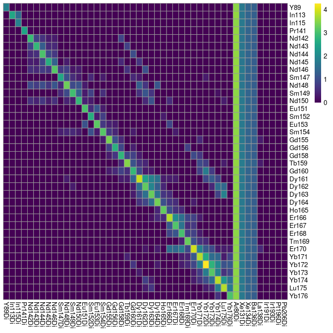

(optional) Perform pixel binning to increase median pixel intensity.
This is only needed if pixel intensities are too low (median below \~200
counts).

``` r
sce2 <- binAcrossPixels(sce, bin_size = 10)
```

The step took 0.21 minutes.

Filter incorrectly assigned pixels. The following step uses functions
provided by the CATALYST package to “de-barcode” the pixels. Based on
the intensity distribution of all channels, pixels are assigned to their
corresponding barcode; here, this is the already known metal spot. This
procedure identifies pixels that cannot be robustly assigned to the
spotted metal. Pixels of such kind can be regarded as “noisy”,
“background”, or “artifacts” that should be removed prior to spillover
estimation. The spotted channels (`bc_key`) need to be specified. The
general workflow for pixel de-barcoding is as follows:

-   assign a preliminary metal mass to each pixel  
-   for each pixel, estimate a cutoff parameter for the distance between
    positive and negative pixel sets  
-   apply the estimated cutoffs to identify truly positive pixels

``` r
library(CATALYST)

bc_key <- as.numeric(unique(sce$sample_mass))
bc_key <- bc_key[order(bc_key)]

sce <- assignPrelim(sce, bc_key = bc_key)
```

    ## Debarcoding data...

    ##  o ordering

    ##  o classifying events

    ## Normalizing...

    ## Computing deltas...

``` r
sce <- estCutoffs(sce)
sce <- applyCutoffs(sce)
```

The step took 0.14 minutes.

Observe the number of correctly and incorrectly assigned pixels per
spot. The heatmap depicts the number of pixels assigned to each spot on
the diagonal, incorrectly assigned pixels off diagonal, and pixels that
could not be assigned to a specific spot in the first row. For the
current dataset, all pixels were either assigned to the corresponding
spot or labeled as unassigned. In the following code chunk, we observe
that between 10% and 55% of pixels could not be assigned to their
corresponding spot which is to be expected as the spatial distribution
of spotted antibodies on the spillover slide can be heterogeneous. In
the `filterPixels` function the `minevents` parameter specifies the
threshold under which correctly assigned pixel sets are excluded from
spillover estimation. The `correct_pixels` parameter indicates if pixels
that were assigned to masses other than the spotted mass should be
excluded from spillover estimation. The default values often result in
sufficient pixel filtering; however, if very few pixels (\~100) are
measured per spot, the minevents parameter needs to be set to a lower
threshold.

``` r
library(pheatmap)
cur_table <- table(sce$bc_id, sce$sample_mass)

# Visualize the correctly and incorrectly assigned pixels
pheatmap(log10(cur_table + 1),
         cluster_rows = FALSE,
         cluster_cols = FALSE)
```

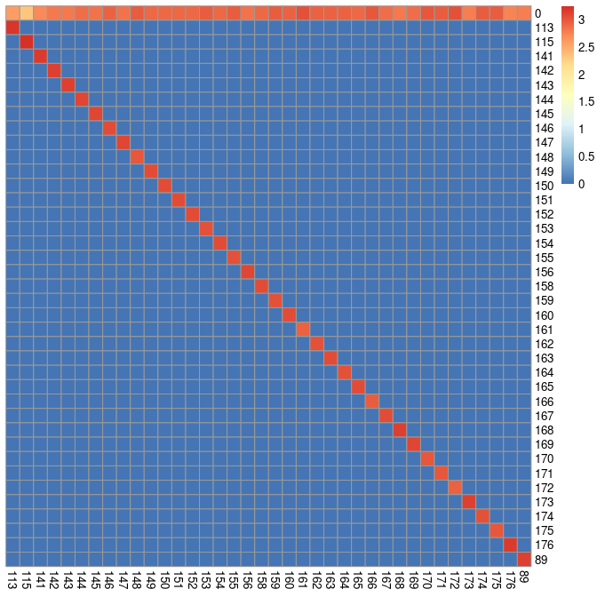

``` r
# Compute the fraction of unassigned pixels per spot
cur_table["0",] / colSums(cur_table)
```

    ##    113    115    141    142    143    144    145    146    147    148    149 
    ## 0.1985 0.1060 0.2575 0.3195 0.3190 0.3825 0.3545 0.4280 0.3570 0.4770 0.4200 
    ##    150    151    152    153    154    155    156    158    159    160    161 
    ## 0.4120 0.4025 0.4050 0.4630 0.4190 0.4610 0.3525 0.4020 0.4655 0.4250 0.5595 
    ##    162    163    164    165    166    167    168    169    170    171    172 
    ## 0.4340 0.4230 0.4390 0.4055 0.5210 0.3900 0.3285 0.3680 0.5015 0.4900 0.5650 
    ##    173    174    175    176     89 
    ## 0.3125 0.4605 0.4710 0.2845 0.3015

``` r
# Filter pixels that were assigned to a mass other than the spotted mass
sce <- filterPixels(sce, minevents = 40, correct_pixels = TRUE)
```

Compute and store the spillover matrix using the CATALYST package.

``` r
sce <- computeSpillmat(sce)
sm <- metadata(sce)$spillover_matrix
```

The step took 0.04 minutes.

Perform single-cell data compensation using the
[CATALYST](https://github.com/HelenaLC/CATALYST) package. The
`compCytof` function corrects channel-to-channel spillover directly on
the single-cell intensities using the previously estimated spillover
matrix. The `isotope_list` variable needs to be extended by isotopes
that are not contained in this list provided by the `CATALYST` package.
Visualization of marker intensities of neighboring channels (e.g., Yb173
and Yb174) before and after correction can be used to assess the
spillover correction efficacy.

``` r
library(dittoSeq)
library(patchwork)

# Specify the channel_name entry for use with CATALYST    
rowData(spe)$channel_name <- paste0(rowData(spe)$channel, "Di")

# Add the missing metal isotope to the isotope_list variable
isotope_list <- CATALYST::isotope_list
isotope_list$Ar <- 80

spe <- compCytof(spe, sm, 
                 transform = TRUE, cofactor = 1,
                 isotope_list = isotope_list, 
                 overwrite = FALSE)

# Visualize biaxial plots before/after compensation
before <- dittoScatterPlot(spe, x.var = "Ecad", y.var = "CD303",
                           assay.x = "exprs", assay.y = "exprs") +
    ggtitle("Before compensation")

after <- dittoScatterPlot(spe, x.var = "Ecad", y.var = "CD303",
                          assay.x = "compexprs", assay.y = "compexprs") +
    ggtitle("After compensation")

before + after
```

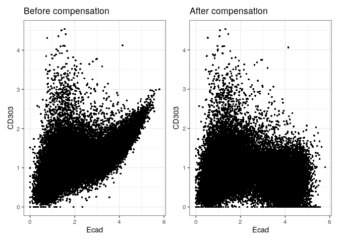

``` r
# Replace uncompensated assays
assay(spe, "counts") <- assay(spe, "compcounts") 
assay(spe, "exprs") <- assay(spe, "compexprs") 
assay(spe, "compcounts") <- assay(spe, "compexprs") <- NULL
```

The step took 0.12 minutes.

Perform channel-to-channel spillover correction on multi-channel images.
To this end, the previously computed spillover matrix needs to be
adjusted to only retain channels that are stored in the multi-channel
images. By visualizing neighboring channels, spillover correction
efficacy can be assessed.

``` r
# Use mass tags as channel names
channelNames(images) <- rowData(spe)$channel_name

# Adapt spillover matrix to retain channels contained in the multi-channel images
adapted_sm <- adaptSpillmat(sm, channelNames(images), 
                            isotope_list = isotope_list)
```

    ## Compensation is likely to be inaccurate.
    ## Spill values for the following interactions
    ## have not been estimated:

    ## Ir191Di -> Ir193Di

    ## Ir193Di -> Ir191Di

``` r
# Perform image compensation
images_comp <- compImage(images, adapted_sm)

# Visualize neighboring channels before/ after compensation
plotPixels(images[5], colour_by = "Yb173Di", 
           image_title = list(text = "Yb173 (Ecad) - before", 
                       position = "topleft"), 
           legend = NULL, bcg = list(Yb173Di = c(0, 4, 1)))
```


``` r
plotPixels(images[5], colour_by = "Yb174Di", 
           image_title = list(text = "Yb174 (CD303) - before", 
                              position = "topleft"), 
           legend = NULL, bcg = list(Yb174Di = c(0, 4, 1)))
```

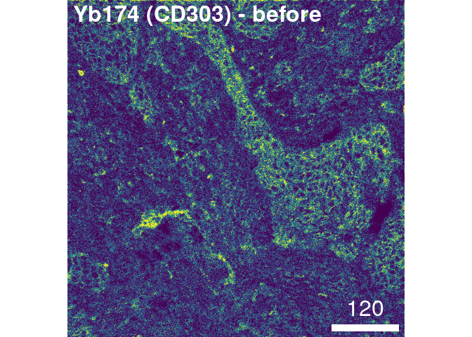

``` r
plotPixels(images_comp[5], colour_by = "Yb173Di",
           image_title = list(text = "Yb173 (Ecad) - after", 
                              position = "topleft"), 
           legend = NULL, bcg = list(Yb173Di = c(0, 4, 1)))
```

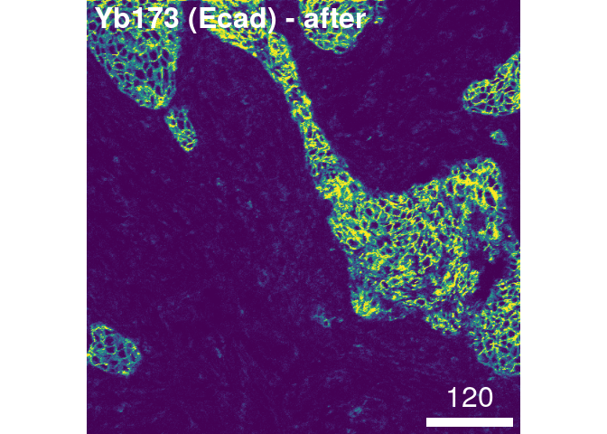

``` r
plotPixels(images_comp[5], colour_by = "Yb174Di", 
           image_title = list(text = "Yb174 (CD303) - after", 
                              position = "topleft"),
           legend = NULL, bcg = list(Yb174Di = c(0, 4, 1)))
```


``` r
# Switch back to using target names as channel names
channelNames(images_comp) <- rownames(spe)
```

The step took 9.93 minutes.

## Quality control

Outline cells on composite images for visual assessment of segmentation
quality. For visualization purposes, we subset 3 images and outline all
cells on composite images after channel normalization.

``` r
set.seed(20220118)
img_ids <- sample(seq_len(length(images_comp)), 3)

cur_images <- images_comp[img_ids]

# Normalize each channel between 0 and 1 
cur_images <- cytomapper::normalize(cur_images, separateImages = TRUE)

# Clip channel intensities at 0 and 0.2
cur_images <- cytomapper::normalize(cur_images, inputRange = c(0, 0.2))

plotPixels(cur_images,
           mask = masks[img_ids],
           img_id = "sample_id",
           missing_colour = "white",
           colour_by = c("CD163", "CD20", "CD3", "Ecad", "DNA1"),
           colour = list(CD163 = c("black", "yellow"),
                         CD20 = c("black", "red"),
                         CD3 = c("black", "green"),
                         Ecad = c("black", "cyan"),
                         DNA1 = c("black", "blue")),
           image_title = NULL,
           legend = list(colour_by.title.cex = 0.9,
                         colour_by.labels.cex = 0.9))
```

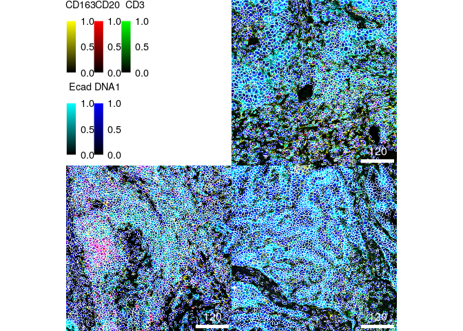

CRITICAL: This visualization approach is useful to identify missegmented
cells in images. It is recommended to visualize many images and zoom in
to assess segmentation quality. An image is sufficiently segmented, if
individual nuclei are outlined by their respective cell mask, without
obvious clumping or splitting of cells. Provided the measured markers
are localized within the nucleus or relatively homogeneously distributed
within the cells, only the nuclei of cells can be segmented to reduce
lateral spillover from neighboring cells. This can optionally be
combined with pixel expansion using the `steinbock utils expand` command
(see steinbock online documentation) to slightly enlarge the area of
cells captured by the cell masks.

Visualize the distribution of the cell area and filter out small cells.

``` r
dittoPlot(spe, var = "area", 
          group.by = "sample_id", 
          plots = "boxplot") +
        ylab("Cell area") + xlab("")
```

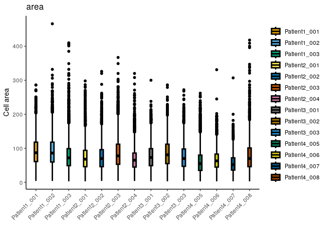

``` r
spe <- spe[,spe$area >= 5]
```

CRITICAL: Multiplexed imaging of tissue sections typically does not
capture whole cells, but measures slices of cells. Small cell slices,
which may not accurately represent the corresponding cell, should
therefore be excluded from the analysis. The selected threshold is
dataset-specific and should be fine-tuned by visualizing the
distribution of the cell area.

Visualize the image area covered by cells per image.

``` r
# Compute the fraction of image area covered by cells
cell_density <- colData(spe) %>%
    as.data.frame() %>%
    group_by(sample_id) %>%
    # Compute the number of pixels covered by cells and the total number of pixels
    summarize(cell_area = sum(area),
           no_pixels = mean(width_px) * mean(height_px)) %>%
    # Divide the total number of pixels by the number of pixels covered by cells
    mutate(covered_area = cell_area / no_pixels)

# Visualize the image area covered by cells per image
ggplot(cell_density) +
        geom_point(aes(sample_id, covered_area)) + 
        theme_minimal(base_size = 15) +
        theme(axis.text.x = element_text(angle = 90, hjust = 1, size = 15)) +
        ylim(c(0, 1)) +
        ylab("% covered area") + xlab("")
```

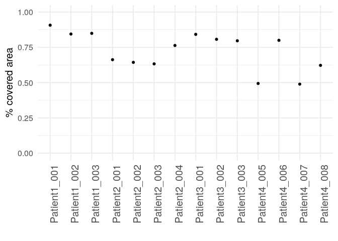

CRITICAL: When selecting dense tissue regions for acquisition, we expect
a high fraction of image pixels to be covered by cells. However, due to
the presence of sparse tissue structures (e.g., vessels) or because of
tissue loss, the covered fraction can be lower.

Visualize staining differences between samples for selected markers.
Together with the visualization of cells in low dimensions, this figure
indicates sample-to-sample differences in marker expression.

``` r
multi_dittoPlot(spe, vars = c("HLADR", "CD3", "Ecad", "PDGFRb"),
               group.by = "patient_id", plots = c("ridgeplot"), 
               assay = "exprs")
```

    ## Picking joint bandwidth of 0.162

    ## Picking joint bandwidth of 0.0982

    ## Picking joint bandwidth of 0.151

    ## Picking joint bandwidth of 0.089

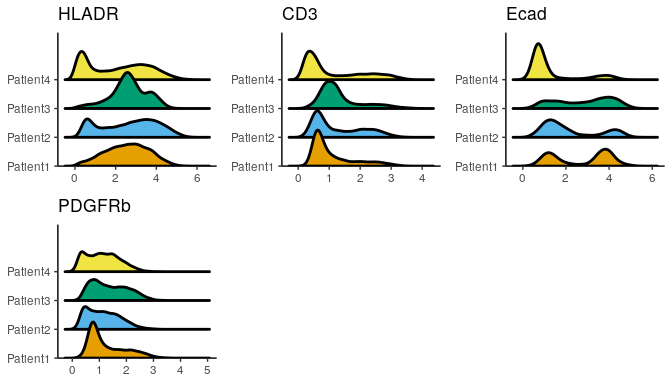

Visualize low-dimensional embeddings of single cells. Here, we use the
[scater](https://bioconductor.org/packages/release/bioc/html/scater.html)
package to compute a Uniform Manifold Approximation and Projection
(UMAP) embedding and visualize cells in low-dimensional space.

``` r
library(scater)

set.seed(220225)
spe <- runUMAP(spe, subset_row = rowData(spe)$use_channel, 
               exprs_values = "exprs") 

# Visualize the UMAP embedding and color cells by patient ID
dittoDimPlot(spe, var = "patient_id", 
     reduction.use = "UMAP", size = 0.2)  +
    ggtitle("Patient ID on UMAP")
```


The step took 0.63 minutes.

CRITICAL: Differences in marker distributions or non-overlapping samples
on the UMAP visualization can indicate sample-to-sample differences in
staining or biological differences. Staining differences can arise when
samples were processed differently or stained with different batches of
an antibody cocktail.

Perform batch correction to remove sample-to-sample differences. Here,
we use the `fastMNN` method of the
[batchelor](https://bioconductor.org/packages/release/bioc/html/batchelor.html)
package. In the following code chunk, the `fastMNN` and the `runUMAP`
functions, which are both not deterministic, are executed subsequently
after setting a seed for reproducibility reasons.

``` r
library(batchelor)

set.seed(220228)
# Perform batch correction
out <- fastMNN(spe, batch = spe$patient_id,
               auto.merge = TRUE,
               subset.row = rowData(spe)$use_channel,
               assay.type = "exprs")
```

    ## Warning in check_numbers(k = k, nu = nu, nv = nv, limit = min(dim(x)) - : more
    ## singular values/vectors requested than available

    ## Warning in (function (A, nv = 5, nu = nv, maxit = 1000, work = nv + 7, reorth =
    ## TRUE, : You're computing too large a percentage of total singular values, use a
    ## standard svd instead.

``` r
# Store corrected embeddings in SPE object
reducedDim(spe, "fastMNN") <- reducedDim(out, "corrected")

# Compute UMAP on corrected embeddings
spe <- runUMAP(spe, dimred= "fastMNN", name = "UMAP_mnnCorrected")

# Visualize corrected UMAP
dittoDimPlot(spe, var = "patient_id", 
             reduction.use = "UMAP_mnnCorrected", size = 0.2) + 
    ggtitle("Patient ID on UMAP after correction")
```

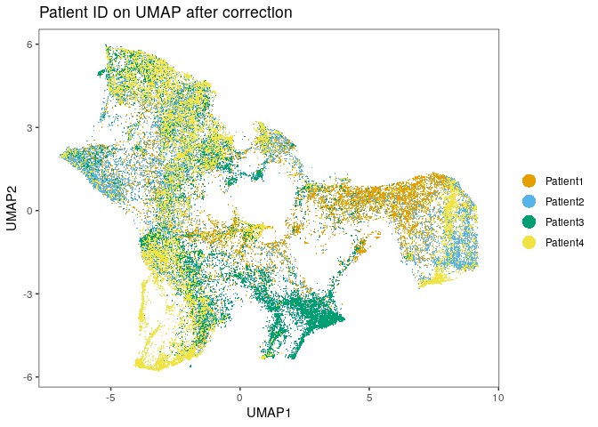

CRITICAL: The accuracy of batch correction needs to be visually assessed
to estimate whether biological variation - in addition to technical
variation - was removed. This can be done by coloring the UMAP embedding
based on markers that are known to be expressed in certain cell
phenotypes. These markers should be expressed in cells that cluster in
the UMAP embedding. Other batch effect correction approaches such as
`Seurat` and `harmony` can be used to improve data integration.

The step took 2.83 minutes.

## Cell phenotyping

Define cellular phenotypes. For this, single cells can be clustered (A)
or cells can be labelled via classification (B).

### (A) Cell phenotyping via clustering.

Graph-based clustering is performed using functions from the
[bluster](https://bioconductor.org/packages/release/bioc/html/bluster.html)
and
[scran](https://bioconductor.org/packages/release/bioc/html/scran.html)
R/Bioconductor packages. Alternatively, other approaches such as
`phenograph` or `FlowSOM` can be used to cluster single cells (see
<https://bodenmillergroup.github.io/IMCDataAnalysis/cell-phenotyping.html#clustering>).

Estimate optimal clustering parameters for graph-based clustering on the
integrated cells after batch correction. We perform a sweep across
possible combinations of clustering parameters, including the number of
nearest neighbors to consider (`k`) and the edge weighting method
(`type`). We keep the community detection algorithm (`cluster.fun`)
fixed, as the Louvain method is one of the most commonly used algorithms
for graph-based clustering. To assess cluster stability, we compute the
mean silhouette width across all cells and select the cluster parameter
combination with highest mean silhouette width.

``` r
library(bluster)
library(BiocParallel)

# Select the corrected cell embeddings for clustering
mat <- reducedDim(spe, "fastMNN")

# Perform the cluster sweep
combinations <- clusterSweep(mat, BLUSPARAM=SNNGraphParam(),
                             k=c(10L, 20L), 
                             type = c("rank", "jaccard"), 
                             cluster.fun = "louvain",
                             BPPARAM = SerialParam(RNGseed = 230214))

# Compute the average silhouette width per parameter combination
sil <- vapply(as.list(combinations$clusters), 
              function(x) mean(approxSilhouette(mat, x)$width), 0)

# Visualize the average silhouette width per parameter combination
ggplot(data.frame(method = names(sil),
                  sil = sil)) +
    geom_point(aes(method, sil), size = 3) +
    theme_classic(base_size = 15) +
    theme(axis.text.x = element_text(angle = 45, hjust = 1)) +
    xlab("Cluster parameter combination") +
    ylab("Average silhouette width")
```

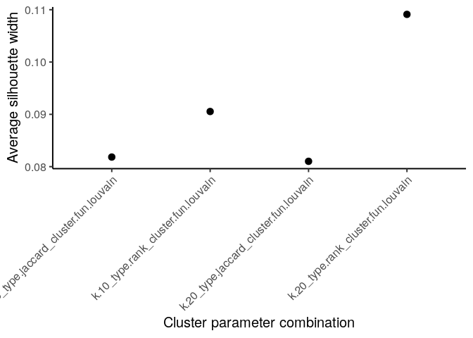

The step took 5.08 minutes.

CRITICAL: For each dataset, parameter estimation should be performed
independently. For large datasets, the function takes a long time to
run, and - as an approximation - the dataset can be subsampled to speed
up the cluster sweep.

Based on the selected parameters, cells are clustered using a
graph-based algorithm. As observed above, the parameter setting for
`k=20` and `type=”rank”` should result in well-separated clusters. The
cluster identifiers are then saved in the `SpatialExperiment` object.

``` r
library(scran)

set.seed(220621)
clusters <- clusterCells(spe, 
                         use.dimred = "fastMNN", 
                         BLUSPARAM = SNNGraphParam(k = 20, 
                                                cluster.fun = "louvain",
                                                type = "rank"))
spe$nn_clusters <- clusters
```

The step took 1.45 minutes.

To annotate the individual clusters based on cell phenotypes contained
within, the marker expression per cluster can be visualized in the form
of a heatmap. For visualization purposes, 2000 cells are randomly
selected from the dataset.

``` r
library(viridis)

set.seed(220619)
cur_cells <- sample(seq_len(ncol(spe)), 2000)

dittoHeatmap(spe[,cur_cells], 
             genes = rownames(spe)[rowData(spe)$use_channel],
             assay = "exprs", scale = "none",
             heatmap.colors = viridis(100), 
             annot.by = c("nn_clusters", "patient_id"))
```


After observing cluster-specific expression patterns, the individual
clusters can be annotated. For example, cluster 12 shows high expression
of the B cell marker CD20 and can therefore be labeled as “Bcell”.

``` r
cluster_celltype <- recode(spe$nn_clusters,
                            "1" = "Tumor_proliferating",
                            "2" = "Myeloid",
                            "3" = "Tumor",
                            "4" = "Tumor",
                            "5" = "Stroma",
                            "6" = "Proliferating",
                            "7" = "Myeloid",
                            "8" = "Plasma_cell",
                            "9" = "CD8",
                            "10" = "CD4",
                            "11" = "Neutrophil",
                            "12" = "Bcell",
                            "13" = "Stroma")

spe$cluster_celltype <- cluster_celltype
```

### (B) Classification-based cell phenotyping

Gate individual cell types based on their marker expression. For this,
the `cytomapper` package provides the `cytomapperShiny` function. Per
image, cells are gated based on their marker expression in a
hierarchical fashion to define expected cell types. The gated cells are
then visualized as outlines on pseudo-coloured composite images. Once
the correct cells are labeled, they can be downloaded as a
`SpatialExperiment` object storing only the selected cells. During
download, the cell label can be specified, which is stored in the
`cytomapper_CellLabel` entry of the `colData` slot for later use in
training a classifier.

``` r
if (interactive()){
    cytomapperShiny(object = spe, mask = masks, image = images_comp, 
                cell_id = "ObjectNumber", img_id = "sample_id")   
}
```

CRITICAL: Due to imperfect segmentation, lateral spillover leads to
incorrect expression levels for some markers. We therefore recommend
gating cells that only express markers of their specific cell phenotype.

Read in files containing the gated cells and concatenate them into a
single `SpatialExperiment` object.

``` r
library(SingleCellExperiment)
label_files <- list.files("data/gated_cells", 
                          full.names = TRUE, pattern = ".rds$")

# Read in individual files containing gated cells
spes <- lapply(label_files, readRDS)

# Concatenate the individual objects into one
concat_spe <- do.call("cbind", spes)
```

Remove cells that were labeled multiple times and reassign tumor cells.
As a result of the multi-step labeling approach, some cells may have
been labeled several times. In cases where one cell was labeled as both
tumor and immune cell, we keep the immune cell label, as these cells are
most likely immune cells residing within the tumor. All other cells that
were labeled several times are removed. Finally, the labels are stored
in the main `SpatialExperiment` object.

We first define a helper function that returns cell labels for cells
that were labeled only once.

``` r
filter_labels <- function(object, 
                          label = "cytomapper_CellLabel") {
    cur_tab <- unclass(table(colnames(object), object[[label]]))
    
    cur_labels <- colnames(cur_tab)[apply(cur_tab, 1, which.max)]
    names(cur_labels) <- rownames(cur_tab)
    
    cur_labels <- cur_labels[rowSums(cur_tab) == 1]
    
    return(cur_labels)
}
```

Next, this function is applied to retrieve all cells that were labeled
once.

``` r
labels <- filter_labels(concat_spe)
```

The function is applied again to all cells while excluding the “Tumor”
label column. This approach identifies those cells that were labeled
once as tumor cells and once as immune cells.

``` r
cur_spe <- concat_spe[,concat_spe$cytomapper_CellLabel != "Tumor"]

non_tumor_labels <- filter_labels(cur_spe)

additional_cells <- setdiff(names(non_tumor_labels), names(labels))
```

Finally, the two sets of cell labels are merged and stored in the
`SpatialExperiment` object.

``` r
final_labels <- c(labels, non_tumor_labels[additional_cells])

# Transfer labels to SPE object
spe_labels <- rep("unlabeled", ncol(spe))
names(spe_labels) <- colnames(spe)
spe_labels[names(final_labels)] <- final_labels
spe$cell_labels <- spe_labels
```

Train a random forest classifier for cell type classification of
unlabelled cells. The cells are first split into labelled and unlabelled
cells. We then perform a 75/25 split of the labelled cells to select
training and testing datasets, respectively. Based on the training
dataset, we perform a 5-fold cross validation to tune the random forest
model parameter. In the following code chunk, the `createDataPartition`
and the `train` functions, which are both not deterministic, are
executed subsequently after setting a seed for reproducibility reasons.

``` r
library(caret)

# Split between labeled and unlabeled cells
lab_spe <- spe[,spe$cell_labels != "unlabeled"]
unlab_spe <- spe[,spe$cell_labels == "unlabeled"]

# Randomly split into train and test data
set.seed(221029)
trainIndex <- createDataPartition(factor(lab_spe$cell_labels), p = 0.75)
train_spe <- lab_spe[,trainIndex$Resample1]
test_spe <- lab_spe[,-trainIndex$Resample1]

# Define fit parameters for 5-fold cross validation
fitControl <- trainControl(method = "cv",
                           number = 5)

# Select the arsinh-transformed counts for training
cur_mat <- t(assay(train_spe, "exprs")[rowData(train_spe)$use_channel,])

# Train a random forest classifier
rffit <- train(x = cur_mat, 
               y = factor(train_spe$cell_labels),
               method = "rf", ntree = 1000,
               tuneLength = 5,
               trControl = fitControl)
```

The step took 9.46 minutes.

Assess the classifier performance by computing the confusion matrix of
the test dataset. The `confusionMatrix` function compares the predicted
cell labels to the ground truth cell labels and computes a number of
performance metrics. A high sensitivity and a high specificity for each
cell type label is to be desired.

``` r
# Select the arsinh-transformed counts of the test data
cur_mat <- t(assay(test_spe, "exprs")[rowData(test_spe)$use_channel,])

# Predict the cell phenotype labels of the test data
cur_pred <- predict(rffit, newdata = cur_mat)

# Compute the confusion matrix between predicted and actual labels
confusionMatrix(data = cur_pred, 
                reference = factor(test_spe$cell_labels), 
                mode = "everything")
```

    ## Confusion Matrix and Statistics
    ## 
    ##              Reference
    ## Prediction    Bcell BnTcell  CD4  CD8 Myeloid Neutrophil Plasma_cell Stroma
    ##   Bcell         186       2    0    0       0          0           6      0
    ##   BnTcell         4     423    1    0       0          0           0      0
    ##   CD4             0       0  163    0       0          2           3      2
    ##   CD8             0       0    0  199       0          0           8      0
    ##   Myeloid         0       0    2    1     437          0           0      0
    ##   Neutrophil      0       0    0    0       0         30           0      0
    ##   Plasma_cell     1       0    3    2       0          0         158      0
    ##   Stroma          0       0    2    0       0          0           0    108
    ##   Treg            0       0    0    0       0          0           3      0
    ##   Tumor           4       0    1    3       0          1           1      0
    ##              Reference
    ## Prediction    Treg Tumor
    ##   Bcell          0     1
    ##   BnTcell        0     1
    ##   CD4            0     5
    ##   CD8            0     3
    ##   Myeloid        0     0
    ##   Neutrophil     0     0
    ##   Plasma_cell    1     0
    ##   Stroma         0     0
    ##   Treg          89     2
    ##   Tumor          0  1487
    ## 
    ## Overall Statistics
    ##                                          
    ##                Accuracy : 0.9806         
    ##                  95% CI : (0.9753, 0.985)
    ##     No Information Rate : 0.4481         
    ##     P-Value [Acc > NIR] : < 2.2e-16      
    ##                                          
    ##                   Kappa : 0.9741         
    ##                                          
    ##  Mcnemar's Test P-Value : NA             
    ## 
    ## Statistics by Class:
    ## 
    ##                      Class: Bcell Class: BnTcell Class: CD4 Class: CD8
    ## Sensitivity               0.95385         0.9953    0.94767    0.97073
    ## Specificity               0.99714         0.9979    0.99622    0.99650
    ## Pos Pred Value            0.95385         0.9860    0.93143    0.94762
    ## Neg Pred Value            0.99714         0.9993    0.99716    0.99809
    ## Precision                 0.95385         0.9860    0.93143    0.94762
    ## Recall                    0.95385         0.9953    0.94767    0.97073
    ## F1                        0.95385         0.9906    0.93948    0.95904
    ## Prevalence                0.05830         0.1271    0.05142    0.06129
    ## Detection Rate            0.05561         0.1265    0.04873    0.05949
    ## Detection Prevalence      0.05830         0.1283    0.05232    0.06278
    ## Balanced Accuracy         0.97549         0.9966    0.97195    0.98361
    ##                      Class: Myeloid Class: Neutrophil Class: Plasma_cell
    ## Sensitivity                  1.0000          0.909091            0.88268
    ## Specificity                  0.9990          1.000000            0.99779
    ## Pos Pred Value               0.9932          1.000000            0.95758
    ## Neg Pred Value               1.0000          0.999095            0.99340
    ## Precision                    0.9932          1.000000            0.95758
    ## Recall                       1.0000          0.909091            0.88268
    ## F1                           0.9966          0.952381            0.91860
    ## Prevalence                   0.1306          0.009865            0.05351
    ## Detection Rate               0.1306          0.008969            0.04723
    ## Detection Prevalence         0.1315          0.008969            0.04933
    ## Balanced Accuracy            0.9995          0.954545            0.94024
    ##                      Class: Stroma Class: Treg Class: Tumor
    ## Sensitivity                0.98182     0.98889       0.9920
    ## Specificity                0.99938     0.99846       0.9946
    ## Pos Pred Value             0.98182     0.94681       0.9933
    ## Neg Pred Value             0.99938     0.99969       0.9935
    ## Precision                  0.98182     0.94681       0.9933
    ## Recall                     0.98182     0.98889       0.9920
    ## F1                         0.98182     0.96739       0.9927
    ## Prevalence                 0.03288     0.02691       0.4481
    ## Detection Rate             0.03229     0.02661       0.4445
    ## Detection Prevalence       0.03288     0.02810       0.4475
    ## Balanced Accuracy          0.99060     0.99368       0.9933

Predict cell labels of unlabelled cells. Cells for which the highest
class probability is below 40% are labeled as “unknown”.

``` r
# Select the arsinh-transformed counts of the unlabeled data for prediction
cur_mat <- t(assay(unlab_spe, "exprs")[rowData(unlab_spe)$use_channel,])

# Predict the cell phenotype labels of the unlabeled data
cell_class <- as.character(predict(rffit,
                                   newdata = cur_mat,
                                   type = "raw"))
names(cell_class) <- rownames(cur_mat)

# Extract prediction probabilities for each cell
cell_prob <- predict(rffit, 
                     newdata = cur_mat, 
                     type = "prob")

# Label cells with a low prediction probability as undefined
cell_class[rowMax(as.matrix(cell_prob)) < 0.4] <- "undefined"

# Store cell phenotype labels in SPE object
cell_labels <- spe$cell_labels
cell_labels[colnames(unlab_spe)] <- cell_class
spe$celltype <- cell_labels
```

CRITICAL: The threshold for labeling cells as undefined needs to be
adjusted per dataset. When predicting more cell classes, the threshold
will likely be lower while the threshold can be increased when
predicting fewer classes.

### Cluster and cell type visualization

Visualize cell phenotype and annotated cluster labels on the UMAP
embedding to qualitatively assess the cell phenotyping.

``` r
p1 <- dittoDimPlot(spe, var = "celltype", 
             reduction.use = "UMAP_mnnCorrected", size = 0.2,
             do.label = TRUE) +
  ggtitle("Cell types on UMAP, integrated cells")

p2 <- dittoDimPlot(spe, var = "cluster_celltype", 
             reduction.use = "UMAP_mnnCorrected", size = 0.2,
             do.label = TRUE) +
  ggtitle("Cluster cell types on UMAP, integrated cells")

p1 + p2
```

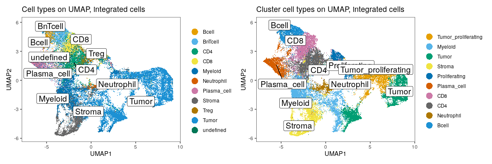

Visualize mean marker expression per cell type and per annotated cluster
as heatmaps.

``` r
library(scuttle)

# Calculate the mean of the arsinh-transformed counts per cell phenotype
celltype_mean <- aggregateAcrossCells(as(spe, "SingleCellExperiment"),  
                     ids = spe$celltype, 
                     statistics = "mean",
                     use.assay.type = "exprs",
                     subset_row = rowData(spe)$use_channel)

dittoHeatmap(celltype_mean,
             assay = "exprs", cluster_cols = TRUE, 
             scale = "none",
             heatmap.colors = viridis(100),
             annot.by = c("celltype", "ncells"))
```

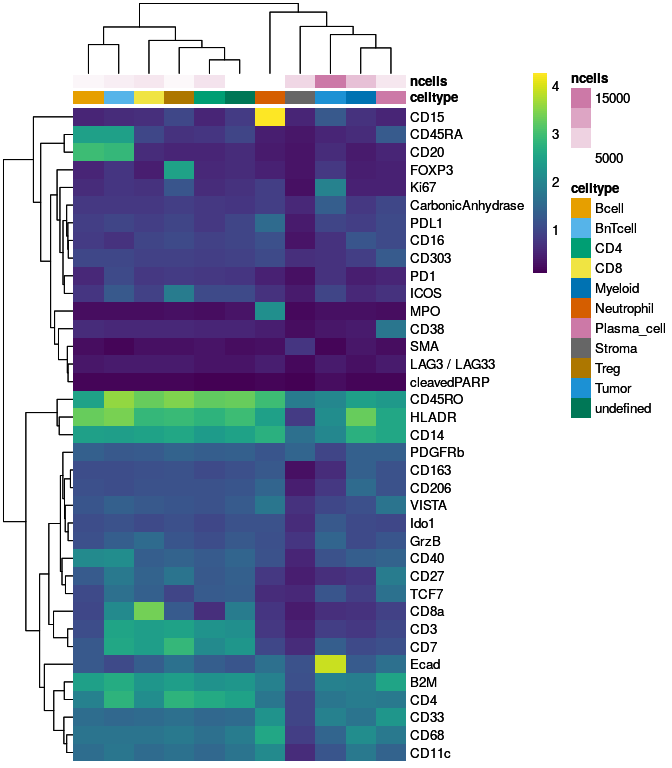

``` r
# Calculate the mean of the arsinh-transformed counts per annotated cluster
cluster_mean <- aggregateAcrossCells(as(spe, "SingleCellExperiment"),  
                     ids = spe$cluster_celltype, 
                     statistics = "mean",
                     use.assay.type = "exprs",
                     subset_row = rowData(spe)$use_channel)

dittoHeatmap(cluster_mean,
             assay = "exprs", cluster_cols = TRUE, 
             scale = "none",
             heatmap.colors = viridis(100),
             annot.by = c("cluster_celltype", "ncells"))
```

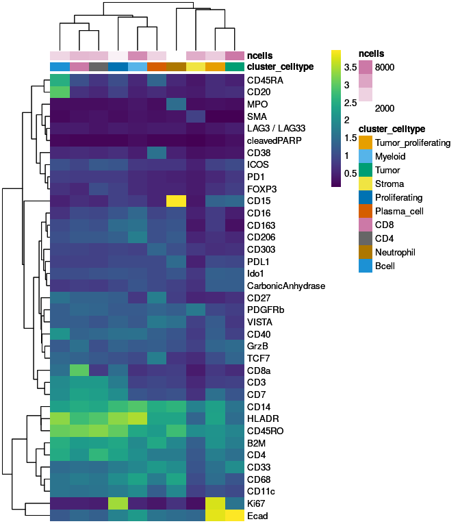

CRITICAL: We expect individual cell phenotypes to show the highest mean
expression of their specific markers. In addition cell phenotypes should
be visually separated on low-dimensional embeddings such as UMAP.

## Spatial analysis

Perform spatial community analysis as proposed by Jackson et al. using
the `detectCommunity` function provided by the `imcRtools` package. This
method groups cells solely based on their location in the tissue by
using a previously constructed spatial cell graph. We perform community
detection separately for tumor and non-tumor cells.

``` r
# Define if cells are part of the tumor or stroma
spe$tumor_stroma <- ifelse(spe$celltype == "Tumor", "Tumor", "Stroma")

# Detect spatial communities
spe <- detectCommunity(spe, 
                       colPairName = "neighborhood", 
                       size_threshold = 10,
                       group_by = "tumor_stroma",
                       BPPARAM = SerialParam(RNGseed = 220819))

# Visualize spatial tumor communities
plotSpatial(spe[,spe$celltype == "Tumor"], 
            node_color_by = "spatial_community", 
            img_id = "sample_id", 
            node_size_fix = 0.5) +
    theme(legend.position = "none") +
    scale_color_manual(values = rev(colors()))
```


The step took 0.05 minutes.

After detecting spatial communities, a number of downstream analyses can
be performed. These include (i) computing the cell phenotype fraction
per community for meta clustering, (ii) identifying shared communities
between samples for comparative analysis, and (iii) computing the size
of the individual communities to estimate tissue segregation.

Perform cellular neighborhood (CN) analysis. CNs are tissue regions with
characteristic cell type composition and represent sites of unique local
biological processes and interactions. We first construct a spatial
20-nearest neighbor graph based on the cells’ centroids, to include a
larger number of neighbors compared to the spatial cell graph
constructed earlier using steinbock. The `aggregateNeighbors` function
of the `imcRtools` package then computes for each cell the cell type
fraction among its 20-nearest neighbors. Cells are subsequently
clustered using k-means clustering to detect CNs. Finally, cells can be
spatially visualized and colored based on their CN, and the cell type
fraction per CN can be computed. Here, CN 3 represents a spatial
aggregation of B cells while CN 1 contains mostly tumor tissue.

``` r
# Construct a 20-nearest neighbor graph
spe <- buildSpatialGraph(spe, img_id = "sample_id", type = "knn", k = 20)
```

    ## The returned object is ordered by the 'sample_id' entry.

``` r
# Compute the fraction of cell phenotypes in each cells neighborhood
spe <- aggregateNeighbors(spe, colPairName = "knn_interaction_graph", 
                          aggregate_by = "metadata", count_by = "celltype")

set.seed(220705)

# Cluster cells based on cell phenotype fractions
cn_1 <- kmeans(spe$aggregatedNeighbors, centers = 6)
spe$cn_celltypes <- as.factor(cn_1$cluster)

# Visualize cellular neighborhoods
plotSpatial(spe, 
            node_color_by = "cn_celltypes", 
            img_id = "sample_id", 
            node_size_fix = 0.5) +
    scale_color_brewer(palette = "Set3")
```

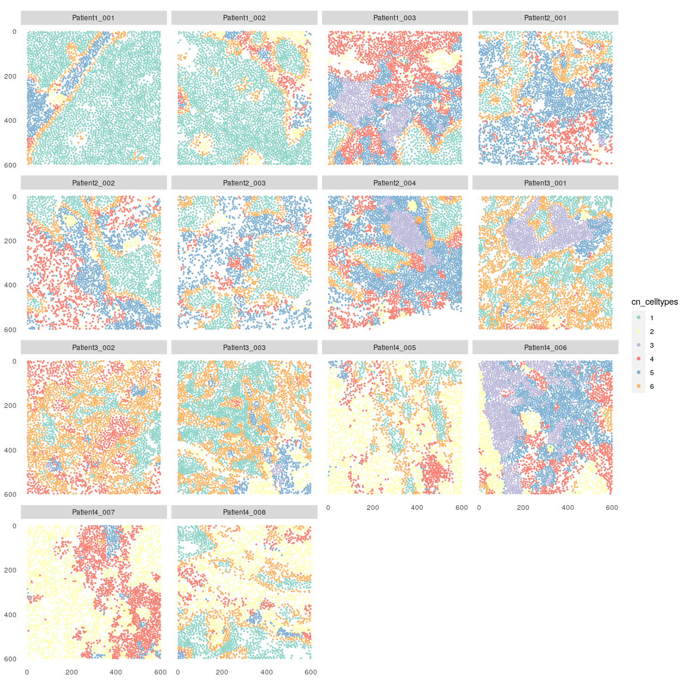

``` r
# Compute the fraction of cell phenotypes in each cellular neighborhood
mat <- prop.table(table(spe$cn_celltypes, spe$celltype), 
                  margin = 1)
```

``` r
# Visualize cell phenotype fractions in each cellular neighborhood
pheatmap(mat, 
  color = colorRampPalette(c("dark blue", "white", "dark red"))(100), 
  scale = "column")
```

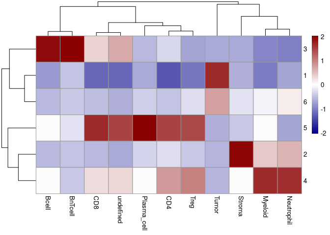

The step took 0.14 minutes.

CRITICAL: A parameter sweep should be performed to estimate the optimal
value for `k`. However, with prior knowledge on the expected tissue
structures to detect, `k` can be set accordingly. Alternatively, cells
can also be clustered based on the mean marker expression of cells
within their neighborhood. In addition, the
[lisaClust](https://bioconductor.org/packages/release/bioc/html/lisaClust.html)
R/Bioconductor package provides alternative strategies to detect CNs.

Perform spatial context (SC) analysis as proposed by Bhate et al. SCs
build upon the concept of CNs and are regions in which the local
biological processes of CNs interact, and where specialized biological
events take place. We construct a second k-nearest neighbor graph with
larger k (`k=40`) to include cells across a length scale on which
biological signals could be exchanged. For each cell, the
`aggregateNeighbors` function computes the fraction of CNs among its 40
nearest neighbors. The `detectSpatialContext` function sorts the CN
fractions from high to low, and the SC of each cell is assigned as the
minimal combination of CNs that additively surpass a user-defined
threshold (here: `threshold=0.9`). After filtering the detected SCs, we
can spatially visualize them and represent SC interactions as a layered
graph. We observe that SC 1 (Tumor-dominated), SC 1_6 (Tumor and
Tumor-Stroma interface) and SC 4_5 (Plasma/T cell and Myeloid/Neutrophil
interface) are the most frequent SCs in this dataset.

``` r
# Construct a 40-nearest neighbor graph
spe <- buildSpatialGraph(spe, img_id = "sample_id", 
                         type = "knn", 
                         name = "knn_spatialcontext_graph", 
                         k = 40)
```

    ## The returned object is ordered by the 'sample_id' entry.

``` r
# Compute the fraction of cellular neighborhoods around each cell
spe <- aggregateNeighbors(spe, 
                          colPairName = "knn_spatialcontext_graph",
                          aggregate_by = "metadata",
                          count_by = "cn_celltypes",
                          name = "aggregatedNeighborhood")

# Detect spatial contexts
spe <- detectSpatialContext(spe, 
                            entry = "aggregatedNeighborhood",
                            threshold = 0.90,
                            name = "spatial_context")

# Filter out small and infrequent spatial contexts
spe <- filterSpatialContext(spe, 
                            entry = "spatial_context",
                            group_by = "patient_id", 
                            group_threshold = 3,
                            cells_threshold = 100,
                            name = "spatial_context_filtered")

# Visualize cell location colored by their spatial context
plotSpatial(spe, 
            node_color_by = "spatial_context_filtered", 
            img_id = "sample_id", 
            node_size_fix = 0.5)
```

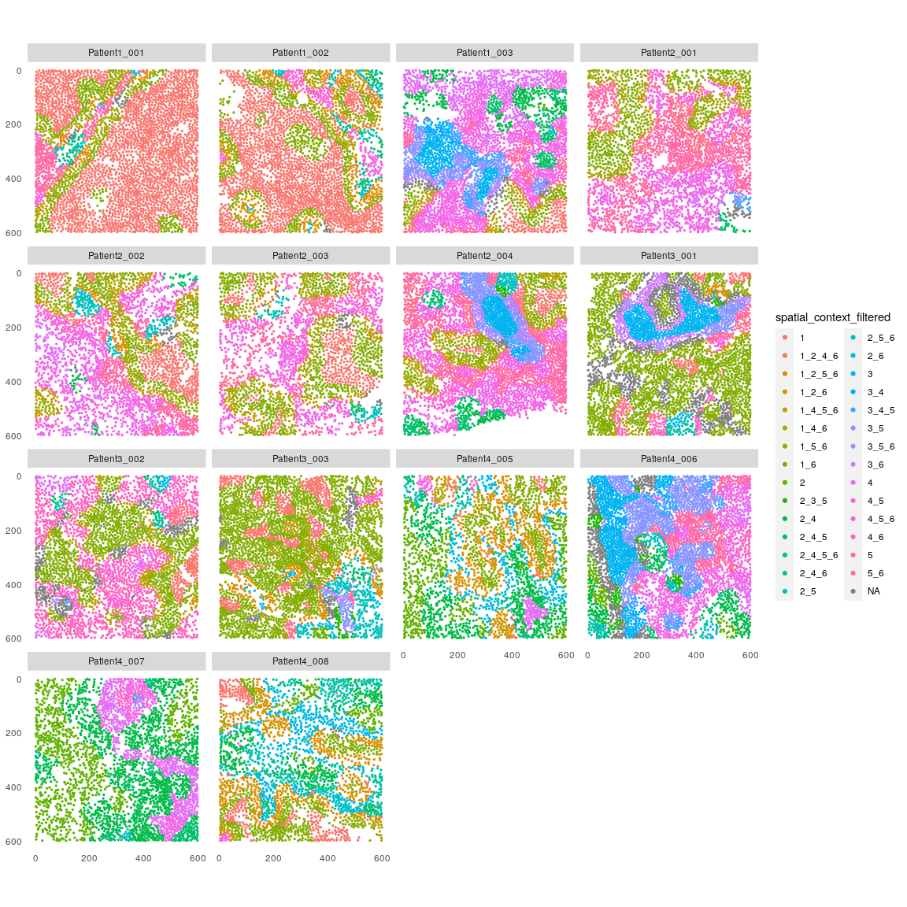

``` r
# Visualize spatial contexts as graph
plotSpatialContext(spe,
                   entry = "spatial_context_filtered",
                   group_by = "sample_id",
                   node_color_by = "n_cells",
                   node_size_by = "n_group",
                   node_label_color_by = "n_cells") +
    scale_color_viridis()
```

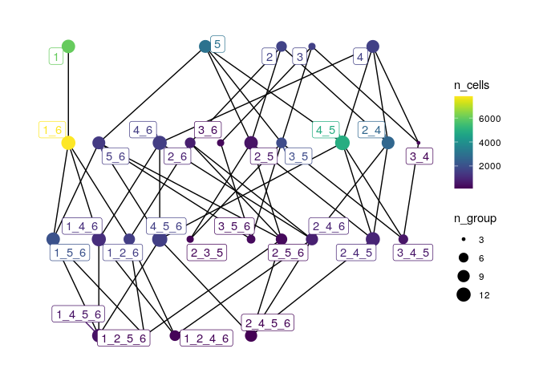

The step took 0.28 minutes.

Perform patch detection analysis. The `patchDetection` function of the
`imcRtools` package detects fully connected components of cells of
interest, constructs a concave hull around each component, and expands
this hull to include neighboring cells. Below, we detect connected tumor
components made up of at least 10 cells, and we slightly expand the
concave hull to include cells within the patch.

``` r
spe <- patchDetection(spe, 
                      patch_cells = spe$celltype == "Tumor",
                      img_id = "sample_id",
                      expand_by = 1,
                      min_patch_size = 10,
                      colPairName = "neighborhood")
```

    ## The returned object is ordered by the 'sample_id' entry.

``` r
plotSpatial(spe, 
            node_color_by = "patch_id", 
            img_id = "sample_id", 
            node_size_fix = 0.5) +
    theme(legend.position = "none") +
    scale_color_manual(values = rev(colors()))
```

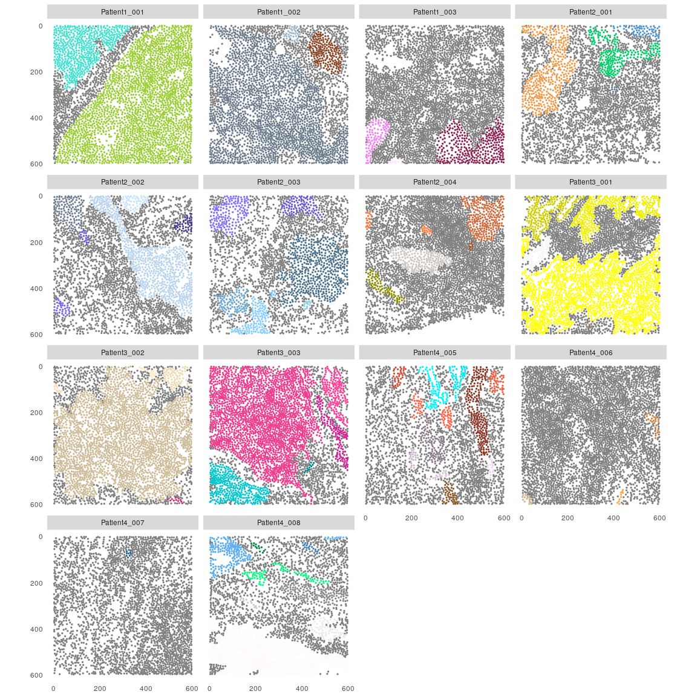

The step took 0.38 minutes.

Perform interaction analysis as proposed by Schapiro et al. This
approach detects cell phenotype pairs that show stronger (“interaction”)
or weaker (“avoidance”) co-localization compared to a random
distribution of cell phenotypes. Using a previously constructed spatial
cell graph (here: the one created using `steinbock`), the
`testInteractions` function of the `imcRtools` package computes the
average interaction count for each cell phenotype pair per image, and
compares it against an empirical null distribution derived by permuting
all cell labels. The returned data frame contains one entry per cell
phenotype pair for each image indicating the empirical p-value and
statistical significance (interaction: 1, no significance: 0, avoidance:
-1). These significance values can be summed across all images and
visualized in the form of a heatmap. We observe that tumor cells are
mostly compartmentalized and are in avoidance with other cell types, and
regulatory T cells reside next to CD4+ T cells and CD8+ T cells.

``` r
library(scales)

out <- testInteractions(spe, 
                        group_by = "sample_id",
                        label = "celltype", 
                        colPairName = "neighborhood",
                        BPPARAM = SerialParam(RNGseed = 221029))

# Sum interaction values across all images
summed_sigvals <- out %>% as_tibble() %>%
    group_by(from_label, to_label) %>%
    summarize(sum_sigval = sum(sigval, na.rm = TRUE))

# Visualize summed interaction values in form of a heatmap
ggplot(summed_sigvals) +
    geom_tile(aes(from_label, to_label, fill = sum_sigval)) +
    scale_fill_gradient2(low = muted("blue"), 
                         mid = "white", 
                         high = muted("red")) +
    theme(axis.text.x = element_text(angle = 45, hjust = 1))
```

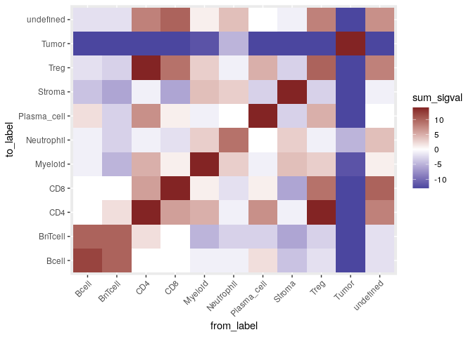

The step took 6.64 minutes.

We finally save out the `SpatialExperiment` object.

``` r
saveRDS(spe, "data/spe.rds")
```

## Session information

``` r
sessionInfo()
```

    ## R version 4.3.0 (2023-04-21)
    ## Platform: x86_64-pc-linux-gnu (64-bit)
    ## Running under: Ubuntu 22.04.2 LTS
    ## 
    ## Matrix products: default
    ## BLAS:   /usr/lib/x86_64-linux-gnu/openblas-pthread/libblas.so.3 
    ## LAPACK: /usr/lib/x86_64-linux-gnu/openblas-pthread/libopenblasp-r0.3.20.so;  LAPACK version 3.10.0
    ## 
    ## locale:
    ##  [1] LC_CTYPE=en_US.UTF-8       LC_NUMERIC=C              
    ##  [3] LC_TIME=en_US.UTF-8        LC_COLLATE=en_US.UTF-8    
    ##  [5] LC_MONETARY=en_US.UTF-8    LC_MESSAGES=en_US.UTF-8   
    ##  [7] LC_PAPER=en_US.UTF-8       LC_NAME=C                 
    ##  [9] LC_ADDRESS=C               LC_TELEPHONE=C            
    ## [11] LC_MEASUREMENT=en_US.UTF-8 LC_IDENTIFICATION=C       
    ## 
    ## time zone: Etc/UTC
    ## tzcode source: system (glibc)
    ## 
    ## attached base packages:
    ## [1] stats4    stats     graphics  grDevices utils     datasets  methods  
    ## [8] base     
    ## 
    ## other attached packages:
    ##  [1] scales_1.2.1                caret_6.0-94               
    ##  [3] lattice_0.21-8              viridis_0.6.2              
    ##  [5] viridisLite_0.4.1           scran_1.28.0               
    ##  [7] BiocParallel_1.34.0         bluster_1.10.0             
    ##  [9] batchelor_1.16.0            scater_1.28.0              
    ## [11] scuttle_1.10.0              patchwork_1.1.2            
    ## [13] dittoSeq_1.12.0             pheatmap_1.0.12            
    ## [15] CATALYST_1.24.0             cytomapper_1.12.0          
    ## [17] EBImage_4.42.0              lubridate_1.9.2            
    ## [19] forcats_1.0.0               stringr_1.5.0              
    ## [21] dplyr_1.1.2                 purrr_1.0.1                
    ## [23] readr_2.1.4                 tidyr_1.3.0                
    ## [25] tibble_3.2.1                ggplot2_3.4.2              
    ## [27] tidyverse_2.0.0             imcRtools_1.6.0            
    ## [29] SpatialExperiment_1.10.0    SingleCellExperiment_1.22.0
    ## [31] SummarizedExperiment_1.30.0 Biobase_2.60.0             
    ## [33] GenomicRanges_1.52.0        GenomeInfoDb_1.36.0        
    ## [35] IRanges_2.34.0              S4Vectors_0.38.0           
    ## [37] BiocGenerics_0.46.0         MatrixGenerics_1.12.0      
    ## [39] matrixStats_0.63.0         
    ## 
    ## loaded via a namespace (and not attached):
    ##   [1] bitops_1.0-7                sf_1.0-12                  
    ##   [3] RColorBrewer_1.1-3          doParallel_1.0.17          
    ##   [5] tools_4.3.0                 backports_1.4.1            
    ##   [7] ResidualMatrix_1.10.0       utf8_1.2.3                 
    ##   [9] R6_2.5.1                    DT_0.27                    
    ##  [11] HDF5Array_1.28.0            uwot_0.1.14                
    ##  [13] rhdf5filters_1.12.0         GetoptLong_1.0.5           
    ##  [15] withr_2.5.0                 sp_1.6-0                   
    ##  [17] gridExtra_2.3               textshaping_0.3.6          
    ##  [19] cli_3.6.1                   sandwich_3.0-2             
    ##  [21] labeling_0.4.2              nnls_1.4                   
    ##  [23] mvtnorm_1.1-3               randomForest_4.7-1.1       
    ##  [25] proxy_0.4-27                ggridges_0.5.4             
    ##  [27] systemfonts_1.0.4           colorRamps_2.3.1           
    ##  [29] svglite_2.1.1               R.utils_2.12.2             
    ##  [31] parallelly_1.35.0           plotrix_3.8-2              
    ##  [33] limma_3.56.0                flowCore_2.12.0            
    ##  [35] rstudioapi_0.14             generics_0.1.3             
    ##  [37] shape_1.4.6                 gtools_3.9.4               
    ##  [39] vroom_1.6.1                 car_3.1-2                  
    ##  [41] Matrix_1.5-4                RProtoBufLib_2.12.0        
    ##  [43] ggbeeswarm_0.7.1            fansi_1.0.4                
    ##  [45] abind_1.4-5                 R.methodsS3_1.8.2          
    ##  [47] terra_1.7-29                lifecycle_1.0.3            
    ##  [49] multcomp_1.4-23             yaml_2.3.7                 
    ##  [51] edgeR_3.42.0                carData_3.0-5              
    ##  [53] recipes_1.0.6               rhdf5_2.44.0               
    ##  [55] Rtsne_0.16                  grid_4.3.0                 
    ##  [57] promises_1.2.0.1            dqrng_0.3.0                
    ##  [59] crayon_1.5.2                shinydashboard_0.7.2       
    ##  [61] beachmat_2.16.0             cowplot_1.1.1              
    ##  [63] magick_2.7.4                metapod_1.8.0              
    ##  [65] pillar_1.9.0                knitr_1.42                 
    ##  [67] ComplexHeatmap_2.16.0       RTriangle_1.6-0.12         
    ##  [69] rjson_0.2.21                future.apply_1.10.0        
    ##  [71] codetools_0.2-19            glue_1.6.2                 
    ##  [73] V8_4.3.0                    data.table_1.14.8          
    ##  [75] vctrs_0.6.2                 png_0.1-8                  
    ##  [77] gtable_0.3.3                gower_1.0.1                
    ##  [79] xfun_0.39                   prodlim_2023.03.31         
    ##  [81] mime_0.12                   DropletUtils_1.20.0        
    ##  [83] tidygraph_1.2.3             ConsensusClusterPlus_1.64.0
    ##  [85] survival_3.5-5              timeDate_4022.108          
    ##  [87] iterators_1.0.14            hardhat_1.3.0              
    ##  [89] cytolib_2.12.0              lava_1.7.2.1               
    ##  [91] units_0.8-2                 statmod_1.5.0              
    ##  [93] ellipsis_0.3.2              TH.data_1.1-2              
    ##  [95] ipred_0.9-14                nlme_3.1-162               
    ##  [97] bit64_4.0.5                 RcppAnnoy_0.0.20           
    ##  [99] irlba_2.3.5.1               svgPanZoom_0.3.4           
    ## [101] rpart_4.1.19                vipor_0.4.5                
    ## [103] KernSmooth_2.23-20          colorspace_2.1-0           
    ## [105] DBI_1.1.3                   nnet_7.3-18                
    ## [107] raster_3.6-20               tidyselect_1.2.0           
    ## [109] curl_5.0.0                  bit_4.0.5                  
    ## [111] compiler_4.3.0              BiocNeighbors_1.18.0       
    ## [113] DelayedArray_0.25.0         classInt_0.4-9             
    ## [115] distances_0.1.9             tiff_0.1-11                
    ## [117] digest_0.6.31               fftwtools_0.9-11           
    ## [119] rmarkdown_2.21              XVector_0.40.0             
    ## [121] htmltools_0.5.5             pkgconfig_2.0.3            
    ## [123] jpeg_0.1-10                 sparseMatrixStats_1.12.0   
    ## [125] highr_0.10                  fastmap_1.1.1              
    ## [127] rlang_1.1.0                 GlobalOptions_0.1.2        
    ## [129] htmlwidgets_1.6.2           shiny_1.7.4                
    ## [131] DelayedMatrixStats_1.22.0   farver_2.1.1               
    ## [133] jsonlite_1.8.4              zoo_1.8-12                 
    ## [135] ModelMetrics_1.2.2.2        R.oo_1.25.0                
    ## [137] BiocSingular_1.16.0         RCurl_1.98-1.12            
    ## [139] magrittr_2.0.3              GenomeInfoDbData_1.2.10    
    ## [141] Rhdf5lib_1.22.0             munsell_0.5.0              
    ## [143] Rcpp_1.0.10                 ggnewscale_0.4.8           
    ## [145] pROC_1.18.0                 stringi_1.7.12             
    ## [147] ggraph_2.1.0                zlibbioc_1.46.0            
    ## [149] MASS_7.3-58.4               plyr_1.8.8                 
    ## [151] listenv_0.9.0               parallel_4.3.0             
    ## [153] ggrepel_0.9.3               graphlayouts_0.8.4         
    ## [155] splines_4.3.0               hms_1.1.3                  
    ## [157] circlize_0.4.15             locfit_1.5-9.7             
    ## [159] igraph_1.4.2                ggpubr_0.6.0               
    ## [161] ggsignif_0.6.4              ScaledMatrix_1.7.1         
    ## [163] reshape2_1.4.4              XML_3.99-0.14              
    ## [165] drc_3.0-1                   evaluate_0.20              
    ## [167] BiocManager_1.30.20         tzdb_0.3.0                 
    ## [169] foreach_1.5.2               tweenr_2.0.2               
    ## [171] httpuv_1.6.9                polyclip_1.10-4            
    ## [173] future_1.32.0               clue_0.3-64                
    ## [175] ggforce_0.4.1               rsvd_1.0.5                 
    ## [177] broom_1.0.4                 xtable_1.8-4               
    ## [179] e1071_1.7-13                rstatix_0.7.2              
    ## [181] later_1.3.0                 ragg_1.2.5                 
    ## [183] class_7.3-21                FlowSOM_2.8.0              
    ## [185] beeswarm_0.4.0              cluster_2.1.4              
    ## [187] globals_0.16.2              timechange_0.2.0           
    ## [189] concaveman_1.1.0            BiocStyle_2.28.0
